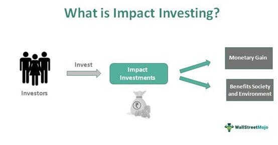

The landscape of investing is experiencing a profound shift as investors increasingly consider the social and environmental implications of their financial decisions. This shift signifies a move away from traditional investment strategies that prioritize financial returns above all else, moving towards a more holistic view that incorporates social responsibility and sustainability. A key aspect of this transformation is the rise of sustainable finance and impact investing, which integrate environmental, social, and governance (ESG) criteria into the investment process to support long-term sustainable growth and generate positive societal impacts. This approach not only appeals to ethical considerations but also addresses investors' growing recognition that ESG factors can affect long-term performance and risk management.

Algorithmic trading is another revolutionary force reshaping modern finance. Utilizing sophisticated algorithms and high-speed computing, it enables rapid execution of trades by analyzing vast datasets to identify investment opportunities and strategies. Its integration into the investment landscape enhances market efficiency and liquidity, though it also introduces new challenges, such as increased market volatility and the need for robust regulatory oversight.



Together, these developments herald a new era in investment strategies. This article examines how sustainable finance, impact investing, and algorithmic trading are reshaping the financial sector, offering fresh opportunities while prompting a reevaluation of how we define successful investment outcomes. This evolving paradigm encourages a broader perspective in assessing the full spectrum of risks and returns, ultimately aiming for a more sustainable and equitable financial future.

## Table of Contents

## Understanding Sustainable Finance

Sustainable finance has emerged as a pivotal strategy in modern investment paradigms, focusing on the integration of Environmental, Social, and Governance (ESG) factors into investment decision-making processes. This approach seeks to foster long-term sustainable growth and generate positive societal impacts, in stark contrast to traditional investment strategies that primarily prioritize financial returns.

The emergence of sustainable finance is driven by an increasing awareness of global challenges such as climate change, social inequality, and corporate governance issues. Investors are realizing that incorporating ESG factors into investment strategies not only addresses these challenges but also presents new opportunities for risk management and value creation.

Environmental considerations within sustainable finance include investments aimed at reducing carbon footprints, promoting renewable energy, and minimizing resource depletion. Social factors involve investments that advance human rights, enhance labor conditions, and contribute to community development. Governance criteria focus on ensuring ethical business practices, transparency, and accountable corporate behavior.

A range of sustainable investment strategies have gained traction among institutional and individual investors. These strategies include [ESG](/wiki/esg-investing) integration, where investors systematically include ESG criteria alongside traditional financial analysis. Thematic investing focuses on specific ESG-related themes such as clean technology or sustainable agriculture. Impact investing, a subset of sustainable finance, is characterized by investments targeted specifically at generating measurable social or environmental impacts alongside financial returns.

The surge in sustainable finance is also reflected in the growth of green bonds and sustainable mutual funds, providing investors with opportunities to support projects that align with their ESG priorities. Furthermore, initiatives like the United Nations Principles for Responsible Investment (PRI) have provided frameworks and guidelines that encourage and support the adoption of ESG principles in investment practices.

Investor sentiment continues to shift, driven by a combination of regulatory pressures, societal expectations, and the increasing availability of ESG data and analytics. This shift is underscored by studies demonstrating that sustainable investments can deliver competitive financial returns, dispelling myths that sustainability comes at the expense of profitability.

In summary, sustainable finance represents a transformative approach to investing, aiming to align financial goals with broader environmental and social objectives. As this field evolves, it presents both challenges and opportunities for investors seeking to contribute to a sustainable future.

## The Rise of Impact Investing

Impact investing has gained significant traction in recent years, reflecting an increasing demand for investment strategies that align with investors' personal values and societal goals. This approach aims to generate measurable social or environmental benefits alongside financial returns, distinguishing it from traditional investment strategies that prioritize financial gains alone.

### History and Principles

The roots of impact investing can be traced back to the mid-20th century, although the concept has gained more recognition in the past few decades. It emerged as a response to the growing desire among individuals and institutions to invest in ways that promote sustainable development and address global challenges such as poverty, climate change, and inequality. The term "impact investing" was officially coined at a meeting convened by the Rockefeller Foundation in 2007, which brought together leaders from various sectors to discuss how to harness private capital for public good.

At its core, impact investing is guided by principles that emphasize intentionality, measurement, and transparency. Investors actively seek to achieve positive impacts by intentionally directing funds toward projects or companies that contribute to solving social or environmental problems. Measurement is crucial to ensure that investments yield tangible benefits; thus, investors employ various metrics and frameworks to assess and report the impact of their investments. Transparency in reporting helps build trust among stakeholders and attracts more interest in impact investment opportunities.

### Types of Impact Investments

Impact investments span a wide array of sectors and financial instruments, reflecting the diverse preferences and objectives of investors. Key areas of focus include:

1. **Clean Energy**: Investments in renewable energy technologies such as solar, wind, and hydroelectric power aim to reduce carbon emissions and promote sustainable energy sources. These projects often provide financial returns through energy savings or revenue generation from power sales.

2. **Education**: Funding is directed toward educational initiatives that improve access to quality education, enhance learning outcomes, and equip individuals with skills for sustainable employment. For instance, investments may support community education programs, educational technology, or affordable educational institutions.

3. **Healthcare**: Impact investments in healthcare target improved access to medical services, development of innovative healthcare solutions, and reduction of health disparities. This can include investments in affordable healthcare facilities, telemedicine technologies, and preventative health programs.

### Impact Investing and Socially Responsible Investing

Impact investing is an integral component of the broader socially responsible investing (SRI) movement, which considers environmental, social, and governance (ESG) factors in investment decisions. While SRI involves screening investments to avoid harm (negative screening) or to support sustainability (positive screening), impact investing goes a step further by intentionally targeting investments that generate concrete social or environmental change. This proactive approach distinguishes impact investing as a powerful tool for investors seeking to make a positive difference while achieving financial goals. 

Overall, the rise of impact investing is reshaping the investment landscape, offering a harmonized path toward financial returns and social responsibility. As more investors seek to align their investments with their values, impact investing continues to grow, driving meaningful changes across local and global communities.

## Algorithmic Trading in Modern Finance

Algorithmic trading represents a significant technological advancement in financial markets, leveraging computer algorithms to execute trades at extraordinary speeds and high volumes. These algorithms can process vast amounts of market data instantaneously, enabling rapid decision-making that far surpasses human capabilities. This transformation is fundamentally altering traditional market operations with its emphasis on speed, efficiency, and precision.

At its core, [algorithmic trading](/wiki/algorithmic-trading) involves a series of predefined instructions for trade execution, which can include timing, price, quantity, and other relevant factors. These algorithms analyze multiple market variables, such as stock prices, historical data, and market indices, to determine optimal trading strategies. By automating trading processes, algorithms can exploit fleeting market opportunities that are often beyond the reach of manual trading.

The benefits of algorithmic trading are numerous. One notable advantage is the reduction of transaction costs. By executing trades with high efficiency, algorithms ensure that trades occur at the best possible prices and volumes, minimizing the bid-ask spread and market impact costs. Additionally, algorithmic systems reduce the influence of human errors that can result from emotional decision-making or fatigue, thereby enhancing the accuracy of trading operations.

Algorithmic trading also facilitates market [liquidity](/wiki/liquidity-risk-premium), providing continuous buy and sell offers, thus narrowing spreads and stabilizing markets. However, challenges accompany these benefits. Increased reliance on algorithms can lead to elevated market [volatility](/wiki/volatility-trading-strategies), particularly when trades are executed erroneously due to technical faults or flawed algorithms. Events such as the "Flash Crash" of 2010 demonstrate the potential for algorithms to contribute to severe market disruptions.

Moreover, the complexity of algorithmic models can obscure their inner workings, making it difficult to predict and control their behavior under diverse market conditions. Ensuring robust risk management systems and regulatory oversight is essential to mitigate the risks associated with high-speed trading.

In conclusion, algorithmic trading is revolutionizing the financial landscape by enhancing trade execution speed and accuracy while also presenting new challenges. As technology continues to advance, the integration of [artificial intelligence](/wiki/ai-artificial-intelligence) and [machine learning](/wiki/machine-learning) into algorithmic trading promises further innovation in market activities, potentially leading to more sophisticated and adaptive trading mechanisms.

## Integrating Sustainable Strategies with Algorithmic Trading

Combining sustainable finance with algorithmic trading is becoming an increasingly attractive approach in the investment world, offering a blend of ethical investing and technological precision. The integration allows for efficient identification and exploitation of sustainable investment opportunities through systematic trading, leveraging the power of algorithms. As Environmental, Social, and Governance (ESG) criteria continue to gain prominence, the ability to effectively incorporate these elements into algorithm-driven trading strategies can optimize decision-making processes and produce enhanced outcomes.

Algorithms can process vast amounts of ESG-related data at high speed, enabling investment strategies that align with sustainability goals. For instance, advanced algorithms use real-time data to assess the sustainability performance of companies and adjust investment portfolios dynamically. Machine learning and other advanced analytical techniques further enhance the accuracy and efficiency of these processes by identifying patterns and predicting future trends.

One practical application of this integration is the development of ESG-centric trading algorithms. These algorithms can be trained to prioritize stocks with high ESG ratings while minimizing those with lower scores. Here is a basic conceptual framework in Python that illustrates how one might begin to code such a trading strategy:

```python
import pandas as pd

# Load stock and ESG data
stock_data = pd.read_csv('stock_prices.csv')
esg_data = pd.read_csv('esg_scores.csv')

# Merge datasets on company identifiers
merged_data = pd.merge(stock_data, esg_data, on='company_id')

# Define a simple strategy: invest in stocks with ESG score above a threshold
threshold = 70
sustainable_stocks = merged_data[merged_data['esg_score'] > threshold]

# Execute trades based on the strategy
def execute_trades(data):
    for index, row in data.iterrows():
        # Logic to buy stock
        buy_stock(row['company_id'], row['price'])

execute_trades(sustainable_stocks)
```

Integrating sustainable strategies with algorithmic trading also opens up numerous case study opportunities. One example is the partnership between financial institutions and technology firms to create platforms for sustainable algo trading. These platforms utilize AI and machine learning to process ESG metrics effectively, uncovering investment opportunities that are environmentally and socially responsible.

Moreover, machines' ability to handle complex datasets can uncover insights that human traders might miss, ensuring both speed and conscientious investment choices. This kind of synergy is evident in the operations of ESG-focused hedge funds, such as Generation Investment Management, which uses data-driven approaches to incorporate ESG factors systematically into their trading models.

In conclusion, the integration of sustainable finance with algorithmic trading represents a potent toolset for investors looking to balance financial performance with ethical considerations. As data-driven strategies evolve, they promise not only greater precision in sustainable investments but also a broader adoption of social and environmental values in financial markets.

## Challenges and Considerations

Embracing sustainable finance and algorithmic trading presents a complex set of challenges that stakeholders must navigate carefully. These challenges primarily revolve around regulatory complexities, the need for high-quality Environmental, Social, and Governance (ESG) data, and the inherent risks associated with algorithmic strategies.

### Regulatory Complexities

The regulatory landscape for sustainable finance and algorithmic trading is continuously evolving, creating significant complexities for investors. Financial regulators globally are increasingly focusing on the establishment of comprehensive frameworks to govern ESG investments and algorithmic trading activities. For instance, the European Union's Sustainable Finance Disclosure Regulation (SFDR) mandates that financial market participants provide transparency on how sustainability risks are integrated into investment decisions. Adhering to such regulations requires extensive resources and adaptation from financial institutions, as non-compliance can lead to legal and financial repercussions.

Additionally, in the algorithmic trading sector, regulations such as the Markets in Financial Instruments Directive II (MiFID II) in Europe demand stringent reporting and transparency from trading firms. These regulations aim to minimize risks associated with high-frequency trading, but they also impose an additional layer of complexity for market participants.

### Need for Transparent and Standardized ESG Data

The integration of ESG factors into investment processes is fundamentally dependent on the availability of reliable and standardized data. However, the ESG data landscape is currently fragmented, with varying reporting standards and methodologies employed by companies. This lack of standardization poses significant challenges for investors seeking to make informed decisions. The inconsistency in ESG reporting can lead to misinterpretation of a company's true sustainability performance and the potential for "greenwashing," where entities may overstate their environmental credentials.

To overcome this hurdle, industry-wide initiatives, such as the Task Force on Climate-related Financial Disclosures (TCFD) and the Sustainability Accounting Standards Board (SASB), are working towards creating more unified reporting standards. Moreover, advancements in technology and data analytics could play a crucial role in improving the quality and comparability of ESG data.

### Algorithmic Trading Risks

Algorithmic trading, while offering numerous efficiencies, can also amplify market risks if not carefully managed. The high-speed nature of algorithmic trades means that errors can propagate swiftly, leading to significant market disruptions. One notable instance was the "Flash Crash" of May 6, 2010, during which the U.S. stock market experienced a rapid and largely unexplained crash and rebound, partly attributed to algorithmic trading strategies. 

To mitigate these risks, algorithmic strategies must be meticulously designed and continuously monitored. Techniques such as stress testing and back-testing algorithms against historical data are essential to ensure robustness. Furthermore, integrating machine learning models can help algorithms adapt to changing market conditions and identify potential anomalies.

### Industry Response

The industry is actively responding to these challenges through collaboration and innovation. Financial institutions are investing in technology to enhance data collection and analysis capabilities, thereby improving ESG data quality and accessibility. Blockchain technology, for instance, is being explored as a means to provide immutable and transparent records of ESG data.

Collaboratively, regulators and industry players continue to work towards refining principles and guidelines, facilitating a more cohesive regulatory environment. In parallel, many firms are developing internal governance standards to ensure that algorithmic trading practices adhere to ethical and risk-mitigating protocols.

In conclusion, while sustainable finance and algorithmic trading present formidable challenges, the continuous adaptation of regulatory frameworks, advancements in data technology, and collaborative efforts within the industry hold promise for overcoming these obstacles and achieving a more sustainable and efficient future in finance.

## The Future of Sustainable Finance and Trading

The future of sustainable finance and trading is poised for significant evolution, driven by a combination of technological advancements, increasing investor demand, and the continuous integration of environmental, social, and governance (ESG) criteria into investment processes. As the financial landscape adapts, several key trends and potential impacts on global markets are becoming evident.

Sustainable and impact investing is on an upward trajectory, spurred by mounting awareness of climate change, social inequalities, and corporate governance issues. Investors are increasingly prioritizing these factors, resulting in more capital flowing towards investments that promise both financial returns and positive societal impacts. This shift is not isolated to individual investors; institutional investors, including pension funds and mutual funds, are also aligning their portfolios to reflect sustainable values. This widespread adoption underscores the transition from niche to mainstream status for sustainable finance.

Technological advancements are at the heart of this transformation, particularly in the realm of data analysis and processing capabilities. Enhanced data analytics are crucial for comprehensively evaluating ESG metrics, which are often complex and multi-dimensional. Innovations in machine learning and artificial intelligence empower investors to dissect this data with greater accuracy, facilitating more informed decision-making. The use of natural language processing can further refine this by analyzing qualitative data from diverse sources such as company reports, news articles, and social media, providing an enriched context for ESG assessments.

Algorithmic trading, already a transformative force in financial markets, stands to further revolutionize sustainable investment strategies. As algorithms become more sophisticated, they are increasingly capable of processing large volumes of ESG data quickly and efficiently, enhancing the precision and speed of trading decisions. This capability can lead to significant efficiency gains, as algorithms can swiftly identify and capitalize on sustainable investment opportunities that align with predefined ESG criteria.

Moreover, advances in blockchain technology promise to enhance transparency and traceability in sustainable finance. With blockchain, investors can ensure that their investments are genuinely sustainable, as it allows for secure, immutable tracking of ESG compliance through the supply chain. This development addresses one of the major challenges in sustainable investing: the verification of ESG claims.

Looking forward, the role of investor demand will be pivotal in shaping the future of sustainable finance and trading. As younger, ESG-conscious generations garner more wealth, the pressure on companies to maintain rigorous ESG standards will intensify. This demographic shift, coupled with regulatory initiatives that mandate greater ESG disclosures, will likely catalyze a more standardized and transparent market environment.

In conclusion, the convergence of sustainable finance and technological innovation represents a paradigm shift in investment strategies. As these fields continue to intertwine, global markets are likely to witness not only enhanced sustainability and efficiency but also a realignment of capital flows towards investments that promise long-term positive impacts on society and the environment. This evolution, driven by both technological breakthroughs and changing investor priorities, marks a promising avenue for the future of global finance.

## References & Further Reading

[1]: Bugg-Levine, A., & Emerson, J. (2011). ["Impact Investing: Transforming How We Make Money While Making a Difference."](https://direct.mit.edu/itgg/article/6/3/9/9670/Impact-Investing-Transforming-How-We-Make-Money) Jossey-Bass.

[2]: Friede, G., Busch, T., & Bassen, A. (2015). ["ESG and Financial Performance: Aggregated Evidence from More than 2000 Empirical Studies."](https://www.tandfonline.com/doi/full/10.1080/20430795.2015.1118917) Journal of Sustainable Finance & Investment, 5(4), 210-233.

[3]: Risi, R. (2019). ["Algorithmic Trading: Winning Strategies and Their Rationale."](https://www.semanticscholar.org/paper/Algorithmic-Trading%3A-Winning-Strategies-and-Their-Chan/8220c62caf83863b7f5fb279366d545e720ee062) Wiley Trading Series.

[4]: Bremen, H., & Koepke, L. (2020). ["Sustainable Investing: Revolutions in theory and practice."](https://www.taylorfrancis.com/books/edit/10.4324/9781315558837/sustainable-investing-cary-krosinsky-sophie-purdom) CFA Institute Research Foundation.

[5]: PRI (Principles for Responsible Investment). ["What is responsible investment?"](https://www.unpri.org/introductory-guides-to-responsible-investment/what-is-responsible-investment/4780.article) United Nations Principles for Responsible Investment.