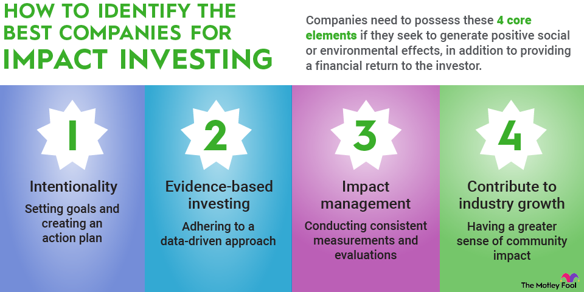

## Table of Contents

## What is impact investing?

Impact investing is when people or organizations invest money in companies or projects that aim to make a positive difference in the world, while also hoping to make a financial return. This type of investing focuses on areas like helping the environment, improving people's health, or supporting education. The goal is to use money to create good changes in society and the planet, not just to make more money.

People who do impact investing believe that they can help solve big problems like poverty, climate change, and inequality by choosing where to put their money. They look for businesses that have a clear plan to make a positive impact and also have a good chance of being successful financially. This way, they can feel good about their investments because they are helping to make the world a better place, while also potentially earning money.

## How does impact investing differ from traditional investing?

Impact investing is different from traditional investing because it focuses on making a positive impact on society or the environment, not just making money. Traditional investing is all about getting the best financial return possible. People who do traditional investing look at things like how much a company is growing, how much profit it makes, and how much risk there is. They don't usually care about what the company does for the world, as long as it makes money.

On the other hand, impact investors care a lot about what the company does for the world. They want to invest in companies that help with things like fighting climate change, improving health, or reducing poverty. But they still want to make money too. So, they look for companies that can do both - make a positive impact and be financially successful. This means impact investors have to think about more than just money when they choose where to invest.

In summary, the main difference is the focus. Traditional investing is all about financial returns, while impact investing is about balancing financial returns with making a positive impact on the world. Both types of investing want to make money, but impact investing adds the goal of making the world a better place.

## What are the main goals of impact investing?

The main goal of impact investing is to make a positive difference in the world while also making money. People who do impact investing want to help solve big problems like climate change, poverty, and poor health. They look for companies or projects that work on these issues and try to make them better. By putting their money into these efforts, impact investors hope to support changes that will help people and the planet.

Another important goal is to make sure that the investments also give a good financial return. Impact investors don't just want to give money away; they want their investments to grow and be successful. This means they have to find a balance between doing good and making money. They look for businesses that have a strong plan to make a positive impact and also have a good chance of being profitable. This way, they can feel good about helping the world while also [earning](/wiki/earning-announcement) money.

## Who are the typical investors in impact investing?

The typical investors in impact investing are a mix of different people and organizations. They include wealthy individuals who want to use their money to make the world a better place while still earning a return. These people often care a lot about social and environmental issues and want to put their money where their values are. There are also foundations and charities that use impact investing to grow their funds while supporting causes they believe in. They see it as a way to do more good with their money than just giving it away.

Another group of impact investors are institutional investors like pension funds, insurance companies, and endowments. These big organizations manage a lot of money and are looking for ways to invest it that align with their values and the values of the people they serve. They want to make sure their investments not only grow but also contribute to solving big problems like climate change and inequality. By choosing impact investments, they can meet their financial goals while also making a positive difference in the world.

## What sectors are commonly targeted by impact investments?

Impact investments often focus on sectors that can make a big difference in the world. One common sector is renewable energy, where investors put money into projects like solar and wind power to help fight climate change. Another important sector is sustainable agriculture, which aims to grow food in ways that are good for the environment and help small farmers. Health care is also a big area, with investments going into making health services better, especially in poor countries. Education is another sector that gets a lot of attention, with money going to schools and programs that help people learn and grow.

Other sectors that impact investors often target include affordable housing, which helps provide homes for people who can't afford them, and microfinance, which gives small loans to people in poor communities to start businesses. Clean water and sanitation projects are also popular, as they help improve people's lives by making sure they have safe water to drink and good sanitation. Finally, impact investors often look at companies that work on reducing inequality, like those that focus on fair wages and good working conditions. All these sectors are chosen because they can make a real difference in people's lives and the health of the planet.

## Can you provide examples of successful impact investments?

One successful impact investment is the company d.light, which makes affordable solar lanterns for people in poor countries. Before d.light, many people had to use dangerous and expensive kerosene lamps. d.light's lanterns are much safer and cheaper to use, and they help the environment by using solar power. Impact investors saw the good d.light was doing and put money into the company. Now, d.light has helped millions of people get light in a better way, and the investors have made money too.

Another example is Root Capital, a company that gives loans to small farmers in poor countries. These farmers often can't get loans from banks, so Root Capital helps them grow their farms and sell their crops. This helps the farmers make more money and live better lives. Impact investors saw how Root Capital was helping these farmers and decided to invest. The investments have helped Root Capital grow and help even more farmers, and the investors have gotten a good return on their money.

A third example is the Acumen Fund, which invests in companies that help poor people in different ways. One of their investments is in WaterHealth International, which builds water treatment plants in poor areas. These plants give people clean water to drink, which helps keep them healthy. The Acumen Fund's investment has helped WaterHealth grow and help more people, and the fund has also made money from the investment. These examples show how impact investing can help make the world a better place while also making money for investors.

## How is the impact of investments measured and reported?

The impact of investments is measured and reported by looking at specific goals and results. Impact investors set clear goals for what they want to achieve, like helping the environment or improving people's lives. They use different ways to measure if these goals are being met. For example, if an investment is in a solar energy company, they might measure how much less carbon dioxide is being put into the air. If it's in a health care project, they might look at how many people are getting better medical care. These measurements help investors see if their money is making a real difference.

Once the impact is measured, it is reported in a way that is easy to understand. Investors often use reports and dashboards to show the results. These reports might include numbers, like how many people were helped or how much pollution was reduced. They might also include stories about how the investment changed people's lives. By sharing this information, investors can show others what they have achieved and help more people understand the importance of impact investing. This helps keep everyone informed and can encourage more people to invest in making the world a better place.

## What are the challenges and risks associated with impact investing?

Impact investing can be tricky because it's hard to measure the good it does. Sometimes, it's not easy to see if a project is really helping the environment or people's lives. Investors have to use special ways to check the impact, but these ways can be complicated and might not tell the whole story. Also, impact investing often goes into new or small companies that are trying to do something different. These companies can be riskier because they might not have a lot of money or experience yet. So, there's a chance that the investment might not make money, or the company might not do well.

Another challenge is finding the right balance between making a positive impact and making money. Sometimes, the best way to help the world might not be the best way to make a profit. Impact investors have to choose projects that can do both, which can be hard. They might have to accept a lower financial return if they want to make a bigger impact. There's also the risk that the impact they hoped for doesn't happen, or it takes longer than expected. This can be frustrating and might make investors think twice about where to put their money next time.

## How can someone start impact investing?

To start impact investing, you first need to figure out what causes you care about, like the environment, health, or education. Then, look for companies or projects that work on these issues and also have a good chance of making money. You can find these opportunities through special impact investing funds, or by looking at companies that report their social and environmental impact. It's a good idea to do a lot of research and maybe talk to a financial advisor who knows about impact investing. This way, you can make sure you're choosing the right investments that match your goals and values.

Once you've picked your investments, keep an eye on how they're doing. Check if they're making the positive impact you hoped for and if they're growing financially. Many impact investors use special tools and reports to track their investments' progress. Remember, impact investing can be a bit riskier than regular investing, so be ready for that. But it's also a way to use your money to help make the world a better place, which can feel really good.

## What role do impact investing funds play in the market?

Impact investing funds are like big pots of money that people put their money into. These funds then use that money to invest in companies or projects that help the world, like fighting climate change or helping poor people. They make it easier for regular people to do impact investing because you don't have to pick and choose each investment yourself. Instead, you can just put your money into the fund, and the people who run the fund will decide where to invest it. This way, more people can join in and help make a difference.

These funds also help bring more money to impact investing. When a lot of people put their money into an impact fund, it can grow big enough to make a real change. The funds can invest in bigger projects and help more companies that are trying to do good. They also show other investors that impact investing can be a good way to make money while helping the world. This can encourage more people to try impact investing and make it a bigger part of the market.

## How does impact investing contribute to sustainable development goals?

Impact investing helps a lot with the sustainable development goals, which are like a big plan to make the world better by 2030. These goals cover things like ending poverty, fighting climate change, and making sure everyone has good health and education. When people do impact investing, they put their money into companies and projects that work on these goals. For example, if someone invests in a company that builds solar power plants, it helps with the goal of using clean energy and fighting climate change. By choosing where to invest carefully, impact investors can help push these big goals forward and make the world a better place.

Impact investing also brings more money to these important goals. Sometimes, it's hard to find enough money to do big projects that help the world. But when impact investors put their money into these projects, it can make a big difference. For example, if a lot of people invest in a fund that helps small farmers in poor countries, it can help end hunger and reduce poverty. This extra money can help more people and make the sustainable development goals happen faster. So, impact investing is a way to use money to help make the world better, and it's a big part of reaching these important goals.

## What future trends are expected in the field of impact investing?

In the future, more and more people are expected to start impact investing. As more people learn about how they can use their money to help the world while still making money, it will become a bigger part of the investing world. Big companies and governments might also start to do more impact investing because they see how it can help with big problems like climate change and poverty. New technology will make it easier to find and track impact investments, so more people will be able to join in.

Another trend we might see is impact investing becoming more focused on certain areas. For example, more money might go into fighting climate change because it's such a big problem. Also, impact investing might start to look at things like how companies treat their workers or how they help local communities. As people learn more about what makes a real difference, they will choose their investments more carefully. This will make impact investing even more important for making the world a better place.

## References & Further Reading

[1]: Bugg-Levine, A., & Emerson, J. (2011). ["Impact Investing: Transforming How We Make Money While Making a Difference."](https://direct.mit.edu/itgg/article/6/3/9/9670/Impact-Investing-Transforming-How-We-Make-Money) Jossey-Bass.

[2]: Friede, G., Busch, T., & Bassen, A. (2015). ["ESG and Financial Performance: Aggregated Evidence from More than 2000 Empirical Studies."](https://www.tandfonline.com/doi/full/10.1080/20430795.2015.1118917) Journal of Sustainable Finance & Investment, 5(4), 210-233.

[3]: Risi, R. (2019). ["Algorithmic Trading: Winning Strategies and Their Rationale."](https://www.semanticscholar.org/paper/Algorithmic-Trading%3A-Winning-Strategies-and-Their-Chan/8220c62caf83863b7f5fb279366d545e720ee062) Wiley Trading Series.

[4]: Bremen, H., & Koepke, L. (2020). ["Sustainable Investing: Revolutions in theory and practice."](https://www.taylorfrancis.com/books/edit/10.4324/9781315558837/sustainable-investing-cary-krosinsky-sophie-purdom) CFA Institute Research Foundation.

[5]: PRI (Principles for Responsible Investment). ["What is responsible investment?"](https://www.unpri.org/introductory-guides-to-responsible-investment/what-is-responsible-investment/4780.article) United Nations Principles for Responsible Investment.