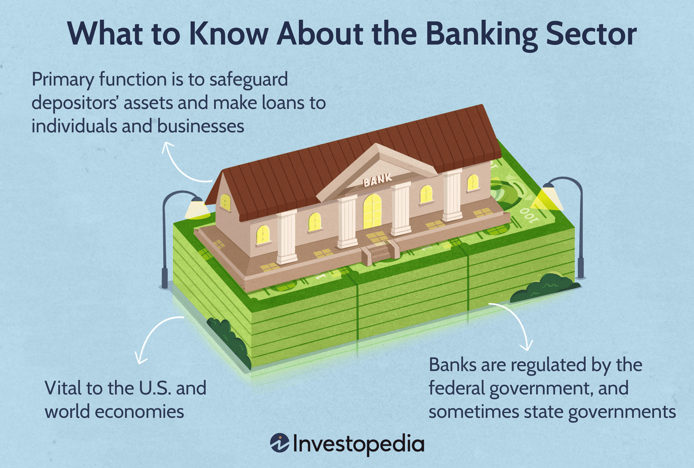

## Table of Contents

## What is an investment bank?

An investment bank is a type of financial institution that helps companies and governments raise money by issuing and selling securities like stocks and bonds. They act as a middleman between the people or organizations that need money and the investors who want to buy these securities. Investment banks also provide advice on financial strategies, mergers, and acquisitions, helping their clients make big business decisions.

In addition to helping with fundraising, investment banks also offer services like trading securities, managing assets, and providing research and analysis on markets and companies. They often work with large corporations, but they can also assist smaller businesses and even individuals with their financial needs. Investment banks play a crucial role in the economy by facilitating the flow of capital and helping businesses grow and succeed.

## How do investment banks differ from commercial banks?

Investment banks and commercial banks are both important parts of the financial world, but they do different things. Investment banks help companies and governments raise money by selling stocks and bonds. They also give advice on big business decisions like mergers and acquisitions. They work with big companies, but can also help smaller businesses and individuals. Their main job is to help move money around to help businesses grow.

Commercial banks, on the other hand, are the banks most people use every day. They offer services like checking and savings accounts, loans, and credit cards. People and businesses use commercial banks to save money, borrow money, and make payments. The main difference is that commercial banks focus on everyday banking needs, while investment banks focus on helping businesses raise money and make big financial decisions.

## What services do investment banks provide?

Investment banks help companies and governments raise money. They do this by selling stocks and bonds to investors. This is called underwriting. They also help companies figure out how much money they need and the best way to get it. They work with big companies, but can also help smaller businesses.

Investment banks also give advice on big business decisions. This includes things like mergers and acquisitions, where one company buys another. They help companies decide if these big moves are a good idea and how to do them. They also do research on markets and companies to help their clients make smart choices. Investment banks play a big role in helping businesses grow and succeed.

## How do investment banks influence economic growth?

Investment banks help the economy grow by helping businesses get the money they need. They do this by selling stocks and bonds, which lets companies raise money to start new projects, expand, or hire more people. When businesses grow, they create more jobs and help the economy get bigger. Investment banks also give advice on big business decisions, like when one company wants to buy another. This can lead to bigger, stronger companies that can do more for the economy.

Investment banks also help money move around the economy. They connect people who have money to invest with businesses that need it. This flow of money helps keep the economy going. When investment banks do their job well, it can lead to more investment, more business growth, and more economic activity. So, they play a big role in making sure the economy keeps growing and stays healthy.

## What role do investment banks play in capital markets?

Investment banks are really important in capital markets. They help companies and governments raise money by selling stocks and bonds. This is called underwriting. When a company wants to sell stocks or bonds, the investment bank helps figure out how much to sell and at what price. They also find people who want to buy these stocks and bonds. This helps companies get the money they need to grow and do new things.

Investment banks also help keep the capital markets running smoothly. They do this by trading stocks and bonds themselves, which helps make sure there are always buyers and sellers. They also give advice to their clients about what's happening in the markets and what might happen next. This helps people make smart choices about where to put their money. So, investment banks are key players in making sure capital markets work well and help the economy grow.

## How do investment banks affect corporate financial strategies?

Investment banks help companies figure out their money plans. They give advice on things like how to raise money, whether to sell stocks or bonds, and how much to sell. They also help companies decide if they should buy other companies or merge with them. This is called mergers and acquisitions. Investment banks look at all the numbers and help companies make smart choices that can help them grow and make more money.

Investment banks also help companies understand the risks they might face. They do research on markets and other companies to give their clients good information. This helps companies plan for the future and make sure they are ready for whatever might happen. By working with investment banks, companies can make better financial decisions that help them succeed in the long run.

## What is the impact of investment banking on mergers and acquisitions?

Investment banks help a lot when companies want to merge or buy other companies. They give advice on whether it's a good idea to do a merger or acquisition. They look at all the numbers and help the companies figure out if it will make them more money or help them grow. Investment banks also help with the tricky parts of these deals, like deciding how much to pay and how to pay for it. They make sure everything goes smoothly so the companies can focus on getting bigger and better.

Investment banks also help find the right companies to buy or merge with. They use their knowledge and research to find good matches. This can make the whole process faster and easier. When investment banks do a good job, it can lead to bigger, stronger companies that are better at what they do. This helps the companies and the economy grow. So, investment banks play a big role in making sure mergers and acquisitions go well and help businesses succeed.

## How do investment banks contribute to economic stability or instability?

Investment banks can help keep the economy stable by making sure money moves around smoothly. They help companies raise money by selling stocks and bonds, which lets businesses grow and create jobs. When businesses do well, it helps the whole economy. Investment banks also give advice to companies about big decisions, like mergers and acquisitions. This can lead to stronger companies that are better for the economy. So, when investment banks do their job well, they can help keep the economy stable and growing.

But, investment banks can also make the economy unstable if they take too many risks. Sometimes, they might make bad investments or help companies take on too much debt. If a lot of these risky moves go wrong at the same time, it can cause big problems. For example, during the 2008 financial crisis, some investment banks made risky bets on housing that didn't pay off. This led to a lot of trouble for the whole economy. So, while investment banks can help the economy, they can also cause instability if they're not careful.

## What are the regulatory challenges faced by investment banks?

Investment banks have to follow a lot of rules to make sure they do things the right way. These rules come from governments and other groups that want to keep the financial world safe and fair. One big challenge is keeping up with all the new rules that keep coming out. The rules can change a lot, and investment banks have to make sure they understand and follow them all. This can be hard because the rules are often complicated and can be different in different countries.

Another challenge is making sure they don't take too many risks. Regulators want to stop investment banks from doing things that could hurt the economy. They watch what the banks do and make sure they have enough money to cover any losses. This can be tricky because investment banks want to make money for their clients, but they also have to be careful not to do anything too risky. Balancing these two things can be a big challenge for investment banks.

## How have investment banks adapted to global financial crises?

Investment banks have had to change a lot because of global financial crises. After the 2008 financial crisis, they started being more careful about the risks they take. They made new rules for themselves to make sure they don't make the same mistakes again. They also started using better ways to check how much risk they are taking. This helps them stay safe and keep the economy stable.

Another way investment banks have adapted is by working more closely with governments and regulators. They know that following the rules is important to avoid big problems. They also started using new technology to help them understand the markets better and make smarter decisions. By doing these things, investment banks can help prevent future crises and keep the financial world running smoothly.

## What is the relationship between investment banks and government policies?

Investment banks and government policies are closely connected. Governments make rules that investment banks have to follow. These rules are there to make sure the banks don't take too many risks and to keep the economy safe. For example, after the 2008 financial crisis, governments made new rules to stop banks from doing the risky things that caused the crisis. Investment banks have to change how they work to follow these rules, which can be hard but helps keep the financial world stable.

Investment banks also work with governments to help them raise money. Governments sometimes need to borrow money to pay for things like roads or schools. Investment banks help them do this by selling government bonds to investors. This helps the government get the money it needs, and it also helps the economy because people can invest in these bonds. So, investment banks play a big role in making sure government policies work well and help the economy grow.

## How do investment banks influence income inequality and wealth distribution?

Investment banks can make income inequality and wealth distribution worse. They help rich people and big companies make more money by giving them advice on how to invest and grow their businesses. This means that people who already have a lot of money can get even richer. Investment banks also help companies raise money by selling stocks and bonds, but not everyone can buy these. Usually, it's the people with more money who can afford to invest in them. So, the rich get richer, and the gap between them and everyone else gets bigger.

On the other hand, investment banks can also help reduce income inequality and improve wealth distribution in some ways. They help companies grow and create jobs, which can give more people a chance to earn money. When businesses do well, they might pay their workers more or hire more people, which can help spread wealth around. But this depends a lot on how the companies choose to use the money they raise. If they use it to help their workers and communities, it can make things more equal. But if they just keep the money for themselves, it can make inequality worse.

## References & Further Reading

[1]: Bergstra, J., Bardenet, R., Bengio, Y., & Kégl, B. (2011). ["Algorithms for Hyper-Parameter Optimization."](https://papers.nips.cc/paper/4443-algorithms-for-hyper-parameter-optimization) Advances in Neural Information Processing Systems 24.

[2]: ["Advances in Financial Machine Learning"](https://www.amazon.com/Advances-Financial-Machine-Learning-Marcos/dp/1119482089) by Marcos Lopez de Prado

[3]: ["Evidence-Based Technical Analysis: Applying the Scientific Method and Statistical Inference to Trading Signals"](https://www.amazon.com/Evidence-Based-Technical-Analysis-Scientific-Statistical/dp/0470008741) by David Aronson

[4]: ["Machine Learning for Algorithmic Trading"](https://github.com/stefan-jansen/machine-learning-for-trading) by Stefan Jansen

[5]: ["Quantitative Trading: How to Build Your Own Algorithmic Trading Business"](https://www.amazon.com/Quantitative-Trading-Build-Algorithmic-Business/dp/1119800064) by Ernest P. Chan