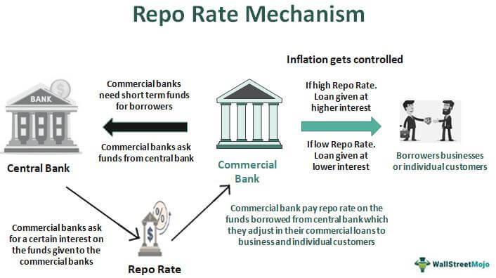

Investment banks play a pivotal role in the global financial system, functioning as key intermediaries that facilitate the flow of capital between investors and entities seeking funding. Their primary functions include underwriting securities for issuance, providing advisory services for mergers and acquisitions, and managing assets for various clients. As crucial participants in capital markets, investment banks are instrumental in price discovery, capital allocation, and risk management, which consequently influence economic growth and stability.

In recent decades, algorithmic trading has emerged as a transformative force within financial markets. This approach employs complex algorithms to automate the process of buying and selling financial instruments, making trades at speeds and frequencies far beyond human capability. The significance of algorithmic trading has grown tremendously, driven by technological advancements and increased data availability, and it is now a dominant method used by investment banks to optimize trading performance and improve market efficiency.

The interconnection between investment banks and financial markets is a deeply entrenched one, where banks’ activities can significantly impact asset prices, liquidity, and overall market conditions. They have both direct and indirect influence over economic policies and financial regulations, shaping how markets develop globally. This article aims to explore the intricate dynamics between investment banks and algorithmic trading, illustrating how they are reshaping the landscape of financial systems. By examining their functions, the technologies they employ, and their far-reaching impacts, the article will provide a comprehensive understanding of their roles in modern finance and global economics.

## Table of Contents

## Understanding Investment Banks

Investment banks are specialized financial institutions that primarily serve corporations, governments, and other organizations by providing a range of financial services. Their main functions center on capital raising through underwriting, advisory services in mergers and acquisitions (M&A), and asset management. Unlike commercial banks, which accept deposits and provide loans to the general public, investment banks focus on helping organizations access capital markets and navigate complex financial transactions.

Historically, investment banks have evolved significantly since their inception in the 19th century. Initially, they emerged as intermediaries facilitating the issuance of government and railroad bonds. Over time, their role expanded alongside the growth of global financial markets, playing a critical role in economic development and globalization. By the late 20th century, investment banks had established a strong global presence, becoming instrumental in the expansion and integration of international capital markets.

Investment banks offer a diverse range of services. Underwriting involves the purchasing of entire new issue of securities from a company and reselling them to the public or institutional investors. This process is crucial for companies seeking to raise capital through public markets. Moreover, investment banks provide strategic advisory services for M&A, guiding clients through the complexities of acquiring or merging with other businesses. Asset management is another significant service offered, where investment banks manage investment portfolios on behalf of clients, tailoring strategies to achieve specific financial objectives.

Key players in the investment banking sector include renowned institutions such as Goldman Sachs, JPMorgan Chase, Morgan Stanley, and Bank of America Merrill Lynch. These banks wield considerable market influence due to their extensive networks, financial expertise, and involvement in high-profile transactions. Their dominance is often driven by their ability to innovate and their extensive global reach, which enables them to operate across diverse markets and industries.

The regulatory environment significantly impacts investment banking operations. Following the financial crisis of 2008, regulatory frameworks tightened globally, with reforms such as the Dodd-Frank Act in the United States and the Basel III standards. These regulations aim to mitigate systemic risks, enhance transparency, and protect investors by imposing stricter capital requirements, limiting proprietary trading, and increasing oversight. Despite these constraints, investment banks continue to adapt, leveraging technology and new financial instruments to maintain their pivotal role in global financial systems.

## Economic Influence of Investment Banks

Investment banks are pivotal in the financial systems through their influence on capital formation and economic growth. By underwriting securities for corporations and governments, they facilitate the flow of capital from investors to those in need of funding, thus enabling the growth and expansion of various sectors. Investment banks act as intermediaries, matching savers and borrowers efficiently, which ensures that the financial resources are optimally allocated within the economy, promoting productivity and growth.

A significant contribution of investment banks to global trade and investment is their role in raising capital and advising on cross-border transactions. By leveraging their deep understanding of international markets and regulatory environments, they assist companies in expanding operations internationally, driving foreign direct investment (FDI). Investment banks often structure complex financial products tailored to the needs of multinational corporations, assisting in risk management and [liquidity](/wiki/liquidity-risk-premium) provision.

These banks also exert considerable influence over commodity prices and currency exchange rates. Through their trading desks, investment banks engage in proprietary trading and market-making activities that can affect supply and demand dynamics. This influence can be both beneficial and detrimental; on one hand, they provide liquidity and facilitate price discovery, while on the other hand, speculative trading can lead to excessive [volatility](/wiki/volatility-trading-strategies) in commodity and currency markets, impacting global trade.

Several case studies highlight the dual impact investment banks have on economies. For instance, during the 1990s, investment banks played a critical role in the economic transformation of Eastern Europe, providing much-needed capital and advisory services for privatization. Conversely, the 2008 financial crisis illustrated the negative impact excessive risk-taking and poor regulatory oversight can have, as investment banks' involvement in complex derivative instruments and mortgage-backed securities significantly contributed to the global economic downturn.

Controversies and criticisms often surround the influence of investment banks on economic policies. Critics argue that their dominance in the financial sector can lead to conflicts of interest, where banks prioritize profits over clients' interests or wider economic stability. Furthermore, their lobbying power poses transparency and fairness challenges within financial regulatory systems. The debate continues over the extent to which regulation should curb the activities of investment banks to mitigate systemic risks without stifling innovation and efficiency in financial markets.

## The Rise of Algorithmic Trading

Algorithmic trading refers to the use of computer algorithms to automate and execute trading decisions in financial markets. Unlike traditional trading methods, which rely on human judgment and manual execution, [algorithmic trading](/wiki/algorithmic-trading) involves pre-programmed instructions, known as algorithms, that determine the timing, price, and quantity of orders based on predetermined criteria. These algorithms can rapidly process vast amounts of market data and execute trades at speeds and frequencies that are impossible for humans to match. 

### History and Development

The origins of algorithmic trading date back to the 1970s when the introduction of electronic stock exchanges laid the groundwork for automated trading systems. However, significant advancements occurred in the late 1990s and early 2000s as electronic communication networks (ECNs) and high-speed internet became widespread. Investment banks began adopting algorithmic trading to manage complex portfolios and execute large orders with minimal market impact. The technology gained further [momentum](/wiki/momentum) with the advent of direct market access (DMA), allowing traders to bypass traditional broker-dealer intermediaries and place orders directly into the order [books](/wiki/algo-trading-books) of exchanges.

### Key Technologies

Several technological advancements have been crucial to the proliferation of algorithmic trading. High-frequency trading ([HFT](/wiki/high-frequency-trading-strategies)) infrastructure, characterized by ultra-low-latency networks and fast computational hardware, has enabled traders to capitalize on minute price discrepancies that exist for only milliseconds. Additionally, big data analytics and [machine learning](/wiki/machine-learning) have enhanced the capabilities of trading algorithms to identify patterns and optimize trading strategies. Sophisticated programming languages and development frameworks, such as Python and C++, have facilitated the creation of complex algorithms that can adapt to dynamic market conditions.

### Impact on Market Liquidity and Volatility

Algorithmic trading has significantly influenced market liquidity and volatility. On one hand, by increasing the [volume](/wiki/volume-trading-strategy) and speed of trades, algorithmic trading contributes to deeper liquidity pools, providing continuous opportunities for buyers and sellers to transact. This enhanced liquidity tends to narrow bid-ask spreads, thereby reducing transaction costs for market participants. On the other hand, the rapid execution and computational nature of algorithmic trading can exacerbate market volatility during periods of stress. The "flash crash" of 2010, where the Dow Jones Industrial Average plunged and quickly recovered within minutes, underscores the potential of algorithmic trading to induce sudden and extreme price movements.

### Regulatory Challenges and Ethical Considerations

The rise of algorithmic trading poses several regulatory and ethical challenges. Regulators across the globe face the daunting task of ensuring fair and orderly markets while accommodating the technological advancements that define modern trading. Regulatory measures, such as the SEC's Rule 613 in the United States, which mandates consolidated audit trails, aim to provide oversight and transparency in high-frequency trading environments. However, the rapid evolution of algorithmic technologies often outpaces regulatory frameworks, leading to calls for more adaptive and robust regulatory measures.

Ethically, algorithmic trading raises concerns about market fairness and access. The competitive advantage conferred by speed and technological sophistication may marginalize smaller investors and exacerbate power imbalances in financial markets. Furthermore, the reliance on quantitative models opens up the possibility of algorithmic biases and errors, necessitating a comprehensive approach to the development and monitoring of trading algorithms to safeguard against unintended consequences.

Algorithmic trading continues to reshape financial markets, driven by technological innovation and the relentless pursuit of efficiency. Investment banks and regulators alike must navigate complex challenges to harness the benefits of algorithmic trading while mitigating associated risks.

## Investment Banks and Algorithmic Trading in Financial Systems

Investment banks leverage algorithmic trading to secure substantial competitive advantages in the financial markets. By employing sophisticated algorithms, these institutions automate the trading process, allowing them to execute orders at speeds and frequencies far beyond human capabilities. The primary objectives of algorithmic trading for investment banks include increasing trading efficiency, reducing transaction costs, and optimizing trade executions. These strategies often target [arbitrage](/wiki/arbitrage) opportunities, [trend following](/wiki/trend-following), or volatility prediction, striving to maximize returns while minimizing risks.

The integration of [artificial intelligence](/wiki/ai-artificial-intelligence) (AI) and machine learning (ML) in trading algorithms has further enhanced the capabilities of algorithmic trading. These technologies enable investment banks to analyze vast amounts of data quickly, identify complex patterns, and adapt trading strategies in real time. Machine learning models enhance predictive accuracy by continuously learning from new data, thus fine-tuning trading decisions. For example, AI-driven sentiment analysis can process news articles and social media to gauge market sentiment, informing trading strategies.

Algorithmic trading has significantly influenced market efficiency and transparency. By facilitating high-speed and high-frequency trades, these algorithms help narrow bid-ask spreads and increase liquidity, making markets more efficient. However, this level of automation can also lead to reduced market transparency, as the sheer volume and complexity of transactions make it challenging for regulators to monitor and detect market manipulation or other illicit activities.

High-frequency trading (HFT), a subset of algorithmic trading, carries inherent risks and potential systemic failures. The rapid execution of thousands of trades per second can exacerbate market volatility, contributing to phenomena such as flash crashes—sudden, severe market drops followed by equally swift recoveries. The infamous 2010 Flash Crash serves as a case study of how HFT can disrupt financial systems. The automated trading systems' reactions to market anomalies can create a cascade effect, compounding losses or gains across interconnected trading platforms.

To mitigate these risks, regulators have imposed measures such as circuit breakers to halt trading during extreme fluctuations, and more stringent reporting requirements for trading activities. Nonetheless, the debate continues on balancing innovation with stability, as the pace of technological advancement in algorithmic trading continues to outstrip regulatory frameworks.

In summary, investment banks have effectively harnessed algorithmic trading to gain a competitive edge in financial markets, powered by the integration of AI and machine learning technologies. While these innovations contribute to market efficiency, they also pose significant challenges concerning transparency and systemic risks that require ongoing regulatory vigilance to ensure the stability of global financial systems.

## The Future of Investment Banking and Financial Systems

In recent years, investment banking and algorithmic trading have undergone significant transformations due to technological advancements and shifting regulatory landscapes. Emerging trends in these areas suggest a dynamic future characterized by innovation, enhanced computational capabilities, and evolving regulatory frameworks.

One notable trend is the integration of artificial intelligence (AI) and machine learning into algorithmic trading strategies. These technologies enable investment banks to process vast amounts of data and identify patterns that were previously undetectable. Machine learning algorithms can adapt to changing market conditions and improve trading accuracy and efficiency. For instance, natural language processing (NLP) is increasingly utilized to analyze news articles and social media sentiment, providing traders with real-time insights that can influence decision-making processes.

The regulatory landscape is poised to influence the evolution of investment banking significantly. Regulatory bodies are likely to introduce stricter controls to mitigate the risks associated with high-frequency trading and protect market integrity. This includes measures to enhance transparency, such as the implementation of real-time reporting requirements and audit trails. Moreover, international cooperation among regulators is anticipated to address the challenges posed by the global nature of financial markets.

Fintech innovations are reshaping the investment banking industry, offering new opportunities for growth and diversification. Technologies such as blockchain and distributed ledger systems are streamlining processes, reducing costs, and providing greater security in transactions. Blockchain technology, for instance, can facilitate faster clearing and settlement of trades, improving efficiency and mitigating counterparty risk. Additionally, digital platforms and robo-advisors are enabling investment banks to cater to a broader range of clients, offering personalized solutions at scale.

In a rapidly evolving digital economy, the role of investment banks is expected to expand beyond traditional financial services. Investment banks are likely to act as intermediaries in digital asset exchanges, providing liquidity and stability to emerging markets for cryptocurrencies and tokenized assets. Furthermore, the increasing importance of environmental, social, and governance ([ESG](/wiki/esg-investing)) criteria in investment decision-making may lead banks to offer specialized advisory services and sustainable investment products.

The implications of these trends on global financial stability are complex. While technology can enhance market efficiency and transparency, it also introduces risks related to cyber security and systemic failures. As investment banks increasingly rely on technology, the potential for cyber-attacks and data breaches becomes a significant concern, necessitating robust measures to safeguard sensitive information and prevent disruptions. Additionally, the concentration of trading activities in algorithmic platforms could amplify market volatility, requiring continuous monitoring and adaptation of risk management frameworks.

In conclusion, the future of investment banking and financial systems is set to be shaped by technological innovation, regulatory changes, and shifts in market demand. By embracing fintech advancements and adapting to regulatory pressures, investment banks can secure their role as pivotal players in the global economy, contributing to financial stability and sustainable economic growth.

## Conclusion

Investment banks have long played a pivotal role in shaping financial systems worldwide. Their economic influence stretches from facilitating capital formation to driving economic growth, often acting as vital intermediaries in global trade and investment. By underwriting securities, advising on mergers and acquisitions, and managing assets, these institutions not only support economic infrastructures but also set the stage for financial market innovations.

Algorithmic trading has emerged as a transformative force in modern finance, redefining the competitive landscape of trading activities within investment banks. By leveraging advanced technologies, such as artificial intelligence and machine learning, algorithmic trading significantly enhances market efficiency and transparency. Its ability to process vast amounts of data and execute trades at lightning speed has increased market liquidity, although it has also introduced new challenges, like heightened volatility and systemic risks associated with high-frequency trading.

The discussion has underscored the dual force of investment banks and algorithmic trading in financial markets, highlighting their intertwined roles and future trajectories. Investment banks utilize algorithmic strategies to gain competitive advantages, improve operational efficiency, and adapt to a rapidly changing economic environment. The integration of cutting-edge technologies will continue to shape the evolution of these institutions, promising further advancements in trading capabilities and market participation.

As investment banks innovate, they must carefully balance efficiency and regulation. While algorithmic trading offers immense benefits, it also demands stringent regulatory oversight to mitigate potential ethical concerns and systemic failures. Future regulatory landscapes must address these challenges without stifling innovation, ensuring that financial systems remain robust and equitable.

In conclusion, the ongoing evolution of investment banking, fueled by technological advancements and algorithmic trading, heralds a new era in global finance. As these entities navigate complexities and drive change, their impact on global financial stability will be significant. It is crucial for stakeholders to engage in informed discussions to balance innovation with prudent regulation, paving the way for a sustainable and inclusive financial future.

## References & Further Reading

[1]: Bergstra, J., Bardenet, R., Bengio, Y., & Kégl, B. (2011). ["Algorithms for Hyper-Parameter Optimization."](https://papers.nips.cc/paper/4443-algorithms-for-hyper-parameter-optimization) Advances in Neural Information Processing Systems 24.

[2]: ["Advances in Financial Machine Learning"](https://www.amazon.com/Advances-Financial-Machine-Learning-Marcos/dp/1119482089) by Marcos Lopez de Prado

[3]: ["Evidence-Based Technical Analysis: Applying the Scientific Method and Statistical Inference to Trading Signals"](https://www.amazon.com/Evidence-Based-Technical-Analysis-Scientific-Statistical/dp/0470008741) by David Aronson

[4]: ["Machine Learning for Algorithmic Trading"](https://github.com/stefan-jansen/machine-learning-for-trading) by Stefan Jansen

[5]: ["Quantitative Trading: How to Build Your Own Algorithmic Trading Business"](https://www.amazon.com/Quantitative-Trading-Build-Algorithmic-Business/dp/1119800064) by Ernest P. Chan