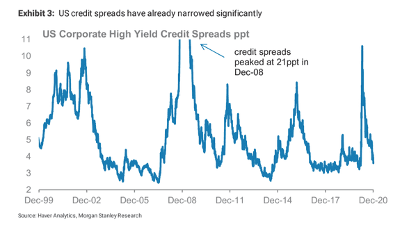

In the highly interconnected world of financial markets, staying informed about economic indicators is crucial. A well-rounded understanding of these indicators not only empowers traders and investors to make informed decisions but also enhances the accuracy of market predictions. Among these indicators, US jobless claims stand out as a critical measure for assessing the health of the labor market. Published on a weekly basis, these claims provide timely insights into the number of individuals filing for unemployment benefits, reflecting changes in employment conditions and broader economic trends.

Jobless claims serve as a valuable barometer for gauging the health of the labor market, impacting trading strategies significantly. An increase in jobless claims might suggest economic slowdowns and potential market downturns, while decreasing claims could indicate economic recovery and stability. Consequently, traders and investors closely analyze jobless claim data, aligning their trading strategies with perceived market conditions. This indicator not only influences short-term trading behaviors but also affects long-term investment decisions.



This article explores the intersection of jobless claims, economic indicators, and algorithmic trading, offering insights for traders. The aim is to demonstrate how traders can leverage jobless claims data in conjunction with other economic indicators to optimize trading strategies and improve market foresight. By understanding the nuances of jobless claims and their implications on financial markets, traders can enhance their ability to adapt and succeed in dynamic trading environments.

## Table of Contents

## Understanding Financial Markets and Economic Indicators

Financial markets are complex systems where prices of financial instruments, such as stocks, bonds, and currencies, are determined. These markets are profoundly influenced by a plethora of economic indicators, which are statistical metrics evaluating various aspects of the economy. Among the most pivotal indicators are Gross Domestic Product (GDP), Consumer Price Index (CPI), and jobless claims, each playing a distinct role in guiding investment decisions and economic policy.

GDP measures the total value of goods and services produced over a specific time period and is often considered the broadest indicator of economic health. A growing GDP signals economic expansion, which typically leads to higher corporate earnings and, consequently, rising stock prices. Conversely, a declining GDP may indicate economic contraction, prompting caution among investors.

The CPI, on the other hand, tracks changes in the price level of a basket of consumer goods and services. It serves as a primary gauge of inflation, which can erode purchasing power. Rising inflation, as indicated by increasing CPI, may compel central banks to raise interest rates to control inflationary pressures, affecting borrowing costs and potentially leading to lower asset prices.

Jobless claims provide a more frequent and immediate snapshot of the labor market's condition. Published weekly, these claims report the number of individuals filing for unemployment benefits. They are divided into initial claims, representing new claimants, and continuing claims, which account for individuals already receiving benefits. Jobless claims are classified as a leading economic indicator due to their capacity to signal shifts in employment levels and consumer spending, consequently foreshadowing broader economic trends.

For investors and traders, the interpretation of these indicators extends beyond understanding the current economic climate. They must also analyze how these indicators collectively impact market dynamics and sentiment. For instance, a period of rising jobless claims, coupled with declining GDP growth, might lead to increased market [volatility](/wiki/volatility-trading-strategies) as investors anticipate weaker earnings and possible monetary policy interventions.

Algorithmic trading systems, which use automated rules to execute trades, extensively incorporate these economic indicators. By inputting variables such as GDP growth rates, CPI changes, and fluctuations in jobless claims, algorithms can generate trading signals that align with prevailing market conditions. This computational approach allows for the rapid processing of vast quantities of data, providing a competitive edge in executing timely trades.

Understanding the interplay between financial markets and economic indicators like GDP, CPI, and jobless claims is critical for traders, especially in the context of algorithmic strategies. The ability to anticipate market movements based on these indicators offers traders strategic advantages, enabling them to capitalize on opportunities and mitigate risks in an ever-evolving economic landscape.

## What Are Jobless Claims?

Jobless claims are statistical reports that provide crucial insights into the state of the labor market by measuring the number of individuals who have filed for unemployment benefits. These reports are published weekly by governmental agencies, such as the U.S. Department of Labor, offering timely data on the labor market's condition. Jobless claims are divided into two primary categories: initial claims and continuing claims.

Initial claims refer to the number of new claimants who have filed for unemployment benefits for the first time during the past week. This metric is often utilized to gauge the pace of layoffs and assess the immediate response of the labor market to economic changes. A spike in initial claims can signal potential economic distress or downturns, affecting both market sentiment and fiscal policy decisions.

Continuing claims, on the other hand, account for individuals who have filed for unemployment benefits for at least two consecutive weeks. This data helps in understanding the persistence of unemployment, providing insights into the long-term impacts on the labor force. By examining continuing claims, analysts can infer the recovery speed of the labor market from economic shocks.

Jobless claims are considered a leading indicator of economic performance due to their timely nature and relevance to overall economic health. Rising initial claims often precede economic slowdowns, while declining numbers can suggest economic recovery or growth. Hence, jobless claims serve as a vital tool for economists and policymakers to interpret current labor market conditions, anticipate future trends, and make informed decisions regarding monetary and fiscal policies.

## How Jobless Claims Affect the Market

Jobless claims serve as a critical metric for assessing the condition of the labor market and, by extension, the broader economy. They can significantly influence market sentiment, with potential repercussions on stock prices and investor behavior. When jobless claims rise, it can signal an economic downturn or a weakening labor market, leading to negative sentiment among investors. This anticipation of reduced consumer spending and slower economic growth can negatively impact stock prices as investors may adjust their portfolios in response to perceived higher risks. Conversely, declining jobless claims suggest an improving labor market, potentially invigorating investor confidence and thus, driving stock prices higher.

Due to the inherent volatility of jobless claims, analysts and traders often place greater emphasis on trends and average figures rather than reacting to weekly fluctuations. Weekly jobless claims can be susceptible to temporary factors such as seasonal employment or short-term economic disruptions. Therefore, focusing on moving averages, such as a four-week moving average, can provide a more stable and reliable indicator of underlying trends in the labor market.

Mathematically, a moving average can be calculated using Python, as follows:

```python
import numpy as np

# Sample jobless claims data (weekly figures)
weekly_claims = np.array([230000, 240000, 235000, 245000, 255000])

# Calculate a four-week moving average
moving_average = np.convolve(weekly_claims, np.ones(4)/4, mode='valid')
print(moving_average)
```

This code snippet calculates the four-week moving average, offering a smoother and less volatile analysis of jobless claims trends over time.

Furthermore, market reactions can be particularly pronounced when jobless claims deviate significantly from economists' expectations. A better-than-expected jobless report may lead to market rallies as investors become optimistic about economic prospects and the potential for increased consumer spending. Conversely, a worse-than-expected report could trigger market slumps, reflecting investor concerns about economic instability and reduced corporate earnings.

Overall, jobless claims are a vital economic indicator with the ability to sway market sentiment and stock prices. Traders and investors often monitor these figures closely, considering the broader context and underlying trends to inform their financial strategies and decisions.

## Algorithmic Trading and Economic Indicators

Algorithmic trading leverages computer systems to automatically execute trades when specific pre-determined criteria are met. This form of trading benefits from the rapid processing capabilities of computers, allowing for high-frequency trading ([HFT](/wiki/high-frequency-trading-strategies)) and the effective management of large volumes of data. Key to this process are economic indicators, which provide data that can be analyzed and incorporated into trading algorithms.

Economic indicators like jobless claims are crucial inputs for [algorithmic trading](/wiki/algorithmic-trading) systems. Jobless claims data, which reflect the number of individuals filing for unemployment benefits, are released weekly and offer insights into the labor market's health. Algorithms can utilize this data to predict market movements and generate trading signals. For instance, a sudden increase in jobless claims might be interpreted as a negative economic signal, potentially leading to a sell-off in the stock market. Conversely, a decrease in jobless claims might be seen as a positive sign, prompting buying activity.

To enhance trading strategies in volatile markets, it is important to understand how algorithms react to jobless claims data. Algorithms are designed to operate on various time frames and market conditions, and their responses may include adjusting positions, hedging risks, or reallocating assets based on anticipated trends. Incorporating jobless claims into these algorithms involves statistical analysis and modeling. For example, a simple moving average (SMA) or an exponential moving average (EMA) can be used to smooth out the data, helping to identify trends and reduce noise from weekly fluctuations. 

In Python, such an approach can be implemented using libraries like `pandas` for data manipulation and `numpy` for numerical operations. A basic implementation might involve calculating an EMA of jobless claims data to guide trading decisions:

```python
import pandas as pd

# Example jobless claims data
jobless_claims_data = {'Date': ['2023-01-01', '2023-01-08', '2023-01-15'], 'Claims': [100, 150, 130]}
df = pd.DataFrame(jobless_claims_data)

# Calculate the Exponential Moving Average (EMA)
ema_span = 2
df['EMA'] = df['Claims'].ewm(span=ema_span, adjust=False).mean()

print(df)
```

This simplified code calculates the EMA of jobless claims over a given period, which could then be used as part of a larger algorithm to generate trading signals. The ability to systematically interpret jobless claims through algorithmic trading frameworks equips traders with tools to respond swiftly to economic changes, potentially gaining an edge in the financial markets.

## Trading Strategies Based on Jobless Claims

Short-term trading strategies often react swiftly to unexpected fluctuations in jobless claims data. Traders utilize high-frequency trading algorithms to capitalize on immediate price movements triggered by the surprise element in the report. For instance, if jobless claims are significantly lower than anticipated, it may signal economic strength, potentially leading to a surge in stock prices. Conversely, higher-than-expected claims might imply economic weaknesses, prompting a sell-off. The immediate reaction to these figures can be relatively short-lived, given that weekly jobless claims can be volatile. 

Long-term investors generally take a more measured approach by examining sustained trends in jobless claims. They may adjust their portfolios based on the broader context of the labor market and economic health. For long-term strategies, integrating jobless claims with other economic indicators like GDP growth rates and consumer confidence indices can offer a comprehensive view of the economic landscape. The multi-month trend line of jobless claims can highlight underlying changes in the economy, guiding asset allocation and investment decisions for sustained growth.

Swing traders, focusing on medium-term strategies, employ jobless claims data to identify optimal entry and [exit](/wiki/exit-strategy) points within a trading range. They seek to exploit the natural volatility caused by fluctuation in these claims during economic cycles. Swing traders often look for patterns in jobless claims data, such as moving averages or support and resistance levels, to determine their trading strategy. 

In Python, a simple strategy might involve using moving averages of jobless claims to generate buy or sell signals:

```python
import pandas as pd

# Example: Load weekly jobless claims data
data = pd.read_csv('jobless_claims.csv')

# Calculate short-term and long-term moving averages
data['MA_2'] = data['Claims'].rolling(window=2).mean()
data['MA_12'] = data['Claims'].rolling(window=12).mean()

# Define buy/sell signals
data['Signal'] = 0
data.loc[data['MA_2'] > data['MA_12'], 'Signal'] = 1
data.loc[data['MA_2'] < data['MA_12'], 'Signal'] = -1

# Display signals
print(data[['Claims', 'MA_2', 'MA_12', 'Signal']])
```

In this example, a buy signal is generated when the short-term moving average crosses above the long-term moving average, and a sell signal is generated when the opposite occurs. This strategy helps swing traders capture trends created by changes in jobless claims within the context of economic cycles.

## Key Factors Influencing Jobless Claims

Various factors can influence US jobless claims numbers, significantly impacting the interpretation of these economic indicators. Key influences include economic indicators, government policies, and global events.

Economic indicators, such as gross domestic product (GDP) growth and consumer price index (CPI), indirectly affect jobless claims by providing context to the overall economic health. For instance, a robust GDP growth typically correlates with lower jobless claims, indicating more job creation and reduced unemployment.

Government policies have a direct influence on jobless claims. Fiscal stimulus measures, such as tax cuts and increased public spending, can boost economic activity, potentially reducing unemployment claims. Conversely, reductions in government spending may lead to increased job losses, reflected in higher jobless claims. Unemployment benefits also directly impact these [statistics](/wiki/bayesian-statistics). Enhanced benefits may lead to extended periods of unemployment claims, as individuals might prefer to continue receiving benefits rather than accepting lower-wage jobs.

Global events have a more indirect but potentially significant impact on jobless claims. Natural disasters, such as hurricanes or wildfires, can cause temporary spikes in unemployment claims due to immediate job losses in affected areas. Geopolitical tensions, such as trade disputes or conflicts, can disrupt supply chains and affect industries, leading to job cuts and increased claims. For instance, the COVID-19 pandemic led to unprecedented spikes in jobless claims due to widespread economic disruptions.

Understanding these key factors allows traders and economists to better interpret weekly jobless claims data and anticipate potential trends or anomalies in the labor market.

## Resources for Monitoring Jobless Claims

Government websites, such as the U.S. Department of Labor, serve as authoritative sources for accessing official jobless claims data. The U.S. Department of Labor releases weekly reports on jobless claims, which are widely regarded as timely indicators of the labor market’s condition. These reports consist of initial claims, representing new requests for unemployment benefits, and continuing claims, which track the number of individuals already receiving benefits. By providing these data, the Department of Labor helps traders, economists, and policymakers understand trends in unemployment and labor market dynamics. The official reports can be accessed through the Department's website, which offers the latest published figures alongside historical data series for comprehensive analysis.

In addition to government sources, financial news platforms like Bloomberg, CNBC, and Reuters provide real-time analysis and commentary on jobless claims data. These platforms not only report on the data release but also offer expert analysis on its implications for financial markets and the economy. Financial analysts and journalists frequently interpret these numbers concerning market expectations, identifying whether the reported figures are better or worse than anticipated and the potential repercussions on stocks, bonds, and currencies. By offering this context, financial news services help traders decipher the impact of jobless claims on market sentiment and trading strategies.

Moreover, economic calendars, such as those offered by trading platforms and financial data providers like Investing.com, TradingEconomics, and ForexFactory, list key dates for economic data releases, including jobless claims. These calendars are essential tools for traders, providing a schedule that helps them anticipate important economic events and adjust their trading strategies accordingly. Typically updated in real-time, economic calendars include information about upcoming releases, previous figures, forecasted data, and the potential impact on financial markets. This allows traders to prepare and time their market entries and exits effectively, enhancing the decision-making process.

Thus, combining insights from official government data, timely financial news analysis, and strategic economic calendars creates a robust framework for monitoring and interpreting jobless claims. These resources collectively enable market participants to harness jobless claims data to make informed trading decisions, keeping pace with shifting market dynamics.

## Conclusion

Mastering the interpretation of jobless claims is essential for traders aiming to make informed decisions within the financial markets. As jobless claims data provides valuable insight into the health of the labor market, it serves as a crucial component in analyzing economic conditions. This data reflects potential shifts in employment trends, which can influence market sentiments and economic forecasts.

By integrating jobless claims data with algorithmic trading strategies, traders can significantly enhance their market foresight. Algorithms, which rely on predefined criteria and historical data, benefit from the inclusion of real-time jobless claims information. This allows for immediate adjustments in trading strategies, helping traders to capitalize on short-term market movements or prepare for long-term trends. For instance, a sudden rise in jobless claims might prompt an algorithm to favor defensive investments, anticipating economic slowdown signals.

Staying ahead in dynamic markets necessitates continuous learning and adaptation to key economic indicators like jobless claims. Traders who consistently update their knowledge of labor market trends and adjust their strategies accordingly are better positioned to exploit market opportunities. This involves not only understanding raw data but also interpreting its implications on a broader economic scale. Monitoring platforms such as the US Department of Labor's website or financial news outlets provide updated information, helping traders remain agile and informed in their decision-making processes.

In conclusion, the effective use of jobless claims data empowers traders to navigate the complexities of financial markets with increased precision. By incorporating this data into sophisticated trading algorithms and maintaining an adaptive approach, traders can achieve a competitive edge, ultimately leading to more robust and successful trading outcomes.

## References & Further Reading

[1]: ["How U.S. unemployment rate is closely watched for signs of trouble ahead"](https://www.nbcnews.com/business/economy/jobs-report-july-2024-employment-numbers-analysis-rcna164651) - Reuters

[2]: ["Employment Situation Summary"](https://www.bls.gov/news.release/empsit.nr0.htm) by Bureau of Labor Statistics, U.S. Department of Labor

[3]: Lopez de Prado, M. (2018). ["Advances in Financial Machine Learning"](https://www.amazon.com/Advances-Financial-Machine-Learning-Marcos/dp/1119482089) - Wiley

[4]: Jansen, S. (2020). ["Machine Learning for Algorithmic Trading: Predictive models to extract signals from market and alternative data for systematic trading strategies with Python"](https://www.amazon.com/Machine-Learning-Algorithmic-Trading-alternative/dp/1839217715) - Packt Publishing

[5]: Chan, E. P. (2009). ["Quantitative Trading: How to Build Your Own Algorithmic Trading Business"](https://github.com/ftvision/quant_trading_echan_book) - Wiley

[6]: Ministry of Labour & Employment, Government of India. ["Unemployment Insurance Benefits"](https://labour.gov.in/annual-reports)

[7]: ["Understanding Algorithmic Trading and Its Impact on Capital Markets"](https://www.sec.gov/files/Algo_Trading_Report_2020.pdf) - Social Science Research Network