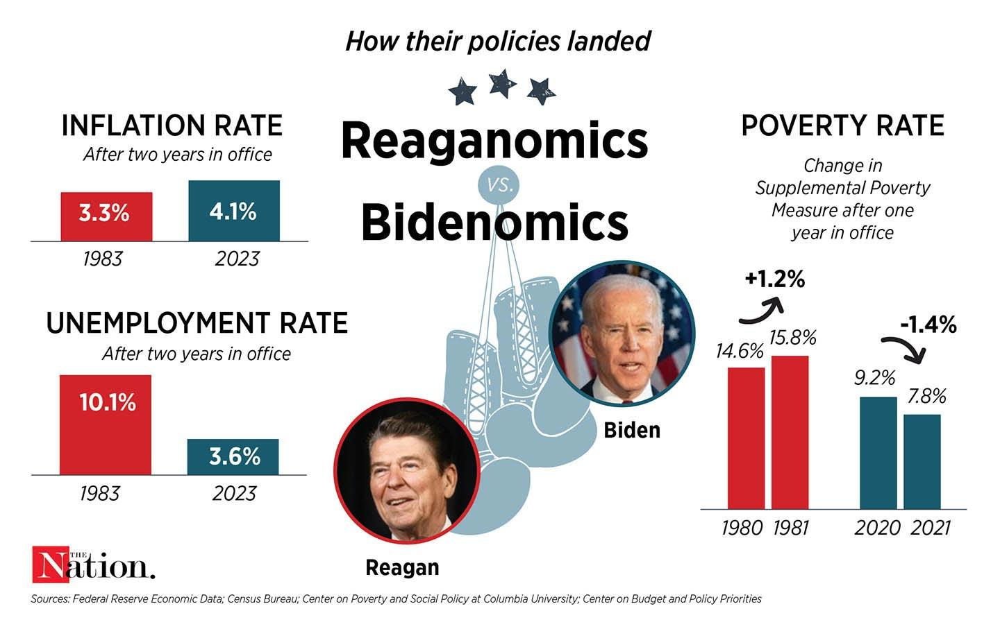

This article explores the intersection of U.S. economic policies under President Joe Biden, commonly known as 'Bidenomics', and the evolving world of algorithmic trading. Bidenomics represents a strategic approach aimed at revitalizing the U.S. economy through legislative measures and public investment. Central to this strategy are initiatives like the American Rescue Plan and the Inflation Reduction Act, which are designed to spur economic growth, promote green energy solutions, and improve infrastructure. These policies aim to support the middle class and foster a competitive market environment by implementing measures such as increased taxation on the wealthy and reducing consumer healthcare costs.

As Bidenomics unfolds, its impact on the U.S. economy and trading markets is under scrutiny. The implementation of these economic measures has significant implications for market dynamics and competition. Algorithmic trading, which utilizes computer algorithms to automatically execute trading strategies, finds itself at the frontline of these changing paradigms. The increased market competition supported by Bidenomics can create opportunities for traders and investors to leverage such automated systems to maintain an edge in the financial markets.

Moreover, the role of algorithmic trading is progressively intersecting with legislative initiatives shaped by Biden's administration, altering market conditions and influencing trading strategies. The convergence of policy and technology exemplifies a shift towards integrating economic policy with modern trading practices. Understanding these changes offers insight into how economic and technological innovations are continuously reshaping the financial landscapes.

## Table of Contents

## Understanding Bidenomics

Bidenomics encompasses the economic strategies implemented by President Joe Biden, characterized by an emphasis on public investment, middle-class empowerment, and fostering business competition. This approach represents a departure from past economic models, seeking to address systemic inequalities and promote sustainable growth.

Central to Bidenomics are legislative initiatives such as the American Rescue Plan Act and the Inflation Reduction Act. The American Rescue Plan Act, passed in March 2021, aimed to provide economic relief amidst the challenges imposed by the COVID-19 pandemic. With a focus on direct payments to individuals, extended unemployment benefits, and support for small businesses, the plan was designed to stabilize the economy by enhancing consumer spending and safeguarding livelihoods.

The Inflation Reduction Act is another pivotal component, targeting long-term economic resilience. Its focus lies on reducing inflationary pressures while promoting sustainable growth. By investing in clean energy technologies and infrastructure, the Act aims to curb carbon emissions, thereby aligning economic policy with environmental goals. Additionally, it proposes measures to negotiate prescription drug prices, which could reduce healthcare costs for consumers significantly.

Key objectives of Bidenomics include a robust promotion of green energy initiatives. This involves investing in renewable energy sources and infrastructure to transition the U.S. economy towards a more sustainable future. The administration's push for green energy not only aims at reducing carbon emissions but also at creating new jobs within the renewable sector, contributing to economic growth.

Supporting unions and advocating for workers' rights is another cornerstone of Bidenomics. By empowering labor unions, the administration seeks to mitigate income inequality and ensure fair wages, thereby reinforcing the purchasing power of the middle class. This empowerment is seen as essential for fostering a healthy economy driven by consumer spending.

Increasing taxes on the wealthy is a strategic move to fund these initiatives. The Biden administration's tax policy proposes higher tax rates for individuals and corporations with higher incomes, with the goal of redistributing wealth and funding social programs. This approach is intended to generate revenue for public investment without exacerbating fiscal deficits.

Furthermore, a focus on reducing consumer healthcare costs is evident in the policy framework. Through measures such as capping prescription drug prices, Bidenomics aims to alleviate financial burdens on consumers, thereby enabling them to allocate more resources towards other needs, contributing to a more dynamic economic environment.

Overall, Bidenomics focuses on restructuring the economic landscape by prioritizing public investment, empowering the middle class, and cultivating a competitive yet equitable business environment. The multifaceted approach aims to foster economic resilience and sustainability while addressing long-standing inequalities.

## Core Pillars of Bidenomics

Bidenomics embodies a distinct economic philosophy that seeks to invigorate the American economy by focusing on equitable growth from the grassroots level. The strategy emphasizes addressing social and economic disparities and advancing climate change initiatives.

A critical component of Bidenomics is public investment, particularly focusing on clean energy and infrastructure. By allocating substantial resources to renewable energy projects and infrastructure modernization, Biden aims to position the United States as a competitive force in a global economy increasingly leaning towards sustainability. Projects funded under Bidenomics seek not only to reduce carbon emissions but also to create jobs and stimulate economic activity. This drive towards public investment reflects a long-term strategy to enhance competitiveness by ensuring that the U.S. infrastructure and energy sectors are robust and forward-looking.

Worker empowerment is another cornerstone of this economic approach. Bidenomics advocates for empowering the workforce through improved educational opportunities and robust support for unions. This involves increasing access to quality education and vocational training to equip workers with skills necessary for a rapidly evolving job market. Furthermore, strengthening unions is seen as a way to secure fair wages and ensure that workers have a voice in the economic processes. By supporting middle-class empowerment, Bidenomics aims to build a resilient economy where prosperity is not just concentrated at the top, but felt by the majority.

Fostering competition within the market is vital under Bidenomics. The administration aims to create an economic environment that reduces monopolistic practices, lowers consumer costs, and enhances wage levels. By promoting policies that encourage competition, there is a concerted effort to counteract corporate dominance, ultimately aiming to deliver better choices and prices to consumers while supporting fair business practices.

Overall, Bidenomics seeks a paradigm shift from traditional top-down economic growth models, emphasizing inclusive growth and sustainable economic practices. By leveraging public investment, workforce empowerment, and competitive markets, this strategy aims to tackle pressing issues such as inequality and climate change while pushing the U.S. towards future economic leadership.

## Bidenomics vs. Reaganomics

Bidenomics represents a distinct ideological shift from Reaganomics, the economic framework championed by President Ronald Reagan during the 1980s. Rooted in the principles of supply-side economics, Reaganomics aimed to stimulate economic growth through significant tax reductions for individuals and corporations, particularly benefiting the wealthiest segments of society. The underlying belief was that enabling the affluent to retain more wealth would lead to increased investment and consumption, thereby generating overall economic prosperity—a process often described as "trickle-down economics."

In contrast, Bidenomics is characterized by its focus on nurturing economic growth from the middle and lower classes. This approach prioritizes public investments in infrastructure and social welfare to create a more equitable economic landscape. By directing resources towards these areas, Bidenomics seeks to bolster the economic capacities of the broader population, thereby stimulating demand and fostering inclusive growth.

A key distinction between these two economic policies lies in their treatment of taxation and government spending. Reaganomics advocated for a substantial decrease in tax rates, particularly for the wealthiest individuals and corporations, alongside a reduction in government intervention in the economy. The intention was to incentivize private investment and productivity, thereby accelerating economic growth.

In contrast, Bidenomics involves increasing taxes on the wealthiest Americans and corporations to fund expansive public programs. This approach is designed to ameliorate income inequality and ensure that wealth generation benefits a wider demographic. It underscores an active governmental role in redistributing wealth and resources to achieve socioeconomic objectives, such as enhancing infrastructure and reducing healthcare costs.

While Reaganomics focused on deregulation as a means of fostering a self-sustaining economic environment, Bidenomics leans towards implementing regulatory measures to ensure fair competition and protect consumer interests. This philosophical divergence illustrates the broader ideological shift from free-market solutions to a more interventionist stance, reflecting differing visions on the role of government in economic management.

Overall, the comparison between Bidenomics and Reaganomics underscores a fundamental realignment in economic policy orientation, from top-down wealth distribution models to strategies that emphasize bottom-up growth and resilience. This shift highlights an evolving understanding of the interplay between government action, taxation, and economic equity.

## Effects on U.S. Economy

Bidenomics has been a key driver of U.S. economic changes since President Joe Biden took office, with significant impacts on job creation, unemployment rates, and manufacturing growth. Under Bidenomics, the U.S. economy has experienced a robust recovery, with policies aimed at revitalizing the labor market and manufacturing sectors. The American Rescue Plan Act, for instance, allocated resources to accelerate job growth and stabilize employment post-pandemic. According to the U.S. Bureau of Labor Statistics, there was a notable increase in employment rates, with key sectors reporting significant job gains. This has led to a reduction in the unemployment rate, which aligns with the administration's goal of fostering an inclusive economic recovery.

One of the most significant economic sectors under Bidenomics is manufacturing. The administration's focus on public investment has helped reinvigorate manufacturing growth, a critical component of the U.S. economic foundation. Initiatives promoting clean energy and infrastructure development have not only created jobs but have also encouraged manufacturing activities. The emphasis on clean energy is intended to transition the economy towards more sustainable practices, which are expected to have long-term benefits for the manufacturing workforce.

Despite these successes, Bidenomics has encountered challenges, notably concerning inflation and [interest rate](/wiki/interest-rate-trading-strategies) fluctuations. Post-pandemic economic conditions have led to increased consumer demand, which, combined with supply chain disruptions, has put upward pressure on prices. The Federal Reserve's decision to raise interest rates in response to inflation concerns indicates the complexities of managing economic growth alongside price stability.

There is ongoing debate regarding the extent of Bidenomics' direct impact compared to natural post-pandemic recovery trends. Critics argue that much of the observed economic improvement is a residual effect of the economy reopening after COVID-19 shutdowns rather than a result of specific policy interventions. Proponents, however, assert that the targeted policies under Bidenomics, such as direct financial assistance and investment in critical sectors, have been integral to accelerating recovery and fostering economic resilience.

Overall, the effects of Bidenomics on the U.S. economy highlight a period of significant transition marked by enhanced job creation, reduced unemployment, and renewed focus on manufacturing growth. Understanding the balance between policy-driven initiatives and intrinsic economic recovery remains a topic of analysis and discussion among economists and policymakers.

## Role of Algorithmic Trading

Algorithmic trading, an increasingly dominant force in financial markets, has evolved significantly with the economic policies implemented during President Joe Biden's administration. This confluence of economic policy and technological advancement has implications for market dynamics and competitiveness. As Bidenomics chart a path centered on increasing public investment and fostering competition, [algorithmic trading](/wiki/algorithmic-trading) plays a critical role in realizing these economic objectives.

Algorithmic trading utilizes sophisticated algorithms to execute trades at speeds and frequencies that far surpass human capabilities. The digital transformation of financial markets has enabled traders to capitalize on minuscule price discrepancies and market inefficiencies, often in fractions of a second. These capabilities are particularly vital in an economic landscape where policies aim to boost market competition and transparency.

The economic environment shaped by Bidenomics influences various market conditions that can alter the effectiveness and strategies of algorithmic trading. For instance, increased public investment in technology and infrastructure may enhance the data available to traders, allowing for more informed decision-making. Additionally, measures aimed at fostering competition can lead to more volatile market environments. Volatility, often seen as a double-edged sword in trading, can provide both risks and opportunities for algorithmic trading systems. The effectiveness of these systems largely depends on their ability to adapt to rapid changes in market conditions, driven by policy-induced shifts in supply and demand dynamics.

Economic policies focusing on transparency and competitiveness, central to Bidenomics, further bolster algorithmic trading ecosystems. By promoting equal opportunity and dismantling monopolistic structures, these policies can lead to a more dynamic trading environment where a diverse set of participants can thrive. Algorithmic traders, benefiting from these competitive markets, are better equipped to exploit [arbitrage](/wiki/arbitrage) opportunities and execute strategies such as [market making](/wiki/market-making) and [statistical arbitrage](/wiki/statistical-arbitrage), which rely heavily on rapid information processing and execution capabilities.

The influence of Bidenomics on algorithmic trading also extends to regulatory aspects. As policymakers scrutinize the financial sector's dynamics, there's potential for regulatory changes that may impact algorithmic trading practices. While increased regulation could impose constraints on certain trading strategies, it may also ensure a level playing field, fostering innovation and ethical algorithmic practices.

In conclusion, algorithmic trading stands as a pivotal component in the interplay between economic policy and market functionality under Bidenomics. Its growth and adaptation in response to policy changes highlight the intricate relationship between technological advancement and economic governance, ensuring that financial markets remain robust and competitive.

## Criticism and Praise

Critics of Bidenomics often argue that the economic recovery observed during President Joe Biden's administration is primarily a result of pandemic-related factors rather than the direct impact of new policies. They contend that the natural rebound from the COVID-19 pandemic, bolstered by the [momentum](/wiki/momentum) of pent-up consumer demand and the reopening of global markets, has played a more significant role in economic improvement than governmental interventions. Such views suggest that the pandemic created unique economic circumstances, including unprecedented fiscal stimulus measures initiated under the previous administration, which laid the groundwork for subsequent recovery.

On the other hand, proponents of Bidenomics highlight tangible achievements attributed to the administration's policies. Notably, they emphasize the substantial job creation and declining unemployment rates that have marked this period. Under Biden's policies, the U.S. economy has reportedly added millions of jobs, contributing to a significant reduction in unemployment. Furthermore, supporters underscore the increase in wage levels, which has been a pivotal aspect of the administration's focus on empowering the middle class and fostering economic growth from the ground up.

Infrastructure development also emerges as a key point of praise for Bidenomics. The administration has championed substantial investments in infrastructure, citing long-term economic benefits and the creation of job opportunities linked to these projects. Supporters argue that such measures are crucial for enhancing national competitiveness and addressing longstanding deficiencies in public infrastructure.

Perspectives from political and economic experts display a spectrum of opinions regarding the efficacy and impact of Bidenomics. Some economists stress the need to differentiate between short-term recovery mechanics and the longer-term effects of specific policies. While the stimulus provided by the American Rescue Plan Act contributed to immediate economic boosts, there is an ongoing debate about the sustainability of this growth and its impact on inflationary pressures.

In political discourse, the dialogue surrounding Bidenomics often mirrors broader partisan lines. Democrats tend to laud the administration's interventions as necessary for equitable growth and social investment. In contrast, Republicans frequently critique the policies as overly expansionary, raising concerns about federal spending and its implications for national debt. The contrasting viewpoints illustrate the complexity of evaluating economic policies, where empirical data intersects with ideological beliefs.

## The Future of Bidenomics

The trajectory of Bidenomics is poised to play a pivotal role in shaping the United States' economic landscape, and its future is intrinsically linked to the outcome of the 2024 election. Depending on political developments, Bidenomics may either continue its [course](/wiki/best-algorithmic-trading-courses) of public investment and middle-class empowerment or undergo significant transformations. This potential shift emphasizes the importance of several key economic indicators which will be crucial in evaluating its past successes and forecasting its future.

Unemployment rates and investment levels will serve as primary benchmarks in assessing Bidenomics' effectiveness. A sustained reduction in unemployment would indicate that Bidenomics' strategies, particularly those focusing on infrastructure development and clean energy, are contributing positively to job creation. Additionally, the level of both domestic and foreign investment in these sectors will reveal the confidence that investors place in the economic strategies pursued under this policy.

Another area of anticipated continuity is the focus on infrastructure and green energy. Continued support for these sectors is essential for long-term economic growth and competitiveness. Bidenomics prioritizes transitioning to a more sustainable economy, which in turn may foster innovation and new industries related to clean technology. Investments in these areas not only promise environmental benefits but could further boost economic resilience by positioning the United States as a leader in green technology.

However, the unpredictable nature of global economic trends and domestic political dynamics means that the future of Bidenomics is not solely dependent on current policies but also on how adaptable these strategies are to changing circumstances. The economic landscape will demand agile responses to challenges such as climate change, technological advancements, and geopolitical shifts, all of which will influence the effectiveness and sustainability of Bidenomics.

In summary, the continuation and potential evolution of Bidenomics are at a critical juncture, where economic indicators like unemployment and investment will heavily influence its evaluation. The emphasis on infrastructure and green energy is likely to persist, fundamentally molding long-term U.S. economic trends. As the nation approaches the 2024 election, these factors collectively underscore the dynamic interplay of policy, politics, and economics that will define the future of Bidenomics.

## Conclusion

Bidenomics marks a considerable departure from preceding economic strategies, emphasizing equitable growth and expanding opportunities for the middle and lower economic classes. By shifting the focus from the previously popular trickle-down economics to a more inclusive framework, Bidenomics underscores the importance of investing in public goods, infrastructure, and clean energy. This approach is designed to stimulate economic growth by empowering the middle class and promoting a more resilient economy.

Simultaneously, the integration of algorithmic trading and rising economic competition signifies a response to contemporary technological and market developments. Algorithmic trading's role in increasing market efficiency and [liquidity](/wiki/liquidity-risk-premium) reflects the dynamic nature of modern financial markets. These systems leverage advanced computing to make rapid trading decisions, thereby supporting a competitive marketplace, a key pillar of Biden's economic strategy. As such, Bidenomics and algorithmic trading collectively capture the evolving landscape of economic interaction where policy and technology converge to shape market dynamics.

Looking forward, the future trajectory of Bidenomics will be influenced by an array of factors including policy decisions and market responses. Political shifts, particularly the outcome of the 2024 elections, will critically shape the continuation or potential transformation of these economic policies. Economic indicators, such as unemployment rates and investment levels in infrastructure and green energy, will serve as benchmarks for assessing the success and adaptability of Bidenomics. The ability of these policies to address ongoing economic challenges and harness technological advancements will ultimately determine their long-term impact on the U.S. economy.

## References & Further Reading

[1]: ["The American Rescue Plan Act of 2021"](https://www.congress.gov/bill/117th-congress/house-bill/1319) - U.S. Congress Legislation

[2]: ["Inflation Reduction Act of 2022"](https://www.congress.gov/bill/117th-congress/house-bill/5376) - U.S. Congress Legislation

[3]: ["Biden's Economic Agenda and the Impact on the Market"](https://www.brookings.edu/five-things-to-know-about-bidens-comprehensive-economic-plan/) - Brookings Institution

[4]: ["The Future of Algorithmic Trading"](https://www.quodfinancial.com/future-of-algorithmic-trading/) by Ali, Sadaquat and Memon, Musarat (2020) - Nature

[5]: ["Advances in Financial Machine Learning"](https://www.amazon.com/Advances-Financial-Machine-Learning-Marcos/dp/1119482089) by Marcos Lopez de Prado