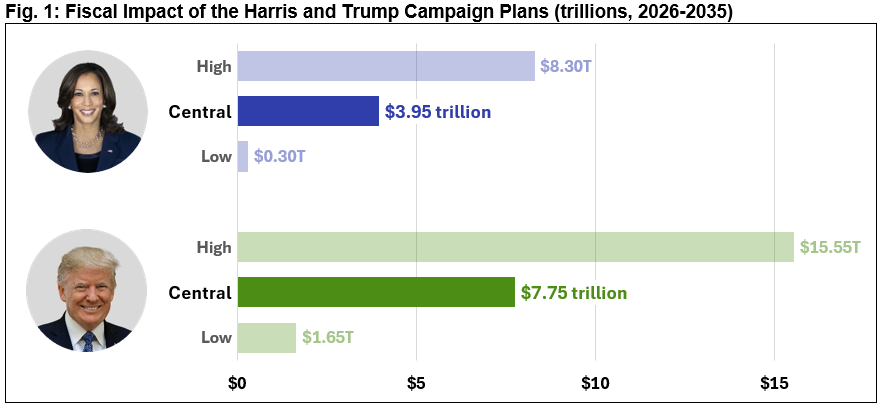

The economic landscape of the United States is continually evolving, shaped by influential leaders and their policy initiatives. Kamala Harris, as Vice President, stands at the forefront of this transformation, with her economic plan drawing considerable attention and analysis. Her approach is seen as pivotal in determining the future trajectory of the nation's economy.

Harris's economic policies are designed to affect a variety of sectors, including the burgeoning field of algorithmic trading, as well as the broader economy. This article intends to analyze the potential impacts of these policies, focusing on how they might influence both specialized financial strategies and overarching economic growth.



By examining the key components and intentions behind Harris's economic proposals, the article seeks to provide a comprehensive understanding of their likely outcomes. This understanding is critical for stakeholders, economists, and policymakers who are evaluating the policies' potential to foster economic growth while simultaneously addressing income disparities.

An in-depth analysis of Kamala Harris’s economic plan not only highlights the potential changes in economic policy but also underscores the complexities of implementation and the challenges such policies might face. It is through this exploration that we gauge their effectiveness in tackling pressing economic issues and promoting a more equitable economic landscape.

## Table of Contents

## Overview of Kamala Harris's Economic Plan

Kamala Harris's economic plan is built around the central themes of supporting middle- and working-class families, fostering job creation, and tackling income inequality. One of the core components of her plan involves revising the tax code to reduce the financial burden on middle-class households while ensuring that corporations and high-income earners contribute a fairer share to the nation's revenue. These revisions aim to simplify the tax system and ensure its progressivity, potentially enhancing disposable income for a significant portion of the population.

Another critical aspect of Harris's economic strategy focuses on reducing living costs, particularly in essential areas such as healthcare, education, and housing. By aiming to lower these expenditures, the plan seeks to increase the financial stability and purchasing power of American families, thereby stimulating economic activity.

Community investments form a vital part of her agenda. By directing resources towards strategically targeted areas, the plan seeks to stimulate local economies and address disparities that have historically hindered growth in underserved regions. Such investments are expected to foster sustainable development, enhance infrastructure, and create robust local economies.

Ultimately, Harris's economic policies are designed to ensure free and fair markets. By promoting both economic growth and equity, her plan addresses systemic issues within the economy that lead to inequality. The overarching goal is to create a balanced economic environment where opportunities are accessible to all, fostering a more equitable society.

## Impact on the Cost of Housing

Kamala Harris’s economic plan includes a comprehensive strategy aimed at addressing the housing crisis in the United States by significantly increasing the housing supply. A key element of this plan is the construction of 3 million new housing units. This initiative is designed to alleviate the chronic shortage in housing supply, which has been a major contributor to the affordability issues faced by many Americans.

The plan includes offering tax incentives to homebuilders, a measure intended to reduce the financial burden and risks associated with large-scale housing projects. By lowering the cost barriers for developers, these incentives aim to spur private investment into the housing market, thereby increasing the rate of new construction projects. This approach is expected to enhance the overall housing availability, particularly in areas where demand has outpaced supply.

In addition to tax incentives, Harris’s plan outlines the provision of support funds for local housing solutions. This funding is aimed at empowering local governments and community organizations to develop innovative housing models tailored to the unique needs of their regions. These support funds are intended to enable the construction of affordable housing units, renovation of existing structures, and implementation of sustainable housing developments.

If successful, these proposed measures could significantly increase the number of affordable housing options, reducing the financial strain on middle- and lower-income families. They aim to make housing more accessible by expanding supply and, consequently, exerting downward pressure on prices. By addressing both supply-side incentives and demand-side support, Harris’s approach seeks to create a more balanced housing market, thus enhancing economic stability and community wellbeing.

## Investments in Community Development Financial Institutions (CDFIs)

Kamala Harris's dedication to enhancing economic opportunities in underserved communities is evident through her support for Community Development Financial Institutions (CDFIs). These institutions play a pivotal role in providing financial services to communities often overlooked by traditional banking systems. CDFIs offer a wide range of financial products and services, including loans, to small businesses and individuals in low-income and rural areas, thereby stimulating local economic development.

Harris's administration aims to significantly increase funding to CDFIs, recognizing their potential to foster small business growth and development. This increase in funding is not merely about injecting capital into these institutions but is a strategic move to stimulate broader economic prosperity. By empowering CDFIs, the administration intends to create a multiplier effect, where every dollar invested can lead to multiple dollars of economic activity within the community.

Furthermore, CDFIs are uniquely positioned to address the financial needs of communities that lack access to conventional banking. They offer tailored financing solutions that accommodate non-standard credit profiles, which is instrumental in supporting small businesses and entrepreneurs who might otherwise struggle to secure funding. As these businesses grow and thrive, they create jobs, increase local tax revenues, and contribute to the overall economic vitality of their communities.

By channeling increased resources to CDFIs, Harris aims to enhance their capacity to offer larger and more frequent loans, provide financial education, and expand their reach across more geographical areas. This strategy is expected to have a pronounced impact on economically distressed regions, facilitating an environment where businesses can flourish, and residents can achieve greater financial stability.

The emphasis on supporting CDFIs aligns with Harris’s broader economic goals of reducing income inequality and fostering equitable growth. By targeting underserved communities and injecting capital where it is most needed, the proposed funding increase to CDFIs represents a critical component of a comprehensive approach to inclusive economic development.

## Algorithmic Trading: An Increasingly Important Economic Tool

Algorithmic trading has become an integral component of contemporary financial markets, driven by the rapid advancement of technology and access to high-frequency data. At its core, [algorithmic trading](/wiki/algorithmic-trading) involves using pre-defined programs and algorithms to execute trades at speeds and frequencies beyond human capability. This method not only enhances market efficiency by providing [liquidity](/wiki/liquidity-risk-premium) but also minimizes manual errors, leading to more transparent and fairer trading conditions.

The implementation of fiscal policies under Kamala Harris's economic plan could influence the landscape of algorithmic trading. Any changes in fiscal policies can impact economic indicators such as interest rates, inflation, and currency values, which are critical parameters in algorithmic models. For instance, in a scenario where a new tax reform alters corporate cash flows, algorithms would need to adjust their strategies based on revised earnings forecasts and valuation metrics.

Algorithmic trading models often rely on a multitude of factors, including macroeconomic indicators. Harris's policies aiming at economic equity, such as those facilitating community development, might introduce variability in regional economic data. This variability needs to be captured by trading algorithms to adjust investment strategies dynamically. For example, if government spending increases in certain sectors, algorithms programmed for those sectors might predict price movements and execute trades to exploit these changes.

Furthermore, algorithmic trading strategies such as statistical [arbitrage](/wiki/arbitrage), [momentum](/wiki/momentum)-based trading, and market-making could face adjustments under changes in liquidity provisions or transaction costs influenced by fiscal policies. If Harris's economic measures involve altering regulations around data transparency and financial reporting, they could directly impact the performance metrics driving algorithmic executions.

In Python, a simple hypothetic algorithm might utilize a macroeconomic indicator to decide trades as follows:

```python
def execute_trade(macro_indicator):
    if macro_indicator > threshold_value:
        order_type = "buy"
    else:
        order_type = "sell"
    return place_order(order_type)

def place_order(order_type):
    # Logic for placing an order with a simulated broker
    print(f"Executing a {order_type} order.")
```

Ultimately, traders and financial firms must remain vigilant and adaptable, ensuring their algorithmic trading strategies remain robust under changing economic conditions predicted by Harris's policies. As these strategies adapt, the broader economic implications of algorithmic trading may manifest in more stabilized and efficient markets, improving investor confidence and contributing to sustained economic growth. Understanding these interactions is essential for foreseeing market reactions to policy changes and strategically positioning investments.

## Economic Growth and Job Creation

Kamala Harris emphasizes job creation as a central component of her 'opportunity economy' framework. This approach focuses on creating sustainable employment opportunities by fostering an environment conducive to business growth and innovation. One of the main strategies involves providing tax deductions for small businesses, aimed at reducing their operational costs and enhancing their capacity to hire more employees. This is particularly significant for small businesses, which constitute a major portion of the U.S. economy and are often more sensitive to shifts in fiscal policy.

Harris's plan also proposes increasing federal contract distributions to emerging enterprises. This policy aims to level the playing field by ensuring that smaller and newer companies have greater access to lucrative government contracts, which can serve as crucial catalysts for growth and job creation. By doing so, these companies are better positioned to increase their workforce, thereby contributing to overall employment growth.

The effective implementation of these job creation strategies is anticipated to play a pivotal role in mitigating inflationary pressures. By enhancing production capacities and generating more jobs, the economy can stabilize as demand and supply dynamics are better matched. This is particularly relevant in times of economic uncertainty when inflation poses a significant threat to economic stability.

In summary, by emphasizing tax benefits and equitable access to federal resources, Harris's economic plan aspires to strengthen the job market, promote economic growth, and provide a robust platform for reducing inflationary constraints, thereby stabilizing the broader economy.

## Addressing Income Inequality

Kamala Harris's approach to addressing income inequality emphasizes the deployment of strategic fiscal policies designed to support lower-income families and promote equitable economic growth. Central to this approach is the expansion of tax credits, which aims to provide financial relief and enhance the economic standing of families that are often disadvantaged by existing tax frameworks.

The expansion of tax credits involves enhancing programs such as the Earned Income Tax Credit (EITC) and Child Tax Credit (CTC). These programs are pivotal in supplementing the income of lower-wage workers and families. For instance, adjusting the EITC parameters can result in more significant refunds for eligible households, effectively augmenting their income levels and reducing the relative tax burden. This policy is based on the premise that increasing disposable income enables families to better support themselves economically, reducing poverty levels and mitigating income disparities.

To further this goal, adjustments in corporate tax structures are also being considered. By revisiting corporate taxes, Harris's plan anticipates influencing corporate behaviors towards more inclusive economic practices. Incentivizing companies to invest in their workforce and communities can foster a more equitable distribution of wealth. One aspect of this is encouraging corporations to increase wages and benefits for their lower-income employees, which can in turn lead to reduced income inequality.

Moreover, by addressing loopholes and ensuring that corporations contribute their fair share, the government can potentially redirect increased revenues toward public investment and social programs that benefit low and middle-income families. This strategy may create a cycle of growth where equitable investment by the private sector supports societal welfare.

The interplay between expanded tax credits and reformed corporate tax policies plays a crucial role in Harris's vision of narrowing the income gap. By carefully crafting these fiscal strategies, the objective is not only to provide immediate relief but also to encourage sustainable economic practices that perpetuate fairness and equality in wealth distribution across the economy.

## Criticisms and Challenges

Criticism of Kamala Harris's economic plan primarily centers on its perceived lack of clarity in addressing long-term economic impacts. Critics argue that while the plan presents bold initiatives aimed at fostering economic growth and reducing inequality, it often falls short in detailing how these goals will be achieved sustainably over time. One specific concern is the implementation feasibility of housing and community investment proposals amidst existing bureaucratic and political hurdles. Critics question whether constructing 3 million new housing units is practical given current regulatory constraints, availability of skilled labor, and supply-chain issues.

The challenge of executing Harris's economic policies is further compounded by the prevalent economic and political divisions within the United States. These divisions can hinder collaborative efforts necessary for policy implementation. For example, partisan disagreements over fiscal priorities can delay or obstruct legislative approval of proposed initiatives. Additionally, variations in economic needs and priorities across regions may lead to resistance from local governments or stakeholders, complicating the enactment of federal economic strategies.

To successfully implement Harris's economic vision, it is crucial to acknowledge and address these criticisms. A clear, detailed plan with actionable steps and measurable benchmarks could help mitigate concerns about long-term impacts. Furthermore, engaging stakeholders across political and economic spectrums through inclusive dialogue and partnerships may facilitate more effective policy execution. By proactively addressing these challenges, the administration can enhance the potential for realizing its economic objectives, ultimately contributing to sustained economic health and equity.

## Conclusion

Kamala Harris's economic plan is a comprehensive approach to addressing the multifaceted challenges currently faced by the U.S. economy. Her policies are designed to stimulate economic growth while promoting equity, aiming to reduce income inequality through various fiscal strategies. Key components, such as constructing new housing units, supporting community development financial institutions, and reforming tax codes, reflect her commitment to bolstering economic opportunities, especially for middle and working-class families.

The intersection of Harris's policies with algorithmic trading and broader market dynamics presents a speculative yet intriguing dimension. Algorithmic trading, which relies heavily on evolving market conditions and fiscal policies, may see shifts in strategy as Harris's economic plan unfolds. Changes in tax structures, market incentives, and financial regulations could redefine trading algorithms, impacting liquidity, market efficiency, and [volatility](/wiki/volatility-trading-strategies).

For investors and economists, staying informed about the trajectory of these policies is crucial. Understanding potential reforms and market shifts enables strategic adjustments to investment approaches and economic forecasts. As Harris's vision seeks to reshape the economic landscape, ongoing analysis will be key to anticipating developments and positioning for future opportunities.

In conclusion, while the full impact of Kamala Harris’s economic plan remains to be seen, its foundational goals of fostering growth and reducing inequality are clear. The challenge will be in the effective implementation and adaptation to the evolving economic and political landscapes. Investors and economists must remain vigilant and adaptive to navigate the potential changes in market dynamics effectively.

## References & Further Reading

[1]: ["Advances in Financial Machine Learning"](https://www.amazon.com/Advances-Financial-Machine-Learning-Marcos/dp/1119482089) by Marcos Lopez de Prado

[2]: ["Machine Learning for Algorithmic Trading"](https://github.com/PacktPublishing/Machine-Learning-for-Algorithmic-Trading-Second-Edition) by Stefan Jansen

[3]: ["Quantitative Trading: How to Build Your Own Algorithmic Trading Business"](https://books.google.com/books/about/Quantitative_Trading.html?id=j70yEAAAQBAJ) by Ernest P. Chan

[4]: Mitchell, S., & Lim, Y. (2018). ["How Community Development Financial Institutions Promote Economic Growth."](https://www.nber.org/papers/w18952) Federal Reserve.

[5]: Benmelech, E., & Kuttner, K. N. (2021). ["The Supply Side of Housing and Housing Credit Markets."](https://effibenmelech.com/wp-content/uploads/2021/03/capital_labor_feb__28_2021.pdf) National Bureau of Economic Research.