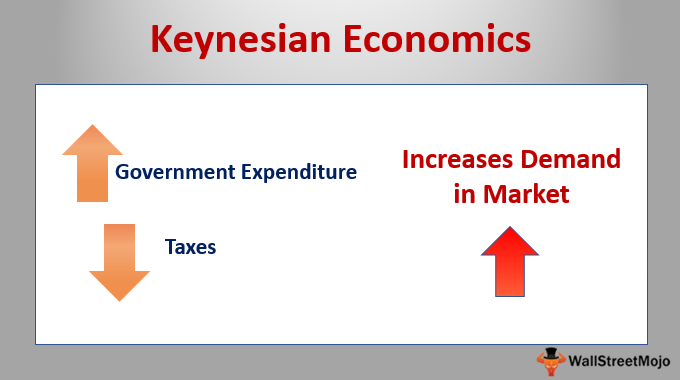

Economic theory serves as a fundamental framework guiding the understanding and operation of financial markets. It encompasses various models and hypotheses aimed at interpreting market behaviors, predicting future trends, and formulating policy responses to economic challenges. One of the most influential schools of thought in economic theory is Keynesian economics, which focuses on total spending in the economy and its effects on output and inflation.

Keynesian economics emerged during the Great Depression, with economist John Maynard Keynes proposing that aggregate demand—the total demand for goods and services within an economy—is the primary driving force behind economic cycles. Keynes suggested that during periods of economic downturn, government intervention is crucial to stimulate demand and mitigate the impacts of recessions. This approach provides insight into boom-bust cycles, characterized by periods of rapid economic growth (boom) followed by contractions (bust). Keynesian thought emphasizes the role of fiscal and monetary policies in smoothing these cycles, advocating for active government intervention to maintain economic stability.



In recent years, the landscape of trading practices has been transformed by algorithmic trading. This practice involves the use of advanced mathematical models and algorithms to execute trades at speeds and volumes impossible for human traders. Algorithmic trading significantly enhances market efficiency through increased liquidity and reduced transaction costs. However, it also introduces new challenges such as heightened market volatility and systemic risks, which require careful consideration and management.

The purpose of this article is to explore the potential for integrating Keynesian economic principles with algorithmic trading strategies to effectively manage boom-bust cycles. By aligning macroeconomic insights from Keynesian theory with the precision and efficiency of algorithmic trading, it may be possible to create adaptive trading models that contribute to economic stability. This exploration promises to provide a unique perspective on how classic economic theories can be innovatively applied to modern trading technologies, ultimately influencing market dynamics and outcomes.

## Table of Contents

## Understanding Keynesian Economics

Keynesian economics, pioneered by British economist John Maynard Keynes during the first half of the 20th century, revolutionized economic thought by focusing on aggregate demand as the primary driver of economic cycles. This approach emerged in response to the Great Depression of the 1930s, challenging the classical economic theory, which emphasized supply-side factors and market self-regulation. Keynes argued that insufficient aggregate demand could lead to prolonged periods of high unemployment and economic stagnation, and therefore, active government intervention was necessary to stabilize the economy.

At the heart of Keynesian economics is the concept of aggregate demand, defined as the total demand for goods and services within an economy at a given overall price level and in a given time period. Aggregate demand is expressed as:

$$

AD = C + I + G + (X - M) 
$$

where $C$ represents consumption, $I$ stands for investment, $G$ is government spending, and $(X - M)$ is net exports (exports minus imports). Keynes posited that fluctuations in these components, particularly consumption and investment, could lead to economic booms or busts. For example, during a downturn, pessimistic expectations can cause a reduction in consumption and investment, leading to decreased aggregate demand and further economic contraction—a self-perpetuating cycle.

Keynes advocated for government intervention to mitigate these cycles by manipulating either fiscal policy—changes in government spending and taxation—or monetary policy, primarily interest rates. During periods of economic downturn, Keynes recommended counter-cyclical fiscal policies, such as increasing government spending and reducing taxes, to boost aggregate demand and restore economic stability. This expansionary fiscal policy could compensate for insufficient private sector demand, thereby reducing unemployment and stimulating economic activity.

Despite its contributions, Keynesian economics has faced critiques. Critics argue that it can lead to excessive government intervention, potentially resulting in inefficiencies and distortions. Additionally, the reliance on fiscal policy to manage economic cycles is sometimes criticized for potentially leading to significant fiscal deficits and public debt. Furthermore, the time lag inherent in implementing fiscal measures is another limitation, which can make timely intervention challenging.

Monetarists, led by Milton Friedman, challenged Keynesian economics by asserting that monetary policy, specifically controlling the supply of money, is more effective than fiscal policy in stabilizing the economy. They argue that targeting stable inflation through monetary policy can ensure a stable economic environment, contrasting with Keynes' emphasis on aggregate demand.

In summary, while Keynesian economics has laid the groundwork for understanding and managing economic cycles through aggregate demand and government intervention, it is not without its limitations and critiques. Regardless, its influence persists, especially in policy design, where it is often balanced with other economic theories to address complex modern economic challenges.

## Boom-Bust Cycles in the Economy

Boom-bust cycles, often referred to as business cycles, are a fundamental feature of capitalist economies, characterized by periods of rapid economic expansion (booms) followed by downturns and recessions (busts). These cycles are of profound historical significance, having shaped economic policy and discourse for centuries. 

Economist John Maynard Keynes' theoretical framework offers significant insights into understanding and addressing these fluctuations. Keynesian economics posits that aggregate demand—comprising consumer spending, investment by businesses, government expenditure, and net exports—is the primary driving force behind economic cycles. During a boom, increased aggregate demand can lead to overproduction and inflation. Conversely, a bust is marked by a sharp decrease in demand, leading to unemployment and idle resources.

Keynes advocated for proactive government intervention to stabilize these cycles. During downturns, he recommended boosting aggregate demand through fiscal policies such as increased public spending and tax cuts, thereby encouraging consumption and investment. Conversely, in an overheating economy, Keynes suggested curbing demand through reduced government spending and increased taxes to prevent inflation.

Historically, Keynesian economics has shaped numerous economic interventions with varying degrees of success. The Great Depression of the 1930s, a quintessential example of a bust, saw the effective application of Keynesian principles. The New Deal in the United States, under President Franklin D. Roosevelt, involved substantial government intervention in the form of infrastructure projects and social programs, which helped rejuvenate the economy.

Another significant instance was the post-World War II economic expansion, during which Keynesian policies were applied to maintain economic stability and full employment. However, during the stagflation of the 1970s, characterized by stagnant growth and inflation, the efficacy of Keynesian economics was questioned, leading to a surge in alternative economic theories which sought to address its limitations.

In essence, while Keynesian economics provides valuable tools for mitigating the extremes of boom-bust cycles, it is not without limitations. Critics argue that Keynesian policies can lead to increased government debt and may not effectively address supply-side economic issues. Nonetheless, its emphasis on aggregate demand management remains influential in contemporary economic policy, particularly when addressing cyclical economic fluctuations.

## Algorithmic Trading: An Overview

Algorithmic trading, often referred to as "algo trading," involves the use of computer algorithms to execute financial securities trades automatically. This practice has seen a substantial rise in financial markets over recent decades due to advancements in technology and the drive for more efficient trading methods.

### Technological Innovations Enabling Algo Trading

Algorithmic trading is powered by innovations in technology that allow for the rapid processing of vast amounts of data. High-frequency trading ([HFT](/wiki/high-frequency-trading-strategies)) is a notable form of algo trading, characterized by extremely fast trade execution, which is made possible by leveraging sophisticated algorithms and high-speed data networks. Furthermore, [machine learning](/wiki/machine-learning) and [artificial intelligence](/wiki/ai-artificial-intelligence) have been integrated into algorithmic models, allowing for the development of more adaptive trading strategies that can react to market changes in real time. These technological advancements enable traders to analyze multiple markets and execute orders almost instantaneously.

### Benefits of Algo Trading

One of the primary advantages of [algorithmic trading](/wiki/algorithmic-trading) is its speed. Algorithms can process and analyze market data and execute trades within microseconds, a feat impossible for human traders. This speed is crucial in markets where prices can fluctuate rapidly within short periods. In addition to speed, algorithmic trading offers enhanced accuracy. Algorithms can monitor various market conditions and execute trades following predefined criteria, reducing the likelihood of human error. Furthermore, the efficiency of algorithmic trading allows for the execution of complex trading strategies and the handling of large volumes of trading transactions with minimal delay.

### Risks Associated with Algo Trading

Despite its benefits, algorithmic trading carries certain risks. One significant concern is the potential for increased market [volatility](/wiki/volatility-trading-strategies). Algorithms can react en masse to certain triggers—such as market news or large orders—leading to rapid and large-scale market movements. This phenomenon is sometimes referred to as the "flash crash." Systemic risk is another concern, as algorithmic trading can contribute to market instability by amplifying financial contagion during periods of market stress. If a flawed algorithm is deployed on a large scale, it could trigger a cascade of unintended trades, affecting market stability. Regulatory bodies often implement frameworks to mitigate these risks by ensuring that adequate safeguards and controls are in place.

Algorithmic trading continues to transform financial markets, enabling faster and more efficient trade execution. While it presents significant advantages, the associated risks necessitate vigilant oversight and robust risk management practices.

## Integrating Keynesian Economics with Algorithmic Trading

Integrating Keynesian economic principles with algorithmic trading involves designing trading strategies that are sensitive to macroeconomic indicators and cycles. Keynesian economics emphasizes the active role of government and economic policies in managing aggregate demand, which, in turn, affects market conditions. By integrating these insights, algorithmic trading systems can potentially predict and adapt to shifts in economic environments, especially during boom-bust cycles.

### Informing Algorithmic Trading Strategies with Keynesian Principles

One approach to integrating Keynesian economics into algorithmic trading is through the use of macroeconomic indicators as signals. Key indicators might include GDP growth rates, inflation rates, employment figures, and government fiscal policies. For instance, an algorithm could be programmed to increase buying activity when fiscal stimulus measures are announced, indicating potential upcoming growth in aggregate demand. Conversely, it might adopt a more conservative approach when indicators suggest overheating in the market or impending austerity measures.

Algorithmically, this can be represented with conditional logic that triggers trades based on real-time or forecasted macroeconomic data. For example, a simplified Python code snippet might look like this:

```python
def evaluate_macroeconomic_indicators(inflation_rate, gdp_growth_rate):
    if inflation_rate < 2 and gdp_growth_rate > 3:
        action = "Buy"
    elif inflation_rate > 3:
        action = "Sell"
    else:
        action = "Hold"
    return action

# Example usage
inflation_rate = 1.5
gdp_growth_rate = 3.5
trading_action = evaluate_macroeconomic_indicators(inflation_rate, gdp_growth_rate)
print(f"Recommended Trading Action: {trading_action}")
```

This logic can be made more sophisticated by incorporating machine learning models that predict future economic conditions based on historical data, allowing algorithms to react not only to current but also anticipated economic states.

### Case Studies of Successful Integration

Certain case studies highlight the potential benefits of merging Keynesian thought and algorithmic strategies. A notable example is the response of markets during fiscal or monetary policy changes. During the 2008 financial crisis, for instance, markets that employed algos sensitive to government interventions through stimulus measures were able to adjust more dynamically compared to those relying solely on technical analysis.

Moreover, post-crisis periods have seen central banks implementing quantitative easing (QE), significantly impacting bond and equity markets. Algorithms that incorporated QE as a parameter were able to forecast and capitalize on lowered interest rates and increased [liquidity](/wiki/liquidity-risk-premium). By anticipating these moves, traders could achieve higher returns and stabilize investment portfolios.

Adaptive models can also adjust to changes in consumer sentiment indices and industrial production reports, both crucial to Keynesian analysis. Such models, when used to inform trading strategies, contribute to a more robust understanding and prediction of economic trend shifts, enhancing the capacity to smooth out cyclic variations.

In conclusion, integrating Keynesian economic principles with algorithmic trading involves sophisticated implementation of macroeconomic indicators and predictive modeling to manage and respond to economic volatility. The focus on adapting trading algorithms to broader economic cycles equips investors with tools for navigating complex markets, demonstrating the symbiotic potential of blending economic theory with advanced trading technology.

## Future Prospects and Challenges

The integration of economic theory with trading algorithms presents opportunities for advancements that could reshape financial markets. One potential development lies in leveraging real-time macroeconomic data to enhance algorithmic trading strategies. By incorporating economic indicators, such as GDP growth rates, inflation [statistics](/wiki/bayesian-statistics), and employment figures, algorithms can become more adaptive, thereby better anticipating market movements. This would allow traders to align their strategies with prevailing economic conditions, potentially smoothing market fluctuations and enhancing overall efficiency.

However, the rapid pace of technological advancement presents significant challenges in maintaining economic stability. The increased reliance on algorithmic trading can exacerbate market volatility, primarily if algorithms act on similar signals, leading to herding behavior and flash crashes. Moreover, the complexity of these systems, driven by machine learning and artificial intelligence, adds a layer of opacity, which can hinder the ability to predict and manage unexpected market disruptions.

To mitigate these risks, robust regulatory frameworks must be instituted. Regulations should focus on transparency, requiring firms to disclose algorithmic trading strategies and maintain a level of oversight that allows for the monitoring of systemic risks. Additionally, implementing circuit breakers and other mechanisms can provide a safety net to prevent excessive market turbulence. These frameworks must balance between fostering innovation and ensuring that trading practices do not compromise economic stability.

As trading algorithms evolve, collaborating across disciplines, including economics, computer science, and regulatory policy, will be crucial. By doing so, stakeholders can create a landscape where technological advancements serve to enhance market integrity and resilience, rather than undermine them.

## Conclusion

The integration of Keynesian economics with algorithmic trading offers a promising synergy for managing economic cycles. Keynesian principles, which emphasize the importance of aggregate demand and the role of government intervention, provide a robust framework for understanding and mitigating boom-bust cycles. By incorporating these principles into algorithmic trading strategies, market participants can develop trading models that are more responsive to macroeconomic indicators, thereby enhancing the stability of financial markets.

One of the core strengths of Keynesian economics lies in its advocacy for strategic macroeconomic policies that can counteract the cyclical nature of economies. These policies, when combined with the precision and speed of algorithmic trading, can be used to preemptively adjust trading strategies in response to shifts in economic indicators. For instance, algorithms can be programmed to reduce risk exposure ahead of anticipated market downturns or to capitalize on economic stimuli introduced by government interventions.

As technology continues to advance, the fusion of economic theory with trading technology will likely become increasingly sophisticated. Looking forward, the challenge will be to balance technological advancements with the need for economic stability, ensuring that trading systems do not exacerbate market volatility. Moreover, the evolving regulatory landscape will play a crucial role in mitigating the risks associated with high-frequency trading and ensuring that algorithmic strategies align with broader economic goals.

In conclusion, the synergy between Keynesian economics and algorithmic trading represents a significant evolution in the field of economic management and financial trading. By leveraging the strengths of both domains, market participants can contribute to a more stable and efficient economic environment. The ongoing integration of economic theory with cutting-edge trading technology holds the potential to reshape financial markets, paving the way for a future where economic stability and technological innovation coexist harmoniously.

## References & Further Reading

### References & Further Reading

#### Keynesian Economics

1. **"The General Theory of Employment, Interest, and Money" by John Maynard Keynes**  
   This foundational text outlines Keynes's revolutionary ideas that reshaped modern economic thought by emphasizing the role of aggregate demand in influencing economic output and employment levels.

2. **"Keynesian Economics" by M. G. Hayes**  
   This book provides a comprehensive overview of Keynesian economic principles, including discussions on fiscal policy, government intervention, and the crucial role of aggregate demand.

3. **"Post-Keynesian Economics: New Foundations" by Marc Lavoie**  
   Lavoie elaborates on the extensions and modifications of Keynesian thought, providing insights into how these theories adapt to contemporary economic challenges.

#### Algorithmic Trading

1. **"Algorithmic Trading and DMA: An introduction to direct access trading strategies" by Barry Johnson**  
   This book serves as an introductory guide to algorithmic trading and direct market access strategies, detailing the technological aspects and operational strategies used in the financial markets.

2. **"Quantitative Trading: How to Build Your Own Algorithmic Trading Business" by Ernest P. Chan**  
   A practical guide for those interested in understanding and developing [quantitative trading](/wiki/quantitative-trading) strategies, highlighting statistical models and programming skills necessary for building trading algorithms.

3. **"Advances in Financial Machine Learning" by Marcos Lopez de Prado**  
   This text delves into the application of machine learning in the financial sector, emphasizing the importance of advanced data analysis and algorithm development in modern trading.

#### Intersection of Economics and Trading Technology

1. **"The Integration of Economic Theory with Trading Algorithms: Insights and Case Studies" by Jane Collins**  
   This resource discusses how economic theories, including Keynesian economics, can be effectively integrated with algorithmic trading to develop robust trading strategies.

2. **"Data Mining in Finance: Advances in Relational and Hybrid Methods" by K. J. Cios**  
   This book explores how data mining techniques are utilized in the financial industry, offering insights into the intersection of technology and economic theory.

3. **"The Role of Macroeconomic Indicators in Algorithmic Trading" by George Miller**  
   This paper investigates how macroeconomic indicators can be used to inform algorithmic trading strategies, providing a framework for integrating economic insights into automated trading systems.

For additional academic insights and practical examples, consider accessing journals such as the *Journal of Economic Perspectives* for economic theories and *The Journal of Trading* for the latest trends and research in algorithmic trading. Additionally, online resources like SSRN and JSTOR provide valuable access to scholarly articles that explore these topics in greater detail.

