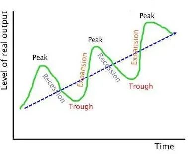

## Table of Contents

## What is Keynesian economics?

Keynesian economics is an economic theory developed by John Maynard Keynes during the Great Depression in the 1930s. It focuses on how government spending and taxes can be used to influence the economy. Keynes believed that during times of economic downturn, the government should increase its spending to boost demand and create jobs. This approach is different from classical economics, which suggests that markets will naturally correct themselves without government intervention.

One key idea in Keynesian economics is the concept of the "multiplier effect." This means that when the government spends money, it can lead to more economic activity than the initial amount spent. For example, if the government builds a new road, it not only creates jobs for construction workers but also increases demand for materials and services related to the project. This can help lift the overall economy out of a slump. Critics of Keynesian economics argue that too much government spending can lead to inflation and higher taxes, but supporters believe it's a necessary tool to manage economic cycles.

## Who was John Maynard Keynes and what were his main economic theories?

John Maynard Keynes was a British economist born in 1883. He is famous for his ideas about how to fix economic problems. He wrote a big book called "The General Theory of Employment, Interest and Money" in 1936. This book changed how people thought about economics. Keynes lived during a time when many people were out of work and the economy was not doing well. He wanted to find ways to make things better.

Keynes believed that the government should spend more money during bad economic times. He thought this would help create jobs and get people spending again. This idea is called "government spending." He also talked about something called the "multiplier effect." This means that when the government spends money, it can lead to even more money being spent in the economy. Keynes' ideas are still used today to help countries deal with economic problems.

## How do economic cycles work?

Economic cycles are like the ups and downs that happen in an economy over time. They can last for a few years or even longer. These cycles have four main parts: expansion, peak, contraction, and trough. During the expansion part, the economy grows, more people get jobs, and businesses do well. This growth keeps going until it reaches a peak, which is the highest point of the cycle. After the peak, the economy starts to slow down and goes into contraction. This is when businesses might struggle, and people might lose their jobs. The contraction keeps going until it hits a trough, which is the lowest point of the cycle. Then, the economy starts to grow again, and the cycle begins all over.

These cycles happen because of many different reasons. Sometimes, people and businesses feel confident and spend more money, which helps the economy grow. Other times, they might feel worried and spend less, which can slow the economy down. Governments and central banks can also affect these cycles. For example, if the government spends more money or lowers taxes, it can help the economy grow. On the other hand, if they raise taxes or cut spending, it might slow the economy down. Understanding these cycles helps people and governments make better decisions to keep the economy stable.

## What are the main phases of an economic cycle?

Economic cycles are the ups and downs that happen in an economy over time. They have four main parts: expansion, peak, contraction, and trough. During the expansion part, the economy grows. More people get jobs, and businesses do well. This growth keeps going until it reaches a peak, which is the highest point of the cycle.

After the peak, the economy starts to slow down and goes into contraction. This is when businesses might struggle, and people might lose their jobs. The contraction keeps going until it hits a trough, which is the lowest point of the cycle. Then, the economy starts to grow again, and the cycle begins all over.

These cycles happen because of many different reasons. Sometimes, people and businesses feel confident and spend more money, which helps the economy grow. Other times, they might feel worried and spend less, which can slow the economy down. Governments and central banks can also affect these cycles by changing their spending or tax policies.

## How does Keynesian economics address economic downturns?

Keynesian economics says that when the economy is doing badly, the government should spend more money. This idea comes from John Maynard Keynes, who thought that during tough times, like when many people are out of work, the government can help by building things like roads or schools. This spending creates jobs and gets people to start spending money again. Keynes called this the "multiplier effect" because the money the government spends can lead to even more money being spent in the economy.

For example, if the government decides to build a new hospital, it hires workers to build it. Those workers then have money to spend on things they need, like food and clothes. This spending helps other businesses and can make the whole economy start to grow again. Keynes believed that without this help from the government, the economy might stay stuck in a bad place for a long time. So, Keynesian economics is all about using government spending to fix economic downturns and get things moving again.

## What role does government spending play in Keynesian economics?

In Keynesian economics, government spending is really important, especially when the economy is not doing well. John Maynard Keynes thought that when businesses are struggling and people are out of work, the government should step in and spend more money. This spending can be used to build things like roads, schools, or hospitals. When the government does this, it creates jobs for people who need them. These new jobs mean that people have money to spend, which can help the economy start to grow again.

Keynes called this idea the "multiplier effect." It means that the money the government spends can lead to even more money being spent in the economy. For example, if the government builds a new road, it not only pays the workers who build it but also the people who make the materials for the road. Those workers then spend their money on things like food and clothes, which helps other businesses. So, government spending in Keynesian economics is like a way to give the economy a boost when it needs it most.

## How does Keynesian economics influence fiscal policy during recessions?

Keynesian economics says that during a recession, the government should spend more money to help the economy. A recession is when the economy is not doing well and many people are out of work. John Maynard Keynes believed that if the government spends more, it can create jobs and get people spending again. This extra spending can be used to build things like roads, schools, or hospitals. When the government does this, it helps the economy because people who get these jobs will spend their money on other things, which helps businesses.

This idea is called the "multiplier effect." It means that the money the government spends can lead to even more money being spent in the economy. For example, if the government builds a new road, it pays workers to build it and also pays for the materials. Those workers then spend their money on food, clothes, and other things, which helps more businesses. So, Keynesian economics tells governments to use fiscal policy, like spending more money, to help the economy during a recession.

## Can you explain the multiplier effect in the context of Keynesian economics?

The multiplier effect in Keynesian economics is like a chain reaction that happens when the government spends money. Imagine the government decides to build a new school. It pays workers to build the school and buys materials from other businesses. Those workers then use their money to buy things they need, like food and clothes. This spending helps more businesses, and those businesses might hire more people or buy more things. So, the initial money the government spent on the school leads to more money being spent all around the economy.

This chain reaction is what Keynes called the multiplier effect. It means that the first bit of money the government spends can lead to a much bigger total effect on the economy. If the government spends $1 million on a project, it might end up helping the economy grow by much more than that because of all the extra spending that happens. This is why Keynes thought that during tough economic times, the government should spend more to help get things moving again.

## What are the criticisms of Keynesian economics in managing economic cycles?

Some people don't agree with Keynesian economics because they think it can cause problems. One big worry is that if the government spends too much money, it can lead to inflation. Inflation is when prices go up and money becomes worth less. If the government keeps spending a lot, it might have to borrow more money or raise taxes. This could make things harder for people and businesses, especially if they have to pay more taxes or if interest rates go up because of all the borrowing.

Another criticism is that Keynesian economics might make the government too big. Some people think that if the government is always spending money to fix the economy, it might start to control too much. They worry that this could stop businesses from growing on their own and might make people rely too much on the government. Critics also say that it's hard to know exactly how much the government should spend and when. If the government gets it wrong, it might not help the economy and could even make things worse.

## How has Keynesian economics evolved since its inception?

Since John Maynard Keynes wrote his big book in the 1930s, his ideas have changed and grown. At first, people used his ideas to help during the Great Depression. They thought the government should spend more money to create jobs and help the economy. Over time, economists started to mix Keynes' ideas with other theories. For example, they combined it with ideas about how to control inflation and how to make sure the economy grows steadily. This new mix of ideas is called the "neoclassical synthesis." It tries to use the best parts of different economic theories to make the economy work better.

Keynesian economics has also changed because of new problems in the world. After World War II, many countries used Keynesian ideas to help their economies grow. But in the 1970s, there was a new problem called "stagflation," where the economy was not growing and prices were going up. This made people rethink how to use Keynesian ideas. Later, in the 2008 financial crisis, many governments used Keynesian ideas again to help their economies. They spent a lot of money to create jobs and help businesses. Today, economists still use and change Keynesian ideas to deal with new economic problems.

## What are some real-world examples where Keynesian policies were implemented to manage economic cycles?

One big example of Keynesian policies being used is during the Great Depression in the 1930s. Many people were out of work and the economy was doing really badly. The U.S. government, led by President Franklin D. Roosevelt, started a program called the New Deal. This was all about spending money to create jobs. They built roads, bridges, and other public works. This helped a lot of people find work and started to get the economy moving again. It's a classic case of using Keynesian ideas to fight a recession.

Another example is during the 2008 financial crisis. Many countries, including the United States, used Keynesian ideas to help their economies. The U.S. government passed a big spending plan called the American Recovery and Reinvestment Act. They spent a lot of money on things like building roads, fixing schools, and helping people keep their jobs. This was meant to boost the economy and help it recover from the crisis. It's another time when governments used Keynesian policies to try and fix economic problems.

## How do modern economists view the effectiveness of Keynesian economics in today's global economy?

Modern economists have different views about how well Keynesian economics works in today's world. Some think it's still really useful, especially during tough economic times. They believe that when the economy is struggling, the government should spend more money to help create jobs and get things moving again. They point to examples like the 2008 financial crisis, where many countries used Keynesian ideas and saw their economies start to recover. These economists think that Keynesian policies can help manage economic cycles and prevent long periods of unemployment and slow growth.

On the other hand, some economists think that Keynesian economics might not work as well in today's global economy. They worry that too much government spending can lead to problems like inflation, where prices go up and money becomes worth less. They also think that in a world where countries are connected through trade and finance, it's harder for one country to use Keynesian policies without affecting others. These critics believe that while Keynesian ideas can be helpful, they need to be used carefully and combined with other economic strategies to be effective in the modern world.

## What is Keynesian Economics and how can it be understood?

Keynesian economics, pioneered by British economist John Maynard Keynes during the first half of the 20th century, revolutionized economic thought by focusing on aggregate demand as the primary driver of economic cycles. This approach emerged in response to the Great Depression of the 1930s, challenging the classical economic theory, which emphasized supply-side factors and market self-regulation. Keynes argued that insufficient aggregate demand could lead to prolonged periods of high unemployment and economic stagnation, and therefore, active government intervention was necessary to stabilize the economy.

At the heart of Keynesian economics is the concept of aggregate demand, defined as the total demand for goods and services within an economy at a given overall price level and in a given time period. Aggregate demand is expressed as:

$$

AD = C + I + G + (X - M) 
$$

where $C$ represents consumption, $I$ stands for investment, $G$ is government spending, and $(X - M)$ is net exports (exports minus imports). Keynes posited that fluctuations in these components, particularly consumption and investment, could lead to economic booms or busts. For example, during a downturn, pessimistic expectations can cause a reduction in consumption and investment, leading to decreased aggregate demand and further economic contraction—a self-perpetuating cycle.

Keynes advocated for government intervention to mitigate these cycles by manipulating either fiscal policy—changes in government spending and taxation—or monetary policy, primarily interest rates. During periods of economic downturn, Keynes recommended counter-cyclical fiscal policies, such as increasing government spending and reducing taxes, to boost aggregate demand and restore economic stability. This expansionary fiscal policy could compensate for insufficient private sector demand, thereby reducing unemployment and stimulating economic activity.

Despite its contributions, Keynesian economics has faced critiques. Critics argue that it can lead to excessive government intervention, potentially resulting in inefficiencies and distortions. Additionally, the reliance on fiscal policy to manage economic cycles is sometimes criticized for potentially leading to significant fiscal deficits and public debt. Furthermore, the time lag inherent in implementing fiscal measures is another limitation, which can make timely intervention challenging.

Monetarists, led by Milton Friedman, challenged Keynesian economics by asserting that monetary policy, specifically controlling the supply of money, is more effective than fiscal policy in stabilizing the economy. They argue that targeting stable inflation through monetary policy can ensure a stable economic environment, contrasting with Keynes' emphasis on aggregate demand.

In summary, while Keynesian economics has laid the groundwork for understanding and managing economic cycles through aggregate demand and government intervention, it is not without its limitations and critiques. Regardless, its influence persists, especially in policy design, where it is often balanced with other economic theories to address complex modern economic challenges.

## References & Further Reading

#