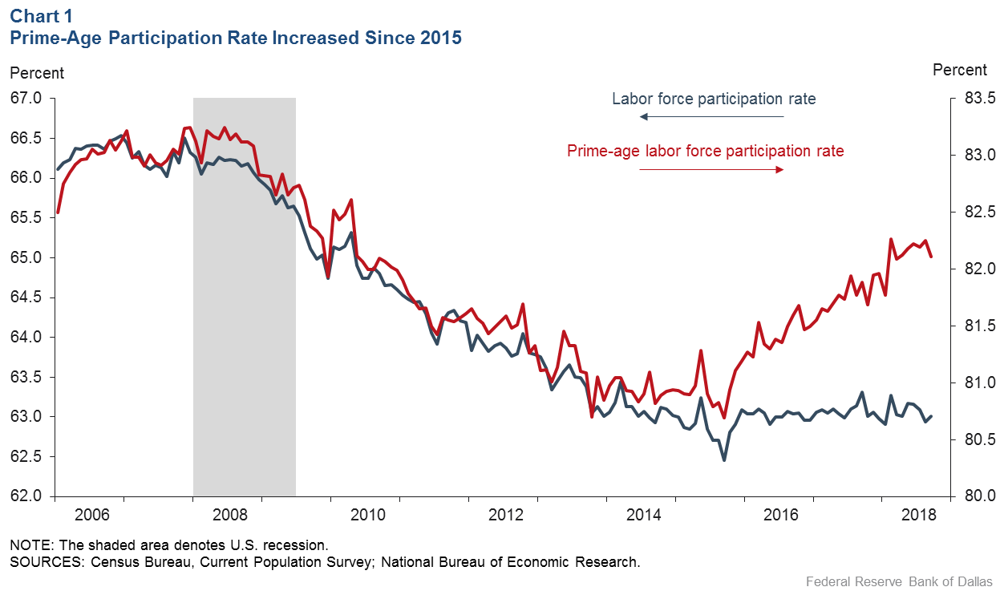

## Table of Contents

## What is the labor force participation rate?

The labor force participation rate is the percentage of people who are either working or looking for work out of the total population that could be working. This includes people aged 16 and over who are not in the military, prison, or other institutions. It's an important number because it shows how many people are active in the job market.

Changes in the labor force participation rate can tell us a lot about the economy. For example, if the rate goes up, it might mean more people are looking for jobs because they think it's easier to find work. If it goes down, it could mean people are discouraged about finding a job, or they might be retiring or going back to school. Economists watch this rate to understand trends and make predictions about the job market.

## How is the labor force participation rate calculated?

The labor force participation rate is calculated by taking the number of people in the labor force and dividing it by the total number of people who could be in the labor force. The labor force includes everyone who is either working or actively looking for work. The total number of people who could be in the labor force is everyone aged 16 and over who are not in the military, prison, or other institutions. After dividing these two numbers, you multiply the result by 100 to turn it into a percentage.

For example, if there are 150 million people in the labor force and 250 million people who could be in the labor force, you would divide 150 million by 250 million to get 0.6. Then, you multiply 0.6 by 100 to get a labor force participation rate of 60%. This means that 60% of the people who could be working are either working or looking for work.

## What is the current labor force participation rate in the U.S.?

The current labor force participation rate in the U.S. is about 62.5% as of early 2023. This number tells us that out of all the people in the U.S. who could be working, around 62.5% are either working or looking for a job. The rate can change over time because of many things like people retiring, going back to school, or feeling hopeful or discouraged about finding work.

This rate is important because it helps us understand the health of the job market. When the rate goes up, it might mean more people think it's a good time to look for jobs. When it goes down, it could mean people are less hopeful about finding work, or they might be choosing to do other things like retire or study. Economists watch this number to see how the economy is doing and to make guesses about what might happen next.

## How does the labor force participation rate affect the unemployment rate?

The labor force participation rate and the unemployment rate are connected but they show different things about the job market. The unemployment rate is the percentage of people in the labor force who are not working but are looking for a job. The labor force participation rate is the percentage of people who could be working that are either working or looking for work. If the labor force participation rate goes up, it means more people are looking for jobs, which can make the unemployment rate go up too, because more people are counted as unemployed.

On the other hand, if the labor force participation rate goes down, it means fewer people are looking for jobs. This can make the unemployment rate look better, even if the number of jobs hasn't changed, because fewer people are counted as unemployed. So, the unemployment rate can sometimes be misleading if you don't also look at the labor force participation rate. It's important to look at both numbers to really understand what's happening in the job market.

## What trends have been observed in the U.S. labor force participation rate over the past decade?

Over the past decade, the U.S. labor force participation rate has seen some ups and downs. It was around 63% in 2013 and slowly went up to about 63.3% by 2019. But then, when the big health crisis happened in 2020, the rate dropped a lot to about 60.2%. This was because a lot of people lost their jobs and some stopped looking for work because it was hard to find a job during that time. After the crisis, the rate started to go back up again, reaching around 62.5% by early 2023. 

These changes in the labor force participation rate show what was happening in the job market and the economy. When the rate went up before the crisis, it meant more people felt good about finding jobs. But when it dropped during the crisis, it showed that people were worried and some stopped looking for work. The rate going back up after the crisis means people are feeling more hopeful about finding jobs again. Economists watch these trends to understand how the job market is doing and to guess what might happen next.

## How do demographic factors influence the labor force participation rate?

Demographic factors like age, gender, and education can change the labor force participation rate a lot. For example, when more people get older and retire, the rate can go down because fewer people are working or looking for work. Also, if more young people go to college instead of working, that can make the rate go down too. Women used to have a lower participation rate than men, but over time, more women have started working or looking for jobs, which can make the rate go up. Education also matters because people with more education are more likely to be in the labor force.

Another important thing is how different groups of people are doing in the job market. For example, if it's hard for certain groups like older workers or people without a lot of education to find jobs, they might stop looking and that can make the labor force participation rate go down. On the other hand, if there are good job opportunities for everyone, more people might start looking for work, which can make the rate go up. So, understanding the different groups of people and what's happening with them can help explain why the labor force participation rate changes over time.

## What are the economic implications of a changing labor force participation rate?

A changing labor force participation rate can have big effects on the economy. When more people start working or looking for jobs, it can mean the economy is doing well. More people working means more money being spent on things like houses, cars, and food. This can help businesses grow and create more jobs. On the other hand, if fewer people are working or looking for work, it might mean the economy is not doing so well. Less money being spent can make businesses slow down and maybe even lay off workers.

The labor force participation rate also affects how much money the government gets from taxes. When more people are working, the government can collect more taxes, which can be used for things like schools, roads, and helping people who need it. But if fewer people are working, the government might get less tax money, which can make it harder to pay for these things. Understanding how the labor force participation rate changes can help the government and businesses plan better for the future.

## How do government policies impact the labor force participation rate?

Government policies can really change how many people are working or looking for jobs. For example, if the government makes it easier for people to get childcare, more parents might be able to work. Also, if the government helps people learn new skills or go back to school, they might be more likely to join the job market. On the other hand, if the government makes it harder for people to get help when they're out of work, some might stop looking for jobs because they feel discouraged.

Another way government policies can affect the labor force participation rate is by changing the rules about when people can retire. If the government says people can retire later, more older people might keep working, which can make the rate go up. Also, if the government gives tax breaks to businesses that hire more people, it might create more jobs and make more people start looking for work. So, the things the government does can have a big impact on how many people are part of the labor force.

## Can changes in the labor force participation rate predict future unemployment trends?

Changes in the labor force participation rate can give us hints about what might happen with unemployment in the future. When more people start looking for jobs, it means the labor force participation rate goes up. If the economy is doing well and there are enough jobs, this might not change the unemployment rate much. But if there aren't enough jobs, more people looking for work can make the unemployment rate go up because more people are counted as unemployed.

On the other hand, if fewer people are looking for jobs, the labor force participation rate goes down. This can make the unemployment rate look better, even if the number of jobs hasn't changed, because fewer people are counted as unemployed. So, watching the labor force participation rate can help us guess if unemployment might go up or down in the future. It's like looking at a weather report to see if it might rain or be sunny.

## What role does the labor force participation rate play in economic recovery post-recession?

The labor force participation rate is really important when an economy is trying to get better after a recession. When more people start looking for jobs again, it's a good sign that people are feeling hopeful about the economy. This can help the economy grow because more people working means more money being spent on things like food, clothes, and cars. Businesses might see this and decide to hire more people or even start new businesses, which can help the economy recover faster.

But if the labor force participation rate stays low after a recession, it can mean people are still worried about finding jobs. This can slow down the economy's recovery because fewer people are spending money. The government might need to do things like help people find jobs or give money to businesses to create more jobs. Watching the labor force participation rate can help everyone understand how well the economy is doing and what might need to be done to help it get better.

## How does the labor force participation rate in the U.S. compare to other developed countries?

The labor force participation rate in the U.S. is around 62.5% as of early 2023. This number is a bit lower than some other developed countries. For example, in countries like Sweden and Switzerland, the rate is higher, around 67% to 68%. These differences can come from things like how easy it is to find childcare, how long people go to school, and when people usually retire.

In other places like Japan and Italy, the labor force participation rate is even lower than in the U.S., around 60% to 62%. This can be because of things like older people retiring earlier or fewer women working. Each country has its own reasons for why their labor force participation rate is what it is. Looking at these rates can help us understand how different countries' job markets and economies are doing.

## What advanced statistical models are used to analyze the relationship between labor force participation and unemployment?

To understand how labor force participation and unemployment are related, economists often use something called regression analysis. This is a way to see how one thing, like the labor force participation rate, affects another thing, like the unemployment rate. They can look at data over time to see if when the labor force participation rate goes up, the unemployment rate goes up too, or if it stays the same. This helps them figure out how these two numbers work together and what might happen in the future.

Another model they use is called time series analysis. This looks at how the labor force participation rate and unemployment rate change over time. It can help economists see patterns and predict what might happen next. For example, if the labor force participation rate has been going up slowly over the last few years, they might guess that it will keep going up and see what that means for unemployment. These models help make sense of a lot of data and give us better guesses about what the job market might do next.

## References & Further Reading

[1]: McKinsey Global Institute. (2017). ["Jobs Lost, Jobs Gained: Workforce Transitions in a Time of Automation."](https://www.mckinsey.com/~/media/McKinsey/Industries/Public%20and%20Social%20Sector/Our%20Insights/What%20the%20future%20of%20work%20will%20mean%20for%20jobs%20skills%20and%20wages/MGI-Jobs-Lost-Jobs-Gained-Executive-summary-December-6-2017.pdf)

[2]: Leonard, J., et al. (2018). ["The Impacts of the Affordable Care Act on Employment and Work,"](https://pubmed.ncbi.nlm.nih.gov/30378119/) National Bureau of Economic Research Working Paper.

[3]: Lopez de Prado, M. (2018). ["Advances in Financial Machine Learning,"](https://www.amazon.com/Advances-Financial-Machine-Learning-Marcos/dp/1119482089) John Wiley & Sons.

[4]: Aronson, D. R. (2006). ["Evidence-Based Technical Analysis: Applying the Scientific Method and Statistical Inference to Trading Signals,"](https://onlinelibrary.wiley.com/doi/book/10.1002/9781118268315) John Wiley & Sons.

[5]: Chan, E. P. (2008). ["Quantitative Trading: How to Build Your Own Algorithmic Trading Business,"](https://github.com/ftvision/quant_trading_echan_book) John Wiley & Sons.