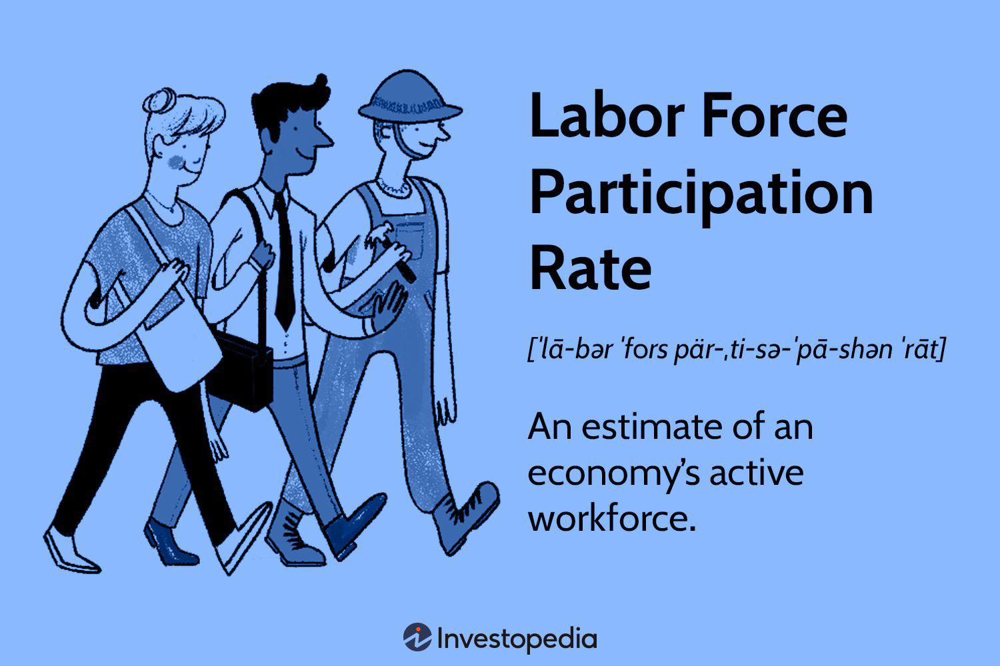

The U.S. labor market is a fundamental driver of the nation's economic policies and growth trajectory. As a dynamic and multifaceted system, it encapsulates various metrics and trends that capture its current state and potential direction. Key performance indicators, such as employment levels, unemployment rates, and labor force participation, offer insights into the health and efficiency of the market. Additionally, the rise of emerging trends, such as algorithmic trading, is beginning to reshape traditional employment landscapes, influencing economic variables and policy-making decisions.

Understanding how these factors interact is essential for predicting future economic conditions and preparing responsive strategies. Employment economics, for instance, examines the mechanisms behind job creation and loss, linking these processes to broader economic health. Labor force participation rates are equally critical, reflecting the proportion of the population that is actively engaged in or seeking employment. A thorough analysis of these metrics provides insights into workforce engagement and potential economic weaknesses.

Unemployment, a closely monitored indicator, varies across different forms such as frictional and structural, each impacting the economic cycle distinctively. Recent events, like the COVID-19 pandemic, have also introduced new challenges and fluctuations in unemployment rates, demonstrating the need for adaptive economic strategies.

Contemporary shifts, such as the adoption of algorithmic trading, highlight important changes within the labor market. This technology-driven innovation focuses on high-speed and high-frequency trading, transforming traditional roles and creating demand for specialized skills. Its influence extends to the financial markets, further affecting employment patterns and economic indicators.

In this article, the focus is on exploring these critical components—employment economics, labor force participation, U.S. unemployment, and the impact of algorithmic trading—to understand their roles in shaping current and future economic policies. Recognizing the interdependency of these factors can lead to more informed decisions that bolster economic resilience and growth.

## Table of Contents

## Understanding Employment Economics

Employment economics is a branch of economics that examines the dynamics of job creation, maintenance, and loss within an economy. It provides insights into how labor markets operate and is crucial for shaping policies that promote long-term economic health. 

One of the primary considerations in employment economics is technological advancement. New technologies can lead to the creation of jobs by fostering innovation and new industries. However, they can also render certain skills obsolete, leading to job displacement. For instance, automation and [artificial intelligence](/wiki/ai-artificial-intelligence) are transforming sectors such as manufacturing and services, reducing the need for labor in certain areas while increasing the demand in others. According to the McKinsey Global Institute, between 75 million and 375 million workers worldwide may need to switch occupational categories and learn new skills by 2030 due to automation and artificial intelligence advancements[1].

Market demands also play a significant role in employment economics, as they drive the demand for labor. In periods of economic growth, demand for goods and services typically increases, pushing firms to hire more workers. Conversely, during economic downturns, demand may fall, leading to job losses. Understanding these cycles helps businesses and policymakers anticipate and mitigate the impact of recessions. 

Policy changes are another critical [factor](/wiki/factor-investing) affecting employment. Government interventions, including tax incentives, subsidies, or regulatory adjustments, can stimulate job creation or, in some cases, lead to job losses if policies hinder business operations. For instance, the introduction of the Affordable Care Act in the United States had mixed impacts on employment, with some studies suggesting that it reduced unemployment by making healthcare more affordable[2].

Comprehensive analysis of these factors informs decisions at multiple levels. Policymakers rely on employment economic insights to craft legislation that maximizes job growth while minimizing negative externalities such as inequality or environmental degradation. Corporations use these analyses to align their strategic planning with labor market trends, ensuring they have the necessary human resources to achieve their objectives. On an individual level, understanding employment economics can guide educational and career choices by highlighting thriving industries and declining sectors.

In summary, employment economics is an indispensable tool for understanding the interplay between various factors that determine job availability and quality in an economy. Its critical analysis aids in forming robust policies and strategies that foster sustainable economic development.

[1] McKinsey Global Institute, "Jobs lost, jobs gained: Workforce transitions in a time of automation", 2017.
[2] Leonard J. et al., "The Impacts of the Affordable Care Act on Employment and Work", 2018.

## Labor Force Participation: The Key Metric

Labor force participation is a critical indicator that reflects the proportion of a country's population actively engaged in or seeking employment. This metric is vital for assessing the health and potential of an economy. A vibrant labor force participation rate signifies a robust economy with ample employment opportunities and active engagement from its working-age population.

Conversely, a declining labor force participation rate can highlight underlying structural issues. Such issues may include insufficient job opportunities, which can discourage people from joining the workforce. For instance, if potential workers perceive that jobs in their area or field are scarce, they may become discouraged and stop seeking employment, thereby reducing the overall participation rate.

Several factors influence labor force participation trends. Demographics play a significant role; for example, an aging population might lead to a decrease in participation as more individuals retire. Conversely, a younger population entering the workforce can increase participation rates. Economic incentives, such as wage levels, benefits, and the cost of living, also impact participation. When wages stagnate or the cost of childcare and commuting rise, some individuals may find it economically unviable to work, thus lowering participation rates.

Understanding these dynamics is crucial for policymakers and economists aiming to bolster employment and ensure a healthy labor market. Addressing the challenges posed by declining participation rates requires targeted strategies, such as creating more job opportunities, providing training programs, and ensuring that working conditions are attractive and inclusive.

## U.S. Unemployment: Current Trends and Analysis

U.S. unemployment is a vital indicator of economic health, reflecting the number of people actively seeking and available for work but currently without employment. To understand this metric comprehensively, it is crucial to examine who constitutes the labor force. The labor force includes individuals aged 16 and over who are either employed or unemployed but seeking work. It excludes those not seeking employment, such as retirees, students, or discouraged workers who have stopped looking for jobs.

Unemployment can be categorized into several forms: frictional, cyclical, structural, and seasonal. Frictional unemployment arises from the time delay in matching available jobs with job seekers, often due to transitions such as career changes or relocations. Cyclical unemployment occurs due to the natural ups and downs in the economic cycle, with job losses typical during economic downturns. Structural unemployment results from mismatches between workers' skills and job requirements, often exacerbated by technological advancements or shifts in consumer demand. Seasonal unemployment, meanwhile, affects industries with fluctuations in demand at different times of the year, such as agriculture or tourism.

Recent trends in U.S. unemployment have been significantly influenced by economic disruptions. The COVID-19 pandemic, for instance, caused unprecedented spikes in unemployment due to widespread shutdowns and shifts in consumer behavior. According to data from the U.S. Bureau of Labor Statistics, unemployment rates soared to a historic high of 14.8% in April 2020, the highest since data collection began in 1948. Since then, there has been a gradual recovery as businesses reopened and adapted to new conditions, but the pandemic highlighted vulnerabilities in certain sectors and the impact of external shocks on employment levels.

Analyzing unemployment trends requires attention to various demographic factors such as age, race, and education level, as these can influence the likelihood of being unemployed. Younger workers, for example, often face higher rates of frictional unemployment due to job market entry and exploration. Similarly, systemic issues may result in higher unemployment rates among minority groups, further exacerbated by economic disruptions like the pandemic.

Overall, understanding the nuances of U.S. unemployment involves examining not only statistical data but also the broader economic and social factors influencing employment patterns. This understanding is crucial for policymakers aiming to design interventions that address the underlying causes of unemployment and promote economic stability.

## Algorithmic Trading: The New Frontier

Algorithmic trading has revolutionized the financial markets by employing computer programs to execute high-speed and high-frequency trades. These automated systems utilize complex algorithms capable of analyzing vast datasets to make trading decisions in milliseconds. The primary goal is to optimize efficiency and enhance profitability across various asset classes, including stocks, currencies, and commodities.

The rise of [algorithmic trading](/wiki/algorithmic-trading) has significantly impacted employment within trading sectors. Traditional trading roles, once dominated by human decision-makers, have seen a reduction as firms pivot towards technology-driven strategies. Consequently, there is an increasing demand for professionals skilled in quantitative analysis, programming, and data science. The skill set required now extends beyond conventional financial knowledge to include proficiency in languages such as Python, R, and MATLAB, critical for algorithm development and implementation.

This shift influences the functioning of financial markets at large. Algorithmic trading contributes to increased market [liquidity](/wiki/liquidity-risk-premium) and tighter bid-ask spreads, as algorithms are capable of executing trades more efficiently than human traders. However, its dominance also introduces the risk of market [volatility](/wiki/volatility-trading-strategies), given that automated systems can execute large volumes of trades at rapid speeds. Events like the Flash Crash of 2010, where the Dow Jones Industrial Average plummeted nearly 1,000 points in minutes, highlight the potential risks associated with algorithmic trading.

Economically, the prevalence of algorithmic trading affects employment through its impact on market efficiency and accessibility. It has challenged traditional market roles but also opened new opportunities in technology and finance, requiring a workforce capable of bridging the two fields. As algorithmic trading continues to evolve, it remains a significant factor in shaping modern employment economics and the broader economic indicators linked to financial market operations.

## Impact of Labor Trends on U.S. Economic Policies

Labor market trends are essential determinants of U.S. economic policies, particularly those involving key monetary and fiscal measures. These trends serve as primary indicators that the Federal Reserve considers when making decisions on interest rates, aiming to achieve a delicate balance between minimizing unemployment and fostering sustainable economic growth.

The Federal Reserve actively monitors data such as the unemployment rate, labor force participation rate, and job growth [statistics](/wiki/bayesian-statistics) to gauge the health of the economy. Changes in these indicators can prompt adjustments in monetary policy, particularly concerning interest rates. For instance, a rising unemployment rate may signal economic distress, potentially leading the Federal Reserve to lower interest rates to stimulate economic activity by making borrowing cheaper. Conversely, low unemployment with indicators of overheating might prompt the Fed to raise interest rates to curb inflationary pressures.

Furthermore, labor market trends assist in shaping fiscal policy. Policymakers analyze employment statistics to assess the need for stimulus measures or austerity. For example, during periods of high unemployment, government spending on infrastructure projects or direct financial aid to citizens can be targeted to spur job creation and economic activity. Fiscal policies are thus crafted based on comprehensive employment data, ensuring that interventions are both timely and effective.

Policymakers and economists employ complex models that incorporate labor data to predict and analyze future trends. Models like the Phillips Curve, which describes an inverse relationship between inflation and unemployment, are often used to inform policy decisions. Although the relationship has evolved over time, the labor market remains a crucial factor influencing macroeconomic policy. 

In conclusion, a deep understanding of labor market trends is imperative for formulating economic policies. These trends provide the insights necessary for adjusting monetary and fiscal tools to stabilize the economy and promote growth.hetha a lagging indicator, it offers critical clues about the future state of the economy, influencing everything from interest rates to government spending initiatives. By analyzing these trends comprehensively, policymakers can enact informed and strategic measures that contribute to the economy's resilience and long-term prosperity.

## Challenges and Opportunities

Economic shifts and technological advancements are reshaping the landscape of employment economics, presenting both challenges and opportunities. The evolution of job markets is increasingly influenced by factors such as automation, artificial intelligence, and globalization. These forces are redefining job roles, creating a demand for new skills while rendering some traditional positions obsolete. 

One significant challenge is the growing skills gap. As technology evolves, the skills required to perform certain jobs also change. This gap necessitates significant investment in education and retraining programs. Workers must be equipped with skills that are relevant in a rapidly changing economy. Governments and corporations must collaborate to create training programs that address these needs, ensuring that the workforce remains adaptable and competitive. 

Retraining programs are particularly crucial for sectors heavily impacted by automation and algorithmic trading, such as finance and manufacturing. For instance, algorithmic trading has altered the financial services industry by reducing the demand for traditional trading roles while increasing the need for professionals skilled in programming and data analysis.

Economic shifts also offer opportunities for innovation and growth. Emerging trends can guide strategic policymaking and business strategies. Policymakers can use data analytics to identify sectors with growth potential, shaping economic policies to support these areas. Businesses can leverage technological advancements to optimize operations and enter new markets.

In essence, to navigate these changes, a proactive approach involving continuous learning and strategic planning is necessary. By acknowledging the challenges and capitalizing on the opportunities presented by economic shifts and technological advancements, societies can foster economic resilience and sustainable growth.

## Conclusion

Employment economics is a continually evolving field influenced by various factors, such as workforce participation rates and the advent of new trading technologies like algorithmic trading. Understanding these dynamics is essential for crafting policies that enhance economic resilience. The integration of innovative technologies into traditional economic sectors has reshaped the landscape, compelling both policymakers and businesses to adapt swiftly to maintain competitiveness.

Key insights into labor trends offer a pathway toward developing robust policies aimed at bolstering economic resilience. By analyzing metrics such as labor force participation and unemployment types, decision-makers can tailor fiscal and monetary strategies to stabilize and stimulate growth. For example, adapting to the shifts caused by high-frequency trading requires not only understanding numeric trends but also fostering skill development to fulfill emerging roles.

To secure future economic stability and growth, a comprehensive grasp of these themes is crucial. The interconnected nature of economic factors necessitates a holistic approach that combines technological, demographic, and policy insights. As such, stakeholders must remain vigilant and responsive, leveraging data and trends to navigate the complex landscape of employment economics effectively. This proactive stance will enable economies to capitalize on opportunities while mitigating potential disruptions, thereby securing long-term prosperity.

## References & Further Reading

[1]: McKinsey Global Institute. (2017). ["Jobs Lost, Jobs Gained: Workforce Transitions in a Time of Automation."](https://www.mckinsey.com/~/media/McKinsey/Industries/Public%20and%20Social%20Sector/Our%20Insights/What%20the%20future%20of%20work%20will%20mean%20for%20jobs%20skills%20and%20wages/MGI-Jobs-Lost-Jobs-Gained-Executive-summary-December-6-2017.pdf)

[2]: Leonard, J., et al. (2018). ["The Impacts of the Affordable Care Act on Employment and Work,"](https://pubmed.ncbi.nlm.nih.gov/30378119/) National Bureau of Economic Research Working Paper.

[3]: Lopez de Prado, M. (2018). ["Advances in Financial Machine Learning,"](https://www.amazon.com/Advances-Financial-Machine-Learning-Marcos/dp/1119482089) John Wiley & Sons.

[4]: Aronson, D. R. (2006). ["Evidence-Based Technical Analysis: Applying the Scientific Method and Statistical Inference to Trading Signals,"](https://onlinelibrary.wiley.com/doi/book/10.1002/9781118268315) John Wiley & Sons.

[5]: Chan, E. P. (2008). ["Quantitative Trading: How to Build Your Own Algorithmic Trading Business,"](https://github.com/ftvision/quant_trading_echan_book) John Wiley & Sons.