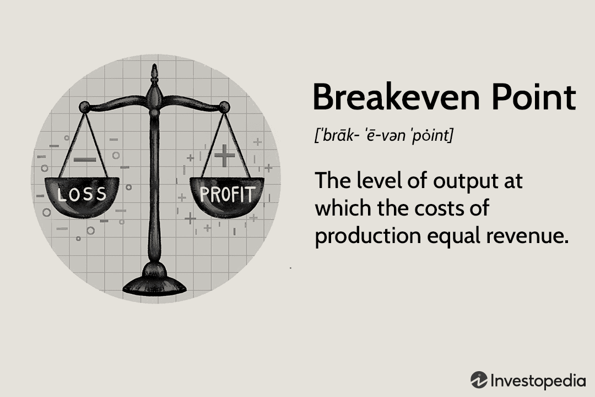

Corporate finance encompasses a spectrum of challenges and opportunities requiring businesses to employ a variety of financial strategies to manage resources efficiently and maintain sustainable growth. At the heart of these strategies lie pivotal concepts such as EBIT (Earnings Before Interest and Taxes), breakeven points, and financial leverage. EBIT serves as an essential metric, providing insight into a company's profitability by focusing on core operations, excluding the effects of interest and tax expenses. This measurement enables a clearer assessment of operational efficiency and potential areas for improvement.

The breakeven point, another critical concept, is vital for businesses looking to cover their operational costs, which include both fixed and variable expenditures. A comprehensive understanding of this point allows companies to determine the minimum output or sales required to avoid losses, making it a fundamental aspect of strategic financial planning.



Financial leverage, which involves the use of debt to amplify potential returns, plays a pivotal role in shaping a company’s financial strategies. While it offers the potential for higher profits, it also introduces increased risk, particularly in periods of economic downturns or revenue shortfalls. Companies must carefully balance the benefits and risks associated with varying levels of leverage to optimize their financial performance.

Algorithmic trading and automation have further evolved the landscape of corporate finance, influencing financial decision-making processes. By employing computer programs capable of executing trades at speeds and frequencies beyond human capacity, firms can optimize financial portfolios, manage risks, and exploit market inefficiencies more effectively. Through automation, trading processes are streamlined, potentially leading to improved decision-making and better EBIT outcomes.

This article will explore the interplay among these elements of corporate finance, examining how effective financing plans, accurate EBIT breakeven analysis, strategic leverage, and the integration of algorithmic trading can enhance a company’s financial strategy. Understanding these interconnected components is essential for optimizing EBIT and maintaining robust financial health amidst the ever-evolving challenges of the modern financial environment.

## Table of Contents

## Understanding EBIT and Breakeven Analysis

Earnings Before Interest and Taxes (EBIT) is a key financial metric that assesses a company's profitability and operational efficiency by eliminating the effects of financial and tax-related activities. By focusing exclusively on income derived from core business operations, EBIT provides a clearer picture of the firm's performance and is particularly useful for comparing companies within the same industry.

Breakeven analysis is an essential tool for determining the level of production or sales [volume](/wiki/volume-trading-strategy) needed to cover a company's total operational costs, which are comprised of both fixed and variable expenses. This analysis helps managers establish the sales target required to reach profitability. The breakeven point is quantified using the formula:

$$
\text{Breakeven Point (Units)} = \frac{\text{Fixed Costs}}{\text{Selling Price per Unit} - \text{Variable Cost per Unit}}
$$

Financial leverage—defined as the use of debt to amplify returns—directly influences the breakeven point. Higher leverage increases financial obligations and raises the income required to meet these fixed costs, thus shifting the breakeven point higher. This necessitates generating more revenue to cover both operating and financial costs, which could introduce additional risk under unstable economic conditions.

Understanding and effectively applying EBIT and breakeven analysis is vital for creating financial strategies that are robust and sustainable over the long term. By evaluating these metrics, companies can gain insights into cost structures, pricing strategies, and profitability thresholds, enabling them to make informed decisions that support operational resilience and growth.

## Leveraging Financing Plans for Optimal Performance

Financing plans serve as comprehensive frameworks that outline strategies for sourcing and managing capital in companies, which can be achieved through equity, debt, or a blended approach. These plans are pivotal in optimizing a company’s performance by aligning capital structure with strategic objectives.

Financial leverage plays a critical role in these plans by using debt to potentially increase returns on equity. The formula for financial leverage is often represented as:

$$
\text{Financial Leverage} = \frac{\text{Total Debt}}{\text{Shareholders' Equity}}
$$

While leverage can magnify financial gains during prosperous times, it also introduces significant risks. During economic downturns or periods of revenue shortfall, companies with high leverage may face increased financial strain due to fixed interest obligations. This is particularly concerning if income does not cover debt expenses, leading to potential solvency challenges.

Understanding the degree of financial leverage (DFL) is crucial for assessing the sensitivity of earnings per share (EPS) to changes in EBIT. The DFL can be calculated as:

$$
\text{DFL} = \frac{\text{EBIT}}{\text{EBIT} - \text{Interest}}
$$

A higher DFL indicates that a small change in EBIT results in a larger change in EPS, signaling potential [volatility](/wiki/volatility-trading-strategies). Hence, companies must conduct thorough risk assessments to ensure that their level of leverage is sustainable.

Strategically leveraging financing options can enhance EBIT by lowering the cost of capital compared to equity financing. However, this strategy requires meticulous planning to prevent over-leverage, which may lead to unsustainable debt levels. This entails balancing debt and equity to maintain a manageable debt-to-equity ratio while ensuring flexibility in financial operations.

To demonstrate the effect of financial leverage on a company’s capital structure, consider the following Python example, which computes the impact of increased leverage on EPS:

```python
def calculate_eps_change(ebit, interest, shares_outstanding):
    eps_before_leverage = ebit / shares_outstanding
    ebit_after_interest = ebit - interest
    eps_after_leverage = ebit_after_interest / shares_outstanding
    change_in_eps = eps_after_leverage - eps_before_leverage
    return change_in_eps

# Example values
ebit = 1000000
interest = 200000
shares_outstanding = 50000

change = calculate_eps_change(ebit, interest, shares_outstanding)
print(f"Change in EPS due to financial leverage: {change:.2f}")
```

In summation, employing financing plans with a strategic focus on financial leverage can maximize EBIT and drive optimal corporate performance. Nonetheless, companies must exert due diligence in managing the inherent risks to sustain financial health and ensure long-term success.

## The Role of Algorithmic Trading in Financial Strategies

Algorithmic trading is an integral component of contemporary financial strategies, utilizing computer algorithms to execute trades at velocities and frequencies far surpassing human capacity. This technological advancement enables traders to capitalize on minor market anomalies, providing a significant edge in portfolio optimization and risk management.

One of the primary advantages of [algorithmic trading](/wiki/algorithmic-trading) is its ability to optimize financial portfolios. By analyzing vast datasets and identifying patterns, algorithms can adjust asset allocations to enhance returns while maintaining desired risk levels. This process often includes the implementation of quantitative strategies, such as mean reversion or [momentum](/wiki/momentum)-based trading models, which leverage historical price trends to predict future movements.

Moreover, algorithmic trading systems enhance decision-making by minimizing human error and emotion-driven biases. Automated processes execute predetermined trading strategies with precision, ensuring consistency and discipline in responding to market signals. This precision often translates into better EBIT outcomes as firms optimize operational efficiency and resource allocation.

Risk management is another critical area where algorithmic trading has a substantial impact. By continuously monitoring market conditions and dynamically adjusting positions, algorithms can mitigate potential losses and safeguard portfolios against volatility. This function complements traditional risk management techniques and adds a layer of resilience in unpredictable market environments.

Nevertheless, the implementation of algorithmic trading systems is not without its challenges. Firms must balance the potential gains with the risks inherent in technology-driven strategies. High-frequency trading, for example, can expose firms to systemic risks, such as flash crashes, which occur when algorithms misfire or react simultaneously to market triggers. Furthermore, the complexity of these systems demands robust infrastructure and continuous monitoring to prevent technical glitches that could lead to substantial financial losses.

To successfully integrate algorithmic trading into financial strategies, organizations must employ rigorous testing and validation processes. These measures ensure that trading algorithms perform as intended under various market conditions and adhere to regulatory requirements. Additionally, firms should cultivate expertise in data science and quantitative analysis to refine algorithmic models and adapt to evolving financial landscapes.

Overall, algorithmic trading offers a pathway to enhanced financial performance by optimizing portfolio management and risk control. However, the success of these systems relies on the careful consideration of their risks and potential market impacts. As technology continues to evolve, algorithmic trading is poised to play an increasingly critical role in shaping strategic financial decisions.

## Interconnections Between Financial Leverage and EBIT Breakeven Calculations

Financial leverage plays a critical role in influencing a company's Earnings Before Interest and Taxes (EBIT) and breakeven point. Companies often utilize leverage to amplify potential returns by using borrowed funds. While this can heighten the returns, it also introduces increased financial risk. This delicate balance of risk and reward underscores the importance of strategic management of financial leverage.

### Degree of Financial Leverage (DFL)

The Degree of Financial Leverage (DFL) measures the sensitivity of a company's Earnings Per Share (EPS) to fluctuations in its EBIT. This metric is crucial for assessing the impact of leverage on shareholder value. The formula for DFL at a given level of EBIT is:

$$
\text{DFL} = \frac{\text{EBIT}}{\text{EBIT} - \text{Interest}}
$$

A higher DFL indicates that a small percentage change in EBIT will result in a larger percentage change in EPS. Thus, companies with higher DFL face more pronounced effects on earnings per share due to variations in operating earnings. 

### Aligning Leverage with Financial Metrics

Correct alignment of financial leverage with other key financial metrics such as EBITDA margin, return on assets (ROA), and interest coverage ratio is essential. This ensures that highly leveraged companies do not breach their breakeven levels under different market conditions. For effective financial management, it is vital for firms to comprehensively evaluate and manage these metrics.

A firm must ensure that its EBIT covers interest expenses to maintain positive earnings. The interest coverage ratio, calculated as EBIT divided by interest expenses, is a critical gauge of this ability. Adequate interest coverage ratios signal financial soundness and are more sustainable across economic fluctuations.

### Case Studies and Real-world Examples

Numerous corporations have successfully balanced financial leverage with achieving financial goals. For example, Amazon strategically used debt financing to expand its operations and has maintained sustainability through robust management of financial metrics. Despite high leverage, the company managed to enhance its EBIT through increased operational efficiency and market share.

Another example includes Tesla, which leverages debt for innovation and expansion initiatives. By aligning its leverage with strategic growth metrics and efficiently managing its financial obligations, Tesla has maintained favorable EBIT levels that support its long-term growth objectives.

These case studies highlight the importance of understanding the interplay between financial leverage, EBIT, and breakeven analyses. By balancing these variables, companies can optimize financial performance and sustain growth amidst varying market conditions.

## Conclusion

Incorporating financing plans, mastering financial leverage, and deploying algorithmic trading are essential components of contemporary corporate financial management. These elements do not operate in isolation; rather, they form an interconnected framework that influences a company's ability to optimize its EBIT and sustain financial health.

To achieve optimal EBIT, firms must skillfully manage their financing, striking a balance between equity and debt. This involves comprehending the implications of financial leverage, which, while offering the potential to amplify returns, also introduces increased risks, particularly during economic downturns. The strategic application of financial leverage requires a clear understanding of the degree of financial leverage (DFL), which indicates how sensitive a company's earnings per share (EPS) is to changes in EBIT. This insight aids companies in making informed decisions about their capital structure.

Moreover, the utilization of algorithmic trading has become a pivotal tool in the financial strategies of modern companies. By employing sophisticated algorithms, businesses can execute trades with greater speed and precision, enabling them to optimize their financial portfolios, manage risks, and capitalize on market inefficiencies. However, the reliance on such technology necessitates careful consideration of the risks associated with automated trading systems, ensuring that the potential gains outweigh these challenges.

As technology and data analytics continue to evolve, they will increasingly influence the strategies used to manage these financial elements. Future advancements are expected to provide more sophisticated tools and insights, enabling deeper analysis and more nuanced decision-making processes. For practitioners, a thorough understanding of these dynamics is critical for making informed choices that facilitate effective growth strategies and maintain organizational resilience. By continuously adapting to technological progress, companies can enhance their strategic approach to financial management and remain competitive in an ever-changing economic environment.

## References & Further Reading

[1]: James, C. (2020). ["The Concise Guide to Financial Management: Financial Management Explained in Under 100 Pages."](https://www.gsb.stanford.edu/faculty-research/books/fundamentals-financial-management-13th-edition) Independently published.

[2]: Damodaran, A. (2015). ["Corporate Finance: Theory and Practice."](https://www.amazon.com/Corporate-Finance-Practice-Aswath-Damodaran/dp/0471283320) Wiley.

[3]: Fabozzi, F. J., & Markowitz, H. M. (2018). ["The Theory and Practice of Investment Management."](https://onlinelibrary.wiley.com/doi/book/10.1002/9781118267028) Wiley.

[4]: Ross, S. A., Westerfield, R. W., & Jaffe, J. (2013). ["Corporate Finance."](https://www.amazon.com/Corporate-Finance-10th-Stephen-Ross/dp/0077511387) McGraw-Hill Education.

[5]: Pineda, Y., & Murphy, M. (2021). ["Algorithmic Trading: A Comprehensive Beginner's Guide to Learn Simple and Advanced Strategies to Make Profits."](https://link.springer.com/article/10.1007/s10067-024-07284-w) Independently published.

[6]: Hull, J. C. (2018). ["Options, Futures, and Other Derivatives."](https://www.semanticscholar.org/paper/Options%2C-Futures%2C-and-Other-Derivatives-Hull/89bdee500c8623864fc9eb7a471546aa713acc44) Pearson.