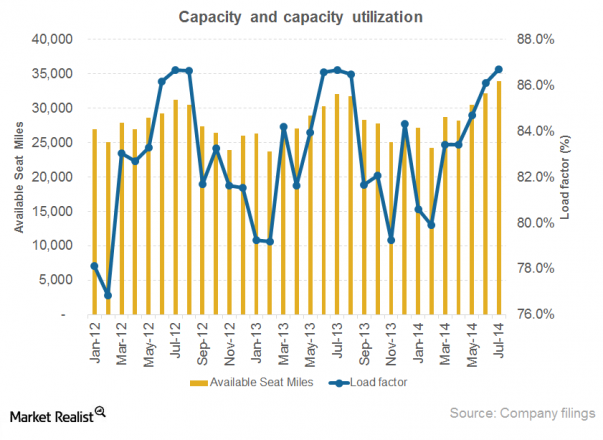

Aviation economics plays a crucial role in shaping the infrastructure that supports global trade, travel, and communication. This field examines the financial performance and strategic management of airlines and airports, serving as a backbone for modern society by enabling rapid and efficient movement of goods and people. The importance of aviation economics is evident as it impacts cost structures, pricing strategies, and investment decisions within the industry.

Key components of aviation economics include the load factor, airline profitability, and algorithmic trading. The load factor is defined as the percentage of available seating capacity that is filled with passengers. It is a critical metric for assessing an airline's capacity utilization and is calculated as:

$$
\text{Load Factor} = \frac{\text{Revenue Passenger Kilometers (RPK)}}{\text{Available Seat Kilometers (ASK)}} \times 100
$$

This percentage helps airlines optimize routes and manage resources effectively. A higher load factor generally indicates better revenue management and operational efficiency, as more seats sold on a flight typically mean higher revenue against relatively fixed costs of operation.

Airline profitability, on the other hand, encompasses the ability of an airline to generate revenue over its costs within a competitive and often volatile market. Key metrics such as net profit margin, return on assets, and cost per available seat kilometer (CASK) help in gauging an airline's financial health. Factors influencing profitability include fuel prices, labor costs, regulatory requirements, and market competition. Airlines often employ strategies like cost-cutting, route optimization, and yield management to enhance profitability.

Algorithmic trading represents a burgeoning trend in aviation economics, markedly influencing how financial transactions related to airline stocks and commodities, such as fuel, are executed. This involves using computer algorithms to automate trading decisions based on specified criteria. Algorithmic trading offers benefits like increased execution speed and reduced transaction costs, but it also carries risks and raises ethical considerations around market manipulation and transparency.

These three concepts are intertwined within the aviation industry. For instance, effective load factor management directly impacts an airline's profitability, while algorithmic trading can be employed to hedge risks associated with volatile costs such as fuel. The article explores these interconnections, emphasizing the importance of understanding these dynamics for stakeholders in the aviation industry.

The purpose of this article is to elucidate the linkage between load factor, profitability, and algorithmic trading, exploring how these elements affect decision-making and overall performance within the aviation sector. By doing so, it aims to provide valuable insights for industry stakeholders, from airline management and investors to policymakers, aiding them in navigating challenges and leveraging opportunities in this rapidly evolving field. Understanding these concepts is essential for making informed strategic decisions that contribute to sustainable growth in aviation.

## Table of Contents

## Understanding Load Factor in Aviation

**Understanding Load Factor in Aviation**

Load [factor](/wiki/factor-investing) is a key performance indicator widely used in the airline industry to assess operational efficiency and capacity utilization. It is defined as the ratio of revenue passenger kilometers (RPK) to available seat kilometers (ASK). In mathematical terms, it can be expressed as:

$$
\text{Load Factor} (\%) = \left( \frac{\text{RPK}}{\text{ASK}} \right) \times 100
$$

### Calculation and Interpretation

To calculate the load factor, an airline determines its total number of passenger kilometers traveled (RPK) and divides it by the total available seat kilometers (ASK) it operates over a specific period. A higher load factor implies a higher percentage of seats filled, indicating efficient use of an airline’s seating capacity. For example, if an airline operates a flight with 100 seats for 1000 kilometers and sells 80 of those seats, the load factor is calculated as follows:

$$
\text{Load Factor} = \left( \frac{80 \times 1000}{100 \times 1000} \right) \times 100 = 80\%
$$

### Factors Influencing Load Factor

Various factors impact load factor, including seasonal variations, economic conditions, and route characteristics. Seasonal fluctuations, such as holiday peaks and business travel periods, can significantly affect passenger numbers and thus the load factor. Economic conditions also play a crucial role; during economic downturns, reduced consumer spending can lower passenger demand, decreasing the load factor.

### Impact on Revenue Management and Operational Efficiency

The load factor directly influences an airline's revenue management strategies and operational efficiency. An optimal load factor maximizes revenue by balancing ticket prices against seat availability. Airlines use advanced forecasting and pricing models to adjust fares dynamically, aiming to boost seat occupancy without undercutting revenue per seat.

Moreover, a well-managed load factor enhances operational efficiency by optimizing fuel usage and reducing per-passenger costs. High load factors can lead to economies of scale, where the cost per passenger is reduced due to fixed costs being spread over a larger number of passengers.

### Case Studies

Several airlines have demonstrated the strategic importance of load factor management. For instance, Southwest Airlines consistently maintains high load factors through a no-frills, low-cost service model that attracts a broad customer base. By offering competitive pricing and focusing on high-density routes, Southwest optimizes its load factors and sustains profitability.

Conversely, legacy carriers like American Airlines or Delta Air Lines often face different challenges, such as network complexity and higher operational costs, requiring nuanced load factor strategies. They leverage differentiated pricing, loyalty programs, and capacity adjustments to maintain favorable load factors across diverse route networks.

In summary, load factor is a critical measurement in aviation that influences both revenue potential and operational efficiency. By understanding and managing this metric, airlines can enhance their competitive edge and financial performance.

## Airline Profitability: More than Just Numbers

Airline profitability is a critical component of aviation economics, encompassing a variety of factors and metrics that extend beyond mere financial figures. Understanding the complexity of airline profitability is essential for stakeholders aiming to navigate the volatile and competitive industry landscape.

### Key Metrics of Airline Profitability

Profitability in airlines is evaluated using several financial and operational metrics. These include:

1. **Revenue Passenger Kilometer (RPK)**: A measure of the volume of passengers carried by an airline, reflecting the actual passenger traffic.

2. **Available Seat Kilometer (ASK)**: Represents the total flight capacity available for sale. It helps assess capacity utilization when considered alongside RPK.

3. **Load Factor**: Calculated as the ratio of RPK to ASK, this metric indicates the percentage of available seating capacity that is actually utilized. A higher load factor typically signals better capacity utilization and cost-efficiency.

4. **Cost per Available Seat Kilometer (CASK)**: Reflects the cost efficiency of an airline by measuring the operating expenses per unit of available seating capacity.

5. **Revenue per Available Seat Kilometer (RASK)**: A gauge of income efficiency, indicating the revenue earned per unit of available seating capacity.

Profitability is often analyzed through operating profit margin and net profit margin, which account for operating expenses and total expenses, respectively.

### Variable and Fixed Costs in the Aviation Industry

Airlines face significant variable and fixed costs that influence profitability. Variable costs, such as fuel expenses and maintenance, fluctuate with flight operations and aircraft utilization. Conversely, fixed costs, including aircraft leasing and administrative expenses, remain constant regardless of operational levels.

Fluctuations in fuel prices are particularly impactful, often prompting airlines to engage in fuel hedging strategies. Additionally, labor costs, another large expense category, involve salaries, benefits, and union obligations. Airlines must balance workforce efficiency with cost control to sustain profitability.

### Strategies to Enhance Profitability

Airlines adopt multiple strategies to improve profitability:

- **Cost-Cutting**: This involves streamlining operations and reducing overhead costs, often through staff optimization or outsourcing non-core activities.

- **Route Optimization**: Airlines continuously analyze and adjust flight routes based on demand, competition, and profitability, seeking to maximize revenue while minimizing costs.

- **Yield Management**: This strategy focuses on pricing and inventory control to maximize revenue from available seats. By adjusting prices based on demand forecasting, airlines can optimize income.

### Challenges in Maintaining Profitability

Airlines operate in a highly competitive and regulated environment, facing challenges such as fluctuating demand, regulatory constraints, and intense price competition. External factors like geopolitical events, pandemics, and economic downturns can dramatically affect profitability.

Moreover, the capital-intensive nature of aviation, with its significant investment in aircraft and infrastructure, adds pressure on financial sustainability. Airline alliances and partnerships are common strategies to expand networks while sharing operational costs and risks.

### Successful Airlines and Their Profitability Approaches

Several airlines have demonstrated successful approaches to maintaining profitability. For instance, Southwest Airlines is renowned for its low-cost carrier model, emphasizing efficient operations, minimal fees, and direct point-to-point routes. Similarly, Ryanair utilizes aggressive cost management and ancillary revenue generation to maintain its low-cost structure.

Network carriers, such as Delta Air Lines, leverage hub-and-spoke models to enhance route connectivity and maximize operational efficiency. Delta's strategic investments in technology and customer experience have bolstered its competitive edge and financial performance.

In conclusion, airline profitability involves a complex interplay of metrics, cost structures, and strategic initiatives. Understanding these dynamics is crucial for stakeholders aiming to drive sustainable growth in the aviation industry.

## Algorithmic Trading in Aviation: An Emerging Trend

Algorithmic trading has emerged as a significant trend in aviation economics, reflecting a shift toward data-driven decision-making processes. This method involves using computer algorithms to automate trading decisions, particularly in the financial markets related to aviation, such as airline stocks and commodities crucial to the industry, including jet fuel.

The primary advantage of [algorithmic trading](/wiki/algorithmic-trading) is its ability to process vast amounts of data at high speed, enabling airlines and investors to execute trades more efficiently and often at lower transaction costs. By using predefined criteria, algorithms facilitate real-time, optimal trading strategies that can improve profit margins. For instance, the use of algorithms in managing airline stock portfolios allows for dynamic adjustment of positions based on market conditions. These algorithms can analyze historical data, identify trends, and predict future price movements, which are critical for making informed trading decisions.

Fuel hedging stands as a prominent example of algorithmic strategies applied in aviation. Given the high [volatility](/wiki/volatility-trading-strategies) in fuel prices and its significant impact on airline operating costs, many airlines utilize algorithmic trading to hedge fuel. By doing so, airlines can lock in fuel prices at more favorable rates, thus stabilizing costs and protecting against future price surges. Similarly, risk management is enhanced through algorithms that evaluate various risk factors and optimize capital allocation accordingly.

However, algorithmic trading in aviation is not without risks and ethical considerations. The reliance on algorithms introduces the potential for systemic errors, such as those caused by faulty programming or unforeseen market events, which could result in significant financial losses. Moreover, the ethics of using such technology warrant scrutiny, particularly concerning the transparency of trading practices and the potential for market manipulation. Ensuring that algorithmic strategies comply with regulatory standards is paramount to maintaining market integrity.

Looking to the future, the role of algorithmic trading in aviation is poised to expand, driven by advancements in [artificial intelligence](/wiki/ai-artificial-intelligence) and [machine learning](/wiki/machine-learning). These technologies promise to enhance algorithmic models' predictive accuracy and adaptability, enabling even more sophisticated trading strategies. As data availability and processing capabilities continue to grow, the integration of algorithmic trading into aviation economics will likely deepen, presenting both opportunities and challenges for airlines seeking to navigate this evolving landscape. This progression underscores the need for continuous innovation and regulation to harness the full potential of algorithmic trading while mitigating its risks.

## The Synergy Between Load Factor, Profitability, and Algorithmic Trading

Load factor, a critical metric in aviation, measures the capacity utilization of an airline by comparing the number of passengers carried to the total available seats. A higher load factor usually translates to improved operational efficiency and increased revenue per flight, directly impacting airline profitability. Airlines strive for an optimal load factor to ensure each flight generates maximum revenue, considering both the costs of operation and the variable pricing of seats.

Algorithmic trading, a sophisticated method involving the use of algorithms to automate trading decisions, has begun to play a pivotal role in optimizing load factor strategies. By leveraging vast data sets and predictive analytics, algorithms can forecast demand patterns and adjust pricing dynamically. For example, algorithms can assess historical flight data, economic indicators, and competitor pricing to recommend optimal seat pricing and maximize load factor.

Data analytics acts as a bridge, connecting load factor metrics with real-time market trading. Airlines can integrate data from multiple sources—such as bookings, economic indicators, and market trends—into their algorithms. This integration enables airlines to conduct scenario analyses and simulate the financial impact of different load factor scenarios on profitability. For instance, airlines might use machine learning algorithms to identify patterns and correlations between load factor changes and stock price fluctuations, thus informing more strategic investment and operational decisions.

Several airlines have successfully leveraged these synergies. Southwest Airlines, for example, utilizes advanced data analytics to achieve competitive load factors and improve profitability. By employing algorithmic models, the airline adjusts ticket prices in real time, based on seat availability and booking trends, ensuring optimal load factor without compromising on profitability.

However, integrating load factor mechanics with algorithmic trading poses both benefits and challenges. One significant advantage is the potential for increased revenue due to optimized pricing strategies that closely align with market demand. Additionally, real-time data analysis can improve decision-making speed and accuracy. 

Conversely, challenges arise in terms of data accuracy, algorithm complexity, and market unpredictability. The effectiveness of algorithms is heavily dependent on the quality of input data; inaccurate forecasts or flawed data can lead to suboptimal strategies. Moreover, the development and maintenance of sophisticated algorithmic systems require substantial investment and technical expertise. Ethical considerations also emerge, related to market fairness and the transparency of automated trading decisions.

The synergies between load factor, profitability, and algorithmic trading continue to evolve, presenting both opportunities and hurdles for airlines. As technology advances, the potential for deeper integration and more refined strategies promises substantial gains in both operational efficiency and financial performance.

## Conclusion and Future Directions

The interconnected nature of load factor, profitability, and algorithmic trading remains a pivotal axis for understanding modern aviation economics. The load factor, a key performance indicator, reflects the capacity utilization of an airline's fleet—directly impacting its revenue management strategies. Airlines strive to maximize this metric since high load factors generally translate to improved profitability due to revenue optimization and better cost distribution across more passengers. However, achieving an optimal load factor involves navigating various challenges, including fluctuating demand patterns and economic uncertainties.

Algorithmic trading introduces a transformative dimension to airline economics by offering tools for airlines to manage assets, reduce fuel costs, and hedge against market volatilities. Its integration into aviation economics is evident as airlines increasingly apply data-driven approaches to enhance operational efficiency and financial robustness. Algorithms provide a systematic framework for market transactions, asset management, and financial forecasting—facilitating better alignment between load factor strategies and profitability goals.

For the future, several emerging trends and innovations could influence aviation economics. Sustainable aviation fuels, technological advancements in fleet management, and personalized customer experience models are set to redefine operational frontiers. Additionally, advancements in artificial intelligence and machine learning promise enhanced predictive capabilities for demand forecasting and market behavior analysis, potentially offering a further boost to load factor optimization and profitability.

Practitioners in the aviation industry should focus on integrating comprehensive data analytics platforms to synthesize insights from load factors and market trends, thereby informing decision-making processes. Engagement with innovative technologies and adopting a more flexible business model can enhance resilience against economic fluctuations. Furthermore, collaboration across sectors for sustainable practices can drive long-term industry growth.

As the aviation industry continuously evolves, understanding the synergy between load factor, profitability, and algorithmic trading becomes increasingly essential. Stakeholders are tasked with leveraging these insights to navigate forthcoming challenges and opportunities, ensuring the sustainable development of airline operations and economics.

## References

1. Belobaba, Peter P., Amedeo R. Odoni, and Cynthia Barnhart, eds. *The Global Airline Industry*. John Wiley & Sons, 2015. This book provides comprehensive coverage on the complexities of the airline industry, addressing both economic and operational aspects.

2. Doganis, Rigas. *The Airline Business*. Routledge, 2006. This publication discusses the principles driving airline profitability and the various strategies airlines employ to maintain financial health.

3. Caves, Douglas W., Laurits R. Christensen, and Michael W. Tretheway. "Economies of Density versus Economies of Scale: Why Trunk and Local Service Airline Costs Differ." *The RAND Journal of Economics* 15, no. 4 (1984): 471-489. This paper analyzes the cost structures in airlines, emphasizing the difference between density and scale economies.

4. Forsyth, Peter. *The Economics of Aviation: A Handbook*. Routledge, 2020. This handbook provides insights into modern aviation economics, covering topics such as demand, supply, and pricing in the airline industry.

5. Scherer, Andreas, and Jasper Gutzeit. "Algorithmic Trading of Airline Stocks: An Event-Study on Weather Conditions." *Journal of Air Transport Management* 87 (2020): 101851. This study explores the impact of external factors like weather on airline stock trading, with a focus on algorithmic interventions.

6. Holloway, Stephen. *Straight and Level: Practical Airline Economics*. Routledge, 2016. A practical guide to understanding the financial intricacies and management challenges faced by airlines.

7. Bureau of Transportation Statistics. *Airline On-Time Statistics and Delay Causes*. U.S. Department of Transportation. This source provides extensive data on flight performance metrics.

8. IATA. "Economic Performance of the Airline Industry." International Air Transport Association, June 2021. This report offers a snapshot of the industry's financial health, key for understanding trends in profitability.

9. Mazzeo, Michael J. "Product Choice and Oligopoly Market Structure." *The RAND Journal of Economics* 33, no. 2 (2002): 221-242. This article explores competitive strategies within oligopolistic markets, relevant for airline route optimization.

10. Brueckner, Jan K., and Pablo T. Spiller. "Economies of Traffic Density in the Deregulated Airline Industry." *The Journal of Law & Economics* 37, no. 2 (1994): 379-415. A study on how deregulation has affected cost efficiencies through traffic density in airlines.

11. Williams, George. "The Airline Industry and the Impact of Deregulation." *Ashgate*, 1994. This book discusses the regulatory transformations in the airline industry and their economic implications.

12. Fiig, Tom, Henk A. Blake, and Jeremy W. Catto. "Airline Revenue Management: An Overview of Booking Limits." *Journal of Revenue and Pricing Management* 9, no. 3 (2010): 245-258. This paper covers key concepts in revenue management, critical for maximizing airline profitability. 

Additional Reading:
- Official airlines' financial statements and shareholder reports for practical examples of cost analysis and profitability strategies.
- Articles from aviation industry publications such as *Flight Global* and *Aviation Week* for the latest innovation trends and market analysis.
- Visit online resources such as the International Civil Aviation Organization (ICAO) for further reading on international regulation and air transport statistics.

## References & Further Reading

[1]: Belobaba, Peter P., Amedeo R. Odoni, and Cynthia Barnhart, eds. *The Global Airline Industry*. John Wiley & Sons, 2015.

[2]: Doganis, Rigas. *The Airline Business*. Routledge, 2006.

[3]: Caves, Douglas W., Laurits R. Christensen, and Michael W. Tretheway. "Economies of Density versus Economies of Scale: Why Trunk and Local Service Airline Costs Differ." *The RAND Journal of Economics* 15, no. 4 (1984): 471-489.

[4]: Forsyth, Peter. *The Economics of Aviation: A Handbook*. Routledge, 2020.

[5]: Scherer, Andreas, and Jasper Gutzeit. "Algorithmic Trading of Airline Stocks: An Event-Study on Weather Conditions." *Journal of Air Transport Management* 87 (2020): 101851.

[6]: Holloway, Stephen. *Straight and Level: Practical Airline Economics*. Routledge, 2016.

[7]: Bureau of Transportation Statistics. *Airline On-Time Statistics and Delay Causes*. U.S. Department of Transportation.

[8]: IATA. "Economic Performance of the Airline Industry." International Air Transport Association, June 2021.

[9]: Mazzeo, Michael J. "Product Choice and Oligopoly Market Structure." *The RAND Journal of Economics* 33, no. 2 (2002): 221-242.

[10]: Brueckner, Jan K., and Pablo T. Spiller. "Economies of Traffic Density in the Deregulated Airline Industry." *The Journal of Law & Economics* 37, no. 2 (1994): 379-415.

[11]: Williams, George. "The Airline Industry and the Impact of Deregulation." *Ashgate*, 1994.

[12]: Fiig, Tom, Henk A. Blake, and Jeremy W. Catto. "Airline Revenue Management: An Overview of Booking Limits." *Journal of Revenue and Pricing Management* 9, no. 3 (2010): 245-258.