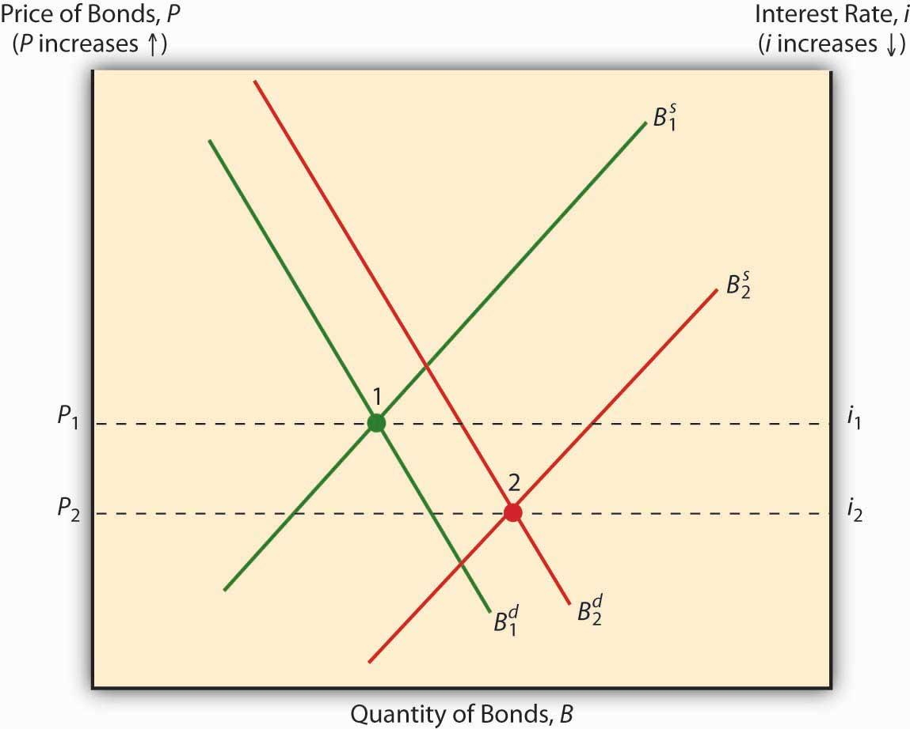

## Table of Contents

## What are interest rates and how do they affect the economy?

Interest rates are the cost of borrowing money, usually shown as a percentage. When you take a loan from a bank, the interest rate is what you pay extra on top of the money you borrowed. Banks and governments set these rates, and they can change over time. If interest rates are low, it means it's cheaper to borrow money. If they're high, borrowing money costs more.

Interest rates have a big impact on the economy. When rates are low, people and businesses are more likely to borrow money to buy things like houses or start new projects. This can help the economy grow because more money is being spent. But if rates are too low for a long time, it might lead to too much borrowing and spending, which can cause inflation. On the other hand, when interest rates are high, borrowing becomes more expensive, so people and businesses might spend less. This can slow down the economy, but it can also help control inflation by reducing the amount of money in circulation.

## What are bonds and why do people invest in them?

Bonds are like IOUs. When you buy a bond, you're lending money to the issuer, which could be a government or a company. In return, they promise to pay you back the money you lent them, plus some extra money called interest, on a certain date. Bonds are seen as safer investments than stocks because they have a more predictable return. You know how much interest you'll get and when you'll get your money back, as long as the issuer doesn't go bankrupt.

People invest in bonds for a few reasons. One big reason is to earn a steady income from the interest payments. This can be especially important for retirees who need a regular source of money. Another reason is to keep their money safe. Since bonds are generally less risky than stocks, they can help balance out a more risky investment portfolio. Lastly, bonds can be a good way to diversify investments, spreading out risk so that if one type of investment goes down, the others might help cushion the blow.

## How do low interest rates influence bond prices?

When interest rates are low, the prices of existing bonds usually go up. This happens because new bonds that are issued when rates are low will have lower interest rates than the older bonds. People who want to buy bonds will be willing to pay more for the older bonds because they offer a higher interest rate than the new ones. It's like choosing between two similar items where one gives you a better deal; you'd pay more for the better deal.

For example, imagine you own a bond that pays 5% interest each year. If new bonds are now only offering 3% interest because rates have dropped, your bond is more attractive to investors. They might offer to buy your bond from you at a higher price than what you paid for it, because they want that 5% return. So, low interest rates make the prices of existing bonds rise as people chase after the higher interest payments.

## What is the relationship between interest rates and bond yields?

Bond yields and interest rates have a close relationship. When interest rates go up, new bonds are issued with higher interest rates. This makes existing bonds with lower interest rates less attractive to investors. As a result, the prices of those existing bonds go down. When bond prices go down, their yields, or the return you get from them, go up. So, higher interest rates lead to higher bond yields.

On the other hand, when interest rates go down, new bonds are issued with lower interest rates. This makes existing bonds with higher interest rates more attractive. People are willing to pay more for those existing bonds, so their prices go up. When bond prices go up, their yields go down. So, lower interest rates lead to lower bond yields. This relationship is important for investors to understand because it affects how much money they can make from their bonds.

## How does the demand for bonds change when interest rates are low?

When interest rates are low, the demand for bonds usually goes up. This happens because low interest rates mean new bonds being issued will have lower interest payments. People who want to invest in bonds will look for older bonds that have higher interest rates. These older bonds become more valuable and attractive to investors because they offer better returns than the new bonds.

For example, if you have a bond that pays 4% interest and new bonds are only offering 2%, more people will want to buy your bond. They are willing to pay more for it because they want that higher 4% return. So, when interest rates are low, the demand for existing bonds increases as people chase after the better interest rates they offer.

## What are the different types of bonds affected by low interest rates?

When interest rates are low, different types of bonds like government bonds, corporate bonds, and municipal bonds can be affected. Government bonds, which are issued by the government, become more attractive to investors because they offer higher interest rates than new bonds. This means more people want to buy them, which can drive up their prices. Corporate bonds, issued by companies, also see increased demand for the same reason. Investors are looking for the best returns, and older corporate bonds with higher interest rates become more valuable.

Municipal bonds, which are issued by local governments or cities, follow a similar pattern. When interest rates drop, the older municipal bonds with higher interest rates become more appealing. Investors are willing to pay more for these bonds because they offer better returns than the new bonds being issued at lower rates. So, low interest rates can make all these types of bonds more in demand and increase their prices.

## How do central bank policies contribute to low interest rates?

Central banks play a big role in setting interest rates. They do this by controlling something called the 'monetary policy.' When a central bank wants to make interest rates low, they might use a tool called 'open market operations.' This means they buy government bonds from banks, which puts more money into the economy. With more money around, banks don't need to charge as much interest to lend it out, so interest rates go down.

Another way central banks can keep interest rates low is by setting a target for the interest rate they charge banks. This is called the 'policy rate.' If the central bank sets this rate low, it means banks can borrow money from the central bank at a low cost. Then, banks pass on these low rates to their customers when they lend money. This makes borrowing cheaper for everyone and keeps interest rates low across the economy.

## What are the long-term effects of sustained low interest rates on bond markets?

When interest rates stay low for a long time, it can really change how the bond market works. People start looking for older bonds that have higher interest rates because new bonds don't offer as much. This makes the prices of those older bonds go up a lot. But there's a problem if rates stay low for too long. People might start taking bigger risks to find better returns, like buying bonds that are riskier but offer higher interest. This can make the bond market a bit unstable because if something goes wrong, those risky bonds could lose a lot of value.

Also, when interest rates are low for a long time, it can lead to something called 'yield chasing.' This means investors are always trying to find the best returns, even if it means buying bonds that might not be as safe. This can make the whole bond market more risky. On the other hand, if rates suddenly go up after being low for a long time, the prices of bonds can drop fast. This can hurt people who were counting on selling their bonds at a high price to make money. So, while low rates can make bonds more valuable in the short term, they can also cause big problems in the long run if not handled carefully.

## How do low interest rates impact bond duration and investor strategies?

When interest rates are low, it changes how long people want to hold onto their bonds, which is called bond duration. Low rates make bonds with longer durations more appealing because they offer higher interest payments over time. Investors might choose to buy bonds that last longer, like 10 or 30 years, because they can lock in those higher rates for a longer time. This can be good for people who want a steady income over many years, like retirees. But it also means they're stuck with those bonds even if rates go up later, which could make the bonds worth less.

Low interest rates also change how investors plan their strategies. Some investors might decide to take more risks to find better returns. They might buy bonds from companies that are riskier but offer higher interest rates. This can be a good way to make more money, but it's also riskier because those companies might have trouble paying back the bonds. Other investors might use something called a 'bond ladder' strategy. This means they buy bonds that mature at different times, so they can take advantage of any changes in interest rates. If rates go up, they can reinvest the money from the bonds that mature into new bonds with higher rates.

## What are the risks associated with investing in bonds during periods of low interest rates?

When interest rates are low, investing in bonds can be risky because the prices of existing bonds go up. People want to buy older bonds that have higher interest rates than the new ones. But if interest rates suddenly go up, the prices of those bonds can drop fast. This means if you need to sell your bonds, you might get less money than you expected. It's like buying something expensive hoping to sell it later for more, but then the price goes down.

Another risk is that when rates are low, investors might start looking for riskier bonds to get better returns. These bonds might offer higher interest rates, but there's a bigger chance the company or government that issued them could have trouble paying back the money. This can make the bond market more unstable. If a lot of people are chasing after these risky bonds and something goes wrong, it could cause big problems for the whole bond market.

Also, if you buy bonds that last a long time, like 10 or 30 years, you're locking in those low rates for a long time. If rates go up later, you're stuck with the lower rates and can't take advantage of the new, higher rates. This can be a problem if you were counting on the interest from those bonds to live on, like if you're retired. So, while low rates can make bonds seem more valuable, they come with their own set of risks that investors need to think about carefully.

## How do low interest rates affect the yield curve and bond market dynamics?

When interest rates are low, it changes the shape of the yield curve, which is a graph that shows how much interest you can get from bonds that last different amounts of time. Usually, the yield curve goes up as you look at bonds that last longer because people want more money for waiting longer. But when rates are low, the difference between short-term and long-term bond yields might not be as big. This can make the yield curve flatter. Investors might start looking for bonds that last longer because they offer a bit more interest, even if it's not a lot more than short-term bonds.

This change in the yield curve can affect how people buy and sell bonds. When rates are low, more people want to buy bonds that were issued before the rates dropped because they offer higher interest. This makes the prices of those bonds go up. But if everyone is buying the same kind of bonds, it can make the bond market less stable. If interest rates suddenly go up, the prices of those bonds could drop fast. This can be a problem for investors who need to sell their bonds quickly. So, while low rates can make bonds seem more valuable, they can also make the bond market more risky and unpredictable.

## What are some advanced investment strategies for navigating bond markets with low interest rates?

When interest rates are low, one advanced strategy investors might use is called 'bond laddering.' This means buying bonds that mature at different times. Imagine you have a ladder with rungs at different heights. Each rung is like a bond that matures at a different time. If interest rates go up, you can take the money from the bonds that mature and buy new bonds with higher rates. This helps you take advantage of any changes in interest rates without being stuck with low rates for too long.

Another strategy is to look for 'high-yield bonds.' These are riskier because they're from companies that might have trouble paying back the money, but they offer higher interest rates. When rates are low, these bonds can seem more attractive because they give you a better return than safer bonds. But you have to be careful because if the company can't pay back the bond, you could lose money. So, it's a good idea to only put a small part of your money into these riskier bonds and keep most of it in safer investments.

A third strategy is to use 'interest rate swaps.' This is when you agree to exchange the interest payments on your bonds with someone else. If you have a bond with a low fixed rate, you might swap it for a bond with a variable rate that could go up if interest rates rise. This can help protect you from losing money if rates go up. But swaps can be complicated, so it's important to understand them well before trying this strategy.

## What is the role of bonds in financial markets and how can we understand them?

Bonds are fundamental elements of investment portfolios, serving as a loan from investors to issuers such as governments, corporations, or municipalities. These fixed-income securities offer a predictable income stream through periodic interest payments, making them particularly attractive to conservative investors who prioritize stability and lower risk over potentially higher returns associated with equities. 

The types of bonds are varied, each with unique characteristics tailored to different investment needs. US Treasury bonds, for instance, are issued by the federal government and are backed by its full faith and credit, making them virtually risk-free in terms of default. This security comes at the cost of lower yields compared to other bonds. In contrast, corporate bonds, issued by companies, generally offer higher yields, reflecting the greater risk of default compared to government securities. Investors in corporate bonds must consider the creditworthiness of the issuing company, which can be assessed through credit ratings provided by agencies such as Moody’s and Standard & Poor’s.

Municipal bonds, issued by state or local governments, are another option, often presenting tax advantages; the interest income from these bonds may be exempt from federal and sometimes state taxes. This feature can increase the effective yield for investors in high tax brackets. Each bond type carries its own benefits and risks, and understanding these is vital for investors seeking to diversify their portfolios.

Three key characteristics define bonds: face value, coupon rate, and maturity date. The face value is the amount paid back to the investor at maturity. The coupon rate is the bond's annual interest payment as a percentage of face value, and maturity date indicates when the issuer must repay the bond's face value. These features determine the bond’s price and yield, which inversely fluctuates with changes in market interest rates.

For example, the yield to maturity (YTM) of a bond, which is a crucial measure, represents the total return anticipated on a bond if held until it matures. The YTM formula can be expressed as:

$$

YTM \approx \frac{C + \frac{F - P}{n}}{\frac{F + P}{2}} 
$$

where $C$ is the annual coupon payment, $F$ is the face value, $P$ is the price of the bond, and $n$ is the number of years to maturity. This formula helps investors compare bonds with different prices and maturities to assess their investment potential.

Understanding these aspects of bonds is essential for investors aiming to diversify their portfolios effectively, balancing risk with returns to achieve financial stability. With each type offering specific advantages, a carefully selected mix of bonds can serve as a sturdy foundation within broader investment strategies.

## What is the impact of interest rates on bond demand?

Interest rates play a crucial role in shaping bond demand due to their direct impact on bond prices. The fundamental relationship between interest rates and bond prices is inverse. This means when interest rates rise, the prices of existing bonds generally fall, and conversely, when interest rates decline, bond prices tend to increase. This inverse relationship arises because the fixed interest payments of bonds become more or less attractive relative to the new market interest rates.

### Interest Rate and Bond Price Relationship

When an investor buys a bond, they effectively agree to receive fixed periodic payments (known as coupon payments) until the bond matures. If market interest rates increase after the bond's issuance, new bonds are likely to be issued with higher coupon rates. This makes existing bonds, with their lower fixed payments, less attractive unless they are sold at a discount, hence the reduction in their price.

The price of an existing bond can be mathematically expressed using the following formula for its present value:

$$
P = \sum \frac{C}{(1 + r)^t} + \frac{F}{(1 + r)^n}
$$

where:
- $P$ is the price of the bond.
- $C$ is the annual coupon payment.
- $r$ is the current market interest rate.
- $t$ is the time period.
- $F$ is the face value of the bond.
- $n$ is the term to maturity.

### Economic Indicators Influencing Interest Rates

Numerous economic indicators can influence interest rates, thereby affecting bond demand. Key among these are inflation rates, monetary policy, and fiscal policy shifts.

- **Inflation**: As inflation rises, central banks often increase interest rates to stabilize the economy. This can lead to decreased bond prices as newer issues carry higher rates.

- **Monetary Policy**: Central banks, like the Federal Reserve, set target interest rates to control economic growth and inflation. A hawkish monetary stance implies higher future interest rates, negatively impacting existing bond values.

- **Fiscal Policy Shifts**: Government borrowing needs can influence interest rates. Increased borrowing often results in higher interest rates as the government competes for funds, affecting bond demand.

### Strategic Positioning for Investors

Investors can make informed strategic decisions by understanding and predicting [interest rate](/wiki/interest-rate-trading-strategies) movements. By anticipating rate changes, they can position their portfolios to either capitalize on favorable movements or hedge against potential risks. For instance, during expected interest rate rises, investors might favor short-duration bonds or floating-rate bonds that are less sensitive to rate changes.

Furthermore, advanced predictive tools and economic modeling techniques can aid investors in forecasting interest rate trends. By incorporating these tools, investors can assess the potential impact on their bond holdings and make data-driven decisions to optimize returns or mitigate risks.

Through a clear understanding of these dynamics, investors can better navigate the complexities associated with bond investments and interest rate fluctuations, ensuring more resilient and profitable portfolio management.

## References & Further Reading

[1]: ["The Economics of Money, Banking and Financial Markets"](https://www.pearsonhighered.com/assets/preface/0/1/3/4/0134855388.pdf) by Frederic S. Mishkin

[2]: ["Advances in Financial Machine Learning"](https://www.amazon.com/Advances-Financial-Machine-Learning-Marcos/dp/1119482089) by Marcos Lopez de Prado

[3]: Fabozzi, Frank J. (2013). ["Bond Markets, Analysis, and Strategies."](https://books.google.com/books/about/Bond_Markets_Analysis_and_Strategies_ten.html?id=bQpNEAAAQBAJ) Pearson.

[4]: ["Algorithmic and High-Frequency Trading"](https://www.amazon.com/Algorithmic-High-Frequency-Trading-Mathematics-Finance/dp/1107091144) by Álvaro Cartea, Sebastian Jaimungal, and José Penalva

[5]: ["Quantitative Trading: How to Build Your Own Algorithmic Trading Business"](https://github.com/LucindaYa/quant-resources/blob/master/Quantitative%20Trading%20How%20to%20Build%20Your%20Own%20Algorithmic%20Trading%20Business.pdf) by Ernest P. Chan

[6]: ["Evidence-Based Technical Analysis: Applying the Scientific Method and Statistical Inference to Trading Signals"](https://www.amazon.com/Evidence-Based-Technical-Analysis-Scientific-Statistical/dp/0470008741) by David Aronson