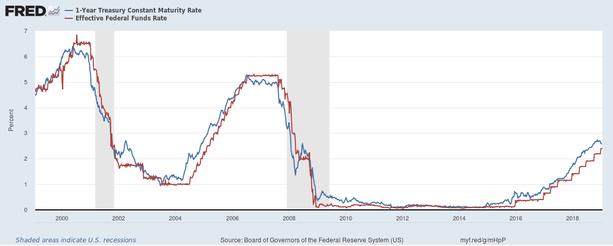

In financial markets, understanding the interplay between bond demand, interest rates, and algorithmic trading is crucial for investors and traders. Bonds serve as essential components within investment portfolios, with their demand largely swayed by prevailing interest rates. These rates are often dictated by macroeconomic factors, including inflation and government monetary policies. As interest rates fluctuate, they inversely affect bond prices, creating a key consideration for investors seeking optimal returns while managing risk.

Moreover, algorithmic trading has transformed the landscape of financial markets. By employing advanced algorithms and high-speed computing, traders can swiftly process extensive market data to execute transactions with precision and speed, significantly enhancing market efficiency. This automation has minimized human error and allowed for more complex trading strategies, providing investors with new avenues to capitalize on market movements.

This article explores these interconnected elements, highlighting their influence on investment strategies in bonds and how they shape the broader financial market landscape. Understanding the intricacies of bond investments, the effects of interest rate variations, and the transformative capability of algorithmic trading empowers investors to make informed decisions and optimize their portfolios for better returns. Join us as we uncover the complexities and opportunities within financial markets and the evolving strategies that drive them.

## Table of Contents

## Understanding Bonds and Their Role in Financial Markets

Bonds are fundamental elements of investment portfolios, serving as a loan from investors to issuers such as governments, corporations, or municipalities. These fixed-income securities offer a predictable income stream through periodic interest payments, making them particularly attractive to conservative investors who prioritize stability and lower risk over potentially higher returns associated with equities. 

The types of bonds are varied, each with unique characteristics tailored to different investment needs. US Treasury bonds, for instance, are issued by the federal government and are backed by its full faith and credit, making them virtually risk-free in terms of default. This security comes at the cost of lower yields compared to other bonds. In contrast, corporate bonds, issued by companies, generally offer higher yields, reflecting the greater risk of default compared to government securities. Investors in corporate bonds must consider the creditworthiness of the issuing company, which can be assessed through credit ratings provided by agencies such as Moody’s and Standard & Poor’s.

Municipal bonds, issued by state or local governments, are another option, often presenting tax advantages; the interest income from these bonds may be exempt from federal and sometimes state taxes. This feature can increase the effective yield for investors in high tax brackets. Each bond type carries its own benefits and risks, and understanding these is vital for investors seeking to diversify their portfolios.

Three key characteristics define bonds: face value, coupon rate, and maturity date. The face value is the amount paid back to the investor at maturity. The coupon rate is the bond's annual interest payment as a percentage of face value, and maturity date indicates when the issuer must repay the bond's face value. These features determine the bond’s price and yield, which inversely fluctuates with changes in market interest rates.

For example, the yield to maturity (YTM) of a bond, which is a crucial measure, represents the total return anticipated on a bond if held until it matures. The YTM formula can be expressed as:

$$

YTM \approx \frac{C + \frac{F - P}{n}}{\frac{F + P}{2}} 
$$

where $C$ is the annual coupon payment, $F$ is the face value, $P$ is the price of the bond, and $n$ is the number of years to maturity. This formula helps investors compare bonds with different prices and maturities to assess their investment potential.

Understanding these aspects of bonds is essential for investors aiming to diversify their portfolios effectively, balancing risk with returns to achieve financial stability. With each type offering specific advantages, a carefully selected mix of bonds can serve as a sturdy foundation within broader investment strategies.

## The Impact of Interest Rates on Bond Demand

Interest rates play a crucial role in shaping bond demand due to their direct impact on bond prices. The fundamental relationship between interest rates and bond prices is inverse. This means when interest rates rise, the prices of existing bonds generally fall, and conversely, when interest rates decline, bond prices tend to increase. This inverse relationship arises because the fixed interest payments of bonds become more or less attractive relative to the new market interest rates.

### Interest Rate and Bond Price Relationship

When an investor buys a bond, they effectively agree to receive fixed periodic payments (known as coupon payments) until the bond matures. If market interest rates increase after the bond's issuance, new bonds are likely to be issued with higher coupon rates. This makes existing bonds, with their lower fixed payments, less attractive unless they are sold at a discount, hence the reduction in their price.

The price of an existing bond can be mathematically expressed using the following formula for its present value:

$$
P = \sum \frac{C}{(1 + r)^t} + \frac{F}{(1 + r)^n}
$$

where:
- $P$ is the price of the bond.
- $C$ is the annual coupon payment.
- $r$ is the current market interest rate.
- $t$ is the time period.
- $F$ is the face value of the bond.
- $n$ is the term to maturity.

### Economic Indicators Influencing Interest Rates

Numerous economic indicators can influence interest rates, thereby affecting bond demand. Key among these are inflation rates, monetary policy, and fiscal policy shifts.

- **Inflation**: As inflation rises, central banks often increase interest rates to stabilize the economy. This can lead to decreased bond prices as newer issues carry higher rates.

- **Monetary Policy**: Central banks, like the Federal Reserve, set target interest rates to control economic growth and inflation. A hawkish monetary stance implies higher future interest rates, negatively impacting existing bond values.

- **Fiscal Policy Shifts**: Government borrowing needs can influence interest rates. Increased borrowing often results in higher interest rates as the government competes for funds, affecting bond demand.

### Strategic Positioning for Investors

Investors can make informed strategic decisions by understanding and predicting [interest rate](/wiki/interest-rate-trading-strategies) movements. By anticipating rate changes, they can position their portfolios to either capitalize on favorable movements or hedge against potential risks. For instance, during expected interest rate rises, investors might favor short-duration bonds or floating-rate bonds that are less sensitive to rate changes.

Furthermore, advanced predictive tools and economic modeling techniques can aid investors in forecasting interest rate trends. By incorporating these tools, investors can assess the potential impact on their bond holdings and make data-driven decisions to optimize returns or mitigate risks.

Through a clear understanding of these dynamics, investors can better navigate the complexities associated with bond investments and interest rate fluctuations, ensuring more resilient and profitable portfolio management.

## Algorithmic Trading in Bond Markets

Algorithmic trading has significantly transformed the bond market landscape, optimizing various facets of bond acquisition and sales processes. The primary advantage of [algorithmic trading](/wiki/algorithmic-trading) lies in its ability to leverage advanced computing technology to process large volumes of market data rapidly. This capability minimizes human error and enhances trading efficiency, a crucial improvement given the traditionally opaque and manually intensive nature of bond markets.

One of the primary strategies employed in algorithmic trading within bond markets is mean-reversion. This strategy is predicated on the assumption that an asset's price will eventually return to its mean or average value. In practical terms, if a bond's price deviates from its historical average, algorithms can execute trades that capitalize on the eventual correction. This strategy is particularly effective in bond markets due to the relatively stable and predictable nature of bond pricing compared to equities.

Another prevalent algorithmic trading strategy is [momentum](/wiki/momentum) trading, which involves capitalizing on existing market trends. In bond markets, momentum strategies might analyze trends in interest rate movements and their impact on bond prices. Python, for example, provides libraries such as NumPy and pandas, which can be employed to analyze historical price data and detect momentum, allowing algorithms to execute trades in alignment with these trends.

Statistical [arbitrage](/wiki/arbitrage) is also a commonly used strategy in bond markets. It involves the simultaneous buying and selling of related bonds to exploit pricing inefficiencies. This can involve complex mathematical models and statistical techniques to identify and act upon discrepancies in bond pricing. For example, pairs trading strategies might involve two bonds with similar characteristics where an algorithm identifies a temporary price divergence and executes trades to profit from the expected convergence. The use of advanced statistical models and [machine learning](/wiki/machine-learning) techniques allows for a rigorous analysis of bond prices and market conditions, optimizing the timing and execution of trades.

Case studies illustrate the efficacy of algorithmic trading in enhancing market efficiency and providing competitive advantages to investors. For instance, firms deploying mean-reversion strategies in volatile market segments have reported significant returns by systematically exploiting price corrections. Similarly, momentum strategies have enabled traders to leverage swift changes in macroeconomic indicators, such as unexpected shifts in central bank policies, which influence bond markets.

Ultimately, algorithmic trading in bond markets reduces transaction costs and increases [liquidity](/wiki/liquidity-risk-premium), vital components for fostering a more dynamic and efficient market environment. As technology continues to evolve, the integration of machine learning and [artificial intelligence](/wiki/ai-artificial-intelligence) is expected to further refine these strategies, enhancing their precision and efficacy. This ongoing innovation underscores the critical role of technology in transforming financial markets and shaping future trading paradigms.

## Challenges and Opportunities in Algo Trading

Algorithmic trading has become a cornerstone of modern financial markets, bringing significant improvements in efficiency and execution speed. However, its application in bond markets presents unique challenges that differ from those encountered in equity markets.

One primary challenge is data fragmentation. Bond markets are historically less transparent compared to equity markets. Each bond is unique in terms of its maturity, credit rating, and coupon rate, leading to a vast amount of heterogeneous data that can be difficult to aggregate and analyze comprehensively. This lack of standardization and transparency can hinder the ability of algorithms to make optimal trading decisions.

The complexity of bond structures adds an additional layer of difficulty. Bonds can have various embedded features, such as callable options, puttable options, and convertible bonds, which require sophisticated modeling to accurately assess their value and risk. Algorithms must be designed to account for these complexities and simulate various market scenarios to evaluate potential trading strategies.

Despite these challenges, technological advancements offer promising solutions. The integration of artificial intelligence (AI) and machine learning (ML) has the potential to enhance data processing and analysis. ML algorithms can identify patterns and correlations in vast datasets that may not be immediately apparent to human analysts. These technologies can improve decision-making by providing more accurate bond pricing models and forecasting tools.

Another opportunity lies in the development of unified trading platforms that aggregate data from multiple sources, providing traders with a holistic view of the market. Such platforms can facilitate better price discovery and improve the efficiency of algorithmic trading strategies.

Additionally, the use of natural language processing (NLP) can assist in extracting valuable information from unstructured data, such as news articles and financial reports, which can affect bond market conditions. This capability enables algorithms to assess sentiment and anticipate market-moving events, improving their adaptiveness and responsiveness.

Looking ahead, the future of algorithmic trading in bond markets will likely be shaped by continued advancements in computational technology and analytics. Investors must stay abreast of these developments and refine their algorithms to adapt to the evolving landscape. This involves not only employing cutting-edge technologies but also fostering collaboration between technologists and financial experts to design robust trading systems that can navigate the complexities of bond markets effectively.

In conclusion, while the challenges in algorithmic bond trading are significant, they are not insurmountable. By strategically leveraging AI, ML, and other technological innovations, investors can overcome these obstacles and capitalize on the opportunities presented by the evolving bond market. The key to success will be a proactive approach to incorporating these technologies into trading strategies, fostering innovation, and maintaining flexibility in a rapidly changing financial environment.

## Conclusion

As financial markets evolve, the ability to understand and navigate the intricate relationship between bonds, interest rates, and algorithmic trading becomes increasingly critical for investors. This interconnectedness allows for a more comprehensive approach to portfolio management, where insights from each element inform strategic decisions that optimize performance.

Integrating knowledge about bond demand and interest rate dynamics empowers investors to effectively balance risk and reward. Bond prices are influenced by interest rates through an inverse relationship: when interest rates climb, existing bond prices typically fall, which can lead to capital losses if not strategically managed. By anticipating shifts in economic indicators like inflation and monetary policy, investors can position their portfolios to either capitalize on or mitigate the impact of these changes.

Algorithmic trading represents a transformative force in financial markets. It combines traditional investment strategies with advanced technology, including AI and machine learning, to process vast amounts of data quickly and execute trades with precision. This fusion allows for informed, data-driven decision-making, where algorithms can react to market signals far faster than any human trader. By leveraging algo trading strategies such as mean-reversion and [statistical arbitrage](/wiki/statistical-arbitrage), investors can enhance market efficiency and gain a competitive edge.

The future of financial markets is clearly shaped by the integration of these elements. As technology continues to advance, the opportunities for refining investment strategies through better data analytics and predictive modeling increase. Investors who adapt to this technological landscape can embrace the complexities of financial markets, ensuring optimized outcomes through strategic blending of traditional approaches and technological innovations. Consequently, mastering this interconnected framework positions investors to not only navigate but excel in the ever-evolving financial market environment.

## References & Further Reading

[1]: ["The Economics of Money, Banking and Financial Markets"](https://www.pearsonhighered.com/assets/preface/0/1/3/4/0134855388.pdf) by Frederic S. Mishkin

[2]: ["Advances in Financial Machine Learning"](https://www.amazon.com/Advances-Financial-Machine-Learning-Marcos/dp/1119482089) by Marcos Lopez de Prado

[3]: Fabozzi, Frank J. (2013). ["Bond Markets, Analysis, and Strategies."](https://books.google.com/books/about/Bond_Markets_Analysis_and_Strategies_ten.html?id=bQpNEAAAQBAJ) Pearson.

[4]: ["Algorithmic and High-Frequency Trading"](https://www.amazon.com/Algorithmic-High-Frequency-Trading-Mathematics-Finance/dp/1107091144) by Álvaro Cartea, Sebastian Jaimungal, and José Penalva

[5]: ["Quantitative Trading: How to Build Your Own Algorithmic Trading Business"](https://github.com/LucindaYa/quant-resources/blob/master/Quantitative%20Trading%20How%20to%20Build%20Your%20Own%20Algorithmic%20Trading%20Business.pdf) by Ernest P. Chan

[6]: ["Evidence-Based Technical Analysis: Applying the Scientific Method and Statistical Inference to Trading Signals"](https://www.amazon.com/Evidence-Based-Technical-Analysis-Scientific-Statistical/dp/0470008741) by David Aronson