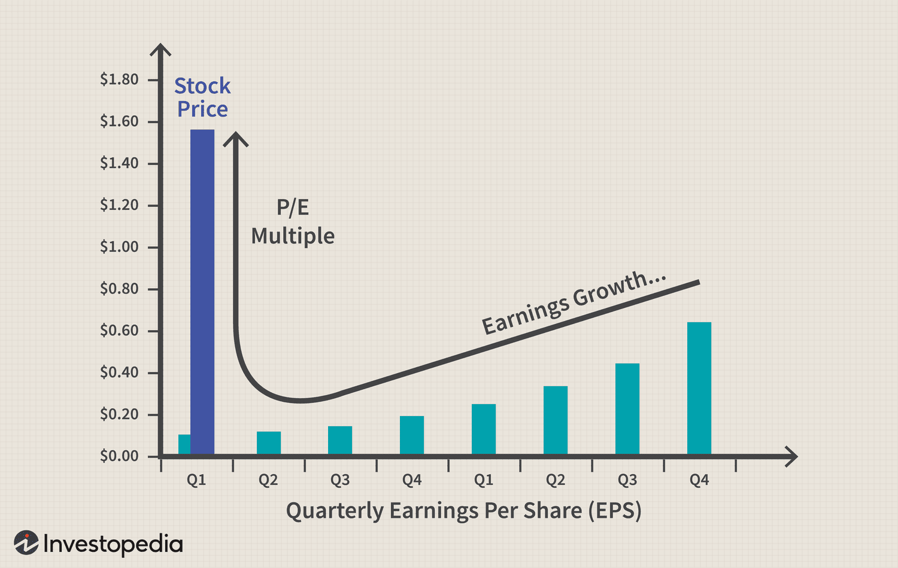

## Table of Contents

## What is market share and how is it calculated?

Market share is a way to measure how much of a market a company or product controls. It shows the size of a company compared to its competitors. Market share is usually shown as a percentage. For example, if a company has a 20% market share, it means that 20 out of every 100 sales in that market are from that company.

To calculate market share, you need to know the total sales of the company and the total sales of the entire market. You divide the company's sales by the total market sales and then multiply by 100 to get a percentage. For example, if a company made $1 million in sales and the total market sales were $5 million, the company's market share would be ($1 million / $5 million) * 100 = 20%. This simple calculation helps businesses understand their position in the market and see how they are doing compared to others.

## How does market share influence a company's revenue?

Market share directly affects a company's revenue because it shows how much of the total market's sales the company is capturing. If a company has a large market share, it means more people are buying its products or services compared to its competitors. This usually leads to higher revenue because the company is getting a bigger piece of the market's total sales. For example, if the market's total sales are $100 million and a company has a 30% market share, it will earn $30 million in revenue from that market.

However, market share is not the only [factor](/wiki/factor-investing) that influences revenue. A company can have a small market share but still earn a lot of revenue if the market itself is very large or if the company charges high prices for its products. On the other hand, a company with a large market share in a small market might not earn as much revenue as a company with a smaller share in a bigger market. Therefore, while market share is important for understanding a company's position and potential revenue, other factors like market size and pricing strategies also play a big role in determining how much money a company makes.

## Can market share affect a company's stock price?

Market share can affect a company's stock price because it shows how well the company is doing compared to others in the same market. If a company's market share is growing, it usually means more people are buying its products or services. This can make investors think the company is doing well and likely to make more money in the future. When investors think a company is doing well, they are more likely to buy its stock, which can push the stock price up.

However, market share is not the only thing that affects stock prices. Other things like how much profit the company is making, what's happening in the economy, and what investors expect to happen in the future also play a big role. If a company has a big market share but is not making much profit, or if the market it's in is shrinking, the stock price might not go up even if the market share is high. So, while market share is important, it's just one of many factors investors look at when deciding whether to buy or sell a company's stock.

## What are the key indicators that market share impacts stock performance?

When a company's market share grows, it often means more people are choosing its products or services over competitors. This can make investors think the company is doing well and will make more money in the future. When investors feel this way, they might buy more of the company's stock, which can make the stock price go up. For example, if a company's market share jumps from 10% to 15%, investors might see this as a sign of strong growth and be more willing to invest in the company.

However, market share is just one piece of the puzzle. Other things can affect stock prices too, like how much profit the company is making, what's happening in the economy, and what investors expect to happen in the future. If a company has a big market share but isn't making much profit, or if the market it's in is shrinking, the stock price might not go up even if the market share is high. So, while market share can impact stock performance, it's important to look at the bigger picture to understand what's really happening with a company's stock.

## How do investors typically analyze market share data in relation to stock performance?

Investors often look at market share data to see how well a company is doing compared to its competitors. If a company's market share is going up, it means more people are choosing its products or services. This can make investors think the company will make more money in the future. When investors believe this, they might buy more of the company's stock, which can make the stock price go up. For example, if a company's market share grows from 10% to 15%, investors might see this as a good sign and be more likely to invest in the company.

However, market share is not the only thing investors look at. They also consider other things like how much profit the company is making, what's happening in the economy, and what they expect to happen in the future. If a company has a big market share but isn't making much profit, or if the market it's in is getting smaller, the stock price might not go up even if the market share is high. So, while market share can give investors some clues about how a company is doing, they need to look at the bigger picture to really understand what's happening with the stock.

## What role does market share growth play in stock valuation?

Market share growth can make a big difference in how much investors think a company is worth. If a company's market share is getting bigger, it means more people are buying its products or services. This can make investors think the company will make more money in the future. When investors think a company will make more money, they might be willing to pay more for its stock. This can push the stock price up and make the company's total value higher.

However, market share growth is not the only thing investors look at when deciding how much a company is worth. They also think about how much profit the company is making, what's happening in the economy, and what they expect to happen in the future. If a company has a big market share but isn't making much profit, or if the market it's in is getting smaller, the stock price might not go up even if the market share is growing. So, while market share growth can be a good sign, investors need to look at the whole picture to really understand a company's value.

## How does losing market share impact a company's stock performance?

Losing market share means fewer people are buying a company's products or services compared to its competitors. When this happens, investors might worry that the company will make less money in the future. If investors think a company will make less money, they might sell its stock. This can make the stock price go down. For example, if a company's market share drops from 20% to 15%, investors might see this as a bad sign and be less willing to invest in the company.

However, losing market share is not the only thing that affects stock prices. Other things like how much profit the company is making, what's happening in the economy, and what investors expect to happen in the future also play a big role. If a company is losing market share but still making a lot of profit, or if the market it's in is growing, the stock price might not go down as much as expected. So, while losing market share can impact a company's stock performance, it's important to look at the bigger picture to understand what's really happening with the stock.

## Can a high market share guarantee good stock performance?

A high market share does not guarantee good stock performance. It means a company has a big part of the market, but that's not the only thing investors look at. If a company has a high market share but isn't making much profit, or if the market it's in is getting smaller, the stock price might not go up. Investors care about many things, like how much money the company is making, what's happening in the economy, and what they think will happen in the future.

So, while a high market share can be a good sign, it's just one piece of the puzzle. Investors need to look at everything to decide if a company's stock is a good investment. If a company with a high market share is doing well in other areas too, then its stock might do well. But if other things are not going well, the stock might not perform as well as expected, even with a high market share.

## How do competitive dynamics influence the relationship between market share and stock performance?

Competitive dynamics play a big role in how market share affects a company's stock performance. If a company is doing well and gaining market share, it might mean they are beating their competitors. This can make investors think the company will keep doing well and make more money in the future. When investors think this, they might buy more of the company's stock, which can make the stock price go up. But if the competition is tough and other companies are also doing well, it might be harder for one company to keep growing its market share. This can make investors less sure about the company's future, which might make them less likely to buy its stock.

On the other hand, if a company is losing market share because of strong competition, investors might worry that the company will make less money. This can make them sell the company's stock, which can make the stock price go down. But it's not just about market share. If a company is losing market share but still making a lot of profit, or if the market it's in is growing, the stock price might not go down as much. So, while competitive dynamics can influence how market share affects stock performance, investors need to look at the whole picture to understand what's really happening with the stock.

## What are some case studies of companies where market share significantly affected stock performance?

One example is Apple Inc. In the early 2000s, Apple started gaining a lot of market share in the smartphone market with the iPhone. As more and more people bought iPhones, Apple's market share grew, and investors saw this as a good sign. They thought Apple would keep making more money in the future, so they bought more Apple stock. This made Apple's stock price go up a lot. But it's not just about market share. Apple also made a lot of profit and kept coming up with new products, which helped its stock do well.

Another example is Nokia. In the early 2000s, Nokia had a big market share in the mobile phone market. But when smartphones became popular, Nokia lost a lot of its market share to companies like Apple and Samsung. Investors started to worry that Nokia wouldn't make as much money in the future, so they sold Nokia's stock. This made Nokia's stock price go down a lot. Nokia's case shows that losing market share can hurt a company's stock performance, but it's also important to look at other things like what's happening in the market and how much profit the company is making.

## How do sector-specific factors modify the impact of market share on stock performance?

In some sectors, like technology, market share can have a big impact on stock performance. If a tech company like Apple or Google gains more market share, it can mean they are doing better than their competitors. Investors might think these companies will keep making more money, so they buy more stock, which can make the stock price go up. But in the tech world, things change fast. If a company loses market share because new technology comes out, investors might worry and sell the stock, which can make the stock price go down.

In other sectors, like utilities or food, market share might not affect stock performance as much. These sectors are often more stable, and companies might have steady market share without big changes. Investors might care more about how much profit these companies make or how well they run their business. So, even if a utility company loses a little market share, its stock price might not change much if it's still making good profits. This shows that the impact of market share on stock performance can be different depending on the sector.

## What advanced metrics should experts use to predict stock performance based on market share changes?

When experts want to predict how changes in market share will affect a company's stock performance, they often look at more than just the market share numbers. One important metric they use is the "market share growth rate," which shows how fast a company's market share is growing or shrinking. If a company's market share is growing quickly, it might mean the company is doing better than its competitors and could make more money in the future. This can make investors think the stock is a good buy, which can push the stock price up. But experts also look at the "profitability per market share," which shows how much profit a company makes for each percentage point of market share it has. If a company has a high market share but isn't making much profit, the stock might not do as well, even if the market share is growing.

Another metric experts use is the "relative market share," which compares a company's market share to the market share of its biggest competitor. If a company has a much bigger market share than its closest competitor, it might mean the company is in a strong position and could keep growing. This can make investors feel good about the company's future and want to buy its stock. But experts also consider the "market size and growth" of the industry. If a company is gaining market share in a market that's getting smaller, the stock might not do as well as if the market were growing. So, by looking at these advanced metrics, experts can get a better idea of how market share changes might affect a company's stock performance.

## What is Company Valuation: An Essential Metric?

Company valuation is a critical process that determines a firm's worth, providing essential insights that guide investment decisions. Valuation influences how investors perceive a company and has the potential to affect stock prices directly. By estimating future cash flows or comparing with similar entities, valuation serves as an indispensable tool in the financial ecosystem.

### Methods of Company Valuation

**Discounted Cash Flow (DCF):** This method involves estimating the present value of a company's expected future cash flows. The formula used in computing DCF is:

$$
DCF = \sum \frac{CF_t}{(1 + r)^t}
$$

where $CF_t$ represents the cash flow in year $t$, and $r$ is the discount rate. DCF is highly regarded for its intrinsic approach, focusing on fundamental factors rather than market conditions.

**Comparable Companies Analysis:** This valuation approach assesses a company by comparing its financial metrics, such as price-to-earnings ratios, with peer companies in the same industry. Investors find this method useful for gauging how the market values a company relative to its competitors.

**Precedent Transactions:** This approach involves analyzing the prices paid for similar companies in past transactions. It provides a benchmark that reflects the acquisition environment and industry trends, often used in mergers and acquisitions.

**Asset-Based Valuation:** This method evaluates a company's net asset value, subtracting liabilities from total assets. While straightforward, it may not reflect a company's true market value if intangible assets and growth prospects are significant.

Each valuation method offers unique insights, serving different purposes depending on the context and industry dynamics. Selecting an appropriate valuation technique requires understanding the business model, market conditions, and economic environment.

### Influence on Stock Prices

Valuation not only informs investors but also plays a role in stock price determination. A company deemed undervalued may attract investor funds, leading to price corrections. Conversely, overvaluation can result in inflated stock prices, potentially leading to market corrections when reality aligns with intrinsic value assessments.

In sum, company valuation is a cornerstone of financial analysis, articulating a firm's economic potential. It empowers stakeholders to make informed choices by aligning perceived value with financial realities. Through robust methodologies like DCF and comparables, valuation remains crucial in steering investment strategies and understanding market dynamics.

## References & Further Reading

[1]: Bergstra, J., Bardenet, R., Bengio, Y., & Kégl, B. (2011). ["Algorithms for Hyper-Parameter Optimization."](https://dl.acm.org/doi/10.5555/2986459.2986743) Advances in Neural Information Processing Systems 24.

[2]: ["Advances in Financial Machine Learning"](https://www.amazon.com/Advances-Financial-Machine-Learning-Marcos/dp/1119482089) by Marcos Lopez de Prado

[3]: ["Evidence-Based Technical Analysis: Applying the Scientific Method and Statistical Inference to Trading Signals"](https://www.amazon.com/Evidence-Based-Technical-Analysis-Scientific-Statistical/dp/0470008741) by David Aronson

[4]: ["Machine Learning for Algorithmic Trading"](https://github.com/stefan-jansen/machine-learning-for-trading) by Stefan Jansen

[5]: ["Quantitative Trading: How to Build Your Own Algorithmic Trading Business"](https://www.amazon.com/Quantitative-Trading-Build-Algorithmic-Business/dp/1119800064) by Ernest P. Chan