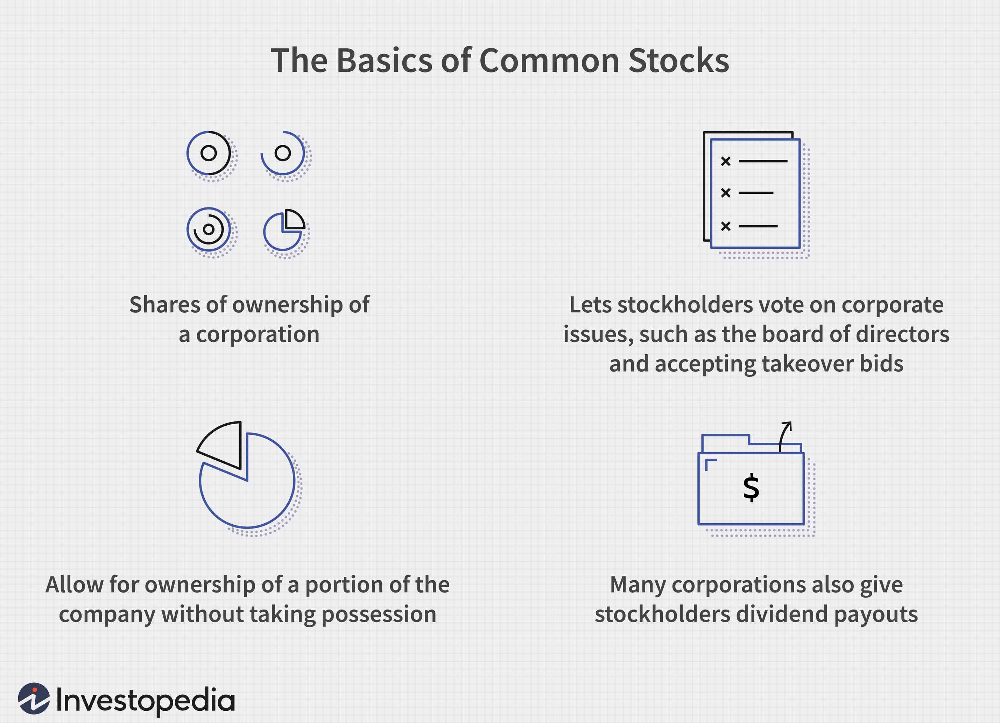

The stock market is a cornerstone of modern economic systems, serving as a pivotal indicator of the health and direction of an economy. Its performance is intricately tied to various macroeconomic trends ranging from interest rates and inflation to geopolitical events and consumer confidence. Understanding the stock market requires an examination of several key factors, including market share, stock performance, and company valuation.

Market share, defined as the fraction of an industry's total sales that is owned by a particular company, is crucial in determining a company's competitive position. Variations in market share can influence investor perceptions and, consequently, stock performance. In cyclical industries, where company performance is closely linked to the economic cycle, shifts in market share can lead to significant fluctuations in stock prices. Conversely, in sectors experiencing robust growth, a company might maintain a positive stock performance even if its market share reduces, as the overall market itself is expanding at a rapid pace.

Stock performance, in turn, is a reflection of how investors perceive a company's future potential. It impacts the company's ability to raise capital, reward shareholders, and reinvest in growth initiatives. The valuation of a company, an estimation of its worth, plays an integral role in shaping these perceptions. Analysts employ various methods to determine company valuation, such as discounted cash flow (DCF) analysis, which estimates future cash flows and discounts them to their present value, or comparables, which measure a company's valuation against similar entities in the industry.

Technological advancements have also profoundly affected the stock market, especially through the introduction of algorithmic trading. This form of trading uses computer algorithms to execute trades based on predefined criteria, significantly enhancing the speed and efficiency of trades. Algorithmic trading has transformed how market data is analyzed, harnessing vast amounts of information to drive every decision in a fraction of a second. Furthermore, the integration of artificial intelligence (AI) and machine learning (ML) technologies has paved the way for more sophisticated predictive analytics, offering traders a competitive edge in forecasting stock trends.

This article will examine the links and interactions between market share, stock performance, company valuation, and the evolving practice of algorithmic trading, providing insights into their collective impact on the present and future of the stock market.

## Table of Contents

## Understanding Market Share and Stock Performance

Market share is a critical metric reflecting the percentage of total sales within an industry that a company captures. It is a vital indicator of a company's competitive position and its influence on stock performance. The dynamics of market share changes can significantly affect stock prices, especially in cyclical industries where demand and profitability fluctuate with economic conditions. 

For instance, in a cyclical industry like automotive or construction, a company's increased market share can lead to enhanced investor confidence, boosting its stock performance. Conversely, a decline in market share might lead to negative stock performance as investors anticipate reduced sales and profits. This correlation between market share and stock prices is often due to the perception that market share gains can translate into increased revenue and market dominance, which are attractive to investors.

However, the impact of market share on stock performance is not uniform across all industries. In rapidly expanding industries, such as technology or renewable energy, a company may experience significant growth in sales even if its market share declines. This scenario can occur because the overall market is growing at a faster rate, allowing companies to increase sales volumes despite reduced market share percentages. Consequently, stock performance can remain positive due to the absolute growth in sales and potential for profitability improvements, overshadowing market share losses.

The interaction between market share and stock performance underscores the importance of evaluating both metrics in the context of industry characteristics. Analysts and investors must consider the cyclical nature of the industry, overall market growth, and the company's strategic initiatives to properly assess the implications of market share changes.

## Company Valuation: An Essential Metric

Company valuation is a critical process that determines a firm's worth, providing essential insights that guide investment decisions. Valuation influences how investors perceive a company and has the potential to affect stock prices directly. By estimating future cash flows or comparing with similar entities, valuation serves as an indispensable tool in the financial ecosystem.

### Methods of Company Valuation

**Discounted Cash Flow (DCF):** This method involves estimating the present value of a company's expected future cash flows. The formula used in computing DCF is:

$$
DCF = \sum \frac{CF_t}{(1 + r)^t}
$$

where $CF_t$ represents the cash flow in year $t$, and $r$ is the discount rate. DCF is highly regarded for its intrinsic approach, focusing on fundamental factors rather than market conditions.

**Comparable Companies Analysis:** This valuation approach assesses a company by comparing its financial metrics, such as price-to-earnings ratios, with peer companies in the same industry. Investors find this method useful for gauging how the market values a company relative to its competitors.

**Precedent Transactions:** This approach involves analyzing the prices paid for similar companies in past transactions. It provides a benchmark that reflects the acquisition environment and industry trends, often used in mergers and acquisitions.

**Asset-Based Valuation:** This method evaluates a company's net asset value, subtracting liabilities from total assets. While straightforward, it may not reflect a company's true market value if intangible assets and growth prospects are significant.

Each valuation method offers unique insights, serving different purposes depending on the context and industry dynamics. Selecting an appropriate valuation technique requires understanding the business model, market conditions, and economic environment.

### Influence on Stock Prices

Valuation not only informs investors but also plays a role in stock price determination. A company deemed undervalued may attract investor funds, leading to price corrections. Conversely, overvaluation can result in inflated stock prices, potentially leading to market corrections when reality aligns with intrinsic value assessments.

In sum, company valuation is a cornerstone of financial analysis, articulating a firm's economic potential. It empowers stakeholders to make informed choices by aligning perceived value with financial realities. Through robust methodologies like DCF and comparables, valuation remains crucial in steering investment strategies and understanding market dynamics.

## The Role of Algorithmic Trading

Algorithmic trading involves using sophisticated computer algorithms to automate the entire trade execution process. These algorithms are designed to facilitate decisions based on a wide array of inputs and conditions, allowing trades to be executed with remarkable speed and efficiency. The advent of high-frequency trading ([HFT](/wiki/high-frequency-trading-strategies)), a subset of [algorithmic trading](/wiki/algorithmic-trading), has further highlighted the capability of these systems to execute thousands of trades in mere fractions of a second, leveraging the minute differences in price across various platforms to generate profits.

A primary characteristic of algorithmic trading is its capacity to process vast quantities of data rapidly. This ability is pivotal, as financial markets generate complex and large datasets continuously. These datasets encompass historical price information, financial statements, news sentiment, and real-time trading patterns. By analyzing these datasets, algorithms can identify market trends and potential trading opportunities with pinpoint accuracy.

Moreover, the integration of [artificial intelligence](/wiki/ai-artificial-intelligence) (AI) and [machine learning](/wiki/machine-learning) (ML) into algorithmic trading systems has revolutionized predictive analytics for stock performance. With AI, systems can learn from historical data and adapt to changing market conditions, improving their decision-making processes over time. Machine learning models, in particular, excel at recognizing patterns within large datasets and can be trained to predict future stock price movements based on historical trends.

For instance, an algorithm might utilize a machine learning model like a recurrent [neural network](/wiki/neural-network) (RNN) to analyze time-series data, forecast future price movements, and automate buy/sell decisions. These models can be optimized by continuously updating inputs with new data, making them highly responsive to dynamic market conditions.

Algorithmic trading's capability to execute large volumes of trades swiftly not only enhances transaction speed but also substantially improves market [liquidity](/wiki/liquidity-risk-premium). A more liquid market generally benefits participants by enabling smoother price adjustments and reducing the cost of trading.

Python, a favored language among developers, is often used for implementing algorithmic trading strategies due to its readability and extensive library support. Libraries such as NumPy and pandas allow for efficient data manipulation and analysis, while scikit-learn provides machine learning functionalities for developing predictive models.

In summary, the role of algorithmic trading is distinguished by its transformative impact on trade execution and market efficiency, primarily through the automated analysis and processing of extensive datasets. This role continues to expand with ongoing advancements in AI and machine learning, promising further enhancements in predictive accuracies and trading efficiencies.

## Impact of Algorithmic Trading on Market Dynamics

Algorithmic trading, often referred to as algo trading, significantly impacts market dynamics by affecting liquidity, trade execution efficiency, and consequently, market share distribution among traders. Algo trading utilizes sophisticated computer algorithms to execute orders at speeds and frequencies that are impossible for human traders. This approach to trading not only optimizes the execution of trades but also has broader implications for market stability and regulatory practices.

Algo trading enhances market liquidity by increasing the number of orders in the market, thus reducing the bid-ask spread—the difference between the selling price and the buying price. By efficiently matching buy and sell orders, it helps maintain a continuous market flow. However, the introduction of algorithms into trading platforms has also led to the phenomenon of "flash crashes." These are extremely rapid and severe price declines that occur within minutes, often triggered by the sudden withdrawal of liquidity or rapid execution orders by high-frequency trading algorithms. An example of a flash crash occurred on May 6, 2010, when the U.S. stock market saw a $1 trillion loss in just about 36 minutes before rebounding.

With algorithms performing trades in milliseconds, trading costs are significantly reduced. Lower transaction costs result in increased execution efficiency, as orders are processed swiftly without causing significant price deviations. Algorithmic trading also influences market share distribution among traders by enabling small-scale traders to compete with larger institutional players, at least in terms of speed and efficiency.

Regulatory bodies have become increasingly focused on algorithmic trading due to its potential to disrupt market stability. This focus includes the ongoing development of frameworks and directives to monitor and manage the risks posed by high-speed trading. The U.S. Securities and Exchange Commission (SEC) and the Commodity Futures Trading Commission (CFTC) have implemented measures to identify and mitigate the risks associated with algorithmic trading, such as circuit breakers and order cancellation rules to prevent extreme [volatility](/wiki/volatility-trading-strategies).

In conclusion, while algorithmic trading brings various benefits, such as enhanced liquidity and reduced trading costs, it also poses challenges that require continuous regulatory attention to ensure the stability and integrity of financial markets.

## Strategies and Innovations in Algorithmic Trading

High-frequency trading (HFT) is a prominent example of algorithmic trading that targets minimal price discrepancies by executing a large number of trades at extremely high speeds. The strategy hinges on advanced algorithms and powerful computing power to detect fleeting profit opportunities in the market. HFT firms typically operate with a very low latency, often measured in microseconds, to capitalize before competitors.

The increasing adoption of algorithmic trading by retail investors signifies a democratization of access to complex trading models that were traditionally reserved for institutional investors. Platforms and tools have emerged to equip retail traders with algorithmic capabilities, allowing them to implement sophisticated strategies without requiring extensive programming knowledge or infrastructure. This shift is pivotal as it provides individual traders with more power and flexibility in executing trades and managing investments.

Generative artificial intelligence (AI) integration introduces further innovation in algorithmic trading by offering dynamic adjustments to market strategies. Generative AI models, such as Generative Adversarial Networks (GANs) and Transformers, can analyze vast datasets to generate new trading models and refine existing ones on the fly. They are capable of learning from market behavior and adapting to changing conditions, potentially improving prediction accuracy and decision-making in real-time. 

The utility of generative AI in algorithmic trading can be exemplified by its application in predictive analytics. For instance, a supervised generative AI model trained on historical market data might anticipate market fluctuations by recognizing patterns that a traditional trading algorithm could overlook. This adaptability is crucial for responding to volatile market conditions and optimizing trading strategies continuously.

Overall, the innovations in algorithmic trading, from high-frequency trading to the integration of generative AI, highlight a significant evolution in how trading is conceptualized and executed, leading to potential shifts in market dynamics.

## Regulatory and Risk Management Considerations

Regulation plays a pivotal role in managing the complexities and potential risks associated with algorithmic trading. The increasing reliance on sophisticated algorithms to execute trades necessitates the establishment of robust regulatory frameworks to ensure market stability and integrity. Regulatory bodies such as the Securities and Exchange Commission (SEC) and the European Securities and Markets Authority (ESMA) are at the forefront of these efforts, implementing rules and guidelines that govern the use of automated trading systems.

A critical component of this regulatory oversight is appropriate risk valuation capabilities. These capabilities entail accurate assessment and management of risks that could lead to unintended market consequences, such as excessive volatility or systemic failures. For instance, risk management algorithms are often employed to evaluate trading strategies before their deployment, ensuring they operate within defined risk parameters. 

The accurate valuation of risks often involves the utilization of mathematical and statistical models. These models may include value-at-risk (VaR), which quantifies the risk of loss on a specific portfolio of financial assets, or stress testing, which examines the resilience of trading strategies under extreme market conditions. By adopting these methods, traders and institutions can anticipate potential challenges and mitigate them proactively.

Ongoing regulatory initiatives aim to streamline the implementation of algorithmic trading practices while ensuring market integrity. These initiatives include the development of standardized testing and certification procedures for trading algorithms, mandatory registration and monitoring of high-frequency traders, and enforcing circuit breakers to prevent market disruptions such as flash crashes.

Furthermore, advancements in technology and artificial intelligence are being incorporated into regulatory frameworks. For instance, machine learning algorithms can be employed to monitor market activities in real time, alerting regulators to potentially illicit trading behaviors. The integration of these technologies supports regulators in maintaining a fair and transparent trading environment.

In conclusion, the interplay between regulation and algorithmic trading is essential for sustaining market confidence and preventing disruptions. While regulations evolve to accommodate new technological advancements, the fundamental goal remains to balance innovation with market stability, ensuring that algorithmic trading practices contribute positively to the financial ecosystem.

## Conclusion

Market share, stock performance, and company valuation form a critical triad in the financial markets, with algorithmic trading playing a pivotal role in influencing these elements. Market share represents a company's sales dominance in its industry and directly impacts stock performance. An increase in market share typically signals strong competitive positioning, potentially elevating stock prices as investor confidence rises.

Stock performance, reflecting the company's financial health and future prospects, is also heavily influenced by company valuation. Accurate company valuation, whether through discounted cash flows or comparables, provides crucial insights for investors making buy or sell decisions. 

Algorithmic trading, utilizing complex mathematical models and high-speed computations, profoundly impacts these interconnected areas. By executing large trades with efficiency and precision, algorithmic trading can affect stock volatility and liquidity, reshaping how market share and valuations are perceived. The rise of algorithmic trading means trades are often executed based on pre-programmed criteria, allowing for rapid market response to performance indicators and valuation shifts.

The interplay between market share, stock performance, and company valuation requires careful analysis, as algorithmic trading becomes increasingly sophisticated. For instance, the integration of artificial intelligence and machine learning enhances the predictive capabilities of trading algorithms, offering more nuanced insights into market trends and company performance.

Looking forward, we anticipate significant growth driven by ongoing innovations in algorithmic trading and enhanced computational capabilities. These advancements could bring about new trading strategies and improved market efficiencies, making the need for strategic and informed decision-making vital for investors and companies alike. Understanding these complex relationships will be essential for navigating the evolving financial landscape and capitalizing on emerging opportunities in trading and investment.

## References

1. Investopedia: Market Share and its Influence on Stock Performance. This source provides insightful information on how changes in market share can affect a company's stock performance, highlighting the importance of market share in cyclical and growing industries.

2. Fortune Business Insights: Algorithmic Trading Market Analysis. This analysis explores the role and significance of algorithmic trading in today's stock market, emphasizing how technologies like AI and machine learning enhance trading efficiencies and predictive analytics.

3. Grand View Research: Trends in Algorithmic Trading and Market Growth. This research offers comprehensive data and trends in the algorithmic trading sector, addressing its increasing impact on market transactions and its influence on market liquidity and trading costs.

## References & Further Reading

[1]: Bergstra, J., Bardenet, R., Bengio, Y., & Kégl, B. (2011). ["Algorithms for Hyper-Parameter Optimization."](https://dl.acm.org/doi/10.5555/2986459.2986743) Advances in Neural Information Processing Systems 24.

[2]: ["Advances in Financial Machine Learning"](https://www.amazon.com/Advances-Financial-Machine-Learning-Marcos/dp/1119482089) by Marcos Lopez de Prado

[3]: ["Evidence-Based Technical Analysis: Applying the Scientific Method and Statistical Inference to Trading Signals"](https://www.amazon.com/Evidence-Based-Technical-Analysis-Scientific-Statistical/dp/0470008741) by David Aronson

[4]: ["Machine Learning for Algorithmic Trading"](https://github.com/stefan-jansen/machine-learning-for-trading) by Stefan Jansen

[5]: ["Quantitative Trading: How to Build Your Own Algorithmic Trading Business"](https://www.amazon.com/Quantitative-Trading-Build-Algorithmic-Business/dp/1119800064) by Ernest P. Chan