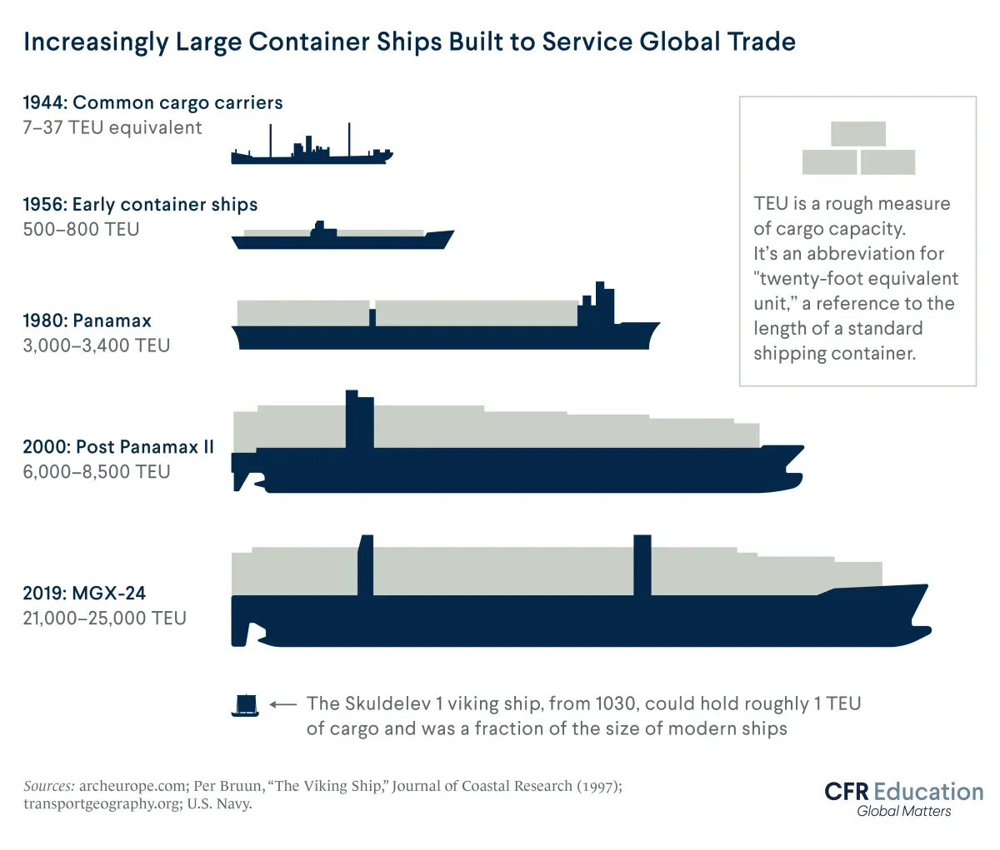

## Table of Contents

## What is mass production?

Mass production is a way of making a lot of the same thing quickly and cheaply. It started in the early 1900s, and it changed how things were made. Instead of one person making a whole product from start to finish, many people work on different parts of the product at the same time. This is often done on an assembly line, where the product moves along a line and each worker adds or changes something.

This method makes things faster and cheaper because it uses machines and a lot of workers. It's good for making things like cars, clothes, and electronics. But it can also mean that the workers do the same thing over and over, which can be boring. Also, if something goes wrong with one part, it can stop the whole line. Despite these problems, mass production is still used a lot because it helps make things that many people can afford.

## How does mass production affect the cost of producing consumer goods?

Mass production helps lower the cost of making things that people use every day. When companies make a lot of the same item at the same time, they can use machines and big factories. This means they don't need as many people to make each item, and machines can work faster than people. Also, when they buy materials in big amounts, they can get them cheaper. All of these things make the cost of making each item go down.

Even though it costs less to make each item, there are some extra costs. For example, setting up the machines and the factory can be expensive at first. Also, if something goes wrong, it can stop the whole line and cost more money to fix. But usually, the savings from making a lot of items at once are bigger than these extra costs. So, in the end, mass production makes things cheaper for people to buy.

## Can you explain the concept of economies of scale in relation to mass production?

Economies of scale is a big idea that goes hand-in-hand with mass production. It means that the more of something you make, the less it costs to make each one. When a company makes a lot of the same thing, they can buy materials in bigger amounts, which makes them cheaper. They can also use big machines that work faster than people, and they don't need as many workers for each item. All of this adds up to lower costs for making each product.

This is really important for mass production because it helps companies make things that a lot of people can afford. When the cost of making each item goes down, the company can sell the items for less money, and more people will buy them. So, economies of scale make mass production work better by making things cheaper to produce and easier for people to buy.

## What are the historical trends in consumer goods prices due to mass production?

Historically, mass production has led to a big drop in the prices of consumer goods. When companies started using mass production in the early 1900s, they could make a lot of the same thing quickly and cheaply. This meant that things like cars, clothes, and appliances became a lot less expensive. For example, the price of a car went down a lot after Henry Ford started using an assembly line to make them. This made cars something that more people could afford, not just rich people.

Over time, as mass production got even better with new technology and bigger factories, the prices of consumer goods kept going down. Electronics like TVs and computers, which used to be very expensive, became much cheaper. This happened because companies could make a lot more of these items and the cost of making each one went down. So, more and more people could buy things that used to be out of reach. This trend of falling prices due to mass production has helped make life easier and more comfortable for a lot of people.

## How has mass production influenced the pricing strategies of companies?

Mass production has changed how companies set their prices. When companies can make a lot of the same thing quickly and cheaply, they can sell those things for less money. This means they can make more money by selling more items at a lower price, instead of selling fewer items at a higher price. It's like when a store has a sale and more people come to buy things because they are cheaper. Companies use this idea to make their products affordable to more people, which helps them sell more and make more money overall.

Because of mass production, companies also have to think about what other companies are doing. If one company can make something cheaper than another, they might lower their prices to get more customers. This can start a price war, where companies keep lowering their prices to try to sell more than their competitors. This is good for people buying things because it makes prices go down, but it can be hard for companies because they have to keep finding ways to make things even cheaper.

## What role does automation play in mass production and how does it impact prices?

Automation is a big part of mass production. It means using machines and computers to do work that people used to do. When companies use automation, they can make things faster and with fewer mistakes. Machines don't get tired or need breaks like people do, so they can keep working all the time. This helps companies make a lot more of the same thing in a shorter time. Automation also means that companies don't need as many workers, which can save them a lot of money.

Because of automation, the cost of making things goes down. When it costs less to make each item, companies can sell them for less money. This makes things like cars, phones, and clothes cheaper for people to buy. But setting up the machines and keeping them running can be expensive at first. Still, over time, the savings from using automation usually make up for these costs. So, automation helps keep prices low and makes things more affordable for everyone.

## How do global supply chains and mass production interact to affect consumer goods prices?

Global supply chains and mass production work together to make things cheaper for people to buy. A global supply chain means that different parts of a product can come from all over the world. For example, the parts for a phone might come from different countries, and then they are put together in one place. When companies use global supply chains, they can find the cheapest places to get materials and make things. This helps lower the cost of making each item because they can buy things for less money.

Mass production makes this even better. When companies make a lot of the same thing at the same time, they can use big machines and factories to do it quickly and cheaply. Using global supply chains means they can get the materials they need at a lower cost, and then mass production helps them turn those materials into finished products even cheaper. So, when you put global supply chains and mass production together, it makes the price of consumer goods go down a lot. This means people can buy things like clothes, electronics, and cars for less money.

## What are the differences in price impacts between durable and non-durable consumer goods due to mass production?

Mass production affects the prices of durable and non-durable consumer goods in different ways. Durable goods are things that last a long time, like cars, appliances, and furniture. When companies use mass production to make these items, they can make a lot of them quickly and cheaply. This means the cost of making each item goes down, so companies can sell them for less money. Over time, as mass production gets better and more efficient, the prices of durable goods keep going down. This makes things like washing machines and cars more affordable for more people.

Non-durable goods are things that don't last as long, like food, clothes, and cleaning supplies. Mass production also helps lower the prices of these items, but in a different way. Because non-durable goods are used up or wear out faster, companies need to make a lot more of them to keep up with demand. Mass production lets them do this quickly and cheaply, which means they can sell these items for less money. So, things like clothes and food become cheaper, and people can buy them more often without spending too much money.

## How does mass production affect competition and market dynamics, influencing consumer goods prices?

Mass production changes how companies compete with each other and how the market works. When companies can make a lot of the same thing quickly and cheaply, they can sell those things for less money. This makes them want to lower their prices to get more customers. If one company lowers its prices, other companies might do the same to keep up. This can start a price war, where companies keep lowering their prices to try to sell more than their competitors. This is good for people buying things because it makes prices go down, but it can be hard for companies because they have to keep finding ways to make things even cheaper.

Because of mass production, there are also more companies making the same kinds of things. This means more choices for people buying things, and more competition between companies. When there are a lot of companies making similar products, they all have to work hard to make their products better or cheaper. This competition helps keep prices low because companies want to attract more customers. So, mass production not only makes things cheaper to make, but it also makes companies compete more, which helps keep consumer goods prices down.

## What are the long-term economic impacts of mass production on consumer goods pricing?

Mass production has made a big difference in how much things cost over a long time. When companies started making a lot of the same thing at once, they could use big machines and factories to do it quickly and cheaply. This meant that the cost of making each item went down a lot. Over many years, as mass production got better and more efficient, the prices of things like cars, clothes, and electronics kept going down. This made life easier for a lot of people because they could afford things that used to be too expensive.

The long-term effect of mass production also changed how companies compete with each other. Because they could make things cheaper, companies started lowering their prices to get more customers. This competition helped keep prices low because companies always had to find ways to make things even cheaper. So, not only did mass production make things cheaper to make, but it also made companies work harder to keep prices down. This has helped people buy more things and live better lives over time.

## How do government policies and regulations influence the relationship between mass production and consumer goods prices?

Government policies and regulations can change how mass production affects the prices of things people buy. Sometimes, the government makes rules to keep workers safe or to protect the environment. These rules can make it more expensive for companies to make things because they have to spend more money on safety equipment or cleaner ways to make things. This might make the price of the things they make go up a little bit. But if the rules are the same for all companies, it can also make the competition fair, which can help keep prices from going up too much.

On the other hand, the government can also help make things cheaper. They can give money or special deals to companies that make a lot of things, which can lower the cost of making each item. They can also make trade easier with other countries, so companies can get materials cheaper from around the world. This can help keep the prices of things like clothes and electronics low. So, government policies can make a big difference in how much things cost, depending on what the rules are and how they affect companies that use mass production.

## What future trends in mass production technology might further impact consumer goods prices?

In the future, new technology in mass production could make things even cheaper for people to buy. One big trend is the use of robots and smart machines that can do more work without people. These robots can work all the time without getting tired, and they can make things faster and with fewer mistakes. This means companies can make more of the same thing at a lower cost. Also, new kinds of 3D printing could let companies make things in new ways, making it easier and cheaper to make small batches of things that people want.

Another trend is the use of computers and data to make mass production better. Companies can use computers to keep track of what people are buying and make just the right amount of things. This can help them save money because they don't make too much of things that no one wants. Also, computers can help find the cheapest places to get materials from around the world. All of these new technologies could make things like clothes, electronics, and cars even cheaper in the future, helping people save money and buy more things they need.

## What are the differences and similarities between Mass Production and Algorithmic Trading according to a comparative analysis?

Mass production and [algorithmic trading](/wiki/algorithmic-trading) are two distinct yet influential factors affecting the pricing of consumer goods. Each operates with different objectives and mechanisms, yet both significantly impact market dynamics.

Mass production is characterized by the large-scale manufacturing of goods, aiming to achieve cost-effectiveness by producing high volumes. This approach leverages economies of scale, reducing the cost per unit as production increases. The principle of economies of scale can be mathematically represented by decreasing average costs (AC) as output (Q) increases, usually depicted as:

$$
\text{AC} = \frac{\text{Total Cost}}{\text{Quantity}} = \frac{\text{Fixed Cost} + \text{Variable Cost} \times Q}{Q}
$$

As output expands, average fixed costs diminish, leading to lower overall costs per unit, which can be passed on to consumers as lower prices. Mass production not only reduces manufacturing costs but also enhances product availability, fueling market competition and potentially driving down prices further.

On the other hand, algorithmic trading is primarily concerned with market prediction and financial profits. It utilizes complex algorithms to execute financial trades based on preset criteria, enabling rapid transactions and market responsiveness. Algorithmic trading affects consumer goods indirectly through commodity price fluctuations. For example, if an algorithm detects a trend that may increase the price of raw materials essential for consumer goods, such as oil or metals, it may trigger buying actions that drive prices higher. As a result, manufacturers might face increased production costs, often passed down to consumer prices.

While mass production operates with a direct focus on producing physical goods at scale, algorithmic trading influences the financial markets where commodities — crucial for these goods — are traded. The interplay between these two forces becomes evident in situations where mass production efficiency is impacted by the volatile pricing triggered by algorithmic trading activities. For instance, manufacturers reliant on volatile commodities may find their cost advantages offset by price spikes, affecting their pricing strategies.

In a comparative sense, mass production acts on the tangible manufacturing process, improving cost efficiency through large-scale operations. Its effect on consumer goods is more predictable and linear, largely dependent on production scale and efficiency improvements. In contrast, algorithmic trading affects the intangibles of market perception and financial forecasts. Its impact on consumer goods pricing is less direct, marked by the uncertainty inherent in financial markets and the rapid changes algorithms can instigate.

Understanding both mass production and algorithmic trading provides a comprehensive view of the myriad factors influencing the pricing of consumer goods. As both strategies evolve with technological advancements, their combined effects will continue to redefine the industry landscape.

## References & Further Reading

[1]: Bergstra, J., Bardenet, R., Bengio, Y., & Kégl, B. (2011). ["Algorithms for Hyper-Parameter Optimization."](https://dl.acm.org/doi/10.5555/2986459.2986743) Advances in Neural Information Processing Systems 24.

[2]: ["Advances in Financial Machine Learning"](https://www.amazon.com/Advances-Financial-Machine-Learning-Marcos/dp/1119482089) by Marcos Lopez de Prado

[3]: ["Evidence-Based Technical Analysis: Applying the Scientific Method and Statistical Inference to Trading Signals"](https://books.google.com/books/about/Evidence_Based_Technical_Analysis.html?id=jbD47VkOHAEC) by David Aronson

[4]: ["Machine Learning for Algorithmic Trading"](https://github.com/stefan-jansen/machine-learning-for-trading) by Stefan Jansen

[5]: ["Quantitative Trading: How to Build Your Own Algorithmic Trading Business"](https://www.amazon.com/Quantitative-Trading-Build-Algorithmic-Business/dp/1119800064) by Ernest P. Chan