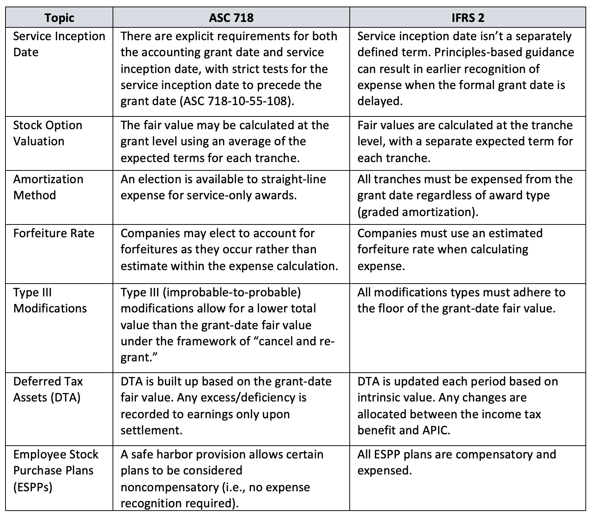

## Table of Contents

## What are GAAP and IFRS?

GAAP stands for Generally Accepted Accounting Principles. It is a set of rules and standards that companies in the United States follow when they prepare their financial statements. GAAP helps make sure that the financial information is clear and consistent, so investors and other people can trust it. It covers things like how to record income, expenses, assets, and liabilities.

IFRS stands for International Financial Reporting Standards. It is used by companies in many countries around the world, except the United States. IFRS is similar to GAAP but has some differences. It aims to make financial statements easier to understand and compare across different countries. Like GAAP, IFRS helps ensure that financial information is reliable and useful for investors and others.

Both GAAP and IFRS are important because they help create trust in financial reporting. While GAAP is specific to the U.S., IFRS is more global. Companies need to follow these standards to show their financial health accurately and fairly.

## Why is there a need to merge GAAP and IFRS standards?

The need to merge GAAP and IFRS standards comes from the desire to have a single set of high-quality, global accounting standards. Right now, companies in the U.S. use GAAP, while many other countries use IFRS. This difference can make it hard for investors and businesses to compare financial statements from companies in different countries. If GAAP and IFRS were merged, it would be easier for everyone to understand and compare financial information no matter where the company is located.

Another reason for merging these standards is to reduce the cost and complexity for companies that operate in multiple countries. When a company has to prepare financial statements using both GAAP and IFRS, it takes more time and money. By having one set of standards, companies could save resources and focus more on their business instead of worrying about different accounting rules. This would make things simpler and more efficient for everyone involved.

## What are the key differences between GAAP and IFRS?

One main difference between GAAP and IFRS is how they handle inventory. GAAP uses the Last In, First Out (LIFO) method, which means the most recent items bought are considered to be sold first. IFRS does not allow LIFO; it only allows First In, First Out (FIFO) and weighted average cost methods. This difference can affect how much a company says it made or spent on inventory, which can change the reported profits.

Another difference is in how the two standards treat research and development (R&D) costs. Under GAAP, most R&D costs must be expensed right away, meaning they are taken out of the company's profits immediately. IFRS allows some development costs to be capitalized, which means they can be spread out over time as an asset on the balance sheet. This can make a big difference in how profitable a company looks, especially if it spends a lot on developing new products.

Lastly, GAAP and IFRS have different rules for how to present financial statements. GAAP has more detailed rules about what information must be shown and how it should be organized. IFRS gives companies more flexibility in how they present their financials, as long as they include all the necessary information. This means that financial statements under IFRS might look different from one company to another, while GAAP statements tend to be more uniform.

## How would merging GAAP and IFRS affect financial reporting?

Merging GAAP and IFRS would make financial reporting easier to understand and compare around the world. Right now, companies in the U.S. use GAAP, and many other countries use IFRS. This can make it hard for investors to look at financial statements from different countries and see how companies are doing. If GAAP and IFRS were merged, everyone would use the same rules. This would help investors and businesses see the true financial health of companies no matter where they are located.

It would also save time and money for companies that work in many countries. Right now, these companies have to prepare two sets of financial statements, one for GAAP and one for IFRS. This takes a lot of work and costs a lot of money. If there was just one set of rules, companies could focus more on their business instead of spending time on different accounting standards. This would make things simpler and more efficient for everyone involved.

## What are the potential benefits of merging GAAP and IFRS for businesses?

Merging GAAP and IFRS would make things easier for businesses that work in different countries. Right now, these companies have to follow two sets of rules, which takes a lot of time and money. If there was just one set of rules, businesses wouldn't have to spend so much on preparing two sets of financial statements. This would save them money and let them focus more on growing their business instead of worrying about different accounting standards.

It would also help businesses when they want to show their financial health to investors from around the world. Right now, investors might find it hard to compare companies from the U.S. with companies from other countries because they use different accounting rules. If everyone used the same rules, it would be easier for investors to see how well a company is doing no matter where it's located. This could help businesses attract more investors and grow faster.

## What challenges might companies face during the transition to merged standards?

When companies move to a new set of accounting rules, they might find it hard at first. They would need to train their staff to understand the new rules, which can take time and money. Some companies might need to change their computer systems and software to work with the new standards. This could be expensive and might cause problems if the new systems don't work well right away.

Another challenge is figuring out how to report past financial information under the new rules. Companies would need to go back and change old financial statements to match the new standards. This can be a big job, especially for big companies with lots of past data. It might also be hard to explain these changes to investors and make sure everyone understands why the numbers look different now.

Even though it might be tough at first, once companies get used to the new rules, it could make things easier in the long run. But the transition period could be tricky, and companies would need to plan carefully to make sure everything goes smoothly.

## How could the merger impact global financial markets?

If GAAP and IFRS were merged, it would make it easier for investors all over the world to compare companies. Right now, investors have to understand two different sets of rules when looking at companies in the U.S. versus other countries. With one set of rules, investors could look at financial statements from any country and know they are seeing the same kind of information. This could help them make better decisions about where to put their money, which could make global financial markets more active and efficient.

The merger could also make things easier for companies that do business in many countries. Right now, these companies have to prepare two sets of financial statements, which is a lot of work. If there was just one set of rules, companies could save time and money. They could focus more on growing their business instead of worrying about different accounting standards. This could help companies grow faster and might lead to more investment and growth in global financial markets.

## What steps have been taken so far towards merging GAAP and IFRS?

Efforts to merge GAAP and IFRS have been going on for a while. In 2002, the Financial Accounting Standards Board (FASB) in the U.S. and the International Accounting Standards Board (IASB) started working together to make their rules more similar. They wanted to make it easier for companies and investors to understand financial statements from different countries. They made a lot of progress, but there are still some big differences between GAAP and IFRS.

In recent years, the focus has shifted a bit. Instead of trying to merge the two sets of rules completely, the FASB and IASB are now working on making sure their rules are at least similar enough that companies can switch from one to the other without too much trouble. This is called "convergence." While full merging might not happen soon, these efforts are still making it easier for companies and investors to work with financial statements from around the world.

## How do regulatory bodies view the potential merger of GAAP and IFRS?

Regulatory bodies have different views about merging GAAP and IFRS. In the U.S., the Securities and Exchange Commission (SEC) has been looking at the idea for a long time. They see that having one set of rules could help investors compare companies from different countries more easily. But they also worry about the costs and challenges of changing the rules. They want to make sure any change would really help companies and investors without causing too many problems.

Outside the U.S., many countries that already use IFRS support the idea of merging the standards. They think it would make the global financial market more fair and easier to understand. But they also know that merging the rules would take a lot of work and time. They want to work with the U.S. to find a good solution that everyone can agree on. Overall, while there is support for the idea, regulatory bodies are being careful and taking their time to make sure any changes are done right.

## What are the implications of a GAAP-IFRS merger for auditors and accountants?

If GAAP and IFRS were to merge, auditors and accountants would need to learn the new rules. This could mean taking classes or training to understand how to apply the new standards correctly. It might be a lot of work at first, but once they know the new rules, it could make their jobs easier. They wouldn't have to keep track of two different sets of rules anymore, which could save time and reduce mistakes.

The merger could also change how auditors and accountants do their work. Right now, they have to prepare two sets of financial statements for companies that work in different countries. With one set of rules, they could focus on just one report. This could make their work simpler and more efficient. But during the transition, they might have to help companies change their old financial statements to match the new rules, which could be a big job.

## How might the merger influence international trade and investment?

If GAAP and IFRS were to merge, it could make international trade and investment easier. Right now, companies that do business in different countries have to follow two sets of accounting rules. This can make it hard for them to compare financial information and make decisions about where to invest or trade. If everyone used the same rules, companies could understand each other's financial statements better. This could help them find new opportunities for trade and investment more easily.

The merger could also make investors feel more confident about putting their money into companies from other countries. When investors look at financial statements, they want to know they can trust the numbers. If all companies used the same accounting rules, it would be easier for investors to compare companies from different countries and see which ones are doing well. This could lead to more investment flowing across borders, which could help grow the global economy.

## What are the long-term economic impacts predicted from merging GAAP and IFRS?

If GAAP and IFRS were to merge, it could make the global economy stronger in the long run. Right now, companies that work in different countries have to follow different accounting rules. This can make it hard for them to understand each other's financial statements and find good opportunities for trade and investment. If everyone used the same rules, companies could compare financial information more easily. This could lead to more trade and investment between countries, which could help the global economy grow.

Another long-term impact could be more trust in financial markets. Investors want to know that the financial information they see is accurate and fair. If all companies followed the same accounting rules, it would be easier for investors to trust the numbers they see. This could make them more willing to invest in companies from other countries, which could bring more money into the global economy. Over time, this could lead to more jobs and better economic growth around the world.

## References & Further Reading

#