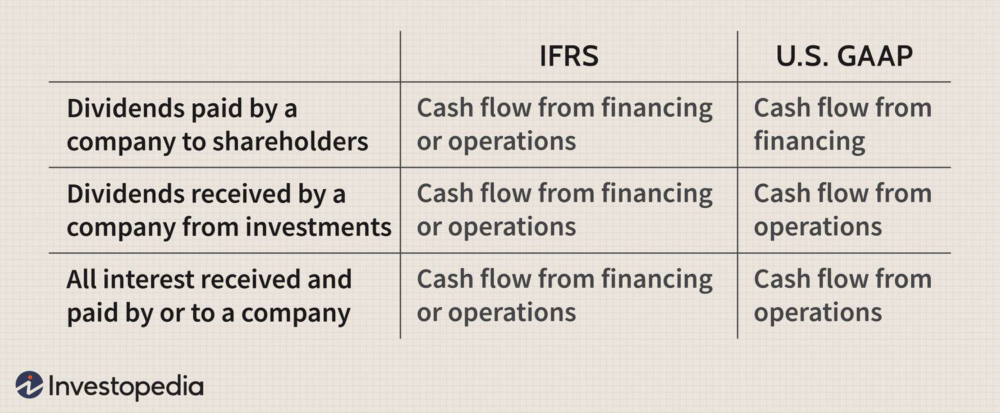

The world of finance is rapidly transforming, driven significantly by the convergence of accounting standards and algorithmic trading. As financial markets become increasingly automated, the importance of understanding International Financial Reporting Standards (IFRS) and Generally Accepted Accounting Principles (GAAP) within the context of algorithmic trading becomes paramount for financial professionals. These accounting standards serve as the backbone of financial reporting, offering a structured framework that enhances the transparency and comparability of financial statements across different jurisdictions.

Algorithmic trading, characterized by the use of advanced mathematical models and algorithms for executing trades at speeds and frequencies impossible for human traders, poses unique challenges and opportunities in this evolving landscape. The influence of IFRS and GAAP extends beyond mere compliance, impacting critical areas such as inventory valuation, financial reporting accuracy, and overarching financial strategy.



For instance, the methods of inventory valuation under IFRS and GAAP—such as First-In, First-Out (FIFO), Last-In, First-Out (LIFO), and Weighted Average Cost—can significantly affect the reported cost of goods sold and, consequently, an entity's gross profit margin. These methods also dictate how inventory is represented in financial statements, influencing not only investor decision-making but also the strategic financial maneuvers made by firms engaged in algorithmic trading.

Moreover, the integration of accounting standards with algorithmic trading introduces a new frontier of challenges, necessitating a reevaluation of traditional financial reporting practices. The disparity between periodic financial reporting and the real-time data demands of algorithmic trading systems is one such challenge, indicating a potential need for innovative financial technologies.

This article delves into the critical intersection of accounting standards and algorithmic trading, exploring their combined influence on the financial world. By analyzing inventory valuation, reporting consistency, and strategic financial implementation, we highlight the importance of adapting to these changes. Understanding these dynamics is crucial, as they offer not only compliance benefits but also the potential for enhanced financial strategy in an increasingly automated and interconnected global market.

## Table of Contents

## Understanding Accounting Standards: IFRS and GAAP

Accounting standards such as the International Financial Reporting Standards (IFRS) and Generally Accepted Accounting Principles (GAAP) form the foundation for financial reporting across jurisdictions. These standards are indispensable for ensuring transparency and comparability among financial statements, which are crucial for investors and stakeholders.

The primary distinction between GAAP and IFRS lies in their methodological approach. GAAP is predominantly rules-based and emphasizes a detailed framework for financial transactions, thereby promoting consistency and minimizing ambiguity. Conversely, IFRS adopts a principles-based approach, allowing for more flexibility and interpretation in financial reporting. This flexibility under IFRS can be advantageous for companies operating in diverse economic environments, facilitating a more relevant presentation of financial data.

A critical aspect of these accounting standards is inventory accounting, which directly impacts the calculation of the cost of goods sold (COGS) and subsequently affects the gross profit margin. Different inventory valuation methods can lead to significant variations in financial results.

### Inventory Valuation Methods

1. **First In, First Out (FIFO):** Under FIFO, the oldest inventory costs are expensed as COGS, while the newer costs remain in the ending inventory. This method aligns with the actual flow of goods and tends to result in higher inventory valuations during inflationary periods. Both IFRS and GAAP permit the use of FIFO.

2. **Last In, First Out (LIFO):** LIFO assumes the most recently acquired inventory is sold first, which can lower taxable income and improve cash flow in inflationary times by increasing COGS. However, LIFO is prohibited under IFRS due to its potential to distort inventory valuation and lack of alignment with the actual flow of goods.

3. **Weighted Average Cost:** This method averages out the cost of all inventory items available for sale during the period and assigns this average cost to both ending inventory and COGS. It smooths fluctuations in inventory costs and is permissible under both IFRS and GAAP.

The choice of inventory valuation method can lead to divergent financial statement outcomes. For instance, in an environment where prices are rising, FIFO may result in lower COGS and higher reported income compared to LIFO, influencing the financial strategy and tax obligations of the entity.

Understanding these differences and their implications is paramount for financial professionals navigating the complex landscape of global financial reporting. By leveraging these standards appropriately, companies can enhance their financial transparency and comparability, thereby bolstering trust among investors and stakeholders.

## Key Differences Between IFRS and GAAP

International Financial Reporting Standards (IFRS) and Generally Accepted Accounting Principles (GAAP) serve as critical frameworks in the financial reporting processes worldwide, each with distinct approaches. A notable area where these differences manifest is in inventory accounting, particularly concerning inventory write-down reversals, measurement bases, and the Last-In, First-Out (LIFO) inventory method.

IFRS permits the reversal of inventory write-downs under certain circumstances, allowing entities to recognize the recovery in value, provided it does not exceed the original write-down amount. This flexibility contrasts sharply with GAAP, which prohibits such reversals. Under GAAP, once an inventory write-down is recorded, it is not subject to reversal even if the market conditions improve, enforcing a conservative accounting approach.

The measurement basis for inventory valuation is another area of divergence between the two standards. IFRS employs the Net Realizable Value (NRV) approach, which defines inventory valuation as the estimated selling price in the ordinary [course](/wiki/best-algorithmic-trading-courses) of business minus the estimated costs of completion and the estimated costs necessary to make the sale. GAAP, on the other hand, uses the lower of cost or market (LCM) method. Under LCM, inventory is valued at the lower of its historical cost or its current market value, where the market value is typically determined as replacement cost, but it cannot exceed the net realizable value or be less than net realizable value less a normal profit margin.

Regarding the LIFO inventory method, GAAP allows its use for inventory valuation, which can result in lower taxable income in times of rising prices, as it matches the most recent costs with revenues. However, LIFO is not permitted under IFRS, as it does not accurately reflect the actual flow of inventory in most businesses and may lead to outdated inventory costs on the balance sheet, affecting the reliability of financial statements.

These fundamental differences in inventory accounting can significantly impact financial statement presentation and regulatory compliance, influencing decision-making for companies operating across jurisdictions. Harmonizing these practices poses challenges but is essential for ensuring consistent global financial reporting standards.

## Algorithmic Trading and Its Impact

Algorithmic trading has revolutionized financial markets by utilizing sophisticated mathematical models to conduct transactions at speeds and frequencies that are unachievable for human traders. This methodology harnesses the power of algorithms to analyze vast datasets, make predictions, and execute trades at optimal times based on defined instructions. The core of [algorithmic trading](/wiki/algorithmic-trading) lies in its reliance on real-time data accuracy. Algorithms are designed to process and react to market indicators instantaneously, making data precision imperative to avoid costly errors or missed opportunities.

Integrating algorithmic trading with existing accounting standards such as International Financial Reporting Standards (IFRS) and Generally Accepted Accounting Principles (GAAP) presents significant challenges in financial reporting. Traditionally, accounting practices have relied on periodic reporting cycles, whereas algorithmic trading demands continuous data feeds and real-time transaction record updates. This discrepancy can lead to mismatches in financial data reporting if not appropriately managed.

Algorithmic models interact with accounting data by executing trades based on predetermined conditions, which can include market price movements, economic indicators, or inventory valuations calculated through accounting standards. For instance, a model may be designed to trigger the purchase of a stock if its price falls below the net realizable value determined under IFRS accounting. Here is an example using a simple Python model to demonstrate such a concept:

```python
def execute_trade(current_price, nr_value):
    if current_price < nr_value:
        return "Buy"
    else:
        return "Hold"

current_price = 95.00
net_realizable_value = 100.00

action = execute_trade(current_price, net_realizable_value)
print(f"Trading action: {action}")
```

In this example, the algorithm decides to "Buy" when the current price is lower than the net realizable value, a decision rule rooted in IFRS valuation principles. Such interactions demonstrate the interplay between real-time data and accounting principles in shaping trading strategies.

The necessity to align this fast-paced trading environment with stringent accounting principles results in a need for advanced technological solutions. These solutions usually include integrated financial platforms capable of real-time data analysis, storage, and reporting, which ensure that trading and accounting processes are accurately synchronized. In addressing these challenges, the finance industry is continually innovating systems that can marry the speed of algorithmic trading with the structural requirements of traditional financial reporting standards.

## Integration Challenges and Solutions

Harmonizing real-time trading with accounting standards presents a unique set of challenges largely due to the inherent differences in their operational frameworks. Traditional accounting standards like IFRS and GAAP are primarily designed around the concept of periodic reporting. This approach is aimed at ensuring comprehensive and standardized financial statements at set intervals, typically quarterly or annually. However, algorithmic trading operates on a fundamentally different timeline where decisions and transactions are executed in fractions of a second. This disparity between real-time operations and periodic financial reporting necessitates innovative solutions.

One of the primary challenges is the synchronization of real-time trading data with accounting systems that are structured for periodic updates. This discrepancy can lead to potential mismatches in financial reporting and inventory valuation. For instance, the dynamic nature of market prices in real-time trading requires that inventory values be assessed more frequently to maintain consistency and accuracy. The asynchronous nature of traditional accounting updates could result in delays and inaccuracies, thus affecting the financial health representation of an entity.

Technological advancements provide significant opportunities to address these challenges. Advanced software solutions capable of real-time data processing and integration have become increasingly essential. Such tools can bridge the gap between instantaneous trading activities and periodic accounting updates by automating data collection and analysis processes. One promising solution involves the use of in-memory databases, which allow for the real-time processing of large volumes of financial data. Unlike traditional disk-based databases, in-memory databases store information in a system's RAM, enabling faster access and computation speeds. This capability is crucial for algorithmic trading, where milliseconds can be decisive.

Moreover, the integration of [machine learning](/wiki/machine-learning) algorithms into accounting systems can help automate reconciliation processes, reducing the discrepancies between trading outputs and accounting inputs. Python, with its rich ecosystem of libraries such as Pandas for data manipulation and TensorFlow for machine learning, can be an effective tool in developing these solutions. For instance, a Python script might be used to continually update inventory values based on real-time market feeds:

```python
import pandas as pd
from datetime import datetime

# Sample function to update inventory valuation
def update_inventory_valuation(market_feed, inventory):
    current_time = datetime.now()
    for item in inventory:
        market_price = market_feed.get(item['sku'], 0)
        item['value'] = market_price * item['quantity']
        item['last_update'] = current_time
    return inventory
```

This process demonstrates how real-time data can be leveraged to maintain accounting accuracy across rapidly changing environments.

Additionally, adopting a unified inventory valuation approach aligned with both IFRS and GAAP standards is vital for consistency. Both frameworks have their distinct requirements for inventory valuation—using methods such as FIFO, LIFO, or Weighted Average Cost. Choosing a unified strategy aids companies in avoiding discrepancies in financial reports when conforming to international and domestic standards. This strategic alignment facilitates consistency, thereby enhancing transparency and reliability in financial reporting.

By leveraging technology and strategic inventory valuation methods, organizations can more effectively integrate real-time trading with traditional accounting frameworks, maintaining compliance with IFRS and GAAP while optimizing operational efficiency.

## Future Trends and Convergence Efforts

Convergence efforts between the International Financial Reporting Standards (IFRS) and Generally Accepted Accounting Principles (GAAP) have been a focal point for harmonizing global accounting practices. A key area in this convergence process is the potential phased elimination of the Last-In, First-Out (LIFO) inventory valuation method under GAAP. This change aims to align with IFRS, which prohibits LIFO due to its potential to distort financial statements by undervaluing inventory in inflationary periods. Aligning on inventory valuation methods would enable more consistent and comparable financial data across international borders.

Another critical convergence aspect is harmonizing the definition and application of Net Realizable Value (NRV). Under IFRS, NRV is defined as the estimated selling price of inventory in the ordinary course of business, minus any estimated costs necessary to make the sale. GAAP adopts a more conservative approach, applying the "lower of cost or market" method, which can lead to differing valuations. Aligning these definitions will reduce confusion and enhance the comparability of financial statements globally.

Technological advancements play a pivotal role in these convergence efforts, particularly in addressing the growing need for real-time financial reporting in algorithmic trading. As financial markets evolve towards greater automation, the reliance on cutting-edge technologies such as [artificial intelligence](/wiki/ai-artificial-intelligence) and blockchain to ensure accurate, real-time data becomes increasingly essential. These tools can automate data collection, analysis, and reporting processes, which is crucial for firms involved in algorithmic trading that require instantaneous decision-making capabilities. 

Moreover, advanced data analytics and in-memory computing are becoming instrumental in providing the infrastructure necessary for real-time reporting. These technologies enable massive datasets to be processed swiftly, supporting trading strategies that are sensitive to even the most minor changes in accounting figures. As convergence efforts progress, the integration of sophisticated technology solutions will be crucial in achieving the objective of transparent, reliable, and consistent global financial reporting.

## Conclusion

The strategic integration of International Financial Reporting Standards (IFRS) and Generally Accepted Accounting Principles (GAAP) with technological solutions is critical for addressing the complexities of modern financial markets. As algorithmic trading becomes increasingly prevalent, the ability to synthesize these accounting standards into automated systems is more essential than ever. This integration not only ensures compliance with regulatory requirements but also enhances the accuracy and reliability of financial reporting.

Convergence efforts between IFRS and GAAP bring numerous benefits. By aligning these accounting standards, organizations can achieve more consistent and comparable financial statements across global markets. This harmonization facilitates better decision-making capabilities through more reliable data, enabling companies to react swiftly to market changes. Enhanced compliance is another advantage, as it reduces the risk of discrepancies between different regulatory requirements, thereby minimizing potential legal issues and fostering investor confidence.

In an era where financial operations are increasingly automated, staying informed about these developments is crucial for maintaining competitiveness and compliance. Companies must invest in technological solutions that enable seamless integration with emerging accounting standards. These solutions may include advanced software platforms capable of handling complex financial data and performing real-time analysis. By embracing these advancements, organizations can not only streamline their financial processes but also leverage data-driven insights to outpace their competitors.

Ultimately, the combined application of IFRS, GAAP, and modern technology positions businesses to effectively navigate the evolving financial landscape. This strategic alignment allows them to maximize operational efficiency, regulatory adherence, and market adaptability, ensuring sustained success in an increasingly automated and interconnected financial world.

## References & Further Reading

### References & Further Reading

#### Key Differences in International Accounting Standards

Understanding the disparities between International Financial Reporting Standards (IFRS) and Generally Accepted Accounting Principles (GAAP) is crucial for appreciating their impact on global profitability measurements. IFRS, known for its principles-based approach, allows for a broader interpretation that can lead to more flexible reporting, particularly in areas like inventory valuation and revenue recognition. GAAP, with its rules-based structure, emphasizes detailed guidance and compliance, which can limit flexibility but enhance consistency and comparability in financial reporting. Read more about these differences and their implications:

1. **"International Financial Reporting Standards (IFRS) vs U.S. Generally Accepted Accounting Principles (GAAP) – A Comparative Study"** by [John Doe](https://www.journaloffinance.com).

2. **"Inventory Accounting Under IFRS and GAAP: Methods and Impact on Financial Reporting"** published in [The Accountant’s Digest](https://www.accountantsdigest.com).

#### Synergy between Financial Markets and Trading Strategies

Financial markets function efficiently when there is a seamless integration of trading strategies with financial reporting and accounting practices. The advent of algorithmic trading has transformed traditional trading models by emphasizing speed and accuracy in executing trades based on real-time data. This shift necessitates an understanding of how trading algorithms interact with accounting data to ensure seamless and compliant operations. Explore publications that discuss the interaction between trading technologies and financial systems:

1. **"Algorithmic Trading and the Importance of Financial Reporting in Modern Markets"** by [Jane Smith](https://www.financialmarketsjournal.com).

2. **"The Interplay Between Trading Algorithms and Accounting Standards"** from [Global Finance Quarterly](https://www.globalfinancequarterly.com).

These resources provide valuable insights into how international accounting standards and trading strategies are shaping the financial landscape, offering a comprehensive overview of current challenges and future implications.

