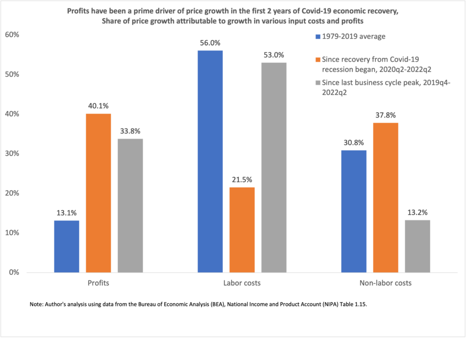

The global economy operates as a complex system influenced by numerous variables that continuously reshape its contours. Among the myriad forces at play, inflation, minimum wage policies, and algorithmic trading have emerged as pivotal factors in defining contemporary financial and economic landscapes. These elements not only function independently but also interact with one another, creating a dynamic environment that requires careful analysis and understanding.

Inflation represents a critical economic indicator, characterized by the rate at which prices for goods and services rise, consequently diminishing purchasing power. This element of economic fluctuation is crucial, as it directly impacts consumer behavior and business planning. High inflation rates can lead to unpredictability in financial markets, affecting both consumer confidence and expenditure patterns. In response, central banks may adjust interest rates to mitigate the adverse effects of inflation, influencing the broader economic environment through investment and savings channels.



Concurrently, minimum wage policies are instituted with the aim of safeguarding a livable income for workers. However, these policies introduce a balancing act between ensuring fair wages and maintaining market dynamics. Changes in minimum wage levels have the potential to amplify consumer spending, yet they also raise operational expenses for businesses. The intricacies of these dynamics are evident in the ongoing global debate regarding the optimal approach to setting minimum wages, balancing socioeconomic objectives with economic sustainability.

In recent years, algorithmic trading has transformed financial markets by employing sophisticated algorithms to automate and optimize trading decisions. This technological advancement enhances trading efficiency and speed, significantly influencing market liquidity and volatility. While algorithmic trading offers numerous benefits, including reduced transaction costs and enhanced market dynamics, it also poses new challenges and risks that require regulatory and strategic consideration.

Understanding the interconnectedness of inflation, minimum wage policies, and algorithmic trading is essential for appreciating their collective impact on economic stability. Each of these factors contributes to shaping economic conditions in unique ways, yet their interactions further complicate the landscape. This introduction sets the foundation for examining these influential elements in greater detail, shedding light on the complexities and opportunities they present in the global economy. By exploring their interrelations, we aim to provide deeper insights into the strategic decisions faced by policymakers, businesses, and financial institutions navigating the evolving economic terrain.

## Table of Contents

## Understanding Inflation and Its Economic Impact

Inflation is a fundamental economic concept describing the rate at which the general level of prices for goods and services rises, ultimately eroding the purchasing power of money. When inflation occurs, each unit of currency buys fewer goods and services over time, which can significantly impact both individuals and the broader economy.

High inflation often leads to unpredictability in financial markets, primarily because it creates uncertainty about future price levels. This unpredictability can deter investment as businesses and consumers become cautious about spending. For investors, inflation can erode the real returns on investment, impacting financial planning and long-term savings.

To control inflation, central banks, such as the Federal Reserve in the United States or the European Central Bank, typically adjust interest rates. By increasing interest rates, central banks aim to reduce borrowing and spending, thereby slowing down price increases. Conversely, when inflation is perceived as too low, central banks may lower interest rates to stimulate economic activity by making borrowing cheaper. The relationship between interest rates and inflation is a central tenet of monetary policy, impacting both investments and savings.

Current inflation trends provide insights into broader economic implications. For instance, in periods of hyperinflation, economies may experience rapid devaluation of currency, leading to severe economic instability. The ripple effects of inflation extend across various industries, influencing overall consumer behavior and business strategies. As inflation escalates, companies may choose to pass on increased costs to consumers in the form of higher prices, potentially leading to a decrease in demand for goods and services. Additionally, inflation can affect wages and employment; as prices rise, workers may demand higher wages to maintain their purchasing power, complicating employer labor cost management.

Government policies are also heavily shaped by inflation. Policymakers must balance the goals of controlling inflation with stimulating economic growth, often requiring difficult trade-offs. For example, during the late 1970s and early 1980s, many Western economies faced stagflation, a combination of stagnant growth and high inflation, pushing governments to adopt stringent monetary policies to restore economic stability.

In conclusion, inflation remains a critical [factor](/wiki/factor-investing) affecting economic stability, influencing consumer confidence, business investment, and policy decision-making. By monitoring inflation trends and employing targeted monetary policies, central banks and governments aim to maintain economic equilibrium, fostering a stable environment for growth and development.

## Minimum Wage Laws: Balancing Act Between Fairness and Market Dynamics

Minimum wage laws are designed to guarantee workers a basic standard of living by establishing the lowest hourly rate that employers can legally pay their employees. While the intention focuses on social fairness, the economic repercussions of modifying minimum wage rates are multifaceted and often contested among economists, policymakers, and business leaders.

Increasing minimum wages can have a positive effect on consumer spending, as it raises the disposable income of low-wage workers who tend to spend a larger portion of their earnings compared to higher-income individuals. This boost in consumption can stimulate demand for goods and services, potentially leading to economic growth. A study by the National Bureau of Economic Research (NBER) highlights that a higher minimum wage can reduce poverty levels by increasing the earnings of low-income workers, thereby enhancing their purchasing power.

However, there is also a counter-argument that raising minimum wages can escalate the operational costs for businesses, particularly small enterprises with narrow profit margins. These additional costs might compel businesses to shift their strategies, such as increasing prices, reducing employee hours, or even cutting jobs to maintain profitability. The Cato Institute has argued that higher minimum wages could lead to unemployment, especially among younger and less experienced workers, as employers might opt for automation or seek to hire only more experienced staff to justify the higher wages.

The impact of minimum wage adjustments on employment levels forms the crux of the debate. Several economic studies present diverse findings, illustrating that the effects largely depend on the specific circumstances of each economy. For instance, a meta-analysis by the University of Washington found minimal to modest employment impacts due to minimum wage increases in some U.S. cities, while a contrasting analysis from Texas Tech University suggested potential job losses in certain sectors, like hospitality and retail.

Various case studies further highlight the complexity of the issue. For example, in Germany, the introduction of a national minimum wage in 2015 did not result in significant job loss, as per a report by the Institute for Employment Research (IAB), defying initial fears from some economic circles. In contrast, evidence from Indonesia, examined by the World Bank, indicates that steep increases in minimum wages resulted in a reduction of formal sector employment opportunities, pushing some workers into lower-paid informal jobs.

Balancing the goal of fair compensation for workers against the need for economic sustainability and business viability remains a central challenge for policymakers. The optimal level for a minimum wage should consider various economic factors including local cost of living, productivity rates, and the elasticity of labor demand. Policymakers must tread carefully, using empirical data and economic modeling to predict potential outcomes and adjust policies accordingly.

In summary, while minimum wage laws are vital for safeguarding workers from exploitation and ensuring wage equity, their broader economic impacts are complex and context-dependent. Striking an appropriate balance requires a nuanced understanding of local economic conditions and the ability for policy adjustments as new data and trends emerge.

## Algorithmic Trading: Transforming the Financial Markets

Algorithmic trading employs advanced algorithms to automate and enhance trading decisions, thereby enhancing efficiency and speed significantly. It has become integral to modern financial markets, transforming the landscape by profoundly influencing [liquidity](/wiki/liquidity-risk-premium) and market [volatility](/wiki/volatility-trading-strategies).

### Operation of Algorithmic Trading

Algorithmic trading systems use complex mathematical models and formulas to make high-speed decisions across numerous market instruments. These systems typically implement strategies such as statistical [arbitrage](/wiki/arbitrage), [market making](/wiki/market-making), and [trend following](/wiki/trend-following). For instance, a simple [algorithmic trading](/wiki/algorithmic-trading) strategy might employ moving averages to identify buy/sell signals on asset prices.

#### Example Python Code
A basic example of a moving average crossover strategy can be implemented in Python:

```python
import pandas as pd

def moving_average_crossover(data, short_window, long_window):
    signals = pd.DataFrame(index=data.index)
    signals['signal'] = 0.0

    signals['short_mavg'] = data['Close'].rolling(window=short_window, min_periods=1, center=False).mean()
    signals['long_mavg'] = data['Close'].rolling(window=long_window, min_periods=1, center=False).mean()

    signals['signal'][short_window:] = np.where(signals['short_mavg'][short_window:] > signals['long_mavg'][short_window:], 1.0, 0.0)   
    signals['positions'] = signals['signal'].diff()

    return signals
```

### Benefits and Risks 

The primary benefit of algorithmic trading is its ability to process voluminous data sets at disrupting velocities, enabling superior market efficiency and facilitating better price discovery. It can help mitigate human error and emotional biases, providing consistent and disciplined trading approaches.

However, the automated nature of algorithmic trading poses inherent risks. It can exacerbate market volatility and contribute to flash crashes when trading algorithms react simultaneously to market stimuli. A notable instance of this occurred during the infamous Flash Crash of May 6, 2010, when the Dow Jones Industrial Average plunged by nearly 1,000 points within minutes, primarily due to algorithmic trading triggers.

### High-Frequency Trading

A subset of algorithmic trading is high-frequency trading ([HFT](/wiki/high-frequency-trading-strategies)), which involves executing thousands of trades in fractions of a second. HFT firms seek to capitalize on small price discrepancies generated from market movements. While HFT increases market liquidity, it also leads to significant market instability due to its reliance on complex algorithms and rapid order execution.

### Regulatory Responses

Regulatory bodies have sought to address the challenges posed by algorithmic trading. This includes imposing circuit breakers to halt trading during excessive market volatility, ensuring transparent trading practices, and mandating the reporting of algorithmic trading activities to promote market integrity. Financial regulators worldwide continue to scrutinize algorithmic trading to balance innovation advantages with market stability demands.

### Navigating the Trading Landscape

Understanding algorithmic trading's multifaceted impact is essential for market participants to adapt to the evolving trading ecosystem. As algorithmic trading grows more sophisticated with advancements in [machine learning](/wiki/machine-learning) and [artificial intelligence](/wiki/ai-artificial-intelligence), stakeholders must continually evolve strategies and regulatory frameworks. By doing so, the financial markets can harness the benefits of technological innovation while mitigating potential risks to economic stability.

## Interconnections: Inflation, Minimum Wage, and Algorithmic Trading

Inflation, minimum wage policies, and algorithmic trading are integral components of the economic ecosystem, each influencing and responding to the other in complex ways. These components are critical in shaping market behaviors and economic performance.

Inflation exerts a direct influence on wage adjustments. As inflation rises, the cost of living increases, prompting demands for higher wages. This cycle impacts consumer spending, which is a significant driver of economic activity. Increased wages can enhance purchasing power, boosting demand for goods and services. However, if wage increases outstrip productivity gains, they can lead to higher production costs, potentially fueling further inflation—a phenomenon known as a wage-price spiral.

Algorithmic trading systems are designed to respond swiftly to macroeconomic trends like inflation. By leveraging big data and sophisticated algorithms, these systems analyze vast amounts of financial information to make informed trading decisions. For instance, an anticipated rise in interest rates, a common tool used by central banks to manage inflation, may trigger algorithms to adjust investment strategies, influencing liquidity and market dynamics. The speed and efficiency of algorithmic trading can both stabilize and destabilize markets, depending on the prevailing economic conditions.

The interplay between inflation, minimum wage policies, and algorithmic trading generates complex effects on economic stability. Policymakers and businesses must navigate these interactions carefully. For instance, while minimum wage policies aim to ensure fair earnings, they must consider the inflationary context and potential repercussions on employment and costs. Simultaneously, the role of algorithmic trading necessitates robust regulatory frameworks to mitigate risks such as excessive volatility or systemic crises.

To foster sustainable growth, a multifaceted approach is required. Policymakers could implement adaptive monetary policies that take into account wage dynamics and technological advancements in trading practices. Businesses, on the other hand, could incorporate data-driven insights into their strategic planning, balancing wage policies with investments in technology and workforce skills.

In summary, the interconnected nature of inflation, minimum wage policies, and algorithmic trading underscores the need for coordinated efforts among stakeholders to ensure economic resilience and growth. Understanding these relationships is crucial for crafting informed strategies that align with evolving economic realities.

## Conclusion

The interplay between inflation, minimum wage policies, and algorithmic trading significantly shapes the economic landscape. Each factor influences economic stability and growth, forming an intricate web of interactions that stakeholders across finance, government, and business must navigate with precision and insight.

Understanding the dynamics between these components is essential for informed decision-making. Inflation, which measures the rate at which prices rise, affects purchasing power and can lead to unpredictable shifts in market behavior. Minimum wage policies, though designed to ensure fair compensation, must be balanced against economic sustainability, as they can drive both consumer spending and operational costs. Algorithmic trading, characterized by its efficiency and speed, introduces new dimensions to market liquidity and volatility.

As economic conditions continuously evolve, adapting to these influences is crucial for stakeholders worldwide. The fluid nature of the global economy demands agility and foresight to anticipate future trends and challenges. For instance, changes in inflation rates may prompt algorithmic traders to adjust their strategies, while shifts in minimum wage policies can alter employment landscapes and consumer behaviors.

The complex web of these economic forces presents both challenges and opportunities. Innovative strategies and informed policymaking can help navigate the complexities of the global economy. Embracing technology and data-driven approaches allows for optimizing decisions, while policy adjustments can mitigate adverse effects and support growth. By integrating robust analysis and strategic foresight, stakeholders can better prepare for future developments and create a resilient economic environment that benefits all participants.

In conclusion, the continued examination and understanding of the interplay between inflation, minimum wage policies, and algorithmic trading are vital for fostering sustainable economic growth and stability. Balancing these factors through thoughtful strategy and policy intervention will enable societies to capitalize on opportunities while mitigating risks, ultimately contributing to a more dynamic and prosperous global economic landscape.

## References & Further Reading

[1]: Card, D., & Krueger, A. B. (1995). ["Myth and Measurement: The New Economics of the Minimum Wage."](https://www.jstor.org/stable/j.ctv7h0s52) Princeton University Press.

[2]: Lopez de Prado, M. (2018). ["Advances in Financial Machine Learning."](https://www.amazon.com/Advances-Financial-Machine-Learning-Marcos/dp/1119482089) Wiley.

[3]: Autor, D. H., Manning, A., & Smith, C. L. (2016). ["The Contribution of the Minimum Wage to US Wage Inequality over Three Decades: A Reassessment."](https://www.aeaweb.org/articles?id=10.1257/app.20140073) American Economic Journal: Applied Economics.

[4]: Engle, R. F., & Rangel, J. G. (2008). ["The Spline-GARCH Model for Low-Frequency Volatility and Its Global Macroeconomic Causes."](https://www.jstor.org/stable/40056848) Review of Financial Studies.

[5]: Haldane, A. G. (2015). ["How Low Can You Go?"](https://www.bankofengland.co.uk/speech/2015/how-low-can-you-can-go) Bank of England Speech.

[6]: Glaeser, E. L. (2003). ["Does the Minimum Wage Cause Inefficient Rationing?"](https://www.nber.org/system/files/working_papers/w13012/w13012.pdf) American Economic Association.