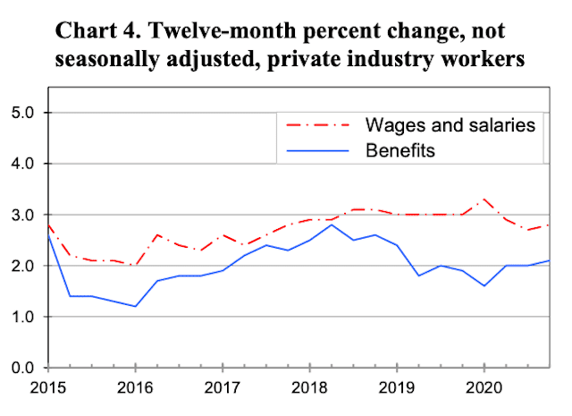

The economic landscape is a dynamic and continually evolving entity, shaped by a multitude of factors that interplay in complex ways. Among the myriad forces influencing this landscape, unemployment, economic policy, minimum wage laws, and algorithmic trading stand out as significant elements. Each of these components alone has a profound impact on the economy, but it is their interconnections and the way they affect one another that ultimately define economic conditions.

Unemployment serves as a barometer of economic health, reflecting the balance between labor supply and demand. High unemployment levels typically signal economic distress, leading to reduced consumer spending and hampering business revenue. This situation necessitates intervention through economic policies aimed at employment stimulation and economic revitalization.



Minimum wage laws further complicate the economic framework by attempting to establish a floor for income levels to reduce poverty. While ensuring a living wage is a critical goal, these laws can have unintended consequences, such as driving up operational costs for businesses, which might respond by reducing workforce size or increasing reliance on automation.

Intersecting with these labor market issues is algorithmic trading, which has gained prominence in financial markets. This sophisticated trading approach, leveraging computer algorithms for rapid execution, has transformed market operations by enhancing efficiencies and liquidity. However, it also introduces new challenges, including the potential for market manipulation and the generation of systemic financial risks.

Understanding the relationships among these economic forces is vital for various stakeholders, including policymakers, businesses, and individuals. By analyzing their connections, one can better grasp their combined effects on economic stability and growth prospects. This article offers a comprehensive overview that highlights the broader implications of these elements within the economic context. Through this analysis, we aim to uncover the intricacies of their interactions and underscore the necessity of strategic policies to manage their influence effectively.

## Table of Contents

## The Dynamics of Unemployment and Economic Impact

Unemployment is a critical issue that consistently affects economic growth and stability. It represents the portion of the labor force that is jobless and actively seeking employment. High unemployment rates exert a downward pressure on consumer spending, which is a significant driver of economic activity. When people are unemployed, their purchasing power diminishes, leading to reduced demand for goods and services. This decrease in consumer spending impacts businesses, causing a ripple effect that can slow down the broader market.

Economists often examine the relationship between unemployment and economic performance using Okun's Law. This empirical relationship shows that for every 1% increase in the unemployment rate, a country's GDP will be roughly an additional 2% lower than its potential GDP. This formula underscores the significance of unemployment in macroeconomic planning. It is often expressed as:

$$
\Delta \text{GDP} = -c \times \Delta \text{Unemployment Rate}
$$

where $c$ is a constant that historically averages around 2 or 3 for many developed economies.

Policymakers focus on addressing unemployment through various reforms and policies aimed at stimulating economic activity. Some of these strategies include fiscal policy measures, such as government spending on infrastructure projects that create jobs, and monetary policies that reduce interest rates to spur business investment. Also, active labor market policies are implemented, such as job training programs, and incentivizing businesses to hire through subsidies or tax breaks.

However, these interventions often spark debates regarding their efficiency and potential side effects. For example, while reducing interest rates can stimulate borrowing and spending, it also poses risks of inflation. Conversely, increasing government spending could lead to higher public debt levels, which might hamper long-term economic growth.

In addition to these macroeconomic strategies, structural reforms aimed at improving the labor market's efficiency are critical. These include initiatives to enhance workforce skills, promote flexible labor contracts, and target reductions in structural unemployment caused by mismatches between skills and job requirements. As labor markets and economic conditions continuously evolve, the complexity of unemployment demands a multi-faceted approach to maintain economic stability and promote growth.

## Minimum Wage: A Double-Edged Sword

Minimum wage laws serve as a crucial tool for establishing a baseline income for workers, aiming to protect them from exploitative compensation practices. These laws, however, present a multifaceted challenge for economies. While the intent is to uplift workers, particularly those in low-income brackets, by guaranteeing them a minimum amount of income, the implications are broader and more complex.

On one side, raising the minimum wage can effectively reduce poverty levels by providing workers with improved living standards, thereby contributing to economic equality. By increasing the purchasing power of low-wage workers, consumer spending can be stimulated, which in turn supports businesses and fosters economic growth. According to the Economic Policy Institute, a rise in the minimum wage can lead to increased economic activity as workers allocate a higher proportion of their income towards goods and services.

However, there are arguments suggesting that increasing the minimum wage may lead to higher unemployment rates. The fundamental concern here revolves around businesses that may be compelled to cut labor costs to absorb the increased wage expenses. This often translates to reducing workforce numbers, limiting hiring, or turning to automation. As suggested by a study published in the Journal of Labor Economics, when labor costs rise due to an increased minimum wage, employers might reduce employment opportunities, particularly impacting low-skilled workers.

The debate surrounding the optimal level of minimum wage is ongoing. It involves balancing the need to lift workers out of poverty with the economic realities faced by employers. The elasticity of demand for labor is a crucial [factor](/wiki/factor-investing) here. If the demand is relatively inelastic, employers are more likely to absorb wage increases without significantly reducing their workforce. However, in industries with elastic demand for labor, even modest increases in the minimum wage might lead to substantial employment reductions.

Economists also consider regional economic conditions when determining minimum wage policies. What might be a sustainable wage increase in a bustling urban economy could prove detrimental in a rural or economically struggling area. The variation in cost of living across different regions often necessitates tailored approaches rather than a one-size-fits-all policy.

The complexity of minimum wage impacts involves considering numerous factors, including labor market conditions, regional economic disparities, and industry-specific characteristics. While there is no consensus on a perfect minimum wage level, it is clear that any adjustments must be carefully calibrated to support both the workforce and the businesses employing them. This delicate balance is vital for nurturing a robust yet equitable economic environment where all stakeholders can thrive.

## The Intersection of Minimum Wage and Unemployment

The relationship between minimum wage and unemployment is a multifaceted one that varies across industries and regions. As the minimum wage increases, the cost of labor rises, potentially prompting businesses to consider reducing their workforce or investing in automation to maintain profit margins. This phenomenon is particularly pronounced in industries with labor-intensive operations, where wage expenses constitute a significant portion of overall costs. 

Automation and outsourcing have emerged as viable solutions for companies facing heightened wage pressures. By leveraging technological advancements, businesses can streamline operations, increase efficiency, and reduce reliance on human labor. For example, in the retail sector, the adoption of self-service kiosks and automated checkout systems has been fueled partly by rising labor costs. In manufacturing, robotics and AI-driven processes have allowed companies to maintain competitiveness in a global market with diverse wage standards.

The impact of minimum wage hikes on unemployment is not uniform; instead, it is shaped by various factors, including the economic environment, the specific industry, and regional cost structures. In some sectors, such as hospitality, where direct customer interaction is integral, opportunities for automation are limited, potentially leading to job reductions. Conversely, in sectors amenable to technological integration, firms may be more inclined to invest in automation rather than cutting jobs outright.

Additionally, regional disparities in cost of living and economic activity mean that the effects of minimum wage changes can differ vastly. In high-cost urban areas, a modest increase in minimum wage might have little impact on employment levels due to the already high wage baseline. However, in lower-cost regions, the same increase might pose significant challenges for small businesses, which may not have the financial flexibility to absorb the higher labor costs.

These complexities underscore the need for a nuanced approach when assessing the implications of minimum wage policies. While minimum wage increases can lead to higher unemployment in certain scenarios, they also have the potential to uplift worker living standards and stimulate economic demand through increased consumer spending. Thus, policymakers must consider the broader economic context and industry-specific conditions when crafting minimum wage legislation, balancing the need for fair worker compensation with the potential for adverse employment effects.

## Algorithmic Trading and Its Economic Implications

Algorithmic trading, often termed as algo-trading, utilizes computer programs to automatically execute a large number of trades at extremely high speeds. Its introduction and widespread adoption have fundamentally transformed financial markets by enhancing efficiency and [liquidity](/wiki/liquidity-risk-premium). Through the use of complex algorithms and mathematical models, [algorithmic trading](/wiki/algorithmic-trading) enables high-frequency trading ([HFT](/wiki/high-frequency-trading-strategies)), a practice wherein trades are conducted in fractions of a second, far exceeding the capabilities of human traders.

The advantages of algorithmic trading include improved market efficiency and reduced transaction costs. By automating trades, algorithms can exploit short-lived [arbitrage](/wiki/arbitrage) opportunities, aligning prices more closely with market fundamentals. This not only provides liquidity but also stabilizes markets by narrowing bid-ask spreads. An example of a simple trading algorithm is illustrated in the following Python code snippet:

```python
import numpy as np

# Sample moving average trading algorithm
def moving_average_strategy(prices, short_window=40, long_window=100):
    signals = np.zeros(len(prices))
    short_mavg = np.convolve(prices, np.ones(short_window)/short_window, mode='valid')
    long_mavg = np.convolve(prices, np.ones(long_window)/long_window, mode='valid')

    # Create signals: 1 for buy, -1 for sell
    for i in range(len(short_mavg) - 1):
        if short_mavg[i] > long_mavg[i]:
            signals[i + long_window - 1] = 1  # Buy signal
        elif short_mavg[i] < long_mavg[i]:
            signals[i + long_window - 1] = -1  # Sell signal

    return signals

#Example prices array
prices = np.array([112, 115, 113, 120, 119, 117, 121, 125])

signals = moving_average_strategy(prices)
print(signals)
```

However, algorithmic trading is not without its drawbacks. Concerns have been raised regarding market manipulation, as high-frequency traders may manipulate market prices through practices like spoofing and layering. These involve placing large orders with no intention of executing them to create an illusion of demand or supply. Such tactics can lead to artificial price movements and undermine the integrity of financial markets.

Another significant issue is systemic risk. The rapid execution speeds and automation of trades can amplify market [volatility](/wiki/volatility-trading-strategies) in times of stress, as witnessed during the 2010 Flash Crash. In such instances, algorithms can react to market movements in unintended ways, exacerbating price declines and leading to cascading sell-offs.

Regulatory bodies worldwide continue to scrutinize algorithmic trading to mitigate associated risks. Regulations aim to prevent unfair advantages through co-location and latency arbitrage, where traders place their servers in close proximity to exchange servers to gain speed advantages. Measures such as circuit breakers, which temporarily halt trading in extreme volatility, have been implemented to enhance market resilience.

The integration of algorithmic trading within financial markets is an evolving process, influencing the roles and strategies of investors and regulators. As technological advancements continue, the challenge lies in balancing the benefits of speed and efficiency with the need to ensure fair, transparent, and stable markets.

## Synthesis: The Convergence of Forces

Understanding the interactions among unemployment, minimum wage policies, and algorithmic trading is crucial for developing comprehensive economic strategies. Each of these components does not operate in isolation; instead, they create a dynamic and interconnected environment that requires nuanced understanding and coordinated management.

Unemployment is influenced by multiple factors, including economic growth rates, technological advancements, and policy decisions. High unemployment often reduces consumer spending, affecting business revenues and economic stability. Minimum wage policies aim to provide a safety net for workers; however, they can also contribute to unemployment if businesses find labor costs unsustainable and resort to downsizing or increasing automation as a cost-cutting measure.

Algorithmic trading, a cornerstone of modern financial markets, adds another layer of complexity. It has improved market efficiencies by enabling faster transactions and increasing market liquidity. However, its rapid execution and potential for market manipulation pose systemic risks. The volatility induced by such trading algorithms can impact investment decisions, further influencing economic indicators like unemployment and wage policies.

The interaction between these entities is exemplified when an increase in the minimum wage, intended to uplift workers economically, results in a rise in company expenditure on wages. This may prompt businesses to invest in automation to reduce labor costs, potentially increasing unemployment rates in certain sectors. Algorithmic trading can exacerbate the situation as market reactions to policy changes become more pronounced, influencing stock market stability and investor confidence.

Policymakers, therefore, need to create strategies that balance these interests. For businesses, the challenge lies in adapting to policy changes without compromising profitability or workforce stability. For individuals, understanding how these factors interplay can guide personal financial decisions and career planning.

In this interconnected setting, collaboration among policymakers, businesses, and communities is essential. Policymakers must tailor regulations that consider the cascading effects of minimum wage adjustments on employment and financial markets. Businesses should innovate responsibly, balancing technological efficiency with human capital investment. Individuals, informed by the broader economic environment, can make decisions that align with emerging trends and opportunities.

Ultimately, the convergence of unemployment, minimum wage policies, and algorithmic trading necessitates ongoing research and dialogue to anticipate future challenges and leverage opportunities for sustainable economic growth.

## Conclusion

The interplay between unemployment, minimum wage, and algorithmic trading highlights the inherent complexity of modern economies. These elements, while distinct, are interconnected and can collectively influence the overall economic landscape. Strategic policies are required to address the multifaceted nature of these interactions and promote economic stability and growth. For instance, a comprehensive understanding of unemployment trends can inform minimum wage policies, which in turn can affect labor market dynamics and influence how businesses adapt through practices such as automation or outsourcing.

Algorithmic trading, while not directly linked to unemployment or minimum wage, plays a crucial role by affecting market liquidity and stability. Innovations in algorithmic trading can provide benefits such as increased trading efficiency, but they also pose challenges related to market manipulation and systemic risk. Policymakers and regulatory bodies must ensure that these technological advancements contribute positively to the economy without exacerbating existing inequalities or creating new risks.

Ongoing research and dialogue are essential for navigating these issues effectively. By fostering collaboration among policymakers, economists, businesses, and technologists, societies can develop innovative solutions that address both current challenges and future opportunities. This collaborative approach is key to crafting sustainable economic futures that are resilient to the evolving challenges of a globalized economy. Such efforts will ensure that economic policies not only respond to immediate needs but also anticipate and adapt to long-term changes and trends.

## References & Further Reading

[1]: Card, D., & Krueger, A. B. (1994). ["Minimum Wages and Employment: A Case Study of the Fast-Food Industry in New Jersey and Pennsylvania."](https://davidcard.berkeley.edu/papers/njmin-aer.pdf) American Economic Review, 84(4), 772-793.

[2]: Neumark, D., & Wascher, W. (2008). ["Minimum Wages."](https://www.nber.org/papers/w12663) MIT Press.

[3]: Bessen, J. (2019). ["AI and Jobs: The Role of Demand"](https://www.nber.org/papers/w24235) Applied Economics Letters, 26(18), 1497-1500.

[4]: Goolsbee, A. (2013). ["Unemployment and Innovation."](https://www.nber.org/papers/w20670) National Bureau of Economic Research, Working Paper 19324.

[5]: Hendershott, T., & Riordan, R. (2013). ["Algorithmic Trading and the Market for Liquidity."](https://www.jstor.org/stable/43303831) The Review of Financial Studies, 26(8), 2267-2306.

[6]: MacKay, D. (2003). ["Information Theory, Inference, and Learning Algorithms."](https://archive.org/details/informationtheor0000mack) Cambridge University Press.

[7]: Percy, C. A., & Chan, N. L. K. (2011). ["Flash Crashes: High-Frequency Trading, Regulation, and Implications."](https://www.tandfonline.com/doi/full/10.1080/03085147.2016.1263034) IIC International Review of Intellectual Property and Competition Law, 10(1), 99-112.