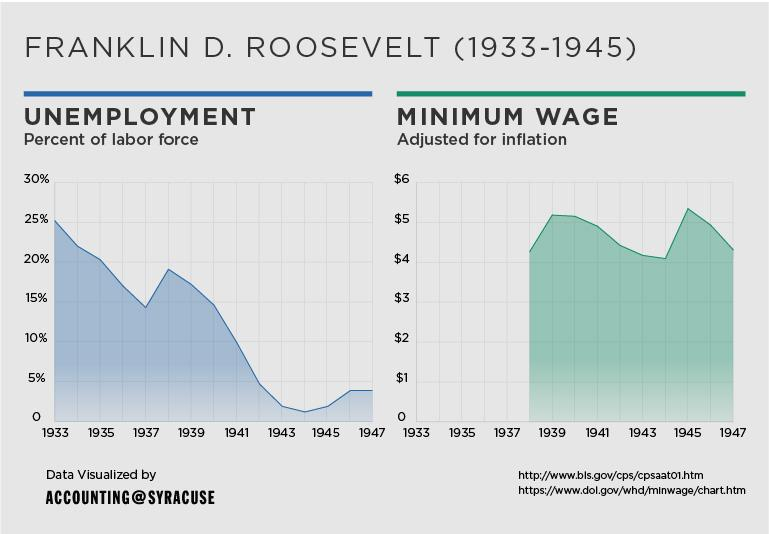

## Table of Contents

## What is the minimum wage?

The minimum wage is the lowest amount of money that employers are legally allowed to pay their workers. It is set by the government to make sure that workers earn enough to live on. Different countries have different minimum wages, and sometimes the minimum wage can be different in different parts of the same country.

In the United States, the federal minimum wage is $7.25 per hour, but some states and cities have their own higher minimum wages. For example, in California, the minimum wage is higher than the federal minimum wage. The minimum wage can change over time, usually going up to keep up with the cost of living. This helps workers to afford basic needs like food, housing, and healthcare.

## How is the minimum wage determined?

The minimum wage is decided by the government. In many countries, it is set by a special group of people who look at things like how much things cost and how much people need to live. They try to make sure that the minimum wage is enough for people to pay for their basic needs, like food and a place to live. Sometimes, they also look at what other countries are doing and how the economy is doing.

In the United States, the federal minimum wage is set by Congress. This means that lawmakers in Washington, D.C. decide on the number. But, states and cities can also set their own minimum wages, which can be higher than the federal one. For example, if the federal minimum wage is $7.25, a state might decide to make it $10. This can happen because different places have different costs of living. The minimum wage can change over time, usually going up to help people keep up with rising prices.

## What is unemployment?

Unemployment means that people who want to work cannot find a job. It happens when there are more people looking for work than there are jobs available. This can happen for many reasons, like when a company closes down or when the economy is not doing well. Governments keep track of unemployment by counting how many people are out of work and looking for a job.

When a lot of people are unemployed, it can be hard for them to pay for things they need, like food and a place to live. It can also make the whole economy slow down because people are not spending as much money. Governments try to help by creating programs to give people jobs or by helping them learn new skills. But, it can take time to fix unemployment, and it can be a big problem for many people.

## How are unemployment rates calculated?

Unemployment rates are calculated by looking at how many people are out of work but are looking for a job. The government does this by doing surveys. They ask a lot of people if they have a job or if they are trying to find one. If someone is not working and is actively looking for a job, they are counted as unemployed.

To find the unemployment rate, the government takes the number of unemployed people and divides it by the total number of people in the labor force. The labor force includes everyone who has a job or is looking for one. Then, they multiply that number by 100 to get a percentage. For example, if 100 out of 1,000 people in the labor force are unemployed, the unemployment rate would be 10%.

This way of calculating unemployment helps show how many people are having trouble finding work. It's important because it helps the government and other people understand how the economy is doing. If the unemployment rate is high, it means a lot of people are out of work, and the government might need to do something to help.

## What is the basic economic theory behind the relationship between minimum wage and unemployment?

The basic economic theory about the relationship between minimum wage and unemployment is that if the minimum wage goes up, it might cause more people to be out of work. This idea comes from the thought that when businesses have to pay their workers more, they might not be able to afford to keep as many people working. So, they might let some workers go or hire fewer new ones. This can lead to more people being unemployed.

However, not everyone agrees with this theory. Some people think that raising the minimum wage can actually help the economy. They believe that if workers earn more money, they will spend more on things they need, like food and clothes. This extra spending can help businesses grow and create more jobs, which could lower unemployment. So, the relationship between minimum wage and unemployment can be complicated, and different people have different ideas about it.

## Can you provide examples of countries with different minimum wage policies and their unemployment rates?

In the United States, the federal minimum wage is $7.25 per hour. Some states, like California, have a higher minimum wage, which is over $15 per hour. The unemployment rate in the United States can change, but it was around 3.7% in 2023. People have different opinions about how the minimum wage affects unemployment in the U.S. Some think that raising the minimum wage might lead to more people being out of work, while others believe it can help the economy by giving workers more money to spend.

In Australia, the minimum wage is much higher than in the U.S., at around $23 per hour. Australia's unemployment rate was about 3.5% in 2023. Even though the minimum wage is high, Australia's unemployment rate is low. This might be because Australia has different rules and a strong economy. It shows that a high minimum wage doesn't always mean higher unemployment.

In contrast, countries like Bangladesh have a very low minimum wage, which is less than $1 per hour. The unemployment rate in Bangladesh can be high, sometimes around 5% or more. A low minimum wage might help businesses hire more people because they don't have to pay much, but it can also mean that workers earn very little money, which can be hard for them.

## How do increases in minimum wage potentially affect employment levels?

When the minimum wage goes up, it can be good and bad for employment levels. Some people think that if businesses have to pay their workers more, they might not be able to afford to keep as many people working. This means they might let some workers go or not hire new ones, which can lead to more people being out of work. It's like if you have a small amount of money to spend and the price of something goes up, you might have to buy less of it.

On the other hand, some people believe that raising the minimum wage can help the economy and employment. When workers earn more money, they can spend more on things they need, like food and clothes. This extra spending can help businesses grow and create more jobs. If businesses do better because people are spending more, they might hire more workers, which could lower unemployment. So, increasing the minimum wage can have different effects on employment, and it depends on many things.

## What are the arguments for and against raising the minimum wage in relation to unemployment?

Some people think raising the minimum wage is good because it gives workers more money. When workers earn more, they can buy more things they need, like food and clothes. This extra spending can help businesses make more money and grow. If businesses are doing well, they might hire more workers, which can lower unemployment. Also, a higher minimum wage can make sure that people can live better lives and not have to worry so much about money.

But other people think that raising the minimum wage can cause problems. They say that if businesses have to pay their workers more, they might not be able to afford to keep as many people working. So, they might let some workers go or not hire new ones, which can lead to more people being out of work. Businesses might also raise prices to cover the higher wages, which could make it harder for people to buy things. This can make the economy slower and might not help unemployment.

The debate about raising the minimum wage and its effect on unemployment is complicated. Different places might see different results because of things like the cost of living, how strong the economy is, and what rules the government has. Some studies show that raising the minimum wage doesn't always lead to more unemployment, while others say it can. So, it's important to look at all these things when deciding if the minimum wage should go up.

## How have empirical studies varied in their findings on the impact of minimum wage on unemployment?

Empirical studies on the impact of minimum wage on unemployment have shown different results. Some studies have found that when the minimum wage goes up, businesses might let some workers go or not hire new ones because they have to pay more money. This can lead to more people being out of work. For example, some research in the United States has shown that raising the minimum wage can increase unemployment, especially among young and less experienced workers who might be the first to lose their jobs.

On the other hand, other studies have found that raising the minimum wage doesn't always lead to more unemployment. Some research, like a famous study in New Jersey and Pennsylvania, showed that even when the minimum wage went up, the number of people working didn't go down. These studies suggest that businesses can handle paying more to their workers without letting people go. They might find other ways to save money or raise prices a little bit, and the extra money workers get can help the economy by making people spend more.

The difference in these findings can come from many things, like how strong the economy is, how much the minimum wage goes up, and what rules the government has. It's hard to say for sure what will happen because every place is different. But, looking at all these studies together helps us understand that the relationship between minimum wage and unemployment is complicated and can change depending on a lot of factors.

## What role do factors like labor market flexibility and economic conditions play in this relationship?

Labor market flexibility and economic conditions can change how raising the minimum wage affects unemployment. If a country has a flexible labor market, it means businesses can easily change how many workers they have or how much they pay them. In a flexible market, businesses might be able to handle a higher minimum wage without letting people go. They could find other ways to save money or raise prices a little bit. But if the labor market is not flexible, businesses might have a harder time dealing with higher wages, and they might let more workers go, which can increase unemployment.

Economic conditions also play a big part in this. If the economy is doing well and businesses are making a lot of money, they might be able to pay their workers more without having to let anyone go. In a strong economy, people are spending more money, which can help businesses grow and create more jobs. But if the economy is not doing well, businesses might struggle to pay higher wages, and they might have to let workers go or not hire new ones. So, whether raising the minimum wage leads to more unemployment can depend a lot on how flexible the labor market is and how the economy is doing.

## How do regional and sector-specific impacts of minimum wage changes influence overall unemployment rates?

When the minimum wage changes, it can affect different areas and types of jobs in different ways. In some places, like big cities, the cost of living is high, so raising the minimum wage might not cause as many problems. Businesses in these areas might be able to pay more to their workers without having to let people go because they can charge more for their products or services. But in smaller towns or rural areas, where the cost of living is lower, businesses might find it harder to pay higher wages. They might have to let some workers go or not hire new ones, which can make unemployment go up in those places.

Different types of jobs can also be affected differently by minimum wage changes. In industries like fast food or retail, where many workers earn close to the minimum wage, raising it can have a big impact. If the minimum wage goes up a lot, these businesses might have to let some workers go or raise prices, which could lead to more unemployment in these sectors. On the other hand, in jobs where workers already earn more than the minimum wage, like in technology or healthcare, the impact might be smaller. The overall unemployment rate can be influenced by how these regional and sector-specific changes balance out across the whole country.

## What advanced econometric models are used to analyze the causal effects of minimum wage on unemployment?

Advanced econometric models help researchers figure out if raising the minimum wage causes more people to be out of work. One common model is the difference-in-differences (DiD) method. This model looks at what happens in places where the minimum wage goes up and compares it to places where it stays the same. By comparing these two groups over time, researchers can see if the change in the minimum wage made a difference in unemployment. Another model is regression discontinuity design (RDD), which looks at what happens right around the point where the minimum wage changes. If unemployment goes up right after the minimum wage increases, it might mean that the higher wage caused more people to be out of work.

Instrumental variables (IV) is another model used to find out if minimum wage affects unemployment. This method uses something else that affects the minimum wage but doesn't directly affect unemployment, like a law that changes the minimum wage. By looking at how this "instrument" affects both the minimum wage and unemployment, researchers can figure out if the minimum wage itself is causing changes in unemployment. These models help us understand the complicated relationship between minimum wage and unemployment by trying to separate the effects of the wage increase from other things happening in the economy.

## What are the dynamics of unemployment and their economic impact?

Unemployment is a critical issue that consistently affects economic growth and stability. It represents the portion of the labor force that is jobless and actively seeking employment. High unemployment rates exert a downward pressure on consumer spending, which is a significant driver of economic activity. When people are unemployed, their purchasing power diminishes, leading to reduced demand for goods and services. This decrease in consumer spending impacts businesses, causing a ripple effect that can slow down the broader market.

Economists often examine the relationship between unemployment and economic performance using Okun's Law. This empirical relationship shows that for every 1% increase in the unemployment rate, a country's GDP will be roughly an additional 2% lower than its potential GDP. This formula underscores the significance of unemployment in macroeconomic planning. It is often expressed as:

$$
\Delta \text{GDP} = -c \times \Delta \text{Unemployment Rate}
$$

where $c$ is a constant that historically averages around 2 or 3 for many developed economies.

Policymakers focus on addressing unemployment through various reforms and policies aimed at stimulating economic activity. Some of these strategies include fiscal policy measures, such as government spending on infrastructure projects that create jobs, and monetary policies that reduce interest rates to spur business investment. Also, active labor market policies are implemented, such as job training programs, and incentivizing businesses to hire through subsidies or tax breaks.

However, these interventions often spark debates regarding their efficiency and potential side effects. For example, while reducing interest rates can stimulate borrowing and spending, it also poses risks of inflation. Conversely, increasing government spending could lead to higher public debt levels, which might hamper long-term economic growth.

In addition to these macroeconomic strategies, structural reforms aimed at improving the labor market's efficiency are critical. These include initiatives to enhance workforce skills, promote flexible labor contracts, and target reductions in structural unemployment caused by mismatches between skills and job requirements. As labor markets and economic conditions continuously evolve, the complexity of unemployment demands a multi-faceted approach to maintain economic stability and promote growth.

## References & Further Reading

[1]: Card, D., & Krueger, A. B. (1994). ["Minimum Wages and Employment: A Case Study of the Fast-Food Industry in New Jersey and Pennsylvania."](https://davidcard.berkeley.edu/papers/njmin-aer.pdf) American Economic Review, 84(4), 772-793.

[2]: Neumark, D., & Wascher, W. (2008). ["Minimum Wages."](https://www.nber.org/papers/w12663) MIT Press.

[3]: Bessen, J. (2019). ["AI and Jobs: The Role of Demand"](https://www.nber.org/papers/w24235) Applied Economics Letters, 26(18), 1497-1500.

[4]: Goolsbee, A. (2013). ["Unemployment and Innovation."](https://www.nber.org/papers/w20670) National Bureau of Economic Research, Working Paper 19324.

[5]: Hendershott, T., & Riordan, R. (2013). ["Algorithmic Trading and the Market for Liquidity."](https://www.jstor.org/stable/43303831) The Review of Financial Studies, 26(8), 2267-2306.

[6]: MacKay, D. (2003). ["Information Theory, Inference, and Learning Algorithms."](https://archive.org/details/informationtheor0000mack) Cambridge University Press.

[7]: Percy, C. A., & Chan, N. L. K. (2011). ["Flash Crashes: High-Frequency Trading, Regulation, and Implications."](https://www.tandfonline.com/doi/full/10.1080/03085147.2016.1263034) IIC International Review of Intellectual Property and Competition Law, 10(1), 99-112.