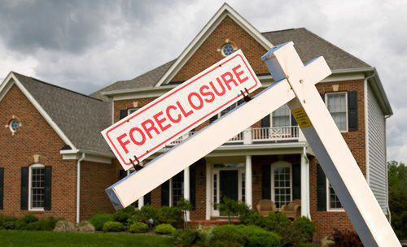

The concept of the American Dream has long been synonymous with homeownership and economic prosperity. This ideal has historically represented the promise of upward mobility and stability, rooted in the belief that anyone, regardless of their background, can achieve success through hard work. Homeownership, in particular, has been seen as a tangible asset that provides both personal security and an investment in one's future.

However, the 2008 housing crisis posed a significant threat to this ideal, triggering a cascade of economic repercussions that continue to be felt today. The crisis, precipitated by risky lending practices and the collapse of inflated housing prices, resulted in widespread financial turmoil. Millions of Americans faced foreclosure and the collapse of major financial institutions led to a global recession, fundamentally challenging the notion that hard work would lead to prosperity and secure homeownership.



This article examines the interconnectedness of the American Dream, the 2008 housing crisis, and the role of algorithmic trading in modern economic landscapes. While algorithmic trading was not a direct cause of the housing crisis, its rise in the aftermath has significantly reshaped financial markets, introducing new dynamics and risks. The rapid execution of trades facilitated by complex algorithms has brought efficiencies to markets but has also emphasized the need for robust financial regulations and oversight.

Understanding the lessons from the past, particularly the 2008 financial turmoil, is crucial for navigating current and future challenges. By exploring these elements, we aim to understand their ongoing impact on American society and future economic stability. Through this analysis, we seek to contribute to a conversation about how to safeguard the principles of the American Dream in an ever-evolving economic environment.

## Table of Contents

## The American Dream and Homeownership

Homeownership has traditionally served as a cornerstone of the American Dream, embodying the ideals of financial stability and upward mobility that have defined American aspirations for generations. This vision has been firmly rooted in the belief that owning a home provides not only shelter but also a reliable nest egg and a means of building wealth over time. The notion that real estate investments are a pathway to economic prosperity and security led many Americans to pursue homeownership.

During the housing boom preceding the 2008 financial crisis, the perception of economic stability through homeownership was significantly reinforced by the ease of acquiring home loans, even for those with less-than-stellar credit ratings. Risky subprime lending practices became prevalent as financial institutions sought to expand access to homeownership. These subprime mortgages were characterized by higher interest rates given to borrowers with poor credit histories, often without proper verification of the borrower's ability to repay. The financial products glorified as innovations enabling more people to realize the dream of homeownership instead inflated a housing bubble that was unsustainable.

The collapse of the housing market in 2008 starkly contradicted the notion of economic security tied to homeownership, shattering this vision for millions of people. As housing prices plummeted, many homeowners found themselves with mortgages larger than the value of their homes, a situation known as being "underwater." This scenario led to widespread foreclosures, where homeowners defaulted on their loans and were forced to relinquish their properties. Consequently, a wave of economic uncertainty swept across the nation, displacing families and undermining trust in the financial system.

The fallout from the housing crisis not only affected individual homeowners but also had broader economic implications. The vast accumulation of mortgage-backed securities tied to subprime mortgages destabilized the global financial markets, contributing significantly to the 2008 financial meltdown. The crisis cast a long shadow over the American Dream, prompting a reevaluation of the inherent risks associated with homeownership and the lending practices that enabled it.

## The 2008 Housing Crisis: Causes and Consequences

The 2008 housing crisis was a pivotal event in modern economic history, rooted in the proliferation of irresponsible lending practices and the unchecked expansion of complex financial instruments. A significant [factor](/wiki/factor-investing) in the crisis was the rise of subprime mortgages, which targeted borrowers with lower credit ratings. These loans were often issued with adjustable interest rates that initially seemed manageable but later became unaffordable as rates increased.

Mortgage-backed securities (MBS), which pooled these mortgages into tradable financial assets, played a crucial role in the spread of risk across the financial system. These securities were sold to investors worldwide, creating a network of financial obligations that were misunderstood and often poorly rated. Credit default swaps further complicated this landscape, allowing institutions to bet against these securities, amplifying systemic risk.

The housing bubble grew as real estate prices soared, driven by speculative investment and the availability of cheap credit. However, as interest rates rose and housing prices peaked, the bubble burst. The initial wave of mortgage defaults triggered a cascade of financial turmoil. The value of mortgage-backed securities plummeted, causing significant losses for financial institutions and leading to a [liquidity](/wiki/liquidity-risk-premium) crisis as banks became unwilling or unable to lend.

The collapse of key financial institutions, epitomized by the bankruptcy of Lehman Brothers, underscored the severity of the crisis. As the financial meltdown unfolded, it triggered the Great Recession, characterized by a profound and sustained economic downturn. This period saw dramatic declines in consumer spending, business investments, and a tightening of credit, exacerbating the economic malaise.

The housing crisis had dire social consequences, most visibly the displacement of millions of Americans who lost their homes to foreclosure. Additionally, the crisis eroded public confidence in the financial system. Skepticism grew regarding the adequacy of regulatory frameworks and the ethical practices of financial institutions, highlighting the need for reform and oversight to restore trust and ensure greater economic stability in the future.

## Economic Impact of the 2008 Crisis

The 2008 housing crisis had profound economic implications, beginning with an immediate surge in unemployment rates and a precipitous decline in property values. This financial turbulence necessitated swift government intervention. Programs such as the Troubled Asset Relief Program (TARP) were devised to inject capital into banks and stabilize the financial system by purchasing troubled assets from these institutions. TARP aimed to strengthen the overall economy by improving liquidity in the credit markets, thus preventing a total economic collapse.

Additionally, the Dodd-Frank Wall Street Reform and Consumer Protection Act was enacted in 2010 as a direct response to the crisis. This legislation sought to curb systemic risks within the financial system and protect consumers through the establishment of more stringent regulatory frameworks. Key components of the Dodd-Frank Act included the creation of the Consumer Financial Protection Bureau (CFPB), which oversees financial products and services, and the Financial Stability Oversight Council (FSOC), which monitors risks to the U.S. financial system.

In the long term, the crisis led to a significant shift in political dynamics. It catalyzed a broader conversation on income inequality and the role of government in regulating financial markets. Enhanced regulatory measures were put in place to prevent a recurrence of similar economic disruptions. There was also a renewed focus on sustainable economic policies and an acknowledgment of the necessity for transparency in financial transactions.

The reevaluation of economic policies after the crisis highlighted the importance of comprehensive risk management strategies within financial institutions. There was an increased emphasis on capital adequacy and liquidity requirements to buffer against future economic shocks. This period of reflection and reform aimed to restore public confidence in the financial system and ensure long-term economic stability. The enduring legacy of the 2008 crisis is characterized by its influence on policy-making, regulatory reforms, and the ongoing debate about the balance between market freedoms and financial oversight.

## Algorithmic Trading and Its Role in Modern Economies

Algorithmic trading, commonly referred to as algo trading, is a sophisticated form of trading that employs computer programs to execute trades at exceptionally high speeds and volumes. This technological advancement leverages complex mathematical models and algorithms to capitalize on minute market inefficiencies, enabling traders to make decisions in fractions of a second that would be impossible for humans to replicate. The insertion of [algorithmic trading](/wiki/algorithmic-trading) into financial markets has prompted a significant transformation, offering not only efficiencies but also potential risks that necessitate comprehensive oversight and regulation.

Algo trading offers several benefits, most notably the ability to execute trades rapidly, which reduces transaction costs and improves market liquidity. By removing the emotional and psychological components of trading, algorithms can operate on a purely rational basis, theoretically enhancing the accuracy and neutrality of trades. For example, high-frequency trading ([HFT](/wiki/high-frequency-trading-strategies)), a subset of algo trading, exploits [arbitrage](/wiki/arbitrage) opportunities created by tiny price differentials between assets traded on different markets or different platforms. A basic illustration in Python of a simplistic trading decision might look like this:

```python
def trade_decision(price_a, price_b, threshold):
    if price_a - price_b > threshold:
        return "Execute arbitrage trade"
    else:
        return "No action"

price_market_a = 100.5
price_market_b = 100.0
threshold_val = 0.45

print(trade_decision(price_market_a, price_market_b, threshold_val))
```

However, the rapid proliferation of algo trading also presents distinct challenges. One primary concern is market stability during periods of extreme [volatility](/wiki/volatility-trading-strategies), where automated systems might exacerbate market movements without human intervention to temper the responses. A notable instance highlighting this potential danger is the "Flash Crash" of May 6, 2010, where the US stock market experienced a rapid and extreme price decline, partly attributed to automated trading systems reacting to an unusually large sell order.

Furthermore, the complexity and opacity of algorithmic trading strategies necessitate stringent financial regulations and oversight. Regulators such as the Securities and Exchange Commission (SEC) and Commodity Futures Trading Commission (CFTC) in the United States have introduced measures like the Market Access Rule and Circuit Breakers to mitigate systemic risks and enhance transparency and accountability in trading activities.

In conclusion, while algorithmic trading has ushered in a new era of efficiency in financial markets, it underscores the demand for robust regulatory frameworks to prevent systemic risks. Balancing technological innovation with financial stability calls for continual vigilance and adaptive policy measures, ensuring that markets remain fair, efficient, and resilient in the face of ever-evolving trading technologies.

## Lessons Learned and Future Implications

The 2008 housing crisis significantly highlighted the necessity for responsible lending and increased transparency within financial markets. At the core of the crisis was the widespread use of subprime mortgages combined with complex financial products like mortgage-backed securities and collateralized debt obligations. These instruments obfuscated the real risk involved, triggering a widespread financial collapse when housing prices fell. The crisis underscored the importance of clear and transparent disclosure of financial risk and prompted a global reassessment of financial market regulations.

One of the primary lessons from the 2008 crisis was the need for robust regulatory frameworks to oversee financial institutions and protect consumers. The reforms that followed included the implementation of the Dodd-Frank Wall Street Reform and Consumer Protection Act in the United States, aimed at reducing risks in the financial system through better oversight and transparency. Key provisions included the establishment of the Consumer Financial Protection Bureau (CFPB) to safeguard borrowers and the Volcker Rule, which limits speculative investments by banks.

Lessons from the 2008 crisis also shaped responses to subsequent financial challenges, such as those prompted by the COVID-19 pandemic. During the pandemic, governments and central banks implemented swift monetary and fiscal measures to stabilize economies, demonstrating an improved understanding of timely intervention’s importance. Programs like the Paycheck Protection Program (PPP) in the United States were introduced to provide liquidity to struggling businesses, while central banks globally reduced interest rates and engaged in quantitative easing to support financial markets.

Looking forward, the balancing act between fostering innovation in trading technologies and maintaining financial stability is crucial. The rise of algorithmic trading has introduced efficiencies and opportunities within financial markets but also poses new risks, such as market volatility and flash crashes. As these technologies evolve, it’s essential to ensure adequate oversight and regulation to prevent systemic risks and protect investors.

Reinforcing regulations that promote transparency and accountability remains a priority while encouraging technological advancements in trading and finance. As financial markets integrate more complex technologies, adopting a proactive regulatory stance will be vital to safeguarding economic stability and achieving a resilient financial system. The lessons of 2008 serve as a continuous reminder of the fragility of economic systems and the need for vigilance and adaptability in formulating financial policies.

## Conclusion

The interplay between homeownership, economic policy, and technological advancements has been instrumental in shaping the American Dream. Homeownership remains a vital symbol of financial stability and prosperity, yet the 2008 housing crisis exposed vulnerabilities within financial systems, emphasizing the necessity of robust economic policies. Lessons from this crisis underscore the importance of prudent lending practices, transparent financial operations, and stringent regulatory oversight to mitigate systemic risks. 

Economic policy must be adaptable, ensuring mechanisms are in place to anticipate and respond to various challenges, such as those presented by the integration of technological advancements like algorithmic trading. As financial markets become increasingly complex, regulatory frameworks must evolve to safeguard against future crises, ensuring that innovation does not outpace risk management capabilities.

To achieve a stable and equitable economic system, continuous vigilance and adherence to responsible regulatory measures are required. Moreover, embracing necessary changes that balance technological innovation with financial stability will be crucial. Such efforts foster an environment where the American Dream remains attainable for future generations, providing opportunities for economic mobility and security. Understanding and applying the lessons learned from past economic events, such as the 2008 crisis, will be crucial in preventing potential financial downturns and ensuring economic resilience.

## References & Further Reading

[1]: Wilmarth, A. E. (2009). [*The Dark Side of Universal Banking: Financial Conglomerates and the Origins of the Subprime Financial Crisis*](https://papers.ssrn.com/sol3/papers.cfm?abstract_id=1403973). Connecticut Law Review, 41(4), 963-1041.

[2]: Gorton, G. B., & Metrick, A. (2012). [*Getting Up to Speed on the Financial Crisis: A One-Weekend-Reader's Guide*](https://www.nber.org/system/files/working_papers/w17778/w17778.pdf). Journal of Economic Literature, 50(1), 128-150.

[3]: Lo, A. W. (2012). [*Reading About the Financial Crisis: A Twenty-One-Book Review*](https://dspace.mit.edu/bitstream/handle/1721.1/75360/Lo_Reading%20about.pdf). Annual Review of Financial Economics, 4, 1-41.

[4]: Lewis, M. (2010). [*The Big Short: Inside the Doomsday Machine*](https://www.amazon.com/Big-Short-Inside-Doomsday-Machine/dp/0393338827). W. W. Norton & Company.

[5]: MacWhorter, D. (2010). [*The 2008 Financial Crisis and Its Aftermath: Addressing the Next Debt Challenge*](https://papers.ssrn.com/sol3/papers.cfm?abstract_id=1697896). Federal Reserve Bank of St. Louis - Central Banker Magazine.

[6]: Hendershott, T., Jones, C. M., & Menkveld, A. J. (2011). [*Does Algorithmic Trading Improve Liquidity?*](https://onlinelibrary.wiley.com/doi/full/10.1111/j.1540-6261.2010.01624.x) The Review of Financial Studies, 24(8), 2245-2279.

[7]: Malkiel, B. G. (2016). [*A Random Walk Down Wall Street: The Time-tested Strategy for Successful Investing*](https://yourknowledgedigest.org/wp-content/uploads/2020/04/a-random-walk-down-wall-street.pdf). W. W. Norton & Company.

[8]: U. S. Financial Crisis Inquiry Commission. (2011). [*The Financial Crisis Inquiry Report: Final Report of the National Commission on the Causes of the Financial and Economic Crisis in the United States*](https://www.govinfo.gov/app/details/GPO-FCIC/). U.S. Government Printing Office.