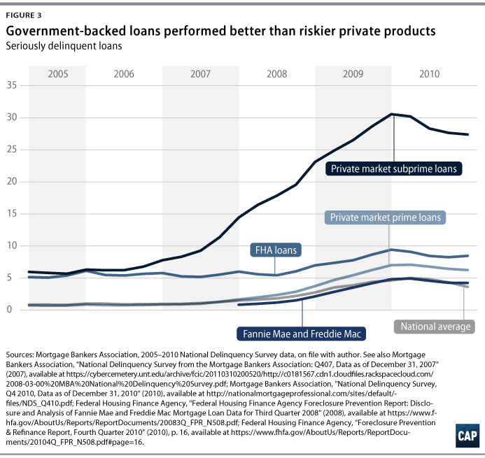

## Table of Contents

## What was the American Dream before the 2008 housing crisis?

Before the 2008 housing crisis, the American Dream was often seen as owning a home, having a good job, and living a comfortable life. Many people believed that if they worked hard, they could achieve this dream. Homeownership was a big part of it because it showed that someone had made it in life. It was also seen as a way to build wealth over time. People felt that with a steady job and a house, they could provide a good future for their families.

However, the idea of the American Dream was not the same for everyone. For some, it meant having the freedom to live the life they wanted, whether that was starting a business or pursuing education. Others saw it as having enough money to enjoy life's pleasures, like traveling or buying nice things. Despite these differences, the core belief was that in America, anyone could achieve their dreams through hard work and determination. This belief was strong before the housing crisis shook the economy and changed many people's lives.

## What caused the 2008 housing crisis?

The 2008 housing crisis was caused by a mix of risky financial practices and too much borrowing. Banks were giving out loans to people who couldn't afford them, known as subprime loans. These loans had low interest rates at first, but then they went up a lot. Many people couldn't pay back these loans when the rates went up. At the same time, banks were selling these loans to investors as mortgage-backed securities. They thought these securities were safe, but they were actually very risky because they were based on loans that might not be paid back.

Another big problem was that housing prices were going up too fast. People thought that prices would keep going up forever, so they kept buying houses. This created a housing bubble. When people couldn't pay their loans, they had to sell their houses. Suddenly, there were too many houses for sale and not enough buyers. Prices started to fall quickly. Banks lost a lot of money because the houses they were holding as collateral were worth less than the loans they had given out. This led to a big financial crisis that affected the whole world.

## How did the 2008 housing crisis affect homeownership rates in the United States?

The 2008 housing crisis had a big impact on homeownership rates in the United States. Before the crisis, homeownership rates were at a high point, reaching about 69% in 2004. But when the crisis hit, many people lost their homes because they couldn't pay their mortgages. This led to a sharp drop in homeownership rates. By 2016, the rate had fallen to about 63%, the lowest it had been in almost 50 years.

The crisis made it harder for people to buy homes even after it was over. Banks became stricter about who they would lend money to, making it tougher for people to get loans. Many people were also scared to buy homes because they remembered how bad the crisis was. It took a long time for homeownership rates to start going up again. Even by 2020, the rate was still below what it was before the crisis, showing how long-lasting the effects were.

## What were the immediate effects of the housing crisis on American families?

The housing crisis hit American families hard right away. Many families lost their homes because they couldn't pay their mortgages. Banks took back the houses, and families had to find new places to live. This was really tough because it meant moving suddenly and often having to live in smaller or less nice places. Losing a home also hurt families' pride and made them feel like they had failed.

On top of losing their homes, many people lost their jobs. The crisis made the economy bad, and companies had to let people go. Without a job, it was even harder for families to pay their bills and take care of their needs. This led to a lot of stress and worry. Families had to cut back on spending, and some even had to rely on help from the government or charities to get by. The crisis changed the way many families lived and made them rethink their dreams and plans for the future.

## How did the crisis influence the perception of the American Dream?

The housing crisis in 2008 changed how people saw the American Dream. Before the crisis, many believed that if you worked hard, you could own a home and live a good life. But when the crisis hit, a lot of people lost their homes and jobs. This made them feel like the American Dream was not real or was too hard to reach. They saw that even with hard work, things could go wrong because of big problems in the economy.

After the crisis, people started to think about the American Dream in different ways. Some felt it was more about being safe and having a steady job than just owning a home. Others thought it was about being happy and not just about money or things. The crisis showed that the old idea of the American Dream was not working for everyone, and people started to look for new ways to find happiness and success.

## What role did government policies play in the aftermath of the crisis?

After the housing crisis, the government had to step in to help fix things. They made new rules to stop the same problems from happening again. One big thing they did was the Dodd-Frank Act. This law made banks be more careful about who they gave loans to and how they handled money. The government also set up the Consumer Financial Protection Bureau to make sure banks treated people fairly. These changes were meant to make the economy safer and help people trust banks again.

The government also helped people who were struggling because of the crisis. They gave money to banks so they wouldn't go out of business and could keep lending money. This was called the Troubled Asset Relief Program, or TARP. They also helped people who lost their homes by giving them money to find new places to live. Programs like the Home Affordable Modification Program helped people change their loans so they could keep their homes. These steps were important to help families get back on their feet and start to feel better about their future.

## How did the housing crisis impact different socioeconomic groups?

The housing crisis hit different groups of people in different ways. For people who were already struggling, like those with low incomes or in minority communities, the crisis made things even harder. Many of these families had taken out risky loans to buy homes, hoping to build a better life. But when the crisis hit, they lost their homes more often than others because they couldn't afford to keep up with the payments. This made it even tougher for them to get back on their feet, and many ended up living in worse conditions or moving to new places.

For middle-class families, the crisis also caused a lot of problems. Many of them lost their homes too, but they often had a bit more savings or family help to fall back on. Still, losing a home was a big shock and made them feel like the American Dream was out of reach. They also had to deal with losing jobs and having less money to spend. This made them rethink what was important and focus more on having a steady job and a safe place to live, rather than just owning a home.

The crisis also affected richer people, but in a different way. They might not have lost their homes, but they saw the value of their homes and investments go down a lot. This made them more careful about where they put their money. Some even had to change their plans for the future because they weren't as wealthy as before. Overall, the crisis showed that no matter how much money you had, it could still shake up your life and make you rethink what the American Dream meant to you.

## What long-term changes occurred in the housing market as a result of the crisis?

After the housing crisis, the housing market changed a lot. Banks started being much stricter about giving out loans. They wanted to make sure people could really afford to pay them back. This meant fewer people could get loans, especially if they didn't have a good credit score or a steady job. It also took longer for home prices to go back up. People were scared to buy homes because they remembered how bad the crisis was. This made the market move more slowly and carefully.

Over time, new rules helped make the housing market safer. The government made laws like the Dodd-Frank Act to stop banks from doing risky things again. They also set up the Consumer Financial Protection Bureau to watch over banks and make sure they treated people fairly. These changes helped people trust the market more, but it still took a long time for things to feel normal again. Homeownership rates stayed lower than before the crisis for many years, showing how big an impact it had on the market and on people's lives.

## How did the crisis affect the financial stability and retirement plans of Americans?

The housing crisis hurt a lot of people's financial stability. Many Americans lost their jobs and homes, which made it hard to save money. Before the crisis, people thought their homes would keep going up in value, so they saw it as a way to build wealth. But when the crisis hit, home values dropped a lot, and many people owed more on their homes than they were worth. This made it tough to sell their homes or use them to get money for other things. Families had to cut back on spending and use up their savings just to get by, which made it hard to feel financially secure.

The crisis also messed up a lot of people's retirement plans. Many people had put their money into the stock market or into their homes, hoping to use that money when they retired. But when the market crashed and home values went down, a lot of that money disappeared. People who were close to retiring had to delay their plans or change them completely. Younger people started to worry more about saving for retirement and looked for safer ways to invest their money. Overall, the crisis made people rethink their plans and try to find new ways to be ready for the future.

## What were the psychological impacts of the housing crisis on homeowners and the general population?

The housing crisis made a lot of people feel really bad. Homeowners who lost their homes felt sad and embarrassed. They worked hard to buy a house, and losing it made them feel like they failed. It was hard for them to move to a new place and start over. Many people also felt stressed and worried because they didn't know what would happen next. They were scared about losing their jobs or not being able to pay their bills. This stress made it hard for them to sleep and enjoy life.

The general population also felt the effects of the crisis. People saw their friends and family struggle, which made them feel sad and worried too. They started to think that the American Dream was not possible anymore. Many people felt angry at the banks and the government for letting the crisis happen. This anger and distrust made people more careful about where they put their money. Overall, the crisis changed how people felt about their future and made them more cautious and less hopeful.

## How have subsequent generations' views on homeownership and the American Dream been shaped by the crisis?

The housing crisis changed how younger people think about owning a home and the American Dream. Many young people saw their parents or other family members lose their homes. This made them scared to buy a house themselves. They started to think that owning a home was too risky and not worth it. Instead of dreaming about a big house, they focused more on having a good job and saving money in safer ways. They also saw that the old idea of the American Dream, where hard work always leads to success, was not always true.

Because of the crisis, younger generations started to see the American Dream differently. They thought more about being happy and safe than just owning things. Some of them wanted to start their own businesses or travel instead of buying a house. They also learned to be more careful with money and not to trust banks too much. The crisis taught them that life can change quickly, so they should be ready for anything and not put all their hopes in one thing like a home.

## What preventive measures have been implemented since the crisis to safeguard the American Dream?

Since the housing crisis, the government has made new rules to keep the American Dream safe. They passed a big law called the Dodd-Frank Act. This law makes banks be more careful about who they give loans to. Banks have to make sure people can really pay back the money they borrow. The government also started the Consumer Financial Protection Bureau. This group watches over banks to make sure they treat people fairly and don't do risky things that could cause another crisis. These changes help people feel safer about buying homes and saving money.

People have also changed how they think about the American Dream. After seeing the crisis, many now focus on having a steady job and saving money in safe ways instead of just wanting to own a big house. They are more careful with their money and don't trust banks as much. Schools and communities teach young people about money and how to avoid risky loans. This helps them make better choices and work towards a dream that feels more possible and less risky. By being more careful and having these new rules, people hope to keep the American Dream alive and make it work for everyone.

## References & Further Reading

[1]: Wilmarth, A. E. (2009). [*The Dark Side of Universal Banking: Financial Conglomerates and the Origins of the Subprime Financial Crisis*](https://papers.ssrn.com/sol3/papers.cfm?abstract_id=1403973). Connecticut Law Review, 41(4), 963-1041.

[2]: Gorton, G. B., & Metrick, A. (2012). [*Getting Up to Speed on the Financial Crisis: A One-Weekend-Reader's Guide*](https://www.nber.org/system/files/working_papers/w17778/w17778.pdf). Journal of Economic Literature, 50(1), 128-150.

[3]: Lo, A. W. (2012). [*Reading About the Financial Crisis: A Twenty-One-Book Review*](https://dspace.mit.edu/bitstream/handle/1721.1/75360/Lo_Reading%20about.pdf). Annual Review of Financial Economics, 4, 1-41.

[4]: Lewis, M. (2010). [*The Big Short: Inside the Doomsday Machine*](https://www.amazon.com/Big-Short-Inside-Doomsday-Machine/dp/0393338827). W. W. Norton & Company.

[5]: MacWhorter, D. (2010). [*The 2008 Financial Crisis and Its Aftermath: Addressing the Next Debt Challenge*](https://papers.ssrn.com/sol3/papers.cfm?abstract_id=1697896). Federal Reserve Bank of St. Louis - Central Banker Magazine.

[6]: Hendershott, T., Jones, C. M., & Menkveld, A. J. (2011). [*Does Algorithmic Trading Improve Liquidity?*](https://onlinelibrary.wiley.com/doi/full/10.1111/j.1540-6261.2010.01624.x) The Review of Financial Studies, 24(8), 2245-2279.

[7]: Malkiel, B. G. (2016). [*A Random Walk Down Wall Street: The Time-tested Strategy for Successful Investing*](https://yourknowledgedigest.org/wp-content/uploads/2020/04/a-random-walk-down-wall-street.pdf). W. W. Norton & Company.

[8]: U. S. Financial Crisis Inquiry Commission. (2011). [*The Financial Crisis Inquiry Report: Final Report of the National Commission on the Causes of the Financial and Economic Crisis in the United States*](https://www.govinfo.gov/app/details/GPO-FCIC/). U.S. Government Printing Office.