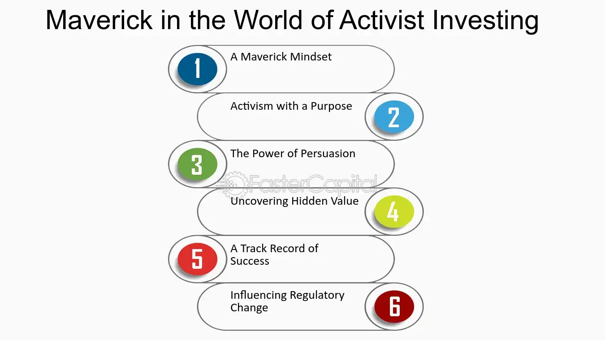

## Table of Contents

## What is an activist investor?

An activist investor is someone who buys a lot of shares in a company and then tries to change how the company is run. They do this because they think the company can do better and make more money if it changes some things. These investors often have specific ideas about what the company should do differently, like selling parts of the business, changing the management team, or doing something else to improve the company's performance.

Activist investors usually start by talking to the company's leaders and trying to convince them to make the changes they want. If that doesn't work, they might use their power as big shareholders to call meetings, propose new ideas at shareholder meetings, or even try to replace the company's board of directors. Their goal is to make the company more valuable, which can help them make more money from their investment.

## How do activist investors influence a company?

Activist investors influence a company by buying a big part of its shares. This gives them a lot of power because they can vote on important decisions. They often talk to the company's leaders and try to convince them to make changes. These changes might be about selling parts of the business, changing who runs the company, or doing something else to make the company better. If the leaders don't agree, the activist investors might call special meetings or suggest new ideas at shareholder meetings.

If talking doesn't work, activist investors can use their voting power to make bigger changes. They might try to replace the company's board of directors with people who agree with their ideas. This can lead to big shifts in how the company is run. By pushing for these changes, activist investors hope to make the company more valuable. If the company does better, the value of their shares goes up, and they can make more money.

## What are the common goals of activist investors?

Activist investors usually want to make the company they invest in more valuable. They do this by trying to change how the company is run. They might think the company should sell some parts of its business that aren't doing well. Or they might believe the company should focus on different products or services. Their main goal is to make the company more profitable, which can make their shares worth more money.

Sometimes, activist investors want to change the people who are in charge of the company. They might think the current leaders are not doing a good job. So, they try to replace the board of directors with new people who agree with their ideas. By doing this, they hope to steer the company in a new direction that will make it more successful. In the end, their goal is to increase the value of their investment.

## Can you provide examples of successful activist investor campaigns?

One example of a successful activist investor campaign is when Carl Icahn targeted Apple in 2013. Icahn bought a lot of Apple shares and then pushed the company to buy back more of its own stock. He thought this would make the remaining shares more valuable. Apple listened to Icahn and started a big stock buyback program. This made the value of Apple's shares go up, and Icahn made a lot of money from his investment.

Another example is when Nelson Peltz and his firm Trian Fund Management got involved with Procter & Gamble in 2017. Peltz wanted to join the board of directors to help the company grow faster. He thought P&G could do better by focusing on its top brands and cutting costs. After a long fight, Peltz won a seat on the board. P&G then made changes that helped the company's stock price go up, showing that Peltz's ideas worked.

These examples show how activist investors can make big changes in companies. By buying a lot of shares and pushing for their ideas, they can help companies become more valuable. This can lead to higher stock prices and more money for everyone who owns shares in the company.

## What are the potential benefits of activist investors for a company?

Activist investors can help a company by making it more valuable. They do this by suggesting changes that can make the company work better. For example, they might say the company should sell parts of the business that are not doing well. Or they might think the company should focus on different products or services. By making these changes, the company can become more profitable. This can make the value of the company's shares go up, which is good for everyone who owns them.

Another benefit is that activist investors can bring new ideas and energy to a company. Sometimes, the people running the company might be stuck in old ways of doing things. Activist investors can shake things up by pushing for new leaders or a new board of directors. This can lead to fresh thinking and better decisions. When a company starts doing things differently and better, it can grow and make more money. This helps the company and its shareholders in the long run.

## What are the potential risks or downsides of activist investor involvement?

Activist investors can cause problems for a company. Sometimes, they focus too much on short-term gains, like making the stock price go up quickly. This can lead to decisions that might not be good for the company in the long run. For example, they might push the company to sell important parts of the business just to make a quick profit. This can hurt the company's future growth and stability.

Also, activist investors can create a lot of conflict and stress within the company. When they try to change the leadership or the board of directors, it can lead to fights and disagreements. This can make it hard for the company to focus on its main goals. Instead of working together to grow the business, the leaders might spend a lot of time dealing with the activist's demands. This can slow down the company and make it less successful.

## How do activist investors typically acquire their stakes in a company?

Activist investors usually start by buying a lot of shares in a company. They do this quietly, often through the stock market, so they can build up a big stake without the company knowing right away. They might buy shares over time or all at once, depending on their strategy. The goal is to get enough shares to have a strong say in the company's decisions.

Once they have a big enough stake, activist investors might tell the company about their plans. They could send a letter to the board of directors or talk to the company's leaders directly. Sometimes, they might even make their stake public to put pressure on the company. By doing this, they can start pushing for the changes they want to see, like selling parts of the business or changing the leadership.

## What role does corporate governance play in activist investing?

Corporate governance is really important in activist investing. It's all about how a company is run and who makes the big decisions. Activist investors look at a company's corporate governance to see if they can make changes that will make the company better. They might think the board of directors isn't doing a good job, or that the company's rules need to change. By focusing on corporate governance, activist investors can push for new leaders or different ways of running the company.

When activist investors get involved, they often try to change the company's corporate governance. They might want to replace some board members with people who agree with their ideas. Or they might suggest new rules that make the company more open and fair. By doing this, they hope to make the company more valuable. Good corporate governance can help the company make better decisions and grow, which is good for everyone who owns shares in the company.

## How do companies respond to activist investors, and what strategies can they employ?

Companies often respond to activist investors by listening to their ideas and trying to work with them. They might meet with the activists to discuss their concerns and see if they can agree on some changes. If the company thinks the activist's ideas are good, they might start making those changes. This can help the company avoid big fights and keep everyone happy. Sometimes, the company's leaders might even agree to add the activist to the board of directors to show they are serious about making improvements.

But sometimes, companies don't agree with the activist investors. When this happens, the company might fight back. They could tell their other shareholders why they think the activist's ideas are wrong. They might also try to show how they are already working to make the company better. In these cases, the company might need to spend a lot of time and money to defend itself. They could hire experts to help them explain their side of the story and keep control of the company.

## What is the impact of activist investors on stock prices and market performance?

When activist investors get involved with a company, it can make the stock price go up right away. This is because people think the company will make changes that will make it more valuable. When the activist's ideas are announced, other investors might buy the company's shares, hoping to make money from the expected improvements. But sometimes, the stock price can go down if people think the activist's ideas are bad for the company in the long run.

The overall impact on market performance can be mixed. Sometimes, the changes activist investors push for can make a company more successful and help the whole market grow. But other times, if the changes are too focused on quick profits, they might hurt the company and the market in the long run. It all depends on whether the activist's ideas are good for the company and how well the company can handle the changes.

## How do regulatory environments affect the strategies and success of activist investors?

The rules and laws in different countries can really change how activist investors work and how well they do. In some places, the rules make it easier for activist investors to buy a lot of shares and push for changes. For example, if the rules let them buy shares without telling everyone right away, they can build up a big stake quietly. But in other places, the rules might make it harder. They might have to tell the company and everyone else as soon as they start buying shares, which can make it tougher to get a big stake without the company fighting back.

These rules can also affect how successful activist investors are. If the rules make it easy for them to change the board of directors or vote on big decisions, they can make the changes they want more easily. But if the rules are strict and make it hard to do these things, the activist investors might not be able to make the company better. So, the success of activist investors can depend a lot on the rules in the country where the company is based.

## What are the long-term effects of activist investing on the economy and market dynamics?

Activist investing can have big effects on the economy and how markets work over time. When activist investors push companies to make changes, it can make those companies more valuable and profitable. This can help the economy grow because successful companies create jobs and spend more money. But if activist investors focus too much on quick profits, they might make companies do things that are not good for them in the long run. This can hurt the economy if it leads to companies failing or not being able to grow properly.

The way activist investors work can also change how markets act. When they get involved, it can make other investors pay more attention to the companies they target. This can make stock prices go up and down more than usual. Over time, this can make markets more active and exciting, but also more risky. If a lot of companies start making big changes because of activist investors, it can shake up whole industries. This can lead to new ways of doing business and more competition, which can be good for the economy. But it can also make things less stable if too many companies are changing at the same time.

## References & Further Reading

[1]: Fink, L. (2020). ["High-Frequency Trading: Evolution and the Future"](https://www.jstor.org/stable/pdf/45286297.pdf). Journal of Investment Strategies, 5(1), 23-47.

[2]: Kahan, M., & Rock, E. B. (2007). ["Hedge Funds in Corporate Governance and Corporate Control."](https://papers.ssrn.com/sol3/papers.cfm?abstract_id=919881) University of Pennsylvania Law Review, 155(5), 1021-1093.

[3]: Gillan, S. L., & Starks, L. T. (2007). ["The Evolution of Shareholder Activism in the United States."](https://papers.ssrn.com/sol3/papers.cfm?abstract_id=959670) Review of Financial Studies, 22(12), 4463-4488.

[4]: Fry, R. (2010). ["Algorithmic Trading and Its Impacts on the Stock Market."](https://www.researchgate.net/publication/378548435_Algorithmic_Trading_and_AI_A_Review_of_Strategies_and_Market_Impact) Financial Analysts Journal, 66(2), 41-54.

[5]: Bugg-Levine, A., & Emerson, J. (2011). ["Impact Investing: Transforming How We Make Money While Making a Difference"](https://direct.mit.edu/itgg/article/6/3/9/9670/Impact-Investing-Transforming-How-We-Make-Money). Jossey-Bass. 

[6]: Lopez de Prado, M. (2018). ["Advances in Financial Machine Learning"](https://www.amazon.com/Advances-Financial-Machine-Learning-Marcos/dp/1119482089). Wiley.

[7]: Summers, L. H., & Summers, V. P. (1989). ["When Financial Markets Work too Well: A Cautious Case for a Securities Transactions Tax."](https://link.springer.com/chapter/10.1007/978-94-009-2193-1_13) Journal of Financial Services Research, 3(2-3), 261-286.

[8]: Eccles, R. G., Ioannou, I., & Serafeim, G. (2014). ["The Impact of Corporate Sustainability on Organizational Processes and Performance."](https://papers.ssrn.com/sol3/papers.cfm?abstract_id=1964011) Management Science, 60(11), 2835-2857.