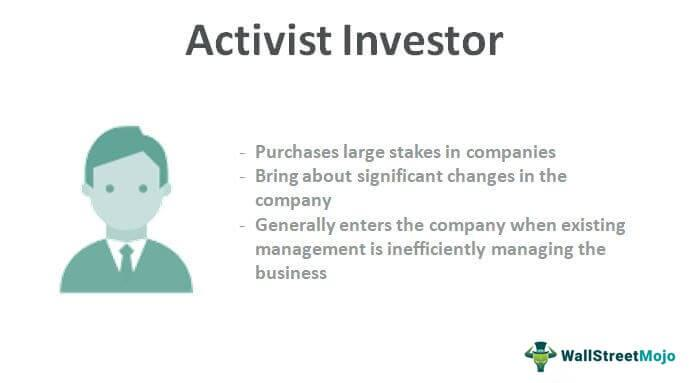

In recent years, the landscape of investment has broadened to include more than just traditional stock purchases and hold strategies. Investors are increasingly exploring innovative approaches that cater to a diverse range of intentions, such as ethical concerns, profit maximization, and operational efficiencies. Three significant areas of investment—impact investment, activist investors, and algorithmic trading—are at the forefront of this evolving financial environment.

Impact investment seeks to generate positive social or environmental impacts alongside financial returns. This approach is gaining traction as more individuals and institutions prioritize investments that reflect their values and contribute to societal good. The focus goes beyond monetary gains to encompass measurable contributions towards solving global challenges.

Activist investors distinguish themselves by acquiring substantial stakes in companies to influence corporate strategies and enhance shareholder value. Prominent figures in this field have played pivotal roles in prompting changes that might include restructuring, mergers, or shifts in operational focus. Despite the potential benefits, such as increased efficiency and stockholder satisfaction, activist investing often involves debates around its aggressive tactics and the resultant tensions with corporate management.

Algorithmic trading represents a technological advancement where complex algorithms perform trades at speeds beyond human capability. This method utilizes quantitative analyses to make split-second trading decisions, significantly affecting market liquidity and trading volumes. While it offers benefits like reduced transaction costs and improved market efficiency, it also raises concerns about market volatility and potential disruptions due to algorithmic errors.

Each of these investment strategies offers distinct advantages and poses unique challenges in the financial markets, shaping investment behaviors and outcomes. By understanding these approaches, investors can make informed choices that align with their specific goals—whether focusing on ethical impacts, financial gains, or enhancing market participation through technology. The interplay between these strategies may lead to innovative solutions that address diverse investor needs and preferences in the constantly evolving world of investments.

## Table of Contents

## Understanding Impact Investment

Impact investment refers to investments made with the intention of generating a positive, measurable social or environmental impact alongside a financial return. This investment strategy addresses the growing concern among investors about aligning their investment portfolios with personal values and societal goals. As environmental issues and social inequities become more pronounced, this approach is increasingly appealing to investors seeking to contribute positively to society while [earning](/wiki/earning-announcement) financial returns.

A primary characteristic of impact investments is their focus on sectors often tied to sustainable and equitable growth. Key sectors include renewable energy, where funds are directed towards developing sustainable energy solutions that reduce carbon footprint; affordable housing, which emphasizes creating housing solutions that are accessible to lower-income populations; healthcare, targeting improved access to health services; and education, improving educational opportunities and infrastructure.

In traditional investing, the metrics for success are mainly financial, focusing on indicators like return on investment (ROI) or net profit. However, in impact investing, the measurement of success extends beyond financial metrics to include social or environmental contributions. Impact investors utilize various frameworks and standards to measure and report their impact, such as the Global Impact Investing Network's (GIIN) Impact Reporting and Investment Standards (IRIS) and the Sustainable Development Goals (SDGs) by the United Nations. These tools help quantify outcomes such as the reduction in carbon emissions, the number of affordable housing units developed, or the expansion of educational facilities.

While the appeal of impact investing continues to grow, it faces significant challenges. One of the foremost difficulties is the measurement of impact outcomes. Unlike financial metrics, which are relatively straightforward to quantify and compare, social and environmental impacts can be complex to assess and are often subject to different interpretations. Standardizing these impact measurements is crucial to ensuring transparency and accountability.

Another challenge is balancing profit with social goals. Investors seeking to generate a return must evaluate potential trade-offs between maximizing financial returns and achieving intended impacts. This often involves a recalibration of investment strategies, such as accepting lower financial returns for investments that promise high social impact or targeting ventures that integrate sustainability into their business models.

Part of tackling these challenges involves developing sophisticated methods and tools to evaluate and manage both financial performance and impact outcomes effectively. For instance, investors might leverage data analytics and technology to conduct deeper due diligence on prospective investments, continuously monitor impact performance, and adapt to evolving circumstances.

In summary, impact investing represents a burgeoning sector within the larger financial landscape, promising dual benefits of societal good and financial returns. Despite its challenges, this investment strategy is set to play an increasingly vital role among investors driven by the dual goals of sustainability and profit. Continued evolution in measurement tools and frameworks will likely facilitate more robust growth in the sector, helping investors to align their portfolios more closely with ethical and sustainable goals.

## Activist Investors: Change Catalysts

Activist investors strategically purchase substantial stakes in companies to exert influence over corporate strategies and operational practices, primarily with the objective of enhancing shareholder value. These investors view their investment as a tool for prompting significant changes within the company which they believe can increase the company’s overall value and, consequently, their investment return.

Prominent activist investors such as Carl Icahn and Bill Ackman have historically wielded their influence to redirect company policies, governance, and financial strategies. For example, by acquiring sizeable shares, these investors gain a platform to propose or demand strategic changes like mergers, divestitures, or restructuring initiatives aimed at operational efficiency, potentially leading to a revaluation of the company’s stock.

While the involvement of activist investors can foster positive transformation within target companies, it is not without its challenges. These investors often employ aggressive tactics that may create tension and conflict with the existing company management. Such conflicts can destabilize company operations and elicit volatile responses in stock prices as investors react to uncertainty and perceived risks associated with the proposed changes.

The outcomes of activist interventions are varied and can be contentious. On one hand, they have the potential to unlock latent value in underperforming companies or redirect strategic focuses towards more profitable avenues. On the other hand, the pressure to deliver quick shareholder returns might compromise long-term company health or neglect stakeholder interests beyond shareholders.

Consequently, the role of activist investors is marked by its capacity to serve as both a conduit of value creation and a source of contention. Shareholders and companies might experience these interventions differently, depending on how well the strategic changes align with their expectations and investment horizons.

## Algorithmic Trading: Automation and Efficiency

Algorithmic trading fundamentally transforms the dynamics of financial markets by utilizing sophisticated algorithms to perform trades at speeds and frequencies beyond human capability. This advanced technology hinges on quantitative analysis, allowing for rapid decision-making and execution of trades within milliseconds. The profound impact of [algorithmic trading](/wiki/algorithmic-trading) is evident in the increased [liquidity](/wiki/liquidity-risk-premium) and heightened trading volumes that it promotes within markets.

At its core, algorithmic trading reduces transaction costs through high-frequency trading ([HFT](/wiki/high-frequency-trading-strategies)), utilizing automated systems that identify market inefficiencies and capitalize on them before traditional traders can respond. This efficiency is achieved by quickly processing large datasets and leveraging predictive analytics to forecast price movements. Consequently, it not only improves market efficiency by narrowing bid-ask spreads but also enhances price discovery mechanisms.

Algorithmic trading's advantages are not without potential drawbacks. One major concern revolves around market [volatility](/wiki/volatility-trading-strategies) and fairness. The high-speed nature of algorithmic trades can exacerbate market fluctuations, as evidenced during the 2010 Flash Crash when erroneous algorithms triggered a rapid sell-off. Such incidents raise questions about market stability and the potential for systemic risks initiated by faulty algorithms. Furthermore, the propensity for algorithms to amplify market trends can lead to liquidity shortages during extreme market conditions.

Despite these challenges, algorithmic trading remains a predominant force among traders, particularly large institutions. By executing substantial volumes of trades with minimal impact on pricing, these institutions strategically deploy algorithms to maintain competitive edges. For instance, an institutional trader might use a Volume-Weighted Average Price (VWAP) strategy, whereby an algorithm slices large orders into smaller ones and executes them over a specific time frame, thereby diminishing any adverse market impact. This approach not only optimizes execution but also aligns with the institution's broader trading strategies.

The proliferation of algorithmic trading has also prompted increased regulatory scrutiny aimed at safeguarding market integrity. Regulatory bodies emphasize the need for robust risk management frameworks and testing procedures to ensure the reliability and accountability of trading algorithms. As algorithmic trading continues to evolve, balancing its benefits with effective regulation will be critical in maintaining a fair and stable market environment.

## The Interplay Between Impact Investment, Activism, and Algo Trading

Impact investment, activist investing, and algorithmic trading, while seemingly distinct, increasingly intersect and influence one another in contemporary financial markets. Each strategy, rooted in different principles and methodologies, can complement the others to meet diverse investment objectives.

Impact investors, traditionally focused on generating both financial returns and positive social or environmental outcomes, can leverage activist strategies to instigate governance reforms in target companies. By using their stake as a platform for advocating changes, impact investors can ensure that corporations prioritize social goals alongside profitability. This synergy enhances the alignment of corporate practices with the investors’ ethical imperatives, such as sustainable resource management or equitable labor practices. 

Algorithmic trading, with its foundation in speed and efficiency, presents benefits to impact investors by optimizing the execution of trades. Through advanced algorithms, trades can be executed in milliseconds, capitalizing on market efficiencies while minimizing transaction costs. This capability allows impact investors to participate in markets in a way that aligns with both ethical objectives and financial prudence. For instance, an impact-focused algorithm might prioritize trading in companies with high environmental, social, and governance ([ESG](/wiki/esg-investing)) ratings, executing trades only when predetermined ethical criteria are met.

Activist investors, known for acquiring significant stakes to exert influence over corporate management, can employ algorithmic trading techniques to swiftly amass shares. This strategic advantage enables activists to implement changes more rapidly, as their substantial holdings can sway board decisions or initiate shareholder resolutions. The ability to quickly acquire large positions helps activists apply pressure on companies, ensuring that proposed changes, such as divestitures or new strategic directions, are considered promptly.

The convergence of these approaches is paving the way for innovative investment products that address both financial and non-financial goals. Algorithmically-managed impact investment funds, for example, can dynamically balance portfolios to maximize returns while adhering to social impact criteria. Similarly, activist hedge funds could incorporate algorithmic systems to track and target companies that misalign with sustainable practices, allowing for tactical interventions that promote corporate responsibility.

In conclusion, the merging of impact investment, activism, and algorithmic trading represents a shift towards more holistic investment strategies designed to satisfy a range of investor priorities, from return maximization to social impact. This interplay reflects the evolving nature of financial markets, characterized by the blending of ethical considerations with technologically-driven efficiency and strategic shareholder engagement.

## Conclusion

Impact investing, activist investors, and algorithmic trading significantly influence today's financial markets by contributing unique perspectives and methodologies. Each approach brings valuable opportunities for diversification and aligning investment strategies with broader socio-economic goals, while also posing distinct challenges. Impact investing empowers investors to support ventures that yield social and environmental benefits alongside financial returns. This alignment of capital with values is increasingly appealing to investors wary of purely profit-driven goals. Conversely, activist investors drive change within corporations, leveraging significant stakes to advocate for operational or strategic modifications that potentially enhance shareholder value. Algorithmic trading contributes to market efficiency by facilitating rapid, automated trade executions that could reduce transaction costs and limit market impact.

These strategies exhibit both synergetic and conflicting dynamics. As these investment modalities evolve, future trends will likely involve an intricate integration, fostering more dynamic and personalized solutions for investors. For example, impact investors could adopt algorithmic tools to maximize portfolio efficiency while maintaining ethical standards. Activist investors might similarly leverage algorithmic trading to secure quick, substantial share purchases, reinforcing their influence over corporate governance changes.

Comprehending these methods enables investors to make well-informed decisions, harmonizing financial targets with personal convictions and ethical principles. As the investment ecosystem constantly evolves, staying informed on how these strategies converge or diverge is essential. Thus, strategically navigating this complex landscape will necessitate a continuous examination of their interactions and implications for both individual goals and broader market trends.

## References & Further Reading

[1]: Fink, L. (2020). ["High-Frequency Trading: Evolution and the Future"](https://www.jstor.org/stable/pdf/45286297.pdf). Journal of Investment Strategies, 5(1), 23-47.

[2]: Kahan, M., & Rock, E. B. (2007). ["Hedge Funds in Corporate Governance and Corporate Control."](https://papers.ssrn.com/sol3/papers.cfm?abstract_id=919881) University of Pennsylvania Law Review, 155(5), 1021-1093.

[3]: Gillan, S. L., & Starks, L. T. (2007). ["The Evolution of Shareholder Activism in the United States."](https://papers.ssrn.com/sol3/papers.cfm?abstract_id=959670) Review of Financial Studies, 22(12), 4463-4488.

[4]: Fry, R. (2010). ["Algorithmic Trading and Its Impacts on the Stock Market."](https://www.researchgate.net/publication/378548435_Algorithmic_Trading_and_AI_A_Review_of_Strategies_and_Market_Impact) Financial Analysts Journal, 66(2), 41-54.

[5]: Bugg-Levine, A., & Emerson, J. (2011). ["Impact Investing: Transforming How We Make Money While Making a Difference"](https://direct.mit.edu/itgg/article/6/3/9/9670/Impact-Investing-Transforming-How-We-Make-Money). Jossey-Bass. 

[6]: Lopez de Prado, M. (2018). ["Advances in Financial Machine Learning"](https://www.amazon.com/Advances-Financial-Machine-Learning-Marcos/dp/1119482089). Wiley.

[7]: Summers, L. H., & Summers, V. P. (1989). ["When Financial Markets Work too Well: A Cautious Case for a Securities Transactions Tax."](https://link.springer.com/chapter/10.1007/978-94-009-2193-1_13) Journal of Financial Services Research, 3(2-3), 261-286.

[8]: Eccles, R. G., Ioannou, I., & Serafeim, G. (2014). ["The Impact of Corporate Sustainability on Organizational Processes and Performance."](https://papers.ssrn.com/sol3/papers.cfm?abstract_id=1964011) Management Science, 60(11), 2835-2857.