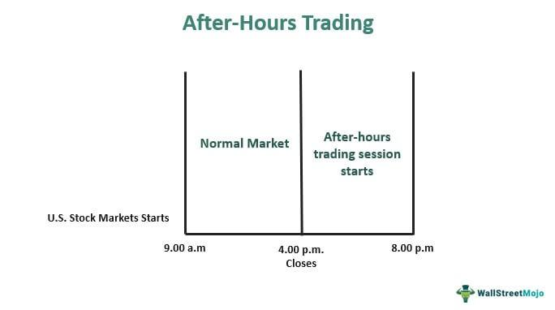

In today's fast-paced financial markets, after-hours trading has emerged as a crucial component of an investor's strategy. Unlike the traditional trading hours defined by major exchanges such as the NYSE and Nasdaq, after-hours trading allows for transactions beyond these boundaries, thereby increasing the opportunities for engagement with the market. This expanded trading period offers investors the ability to react to news and events occurring after the standard market close, which can lead to significant price movements before the next official opening. Algorithmic trading, with its ability to execute trades at high speeds and based on specific criteria, plays an integral role in shaping these after-hours market movements.

The impact of after-hours trading on stock prices is a significant consideration for investors as it can heavily influence the next day's market open. This article will explore the mechanics behind after-hours trading, including its potential benefits and associated risks. Understanding how algorithmic trading contributes to liquidity and volatility during these extended sessions will illuminate the nuances that both individual and institutional investors must navigate.

With this knowledge, investors can gain valuable insights that enhance their decision-making and strategic planning, ultimately enabling a more informed approach to engaging with the ever-evolving financial markets. Join us as we explore this essential aspect of modern trading, discussing the intricate interplay between technology and market forces that define after-hours trading.

## Table of Contents

## What is After-Hours Trading?

After-hours trading allows investors to trade stocks outside the standard trading hours of significant exchanges like the New York Stock Exchange (NYSE) and Nasdaq, typically taking place between 4:00 p.m. and 8:00 p.m. Eastern Standard Time (EST). This extended trading period enables investors to respond to news and events occurring after official market hours, such as corporate earnings announcements, geopolitical developments, or macroeconomic data releases.

The trades during after-hours trading are executed via electronic communication networks (ECNs). ECNs are automated systems that match buy and sell orders, facilitating direct trading between market participants without the need for a traditional stock exchange. This electronic platform offers a direct link for buyers and sellers to interact, often with faster transaction times and potentially lower transaction costs.

Despite the flexibility and opportunities that after-hours trading provides, it presents unique challenges. One primary challenge is lower liquidity, which refers to the reduced volume of trades occurring during this period compared to regular trading hours. Lower liquidity can lead to wider bid-ask spreads, where the difference between the asking price and the selling price of a stock widens, making it more costly to execute a trade.

Increased [volatility](/wiki/volatility-trading-strategies) is another challenge associated with after-hours trading. Due to the lower number of market participants and reduced trading volumes, price swings can be more pronounced. This heightened volatility can result in dramatic fluctuations in stock prices, which may not always reflect the underlying fundamentals of a company or market sentiment accurately.

Investors engaging in after-hours trading should be mindful of these challenges and consider their risk tolerance and trading strategy when navigating this extended trading session.

## The Role of Algorithmic Trading

Algorithmic trading utilizes computer algorithms to execute trades according to predefined conditions and strategies. This approach is prominently featured in after-hours trading due to its ability to exploit price inefficiencies rapidly. When news breaks outside regular trading hours, algorithms can instantly analyze the impact and make trading decisions in milliseconds, thereby enabling traders to seize opportunities that might not be accessible to those operating manually.

The speed and efficiency of [algorithmic trading](/wiki/algorithmic-trading), however, come with the potential to create significant volatility during after-hours sessions. This is primarily because algorithms, when executing high-frequency trades, can drive sudden and large price swings. The rapid execution capabilities of these algorithms can lead to increased market activity in a relatively illiquid environment, amplifying price movements beyond what might occur during normal trading hours. This heightened volatility can create risks for traders relying solely on human decision-making processes.

Algorithmic trading also plays a crucial role in enhancing [liquidity](/wiki/liquidity-risk-premium) and efficiency during after-hours trading. In markets that are typically less liquid after regular closing times, algorithms can provide continuous two-way quotes that facilitate buying and selling, thus ensuring that the market remains functional and accessible for interested participants. This continuous liquidity provision helps minimize transaction costs and provides smoother execution for traders.

Despite these advantages, the widespread use of algorithms in after-hours trading has raised concerns about market manipulation and fairness. Some critics argue that the ability to execute trades with such speed and precision may lead to unfair advantages, particularly for institutional investors with access to sophisticated trading technologies. There is also the potential for algorithms to engage in manipulative tactics, such as spoofing, where fake orders are placed to mislead other market participants about the demand or supply of a security.

The debate around algorithmic trading centers on the balance between fostering an efficient market environment and ensuring that the market operates in a fair and transparent manner. Regulators are continually adapting policies to address these concerns while allowing markets to benefit from the technological advancements that algorithmic trading offers. As such, continuous monitoring and refinement of trading strategies and regulatory frameworks are essential to maintaining the integrity and fairness of financial markets.

## Pros and Cons of After-Hours Trading

After-hours trading presents both advantages and disadvantages that investors need to consider carefully. One of the primary benefits is the ability to rapidly respond to news and events that occur outside regular trading hours, which typically span from 9:30 a.m. to 4:00 p.m. EST on major U.S. exchanges like the NYSE and Nasdaq. This flexibility allows investors to capitalize on breaking news that might affect stock prices before the market opens the next day. Consequently, it can lead to greater investment opportunities and potentially increased returns for those who can make informed and timely decisions.

Additionally, after-hours trading offers a convenient option for investors who have other commitments during standard market hours. This extended window provides the opportunity to monitor and adjust their portfolios at times that fit their schedules, potentially enhancing their ability to manage risk and seize investment opportunities.

However, the after-hours trading environment is fraught with significant challenges. One major drawback is lower liquidity, which can result in wider bid-ask spreads. Lower liquidity means fewer participants are trading, which can lead to less favorable prices and more difficulty in executing trades at desired levels. This condition often leads to increased volatility, as even small trades can cause significant price swings due to the reduced number of buyers and sellers.

Investors also face the risk of incomplete orders or unexpected price movements during after-hours trading. With fewer active traders, an order might not be fully executed, or it might be filled at a significantly different price than anticipated. This uncertainty necessitates the use of strategies, such as limit orders, to better control the execution price, although it may also result in unfilled orders if the market does not reach the specified limit.

Understanding these pros and cons is essential for any investor considering participation in after-hours trading. By recognizing the potential for rapid response and increased flexibility alongside the risks of lower liquidity and heightened volatility, investors can make more informed decisions and better align their strategies with their risk tolerance and investment goals.

## Impact on Stock Prices

After-hours trading has a pronounced effect on stock prices, primarily influencing the opening price of the next day's trading session. This influence is most evident in the reaction to earnings reports and major announcements released outside regular trading hours. For example, when a company announces better-than-expected earnings results after the market has closed, its stock may experience a price surge in after-hours trading. Conversely, disappointing news can lead to a decline.

These movements in after-hours trading can serve as predictors of investor sentiment and potential market trends. They often reflect the initial responses of traders to new information, providing insights into broader market perceptions. Such price shifts can indicate how investors might react when regular trading resumes, thereby setting the tone for the next trading day.

However, the reduced participation during after-hours periods can sometimes lead to exaggerated price movements, giving a misleading impression of a stock's intrinsic value. With fewer market participants, liquidity is lower, which can result in wider bid-ask spreads and increased volatility. This environment can cause prices to deviate significantly from their closing levels in standard hours, only to correct once the full market opens.

Given these dynamics, investors are advised to approach after-hours price changes with caution. It is essential to consider the broader market conditions and other contextual factors when interpreting these movements. Understanding that price changes during this time may not fully represent the consensus view can help in making more informed investment decisions.

After-hours trading also highlights the market's ability to quickly and decisively respond to new information. The speed at which stock prices adjust reflects the efficiency with which markets can incorporate and react to fresh data. This responsiveness underscores the importance of staying informed and updated on relevant news and developments outside regular trading hours for investors aiming to manage their portfolios effectively.

## After-Hours Trading Strategies

After-hours trading presents unique opportunities and challenges, requiring investors to adopt specific strategies to navigate its distinct market conditions. One commonly used approach is employing limit orders. Limit orders enable traders to specify the maximum or minimum price at which they are willing to buy or sell a stock, which is particularly useful during after-hours when volatility and price swings can be more pronounced. By setting a price limit, investors can minimize the risk of executing a trade at an unfavorable rate.

Traders may also use after-hours trading to strategically position themselves ahead of anticipated market news. For example, if a trader expects a company to release positive earnings, they might purchase shares after regular market hours to capitalize on potential price increases once the news is made public. This methodology requires a thorough understanding of market catalysts and timing to execute successfully.

Understanding one's risk tolerance and investment goals is crucial when engaging in after-hours trading. Investors should assess how much risk they are willing to accept and align their trading strategies with their broader financial objectives. This introspection helps in crafting a balanced approach that considers both potential rewards and inherent risks.

Working with a broker that provides a robust after-hours trading platform can significantly enhance an investor's trading experience. Brokers offering seamless access to electronic communication networks (ECNs) and detailed market data can facilitate more informed decision-making. A comprehensive platform can provide real-time data, analytics tools, and support, thereby aiding investors in navigating after-hours market complexities.

Lastly, diligent analysis of pre-market and after-hours data can enable informed trading decisions. Investors should scrutinize [volume](/wiki/volume-trading-strategy) trends, price movements, and broader market indicators during these periods. This analysis can uncover patterns and provide insights into potential price directions, aiding investors in executing strategic trades. Employing technical analysis tools and staying informed about economic indicators and news events are integral to building a successful after-hours trading strategy.

## Conclusion

After-hours trading offers distinct opportunities and challenges that significantly affect stock prices. This trading window allows investors to respond swiftly to news and events occurring after regular market hours, providing crucial opportunities for strategic trades. However, it also brings forth notable challenges like reduced liquidity and heightened volatility, which demand careful consideration and strategy.

Algorithmic trading plays a crucial role in after-hours trading by ensuring that trades are executed with speed and precision. These sophisticated computer programs are designed to [carry](/wiki/carry-trading) out trades based on predetermined criteria, which can lead to rapid price changes and contribute to increased volatility in this session. The ability to execute trades quickly means that algorithmic tools are indispensable, reflecting the importance of technological sophistication in modern investing.

However, investors must balance the benefits of immediate responsiveness with potential risks. The reduced liquidity during after-hours trading can result in wider bid-ask spreads and significant price swings, presenting challenges for obtaining favorable prices. This is why understanding market dynamics and anticipating potential risks are vital components of a successful trading strategy.

Being well-informed and prepared is crucial in optimizing the benefits of after-hours trading. Investors should continually assess market conditions, maintain a keen awareness of how major announcements might influence prices, and refine their strategies accordingly. This level of preparedness ensures that they are not caught off guard by unexpected market movements.

In this ever-evolving market environment, strategic planning and a deep understanding of market mechanics are key to navigating the challenges and leveraging the opportunities of after-hours trading. Investors who approach this segment of the market with careful analysis and tactical foresight are more likely to succeed in achieving their financial objectives.

## References & Further Reading

[1]: Barclay, M. J., & Hendershott, T. (2003). ["Price Discovery and Trading After Hours."](https://faculty.haas.berkeley.edu/hender/after_hours_price_discovery.pdf) The Review of Financial Studies, 16(4), 1041-1073.

[2]: O'Hara, M. (2015). ["High Frequency Market Microstructure."](https://www.sciencedirect.com/science/article/pii/S0304405X15000045) Journal of Financial Economics, 116(2), 257-270.

[3]: Gomber, P., Arndt, B., Lutat, M., & Uhle, T. (2011). ["High-Frequency Trading."](https://papers.ssrn.com/sol3/papers.cfm?abstract_id=1858626) International Encyclopedia of Statistical Science, 645-648.

[4]: Harris, L. (2003). ["Trading & Exchanges: Market Microstructure for Practitioners."](https://academic.oup.com/book/52292) Oxford University Press.

[5]: Easley, D., Lopez de Prado, M. M., & O'Hara, M. (2012). ["Flow Toxicity and Liquidity in a High-Frequency World."](https://academic.oup.com/rfs/article-abstract/25/5/1457/1569929) The Review of Financial Studies, 25(5), 1457-1493.