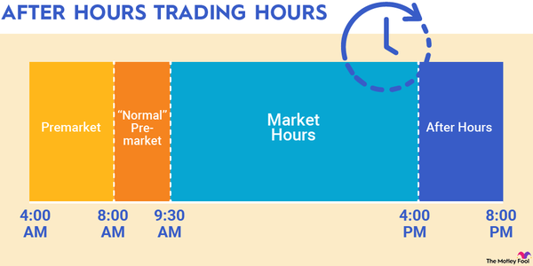

## Table of Contents

## What is after-hours trading?

After-hours trading is when people buy and sell stocks outside of the normal trading hours of the stock market. The normal trading hours are usually from 9:30 AM to 4:00 PM Eastern Time, Monday through Friday. After-hours trading happens before the market opens in the morning and after it closes in the evening.

This type of trading can be useful for people who can't trade during the day because of their jobs or other commitments. However, it can also be riskier. There are usually fewer people trading after hours, so the prices can change more quickly and there might be less information available to help make decisions.

## How does after-hours trading differ from regular trading hours?

After-hours trading happens before and after the regular trading hours of the stock market. Regular trading hours are from 9:30 AM to 4:00 PM Eastern Time, but after-hours trading can happen from 4:00 PM to 8:00 PM and sometimes even earlier in the morning. This means people can buy and sell stocks when the market is officially closed.

The main difference is that after-hours trading can be riskier. During regular hours, there are lots of people trading, so prices usually change slowly and there's a lot of information available. But after hours, fewer people are trading, so prices can change more quickly and there might not be as much information to help make good decisions. This can make it harder to predict what will happen to stock prices.

## Can anyone participate in after-hours trading?

Not everyone can participate in after-hours trading. You usually need to have a special account with a broker that allows after-hours trading. Some brokers let you do this, but others don't. So, you need to check with your broker to see if you can trade after hours.

Also, even if your broker allows it, you need to be careful. Trading after hours can be riskier because fewer people are trading, so prices can change quickly. It's important to understand these risks before you start trading outside of regular hours.

## What types of stocks are typically traded after hours?

After-hours trading often involves stocks that have news or events happening outside of regular trading hours. This can include big companies that release their earnings reports after the market closes. When a company announces how much money it made, it can affect the stock price a lot, so people might want to trade right away, even if it's after hours.

Also, stocks of companies that are in the news for other reasons might be traded after hours. For example, if there's a big announcement about a merger or a new product, people might want to buy or sell the stock before the next regular trading day starts. So, stocks that are likely to have big price changes because of news or events are the ones you'll often see traded after hours.

## How can after-hours trading impact stock prices the next day?

After-hours trading can change stock prices the next day because it lets people buy and sell stocks when the market is closed. If a lot of people trade a stock after hours, it can make the price go up or down. For example, if a company says it made a lot of money after the market closes, people might buy the stock after hours, making the price go up. When the market opens the next day, the stock might start at a higher price because of all the after-hours buying.

Sometimes, the changes in stock prices during after-hours trading can be big. This is because fewer people are trading, so even a few big trades can move the price a lot. If the price changes a lot after hours, it can make the stock more exciting when the market opens the next day. People might want to buy or sell the stock quickly to take advantage of the new price, which can keep the price moving up or down during the regular trading day.

## What are some common reasons for stock price changes during after-hours trading?

Stock prices can change a lot during after-hours trading because of news or events that happen when the market is closed. For example, if a company announces its earnings after the market closes, the price of its stock might go up or down depending on whether the news is good or bad. People might want to buy the stock if the earnings are better than expected, or sell it if the earnings are worse than expected. This can cause big changes in the stock price even though fewer people are trading.

Another reason for stock price changes during after-hours trading is big announcements like mergers, new products, or changes in leadership. If a company says it's going to merge with another company, people might think the stock will be worth more in the future and start buying it after hours. On the other hand, if a company says it's losing its CEO, people might worry and start selling the stock. These kinds of announcements can make the stock price move a lot because people are reacting to the news right away, even if it's after the market has closed.

## How do major news announcements affect after-hours trading?

Major news announcements can really shake things up during after-hours trading. When a company shares big news like how much money they made, plans to merge with another company, or a change in leadership, it can make people want to buy or sell the stock right away. Since the market is closed, they do this after hours. This can cause the stock price to move a lot because fewer people are trading, so even a few big trades can make a big difference.

For example, if a company says it made more money than people thought, people might start buying the stock after hours because they think it's a good investment. This can push the stock price up. On the other hand, if the news is bad, like the company didn't make as much money as expected or is losing its CEO, people might start selling the stock, which can make the price go down. These big moves in stock prices after hours can set the stage for what happens when the market opens the next day.

## What role do institutional investors play in after-hours trading?

Institutional investors, like big banks and investment firms, can have a big impact on after-hours trading. They often have more money to spend than regular people, so when they buy or sell a lot of stock after hours, it can move the price a lot. Because fewer people are trading after hours, even a few big trades from these investors can make a big difference in the stock price. They might trade after hours because they want to react quickly to news or because they need to buy or sell a lot of stock without affecting the price too much during regular hours.

These big investors also have access to more information and better tools than most people. They might use this to make smart trades after hours. For example, if they hear about a company's earnings before everyone else, they might start buying or selling the stock right away. This can start a trend that other people follow when the market opens the next day. So, what institutional investors do after hours can set the stage for what happens to stock prices during regular trading hours.

## How can retail investors use after-hours trading to their advantage?

Retail investors can use after-hours trading to react quickly to news that comes out when the market is closed. For example, if a company announces good earnings after the market closes, a retail investor can buy the stock right away, hoping to get it at a lower price before everyone else starts buying the next day. This can be a way to get in on a good investment before the price goes up too much. But it's important to be careful because after-hours trading can be riskier. There are fewer people trading, so prices can change a lot more quickly.

Another way retail investors can use after-hours trading is to manage their investments better if they can't trade during the day. If someone has a job or other commitments during regular trading hours, they can still buy and sell stocks after hours. This gives them more flexibility to make decisions about their investments. But they need to remember that the prices might be different when the market opens the next day, so they should be ready for that.

## What are the risks associated with trading stocks after hours?

Trading stocks after hours can be riskier than trading during regular hours. One big reason is that fewer people are trading after the market closes. This means that the price of a stock can change a lot more quickly because even a few trades can make a big difference. If you're not careful, you might buy or sell a stock at a price that's very different from what you expected.

Another risk is that there might be less information available after hours. During regular trading hours, there are lots of people watching the market and sharing news and analysis. But after hours, it can be harder to find out what's going on with a stock. This makes it tougher to make good decisions about when to buy or sell. So, it's important to be careful and understand these risks before you start trading after hours.

## How do liquidity and volatility influence after-hours trading?

Liquidity and [volatility](/wiki/volatility-trading-strategies) play big roles in after-hours trading. Liquidity is about how easy it is to buy or sell a stock. During regular trading hours, lots of people are trading, so it's easy to find someone to buy from or sell to. But after hours, fewer people are trading, so it can be harder to find someone to trade with. This lower [liquidity](/wiki/liquidity-risk-premium) means that if you want to buy or sell a lot of stock, you might not be able to do it all at once, or you might have to accept a worse price.

Volatility is about how much the price of a stock changes. After hours, the price can move a lot more quickly because there are fewer people trading. If someone wants to buy or sell a lot of stock, it can push the price up or down a lot more than it would during regular hours. This can be risky because you might buy a stock at a high price and then see it drop a lot when the market opens the next day. So, both lower liquidity and higher volatility can make after-hours trading trickier and riskier.

## What advanced strategies can be employed during after-hours trading to manage stock price impacts?

One advanced strategy for managing stock price impacts during after-hours trading is to use limit orders. A limit order lets you set a specific price at which you want to buy or sell a stock. This can help protect you from big price swings that can happen after hours. For example, if you want to buy a stock, you can set a limit order at a price you think is fair. If the stock price goes above that during after-hours trading, your order won't go through, so you don't end up buying at a higher price than you wanted.

Another strategy is to pay close attention to news and announcements that come out after the market closes. If you know a company is going to release earnings or make a big announcement, you can be ready to trade right away. This can help you take advantage of price changes before everyone else starts trading the next day. But remember, after-hours trading can be risky because fewer people are trading, so prices can move a lot. It's important to be careful and understand these risks before you start trading after hours.

## References & Further Reading

[1]: Barclay, M. J., & Hendershott, T. (2003). ["Price Discovery and Trading After Hours."](https://faculty.haas.berkeley.edu/hender/after_hours_price_discovery.pdf) The Review of Financial Studies, 16(4), 1041-1073.

[2]: O'Hara, M. (2015). ["High Frequency Market Microstructure."](https://www.sciencedirect.com/science/article/pii/S0304405X15000045) Journal of Financial Economics, 116(2), 257-270.

[3]: Gomber, P., Arndt, B., Lutat, M., & Uhle, T. (2011). ["High-Frequency Trading."](https://papers.ssrn.com/sol3/papers.cfm?abstract_id=1858626) International Encyclopedia of Statistical Science, 645-648.

[4]: Harris, L. (2003). ["Trading & Exchanges: Market Microstructure for Practitioners."](https://academic.oup.com/book/52292) Oxford University Press.

[5]: Easley, D., Lopez de Prado, M. M., & O'Hara, M. (2012). ["Flow Toxicity and Liquidity in a High-Frequency World."](https://academic.oup.com/rfs/article-abstract/25/5/1457/1569929) The Review of Financial Studies, 25(5), 1457-1493.