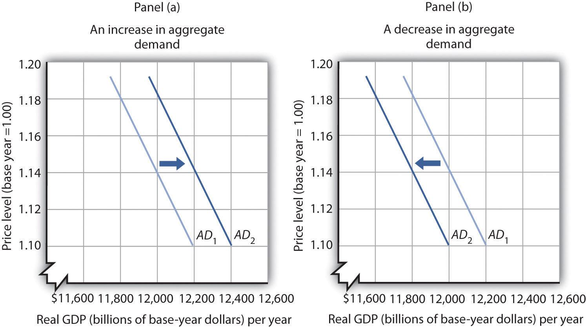

## Table of Contents

## What is aggregate demand?

Aggregate demand is the total amount of goods and services that people in an economy want to buy at a certain time. It includes everything from daily items like food and clothes to big things like cars and houses. It's like adding up all the shopping lists of everyone in a country to see how much they want to spend altogether.

This total demand is important because it helps economists understand how well an economy is doing. If aggregate demand is high, it usually means people are confident and spending a lot, which can help the economy grow. But if it's low, it might mean people are worried and not spending much, which can slow down the economy. Governments and businesses watch aggregate demand closely to make plans and decisions.

## How is aggregate demand measured?

Aggregate demand is measured by adding up all the spending in an economy over a certain period, usually a year. This includes what people spend on things like food, clothes, and cars, what businesses spend on things like machines and buildings, what the government spends on things like schools and roads, and what other countries spend on goods and services from this economy. Economists use a formula that looks like this: Aggregate Demand = Consumer Spending + Investment Spending + Government Spending + (Exports - Imports).

To get the numbers for this formula, economists collect data from different places. They look at surveys and records to see how much people are spending, how much businesses are investing, and how much the government is spending. They also check trade data to see how much the country is selling to and buying from other countries. By putting all these numbers together, economists can figure out the total demand for goods and services in the economy. This helps them understand how the economy is doing and what might happen next.

## What factors influence aggregate demand?

Many things can change how much people want to buy, which is what we call aggregate demand. One big thing is how much money people have. If people are [earning](/wiki/earning-announcement) more or feeling good about their money, they will spend more. This can happen when there are lots of jobs or when people get raises. On the other hand, if people are worried about losing their jobs or not having enough money, they will spend less. Interest rates also play a part. When interest rates are low, it's cheaper to borrow money, so people might buy more things, like houses or cars. But when interest rates go up, borrowing costs more, and people might hold off on big purchases.

Another [factor](/wiki/factor-investing) is what the government does. If the government spends more on things like building roads or giving money to people, it can make aggregate demand go up. Taxes also matter. If taxes go down, people have more money to spend, which can increase demand. But if taxes go up, people might have less money to spend, and demand could drop. Finally, what's happening in other countries can affect aggregate demand too. If other countries are buying a lot of things from a country, that can boost its demand. But if they stop buying as much, it can hurt demand. All these things together can make aggregate demand go up or down, and it's important for economists to keep an eye on them.

## What is the price level?

The price level is like an average price of all the things people buy in a country. It's not the price of one thing, like a loaf of bread, but a way to measure how much prices are going up or down for everything together. Economists use something called a price index to figure out the price level. A price index is a big list of prices for lots of different things, and it helps show if prices are getting higher or lower over time.

When the price level goes up, it means things are getting more expensive overall. This is called inflation. If the price level stays the same or goes down, it means prices are not changing much or getting cheaper, which is called deflation. The price level is important because it affects how much money people can buy with what they earn. If prices go up a lot, people might not be able to buy as much, even if they are earning the same amount of money. Governments and businesses watch the price level closely to make decisions about things like interest rates and wages.

## How is the price level determined in an economy?

The price level in an economy is figured out by looking at the prices of lots of different things people buy, like food, clothes, and services. Economists use something called a price index to do this. A price index is like a big shopping list where they check the prices of many items over time. By comparing these prices, they can see if things are getting more expensive or cheaper. The most common price index is the Consumer Price Index (CPI), which tracks the prices of things that typical families buy. Another one is the Producer Price Index (PPI), which looks at the prices businesses pay for goods and services they use to make stuff.

Lots of things can make the price level go up or down. If there's a lot of demand for things but not enough supply, prices usually go up. This can happen when people have more money to spend or when there are shortages of certain goods. On the other hand, if there's more supply than demand, prices might go down. Things like government policies, taxes, and what's happening in other countries can also affect the price level. For example, if the government decides to print more money, it can lead to higher prices because there's more money chasing the same amount of goods. Keeping an eye on the price level helps economists understand how the economy is doing and what might happen next.

## What is the basic relationship between aggregate demand and price level?

The basic relationship between aggregate demand and the price level is like a seesaw. When aggregate demand goes up, it means more people want to buy things. If the amount of goods and services stays the same, this extra demand can push prices up. So, a higher aggregate demand can lead to a higher price level. This is because businesses might raise prices when they see that people are willing to pay more for their products.

On the other hand, if aggregate demand goes down, it means fewer people want to buy things. If there's less demand but the same amount of goods and services, businesses might have to lower their prices to sell what they have. So, a lower aggregate demand can lead to a lower price level. This relationship helps economists understand how changes in what people want to buy can affect the overall prices in the economy.

## How does a shift in aggregate demand affect the price level?

When aggregate demand shifts, it means the total amount of goods and services people want to buy changes. If aggregate demand goes up, it's like more people showing up at a store wanting to buy things. If the store has the same amount of stuff, the prices might go up because everyone is trying to buy the same things. This is how a shift upward in aggregate demand can push the price level higher. It's like when everyone wants the newest toy, and the price goes up because it's so popular.

On the flip side, if aggregate demand goes down, it's like fewer people coming to the store. If there are less people wanting to buy, the store might have to lower prices to get rid of their stuff. This is how a shift downward in aggregate demand can bring the price level down. It's like when a toy isn't popular anymore, and the store has to sell it for less to make room for new things. So, shifts in aggregate demand can make the price level go up or down, depending on whether more or fewer people want to buy things.

## Can you explain the concept of demand-pull inflation?

Demand-pull inflation happens when there's too much demand for things, and it pulls the prices up. Imagine a lot of people wanting to buy the same toy at the same time. If there aren't enough toys to go around, the store might raise the price because everyone wants it so badly. This is what happens in the whole economy when everyone wants to buy more stuff than what's available. The extra demand pulls the prices up, and that's why it's called demand-pull inflation.

This kind of inflation often happens when the economy is doing well. People have more money to spend, maybe because they got raises or there are more jobs. When everyone starts spending more, it can create a situation where there's more demand than the economy can handle at the current prices. So, businesses start raising prices to meet the extra demand. It's like a tug-of-war where demand is pulling prices higher and higher.

## What role do expectations play in the relationship between aggregate demand and price level?

Expectations are like guesses about what will happen in the future, and they can really change how people act now. If people think prices will go up soon, they might start buying things right away to beat the price increase. This rush to buy can make aggregate demand go up because more people are spending money now. When lots of people do this, it can push the price level higher because there's more demand for the same amount of stuff.

On the other hand, if people expect prices to go down, they might wait to buy things. They think they can get a better deal later, so they hold off on spending now. This can make aggregate demand go down because fewer people are buying things. When demand drops, it can lead to a lower price level because businesses might have to lower prices to sell what they have. So, what people expect about the future can really affect how much they spend now, which in turn affects both aggregate demand and the price level.

## How do different schools of economic thought interpret the impact of aggregate demand on price level?

Different schools of economic thought have different ideas about how changes in aggregate demand affect the price level. Keynesian economists believe that when aggregate demand goes up, it can lead to higher prices because businesses raise prices when they see more people wanting to buy their products. They think that if the economy isn't using all its resources, like when there are a lot of unemployed people, an increase in demand can help without causing too much inflation. But if the economy is already working at full capacity, then more demand can push prices up a lot.

On the other hand, monetarists, who follow the ideas of Milton Friedman, think that changes in the money supply are the main thing that affects aggregate demand and, in turn, the price level. They believe that if the government prints more money, it can lead to more demand, which can cause inflation if the economy is already at full capacity. Monetarists focus a lot on controlling the money supply to keep prices stable. They think that trying to boost demand through government spending can lead to inflation if it's not done carefully.

## What are the long-term effects of sustained changes in aggregate demand on price levels?

When aggregate demand stays high for a long time, it can lead to higher prices overall. This is because if more people keep wanting to buy things and there's not enough stuff to go around, businesses will keep raising their prices. This can cause inflation, where the price level goes up and up. If the economy is already working at full speed, with everyone who wants a job having one, then this extra demand can push prices even higher. Over time, this can make it harder for people to buy things because their money doesn't go as far as it used to.

On the other hand, if aggregate demand stays low for a long time, it can lead to lower prices or even deflation. When fewer people want to buy things, businesses might have to lower their prices to sell what they have. If this keeps happening, the price level can go down. While this might sound good at first, it can be bad for the economy. If prices keep falling, people might wait to buy things, hoping they'll be even cheaper later. This can slow down the economy even more because businesses sell less and might have to cut jobs. So, keeping a balance in aggregate demand is important for a healthy economy over the long run.

## How can government policy influence the relationship between aggregate demand and price level?

Government policy can change how much people want to buy, which we call aggregate demand, and this can affect the prices of things, or the price level. If the government decides to spend more money on things like building roads or helping people, it can make aggregate demand go up. When there's more demand, businesses might raise their prices because everyone wants to buy their stuff. The government can also lower taxes, which gives people more money to spend. This extra spending can push prices up too. On the other hand, if the government raises taxes or spends less, it can make people have less money to spend, which can lower aggregate demand and bring prices down.

Another way the government can influence this relationship is by changing interest rates. If the government, through its central bank, lowers interest rates, it becomes cheaper for people to borrow money. This can make people spend more on things like houses or cars, which can increase aggregate demand and push up the price level. But if the government raises interest rates, borrowing money becomes more expensive, and people might spend less. This can lower aggregate demand and help keep prices from going up too fast. So, by using spending, taxes, and interest rates, the government can try to balance how much people want to buy with how much things cost.

## What is the theoretical understanding of aggregate demand and price levels?

Aggregate demand (AD) represents the total quantity of goods and services demanded across all sectors of an economy at a specific time and prevailing price level. It is a fundamental concept used to measure the health of an economy, expressed as the aggregate of consumption, investment, government spending, and net exports. Mathematically, aggregate demand is represented as:

$$
AD = C + I + G + (X - M)
$$

where $C$ is consumption, $I$ is investment, $G$ is government spending, $X$ is exports, and $M$ is imports.

The price level reflects the average of current prices and serves as an indicator of inflationary trends within an economy. A higher price level typically indicates inflation, while a lower price level suggests deflation. The relationship between aggregate demand and the price level is crucial to understanding macroeconomic equilibriums and market dynamics.

According to economic theory, there exists an inverse relationship between the price level and aggregate demand, commonly referred to as the aggregate demand curve. This curve is typically downward sloping, indicating that as the price level falls, the quantity of goods and services demanded increases, and vice versa. This relationship is driven by several effects:

1. **Wealth Effect**: When price levels decline, the real value of money increases, enabling consumers to purchase more goods and services with the same amount of nominal income, thereby increasing aggregate demand.

2. **Interest Rate Effect**: Lower price levels often lead to reduced interest rates, which decreases the cost of borrowing. This encourages increased investment and consumption, thus boosting aggregate demand.

3. **Exchange Rate Effect**: A decrease in domestic price levels can lead to an appreciation of the real exchange rate. This makes domestic goods relatively cheaper for foreign buyers and stimulates an increase in exports, contributing positively to aggregate demand.

Variations in aggregate demand can lead to different economic outcomes. For instance, an increase in aggregate demand, assuming constant aggregate supply, can lead to higher price levels, causing inflationary pressures. Conversely, a decrease in aggregate demand can result in lower price levels, leading to potential deflationary pressures.

Understanding these concepts allows policymakers and economists to gauge the impact of fiscal and monetary policies on the economy. For example, expansionary fiscal policy, which increases government spending or lowers taxes, can elevate aggregate demand, thereby raising the price level and reducing unemployment in the short term.

In conclusion, the interplay between aggregate demand and price level is a cornerstone of economic theory and essential for comprehending fluctuations in macroeconomic indicators. Recognizing how shifts in aggregate demand influence price levels is vital for anticipating economic conditions such as inflation or deflation, helping inform both economic policy and business strategy.

## What are the key drivers in financial markets according to economic models?

Economic models serve as essential tools in analyzing the interconnectedness of aggregate demand and price levels within financial markets. Two of the most prominent models used for this purpose are the Aggregate Demand-Aggregate Supply (AD-AS) model and the IS-LM framework.

### AD-AS Model:

The AD-AS model provides a macroeconomic framework that illustrates how aggregate demand and aggregate supply interact to determine price levels and output in an economy. 

- **Aggregate Demand (AD):** Represents the total quantity of all goods and services demanded across all levels of the economy at a given overall price level and in a given time period. It can be expressed as:
$$
  AD = C + I + G + (X - M)

$$

  where $C$ is consumption, $I$ is investment, $G$ is government spending, and $(X - M)$ is net exports.

- **Aggregate Supply (AS):** Represents the total supply of goods and services that firms in an economy plan to sell during a specific time period. At the macroeconomic level, the long-run aggregate supply curve is vertical, indicating that in the long run, the economy's output is determined by factors like technology and resources, rather than price levels.

The intersection of the AD and AS curves depicts an equilibrium where the economy's output and the general price level are determined. Shifts in the AD curve occur due to changes in factors such as consumer spending, and investment levels, which ultimately affect the price level and economic output. Conversely, shifts in the AS curve can result from changes in production costs and expectations of future prices.

### IS-LM Framework:

The IS-LM model is a macroeconomic tool used to depict the relationship between interest rates and real output in goods and money markets.

- **IS Curve:** Represents equilibrium in the goods market, where total spending (consumption plus investment) equals total output. The curve slopes downward because an increase in interest rates typically leads to a decrease in investment and, consequently, a decrease in output.
$$
  Y = C(Y - T) + I(r) + G

$$

  Here, $Y$ is the national income, $T$ is taxes, and $r$ is the [interest rate](/wiki/interest-rate-trading-strategies).

- **LM Curve:** Represents equilibrium in the money market, where money demand equals money supply. The curve slopes upward as higher levels of income increase the demand for money, which generally leads to higher interest rates.
$$
  M/P = L(r, Y)

$$

  Where $M$ is the money supply, $P$ is the price level, and $L$ is the demand for money.

The IS-LM model helps in predicting the effects of fiscal and monetary policies on interest rates and output. By analyzing shifts in these curves, economists and policymakers can forecast changes in economic conditions leading to the formulation of strategies that stabilize markets.

### Application in Financial Markets:

Understanding these models is critical for financial market participants and policymakers since they provide strategic insights into how economic conditions might evolve. Traders, especially those using [algorithmic trading](/wiki/algorithmic-trading) systems, can leverage predictions about shifts in aggregate demand and supply to optimize their trading strategies. For instance, a predicted increase in aggregate demand might signal a rise in prices, guiding traders to adjust their portfolios accordingly to hedge against inflation. Conversely, a shift in the LM curve due to monetary policy changes, such as altering the money supply, might trigger a revaluation of interest rate forecasts, impacting bond and equity markets. By incorporating these models into their analytical processes, traders can develop strategies that not only react swiftly to economic changes but also anticipate future market movements.

## References & Further Reading

[1]: Mankiw, N. G. (2014). ["Principles of Economics"](https://faculty.cengage.com/titles/9780357038314). South-Western College Pub.

[2]: Mishkin, F. S. (2015). ["Macroeconomics: Policy and Practice"](https://api.pageplace.de/preview/DT0400.9781292067179_A25609155/preview-9781292067179_A25609155.pdf). Pearson.

[3]: Lane, P. R., & Milesi-Ferretti, G. M. (2007). ["The external wealth of nations mark II: Revised and extended estimates of foreign assets and liabilities, 1970–2004."](https://www.sciencedirect.com/science/article/pii/S0022199607000591) Journal of International Economics, 73(2), 223-250.

[4]: Lopez de Prado, M. (2018). ["Advances in Financial Machine Learning"](https://www.amazon.com/Advances-Financial-Machine-Learning-Marcos/dp/1119482089). Wiley.

[5]: Hull, J. (2018). ["Options, Futures, and Other Derivatives"](https://www.amazon.com/Options-Futures-Other-Derivatives-10th/dp/013447208X). Pearson.

[6]: Harvey, C. R., & Liu, Y. (2019). ["Detecting repeatable performance."](https://people.duke.edu/~charvey/Research/Published_Papers/P132_Detecting_repeatable_performance.pdf) The Journal of Portfolio Management, 45(4), 13-20.

[7]: Chan, E. (2008). ["Quantitative Trading: How to Build Your Own Algorithmic Trading Business"](https://github.com/ftvision/quant_trading_echan_book). Wiley Trading.

[8]: Jansen, S. (2018). ["Machine Learning for Algorithmic Trading"](https://github.com/stefan-jansen/machine-learning-for-trading). Packt Publishing.