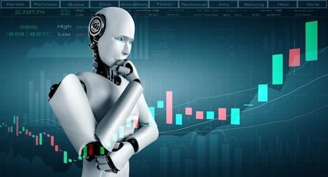

## Table of Contents

## What is AI and how does it relate to trading?

AI, or Artificial Intelligence, is when computers and machines can do things that normally need human intelligence. This includes things like understanding language, recognizing pictures, and making decisions. AI systems learn from data and get better over time, kind of like how people learn from experience.

In trading, AI can be very helpful. Traders use AI to look at lots of data quickly and find patterns that might be hard for people to see. This can help them make better decisions about when to buy or sell things like stocks or cryptocurrencies. AI can also work all the time without getting tired, which means it can keep an eye on the markets 24/7 and react faster than a human could.

## How has AI changed the landscape of trading for beginners?

AI has made trading easier for beginners by doing a lot of the hard work for them. Before AI, new traders had to spend a lot of time learning about the markets and trying to understand all the numbers and charts. Now, AI can help by giving beginners tools that can predict market trends and suggest when to buy or sell. This means that even if you're new to trading, you can start making decisions with the help of smart technology.

Another way AI has changed things for beginners is by making trading platforms more user-friendly. AI can help create apps and websites that are easy to use, with simple instructions and helpful tips. This makes it less scary for someone who is just starting out. Plus, AI can keep learning and getting better, so the more you use these tools, the better they get at helping you trade successfully.

## What are the basic AI tools available for trading?

There are a few basic AI tools that beginners can use for trading. One common tool is an AI-powered trading bot. These bots use algorithms to analyze market data and make trades automatically. They can help you buy and sell things like stocks or cryptocurrencies without you having to watch the market all the time. Another tool is an AI-driven signal service, which looks at market trends and sends you alerts about when to buy or sell. This can be really helpful if you're not sure when the best times to trade are.

Another useful AI tool is a robo-advisor. Robo-advisors use AI to manage your investments for you. They look at your financial goals and risk tolerance, then create a personalized investment plan. They can automatically adjust your portfolio to keep it in line with your goals, which saves you a lot of time and effort. Lastly, there are AI-powered analytics platforms that help you understand market data better. These platforms can show you patterns and trends in an easy-to-understand way, making it simpler for beginners to make smart trading decisions.

## How can AI improve trading strategies for intermediate traders?

For intermediate traders, AI can make their trading strategies better by looking at more data and finding patterns that might be hard to see. AI can use [machine learning](/wiki/machine-learning) to learn from past trades and predict what might happen next in the market. This means intermediate traders can use AI to test different trading ideas quickly and see which ones work best without spending a lot of time. AI can also help by keeping an eye on many different markets at the same time, which can give traders a better overall view of what's happening and help them make smarter decisions.

Another way AI can help intermediate traders is by making their trading more efficient. AI can do things like automatically adjusting stop-loss orders or take-profit levels based on real-time data. This means traders don't have to watch the market all the time and can let AI handle some of the smaller decisions. This frees up time for intermediate traders to focus on bigger strategies and long-term goals. Plus, AI can keep learning and improving, so the more it's used, the better it gets at helping traders make money.

## What are the common AI algorithms used in trading?

Common AI algorithms used in trading include machine learning algorithms like neural networks and decision trees. Neural networks are good at finding patterns in data that might be hard for people to see. They can learn from past trades and predict what the market might do next. Decision trees help traders by breaking down complex decisions into simpler steps. They can look at different factors like stock prices or economic news and decide what to do based on those factors.

Another type of AI algorithm used in trading is [reinforcement learning](/wiki/reinforcement-learning). This is when the AI learns by doing. It tries different trading strategies and sees which ones make money. Over time, it gets better at choosing the right strategies. Genetic algorithms are also used sometimes. These algorithms work by trying lots of different trading rules and then keeping the ones that work best, kind of like how animals evolve to survive better. These algorithms help traders by constantly trying to find the best ways to trade.

Overall, these AI algorithms help traders by making sense of lots of data quickly and finding the best ways to trade. They can learn from the past and adapt to new situations, which makes them very useful for anyone trying to make money in the markets.

## How does AI help in predicting market trends?

AI helps in predicting market trends by looking at a lot of data really fast. It can see patterns in things like stock prices, news, and even social media posts that might be hard for people to notice. For example, AI can look at how people are talking about a company on Twitter and guess if the stock price might go up or down. By using machine learning, AI gets better at predicting trends over time because it learns from what happened before.

Another way AI helps is by using different kinds of algorithms to make predictions. Some AI systems use neural networks, which are good at finding hidden patterns in data. Others use decision trees to break down complex decisions into simpler steps. AI can also use reinforcement learning, where it tries different strategies and learns which ones work best. This means AI can keep getting better at predicting what the market will do next, helping traders make smarter decisions.

## What are the risks associated with using AI in trading?

Using AI in trading can be risky because AI is not perfect. Sometimes, AI might make a wrong prediction because it looks at a lot of data and tries to find patterns. If the data it's using is not good or if something unexpected happens in the market, the AI might make a mistake. This can lead to losing money, so it's important for traders to not rely only on AI and to always check the predictions themselves.

Another risk is that AI can make trading too easy, which might make traders lazy. If traders let AI do all the work, they might not learn how the market really works. This can be a problem if the AI stops working or if the market changes in a way the AI doesn't understand. Traders need to keep learning and understanding the market, even if they use AI to help them.

Lastly, there's the risk of over-reliance on AI. If too many traders are using the same AI tools, they might all make the same decisions at the same time. This can cause big swings in the market, which can be dangerous. It's important for traders to use AI as a tool, but also to think for themselves and not just follow what the AI says.

## How can advanced traders integrate AI into their existing systems?

Advanced traders can integrate AI into their existing systems by using AI algorithms to improve their trading strategies. They can start by adding AI tools that analyze market data and find patterns that might be hard to see. For example, they can use neural networks to predict market trends based on historical data. By feeding their AI system with lots of data, it can learn and get better at making predictions over time. This can help traders make smarter decisions and find new trading opportunities that they might have missed before.

Another way advanced traders can use AI is by automating parts of their trading process. They can set up AI-powered trading bots that can make trades automatically based on the AI's predictions. This can save time and help traders react faster to market changes. AI can also help with risk management by automatically adjusting stop-loss orders or take-profit levels. By integrating AI into their existing systems, advanced traders can make their trading more efficient and effective, but they should always keep an eye on what the AI is doing and not rely on it completely.

## What are the ethical considerations of using AI in trading?

Using AI in trading brings up some important ethical questions. One big issue is fairness. If only some traders can use AI because it's expensive or hard to get, it might not be fair to others who can't use it. This could make the market less equal, where people with AI have a big advantage over those without it. Also, if AI makes trading decisions based on data that might be biased, like social media posts, it could lead to unfair trading practices. Traders need to think about how to use AI in a way that's fair to everyone.

Another ethical concern is transparency. When AI makes trading decisions, it can be hard to understand how it came to those decisions. This lack of transparency can be a problem because traders and regulators need to know why certain trades are made. If AI is used in a way that's not clear, it could lead to mistrust in the market. Traders should try to use AI in a way that's open and easy to understand, so everyone can see how decisions are being made.

## How does AI affect high-frequency trading?

AI has a big impact on high-frequency trading. High-frequency trading is when computers buy and sell things like stocks very quickly, often in just a few seconds. AI helps by making these trades even faster and smarter. It can look at a lot of data in a short time and find patterns that might be hard for people to see. This means AI can help high-frequency traders make better decisions about when to buy or sell, which can lead to making more money.

But using AI in high-frequency trading also has some risks. Because AI can make trades so fast, it can cause big changes in the market very quickly. If a lot of traders are using the same AI tools, they might all make the same decisions at the same time, which can lead to big swings in the market. This can be dangerous because it might cause prices to go up or down a lot in a short time. Traders need to be careful and make sure they understand how AI is affecting the market.

## What future developments can we expect in AI trading technologies?

In the future, AI trading technologies will likely get even better at understanding the market. AI systems will use more advanced machine learning to look at even more data, like news articles and social media posts, to make better predictions. They might also start using things like quantum computing, which can do a lot of calculations very quickly. This could make AI even faster and more accurate at finding the best times to buy and sell. As AI gets better, it might also start to work with other technologies, like blockchain, to make trading safer and more transparent.

Another thing we might see is more personalized AI trading tools. These tools will learn about each trader's style and goals, and then give them advice that's just right for them. This could help traders make more money because the AI will understand what they want and how they like to trade. But as AI gets better, there will also be more rules and laws to make sure it's used in a fair and safe way. This is important so that everyone can trust the market and use AI to help them trade.

## How can expert traders leverage AI for competitive advantage?

Expert traders can use AI to get ahead by using it to look at a lot of data really fast. AI can find patterns in the market that might be hard for people to see. This means expert traders can use AI to make better guesses about what the market will do next. They can also use AI to try out different trading ideas quickly and see which ones work best. This can help them find new ways to make money that other traders might not know about.

Another way expert traders can use AI is by making their trading faster and more efficient. AI can do things like automatically buying and selling stocks based on what it thinks the market will do. This can save expert traders a lot of time and help them react to changes in the market faster than other traders. But expert traders need to be careful and not just rely on AI. They should always keep learning about the market and use AI as a tool to help them, not do all the work for them.

## References & Further Reading

[1]: ["Advances in Financial Machine Learning"](https://www.amazon.com/Advances-Financial-Machine-Learning-Marcos/dp/1119482089) by Marcos Lopez de Prado

[2]: ["Machine Learning for Algorithmic Trading"](https://github.com/stefan-jansen/machine-learning-for-trading) by Stefan Jansen

[3]: ["Quantitative Trading: How to Build Your Own Algorithmic Trading Business"](https://www.amazon.com/Quantitative-Trading-Build-Algorithmic-Business/dp/1119800064) by Ernest P. Chan

[4]: ["Evidence-Based Technical Analysis: Applying the Scientific Method and Statistical Inference to Trading Signals"](https://www.amazon.com/Evidence-Based-Technical-Analysis-Scientific-Statistical/dp/0470008741) by David Aronson

[5]: Krollner, B., Vanstone, B. J., & Finnie, G. (2010). ["Financial Time Series Forecasting with Machine Learning Techniques: A Survey."](https://www.semanticscholar.org/paper/Financial-time-series-forecasting-with-machine-a-Krollner-Vanstone/6772f7ffccc5d320ef6f067c62c8e63083072892) ESANN 2010 proceedings, European Symposium on Artificial Neural Networks (pp. 53-60).

[6]: Bouchaud, J. P., & Potters, M. (2003). ["Theory of Financial Risk and Derivative Pricing: From Statistical Physics to Risk Management."](https://www.cambridge.org/core/books/theory-of-financial-risk-and-derivative-pricing/5BBBA04CE72ED9E5E7C1C028D9A94FCB) Cambridge University Press.