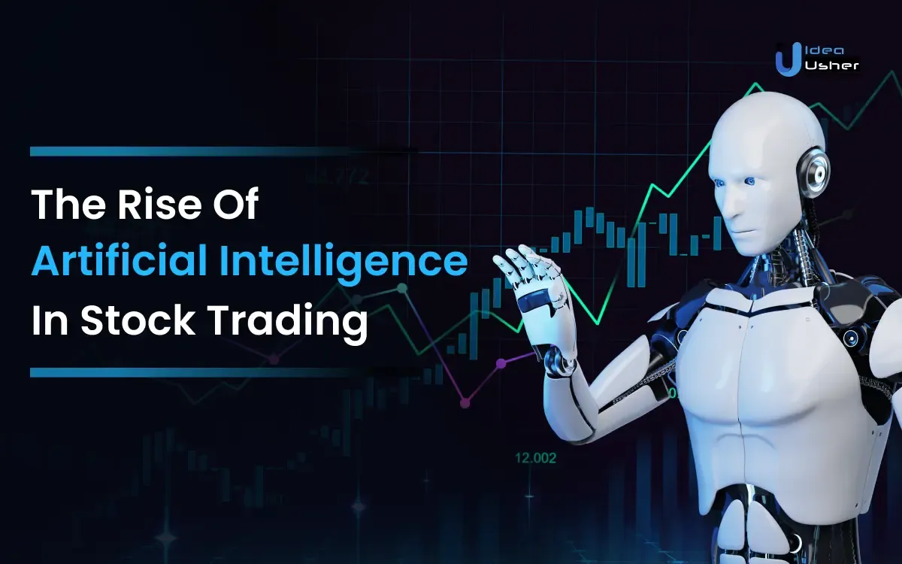

The financial markets have undergone a fundamental transformation with the introduction of Artificial Intelligence (AI) in trading, particularly in algorithmic trading. The integration of AI technologies into the trading environment has substantially enhanced efficiency by automating complex processes and reducing the time required to execute trades. This technological advancement has markedly improved accuracy by enabling precise data analysis and decision-making, thus altering traditional trading practices.

Algorithmic trading, empowered by AI, employs sophisticated algorithms to facilitate trades based on extensive data analysis. The speed at which AI processes information allows for real-time trading decisions, providing traders with a competitive advantage in rapidly evolving markets. This efficiency has redefined how trades are executed, making manual interventions less necessary and promoting more consistent outcomes.



This article examines the significant impact of AI in algorithmic trading, focusing on its diverse applications and the advantages it brings to traders. By enabling faster and more accurate analysis of market data, AI technologies have revolutionized the development of trading strategies and the management of investment portfolios. Furthermore, the article will address the challenges and considerations associated with incorporating AI technologies into trading, such as data quality, regulatory compliance, and the complexities involved in understanding AI-driven decision-making processes.

The continued evolution of AI promises to further enhance the capabilities of algorithmic trading, opening new avenues for innovation and efficiency in the financial markets. As traders seek to leverage AI-driven insights to gain a competitive edge, understanding the potential and pitfalls of these technologies becomes increasingly essential.

## Table of Contents

## Understanding the Role of AI in Algorithmic Trading

Artificial Intelligence (AI) plays a pivotal role in enhancing algorithmic trading by offering an advanced toolkit for data analysis, predictive modeling, risk management, and automated execution. AI algorithms have transformed the landscape of trading through their capacity to process and analyze vast datasets, uncovering patterns and insights that are integral to crafting sophisticated trading strategies.

AI algorithms excel in analyzing vast volumes of market data by leveraging machine learning and deep learning techniques. These algorithms can sift through historical and real-time data to identify patterns that may not be immediately apparent. For instance, AI models can parse through numerical data, chart patterns, and candlestick configurations, thereby aiding in the development of strategies that capitalize on specific market inefficiencies.

Predictive modeling and forecasting powered by AI offer traders the ability to anticipate market trends with greater accuracy. By utilizing techniques such as time series analysis and regression models, AI can help predetermine future movements based on historical trends and current indicators. For example, using a Long Short-Term Memory (LSTM) model in Python can be instrumental in predicting stock prices:

```python
from keras.models import Sequential
from keras.layers import LSTM, Dense
import numpy as np

# Preparing dummy data for illustration
data = np.random.random((1000, 10, 1))

# LSTM Model
model = Sequential()
model.add(LSTM(50, return_sequences=True, input_shape=(10, 1)))
model.add(LSTM(50))
model.add(Dense(1))

# Compilation and training
model.compile(optimizer='adam', loss='mean_squared_error')
model.fit(data, np.random.random(1000), epochs=10, batch_size=32)
```

AI significantly bolsters risk management and portfolio optimization by supplying sophisticated tools for risk assessment and mitigation. Through techniques such as Monte Carlo simulation and scenario analysis, AI can evaluate potential risks and adjust strategies to minimize exposure. Portfolio optimization is further enhanced by AI's capability to process multiple variables simultaneously, balancing risk and return more efficiently than traditional models.

Automated trading execution transformed by AI reduces latency and refines decision-making processes. By automating the execution phase, AI minimizes human error and ensures that trades are executed at optimal times. For example, high-frequency trading ([HFT](/wiki/high-frequency-trading-strategies)) systems rely on AI to execute trades in microseconds, capitalizing on minute price differentials across exchanges.

In summary, AI's integration into [algorithmic trading](/wiki/algorithmic-trading) affords numerous advantages—from deep data analysis and predictive insights to enhanced risk management and automated execution. These capabilities not only optimize the trading process but also adapt to evolving market conditions, offering traders a toolset for sustained competitive advantage.

## Applications of AI in Algorithmic Trading

Artificial Intelligence (AI) has become a pivotal tool in algorithmic trading, offering numerous applications that enhance the efficiency and accuracy of trading operations. Key applications include sentiment analysis, pattern recognition, natural language processing, and the development of algorithmic trading strategies.

### Sentiment Analysis

AI is adept at scanning vast amounts of unstructured data from news outlets, social media platforms, and other information sources to gauge market sentiment. This analysis enables traders to make proactive adjustments to their trading strategies. By assessing public mood and sentiment, AI helps identify potential market movements triggered by significant news events or popular opinions. Machine learning techniques, such as recurrent neural networks (RNNs) and convolutional neural networks (CNNs), are frequently employed to interpret and classify text data to predict market trends.

### Pattern Recognition

Pattern recognition in algorithmic trading involves using AI to identify complex and subtle patterns within large datasets. AI systems can detect historical trends, repetitive patterns, and outlier events that human analysts might overlook. This capability is crucial for spotting trading opportunities that align with these patterns. Techniques such as clustering algorithms and support vector machines (SVMs) are often utilized for their effectiveness in detecting and analyzing these intricate patterns. For instance, AI algorithms can analyze candlestick charts to identify patterns like head and shoulders, triangles, and flags, which are indicative of market behaviors.

### Natural Language Processing (NLP)

Natural Language Processing allows AI to interpret and analyze textual data from various sources, aiding traders in making informed decisions. NLP techniques enable machines to understand and process human language, extracting relevant information that can influence trading strategies. By comprehending regulatory filings, [earning](/wiki/earning-announcement) reports, or analysts' comments, NLP tools enhance the trader's ability to respond swiftly to new information. Python libraries like NLTK and spaCy are commonly used to implement NLP tasks, such as sentiment analysis, named entity recognition, and information extraction.

### Developing Algorithmic Trading Strategies

AI plays a significant role in developing and optimizing trading strategies by leveraging historical and streaming data. Machine learning models are trained to predict asset price movements, [volatility](/wiki/volatility-trading-strategies), and other crucial financial metrics. Reinforcement learning, a subset of [machine learning](/wiki/machine-learning), is particularly beneficial in creating algorithmic trading strategies that adapt to real-time market changes. This method involves creating algorithms that learn and make decisions by interacting with the market environment, continuously improving its strategy based on feedback from trading outcomes. Here's a simplified example in Python that illustrates a basic [reinforcement learning](/wiki/reinforcement-learning) setup:

```python
# A simplified RL setup for trading strategy simulation
import random

class TraderAgent:
    def __init__(self):
        self.strategy = random.choice(['buy', 'sell', 'hold'])

    def update_strategy(self, market_feedback):
        if market_feedback > 0:
            self.strategy = 'buy'
        elif market_feedback < 0:
            self.strategy = 'sell'
        else:
            self.strategy = 'hold'

    def act(self):
        return self.strategy

# Simulation of market feedback
market = [random.randint(-1, 1) for _ in range(100)]
agent = TraderAgent()

for feedback in market:
    agent.update_strategy(feedback)
    action = agent.act()
    print(f"Market feedback: {feedback}, Agent's action: {action}")
```

In conclusion, AI's applications in algorithmic trading are vast and varied, encompassing sentiment analysis, pattern recognition, and NLP, among others. Through these technologies, traders can craft strategies that are not only responsive to current market conditions but also forward-looking, adapting effectively as new data emerges.

## Benefits of AI in Algorithmic Trading

Artificial Intelligence (AI) in algorithmic trading offers several notable benefits that enhance the trading process and provide competitive advantages.

Increased Efficiency is one of the key benefits AI brings to algorithmic trading. AI systems optimize the execution of orders by minimizing latency, which is crucial in high-frequency trading environments where every millisecond counts. Advanced algorithms can rapidly process large volumes of data and execute trades with precise timing, significantly improving execution speed and reducing potential slippage.

Another pivotal benefit of AI is Enhanced Precision. AI algorithms are designed to analyze extensive datasets with high accuracy, extracting valuable insights that facilitate informed trading decisions. The sophisticated models employed by AI can detect minute patterns and anomalies within the data that may be imperceptible to human traders, enabling more precise prediction of market movements.

Improved Risk Management is also achieved through AI. By utilizing AI, traders can identify and mitigate various types of risks more effectively. AI systems can assess risk factors in real-time, providing traders with critical information to safeguard their investments. For example, AI can model risk scenarios based on historical data and current market conditions, helping traders prepare appropriate strategies to minimize potential losses.

Adaptability is a significant advantage of AI systems in algorithmic trading. These systems are capable of continuous learning and adaptation through machine learning techniques. As market conditions change, AI algorithms can automatically adjust their parameters to maintain optimal performance. This dynamic adaptability ensures that trading strategies remain effective under varying market dynamics, providing traders with a robust tool to navigate the complex and rapidly changing financial markets.

Through these benefits, AI significantly enhances the overall performance and effectiveness of algorithmic trading, empowering traders to operate with greater efficiency, precision, and resilience in the face of market uncertainties.

## Challenges and Considerations in AI Algorithmic Trading

Ensuring high-quality, unbiased data is paramount for accurate AI model predictions in algorithmic trading. Data quality is often influenced by the source, frequency, and accuracy of the data sets utilized. Inaccurate data can lead to erroneous model training, which subsequently results in flawed trading strategies. Bias in data, often stemming from historical data that may not reflect current market conditions or diverse perspectives, can further exacerbate the risk of making inaccurate predictions. Addressing these challenges requires rigorous data validation and cleansing processes to ensure that the data fed into AI models reflects true market conditions without systemic biases.

Model interpretability is another crucial aspect in AI algorithmic trading. As AI models, particularly those based on [deep learning](/wiki/deep-learning), become more complex, understanding the internal decision-making processes becomes inherently difficult. Traders need to comprehend why a model has arrived at a particular decision to build trust in automated systems and to refine model outputs. Techniques such as feature importance analysis, surrogate modeling, and visualizations of decision pathways are being developed to aid in demystifying these black-box models. Tools like LIME (Local Interpretable Model-agnostic Explanations) can be particularly useful for interpreting complex AI predictions, allowing traders to make informed judgments based on the model's reasoning.

Regulatory compliance is a significant consideration, as AI systems in trading must adhere to stringent legal frameworks designed to ensure fair and accountable market practices. Market regulators impose standards that govern algorithmic trading to prevent manipulative or harmful practices. AI models must be designed and implemented in a manner that aligns with these regulations, ensuring transparency and fairness. This often requires comprehensive documentation of AI systems, routine audits, and the ability to demonstrate the system's decision-making processes. Compliance tools can be integrated into AI frameworks to monitor adherence to these regulations continuously.

In summary, the effective application of AI in algorithmic trading hinges on high-quality data, understandable and transparent models, and strict regulatory compliance. Addressing these challenges is crucial for leveraging AI technologies successfully in the financial markets.

## Conclusion

Artificial Intelligence (AI) continues to play a transformative role in algorithmic trading by providing enhanced efficiency, precision, and risk management capabilities. These advancements enable traders to execute trades more effectively and with greater confidence. AI-driven systems optimize order execution by significantly reducing latency, thereby improving the speed at which trades are conducted. The high precision of AI algorithms ensures that decisions are based on accurate data analysis, leading to more informed trading strategies.

Traders who leverage AI technologies gain a significant competitive advantage in today's dynamic financial markets. AI systems analyze vast datasets at unprecedented speeds, allowing traders to identify opportunities and risks more rapidly than traditional methods. Moreover, AI's ability to adapt to changing market conditions ensures that traders can continue to adjust their strategies in real-time, maintaining their edge in a highly competitive environment.

However, realizing AI's full potential in algorithmic trading hinges on overcoming specific challenges, such as ensuring data quality and addressing model interpretability. High-quality, unbiased data is vital for accurate AI predictions, while understanding the decision-making processes of complex AI models is crucial for compliance and accountability. Regulatory compliance remains a key consideration, as AI systems must align with industry standards to ensure fair practices.

As AI technologies advance, their impact on algorithmic trading is set to expand, further driving innovation and efficiency. Continuous improvements in AI methodologies will likely lead to more sophisticated trading strategies, offering traders enhanced tools for managing investments and optimizing performance. The ongoing evolution of AI solutions promises to revolutionize the financial markets, setting the stage for a future where efficiency and precision are paramount.

## References & Further Reading

[1]: ["Advances in Financial Machine Learning"](https://www.amazon.com/Advances-Financial-Machine-Learning-Marcos/dp/1119482089) by Marcos Lopez de Prado

[2]: ["Machine Learning for Algorithmic Trading"](https://github.com/stefan-jansen/machine-learning-for-trading) by Stefan Jansen

[3]: ["Quantitative Trading: How to Build Your Own Algorithmic Trading Business"](https://www.amazon.com/Quantitative-Trading-Build-Algorithmic-Business/dp/1119800064) by Ernest P. Chan

[4]: ["Evidence-Based Technical Analysis: Applying the Scientific Method and Statistical Inference to Trading Signals"](https://www.amazon.com/Evidence-Based-Technical-Analysis-Scientific-Statistical/dp/0470008741) by David Aronson

[5]: Krollner, B., Vanstone, B. J., & Finnie, G. (2010). ["Financial Time Series Forecasting with Machine Learning Techniques: A Survey."](https://www.semanticscholar.org/paper/Financial-time-series-forecasting-with-machine-a-Krollner-Vanstone/6772f7ffccc5d320ef6f067c62c8e63083072892) ESANN 2010 proceedings, European Symposium on Artificial Neural Networks (pp. 53-60).

[6]: Bouchaud, J. P., & Potters, M. (2003). ["Theory of Financial Risk and Derivative Pricing: From Statistical Physics to Risk Management."](https://www.cambridge.org/core/books/theory-of-financial-risk-and-derivative-pricing/5BBBA04CE72ED9E5E7C1C028D9A94FCB) Cambridge University Press.