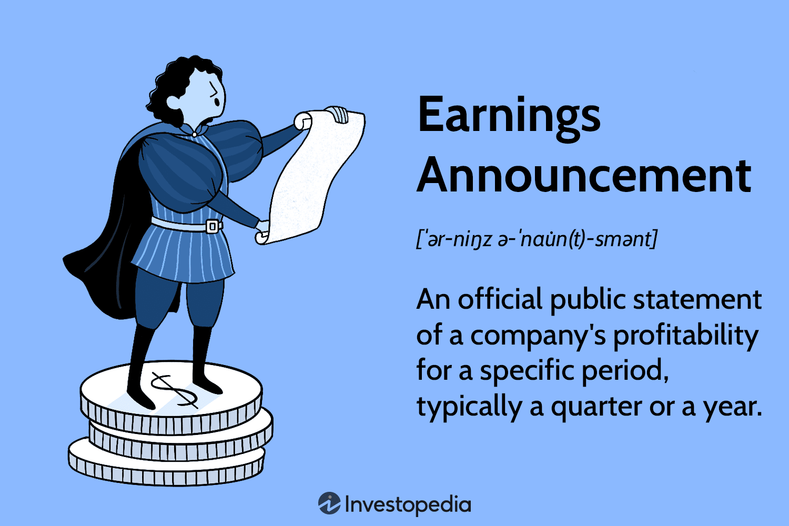

## Table of Contents

## What are financial markets and why are they important?

Financial markets are places where people and businesses can buy and sell things like stocks, bonds, and other financial products. They help connect people who need money with those who have money to invest. For example, if a company wants to grow, it can sell stocks to raise money from investors. On the other hand, if someone wants to save for the future, they can buy those stocks and possibly earn money if the company does well.

These markets are important because they help the economy grow. When companies can easily get money, they can start new projects, create jobs, and bring new products to the market. This activity helps the whole economy. Also, financial markets give people a way to save and invest their money, which can help them reach their financial goals, like buying a house or retiring. Without financial markets, it would be much harder for the economy to grow and for people to plan for their future.

## What types of announcements typically affect financial markets?

Announcements that often affect financial markets include news about the economy, like changes in interest rates or unemployment rates. When a country's central bank, like the Federal Reserve in the U.S., changes interest rates, it can make borrowing money more or less expensive. This can influence how much people spend and how businesses invest. If interest rates go up, borrowing becomes more expensive, and people might spend less, which can slow down the economy. On the other hand, if rates go down, borrowing becomes cheaper, and people might spend more, helping the economy grow.

Another type of announcement that impacts financial markets is news about companies, like their earnings reports or big changes in management. When a company announces how much money it made or lost in a quarter, investors pay close attention. If a company does better than expected, its stock price might go up because investors think it's a good investment. But if the company does worse than expected, the stock price might go down. Also, if a company announces a new CEO or other big changes, it can affect how investors feel about the company's future, which can move the stock price.

Lastly, geopolitical events and government policies can also shake up financial markets. For example, if there's a big election or a new trade deal, it can create uncertainty or excitement in the markets. If people think a new policy will help the economy, stock prices might go up. But if they think it will hurt the economy, prices might go down. Wars, natural disasters, and other global events can also cause big swings in the markets because they can disrupt businesses and change how people feel about the future.

## How do economic announcements like GDP and employment data influence market behavior?

Economic announcements like GDP and employment data give important information about how the economy is doing. GDP, which stands for Gross Domestic Product, tells us how much a country's economy has grown or shrunk over a certain period. If GDP numbers are higher than expected, it usually means the economy is doing well, and this can make people feel more confident. When people feel good about the economy, they are more likely to spend money and invest in stocks, which can push stock prices up. On the other hand, if GDP numbers are lower than expected, it might mean the economy is slowing down, and this can make people worried. When people are worried, they might sell their stocks, which can cause stock prices to go down.

Employment data, like the unemployment rate, also has a big impact on the markets. When the unemployment rate goes down, it usually means more people have jobs and are earning money. This can make people feel good about the economy because they have more money to spend. When people spend more, businesses do better, and this can lead to higher stock prices. But if the unemployment rate goes up, it can mean fewer people have jobs and less money to spend. This can make people worried about the economy, and they might sell their stocks, causing stock prices to fall. So, both GDP and employment data can really move the markets by changing how people feel about the economy and what they do with their money.

## What is the role of central bank announcements in financial markets?

Central bank announcements are really important for financial markets because they tell people what the central bank thinks about the economy and what it plans to do. The central bank, like the Federal Reserve in the U.S., can change interest rates, which is the cost of borrowing money. When the central bank says it will raise interest rates, it means borrowing money will become more expensive. This can make people and businesses spend less because it costs more to borrow. When people spend less, the economy might slow down, and stock prices might go down too. On the other hand, if the central bank says it will lower interest rates, borrowing money becomes cheaper. This can make people and businesses spend more, which can help the economy grow and push stock prices up.

Besides changing interest rates, central banks can also use other tools to influence the economy. For example, they can buy or sell government bonds, which can change how much money is in the economy. When the central bank buys bonds, it puts more money into the economy, which can help it grow. When it sells bonds, it takes money out of the economy, which can slow it down. These actions can make investors change what they do with their money. If the central bank's actions make investors think the economy will do well, they might buy more stocks, pushing prices up. But if investors think the economy will do poorly, they might sell their stocks, causing prices to fall. So, central bank announcements are a big deal because they can change how people feel about the economy and what they do with their money.

## How do corporate earnings announcements impact stock prices?

Corporate earnings announcements tell investors how much money a company made or lost over a certain time, like a quarter or a year. When a company does better than what people expected, it's good news. Investors get excited because they think the company is doing well and might keep doing well in the future. This excitement can make more people want to buy the company's stock, which can push the stock price up. On the other hand, if a company does worse than expected, it's bad news. Investors might get worried and think the company isn't doing so well. This worry can make people want to sell the stock, which can push the stock price down.

Besides the actual numbers, what the company says about its future can also move the stock price. If the company talks about new products, new markets, or other good things coming up, investors might think the company will do even better in the future. This hope can make the stock price go up. But if the company talks about problems, like losing customers or having to spend a lot of money on something, investors might think the company will struggle. This worry can make the stock price go down. So, corporate earnings announcements are really important because they can change how investors feel about a company and what they do with their money.

## What is market sentiment and how does it relate to announcements?

Market sentiment is how people feel about the market or a particular stock. It's like the mood of investors. If people are feeling good and confident, we call it a positive market sentiment. If people are feeling worried or unsure, we call it a negative market sentiment. This mood can make a big difference in what people do with their money. When people feel good, they might buy more stocks, which can make prices go up. When they feel bad, they might sell their stocks, which can make prices go down.

Announcements can change market sentiment a lot. When a company, a central bank, or the government makes an announcement, it gives people new information. If the news is good, like a company making more money than expected or the central bank saying it will keep interest rates low, it can make people feel more confident. This can lead to a positive market sentiment, and people might buy more stocks. But if the news is bad, like a company losing money or the central bank saying it will raise interest rates, it can make people worried. This can lead to a negative market sentiment, and people might sell their stocks. So, announcements can really move the market by changing how people feel.

## How can traders and investors prepare for major announcements?

Traders and investors can prepare for major announcements by staying informed about when these announcements will happen. They should keep an eye on economic calendars and news sources to know the dates and times of important events like earnings reports, central bank meetings, and employment data releases. This way, they won't be caught off guard. It's also a good idea for them to understand what the market expects from these announcements. If a company is expected to report high earnings, and it does, the stock might not move much because the news was already expected. But if the company does better or worse than expected, the stock price could move a lot.

Another way to prepare is by managing risk. Traders and investors can use tools like stop-loss orders to limit how much money they might lose if the market moves against them after an announcement. They can also decide how much they are willing to risk before the announcement happens. Some traders might choose to reduce their positions or even stay out of the market before big announcements to avoid big swings in prices. By being ready and having a plan, traders and investors can handle the ups and downs that come with major announcements.

## What are the short-term versus long-term effects of announcements on financial markets?

In the short term, announcements can cause big changes in financial markets. When news comes out, like a company's earnings report or a central bank's decision on interest rates, it can make people feel different about the market right away. If the news is good, like a company making more money than expected, people might start buying more stocks, which can make prices go up quickly. But if the news is bad, like a company losing money or the central bank raising interest rates, people might start selling their stocks, which can make prices go down fast. These short-term reactions can lead to a lot of ups and downs in the market as people try to figure out what the news means for them.

In the long term, the effects of announcements can be more steady and last longer. After the first big reaction, people start to think more about what the news means for the future. For example, if a company's earnings are good and it talks about new plans that sound promising, people might keep buying the stock over time because they believe in the company's future. On the other hand, if a central bank raises interest rates, it might slow down the economy over time, which could make people less excited about investing. So, while announcements can cause quick changes in the market, what really matters in the long run is how the news changes people's views about the future of the economy and companies.

## How do algorithmic trading and high-frequency trading react to announcements?

Algorithmic trading and high-frequency trading use computers to buy and sell stocks really fast. When an announcement comes out, these computers can react almost right away. They are set up to look for certain words or numbers in the announcement, like if a company made more money than expected or if the central bank changed interest rates. If the news is good, the computers might start buying stocks quickly, hoping to make money as prices go up. If the news is bad, they might start selling stocks fast, trying to avoid losing money as prices go down. This can make the market move a lot right after an announcement.

Over time, the way algorithmic and high-frequency trading react to announcements can change how the market works. Because these computers can trade so fast, they can cause big swings in prices right after news comes out. This can make the market more exciting but also more risky. Other traders and investors might see these quick changes and decide to wait a bit before making their own moves, hoping to see how the market settles down after the first big reactions. So, while algorithmic and high-frequency trading can make the market move a lot in the short term, they also play a big role in how the market behaves over longer periods.

## What are some historical examples where announcements significantly moved the markets?

One big example of an announcement moving the markets happened in 2008 during the financial crisis. When Lehman Brothers, a huge bank, announced it was going bankrupt, it scared a lot of people. They started selling their stocks because they were worried about other banks too. This caused the stock market to drop a lot in a short time. The announcement made people lose trust in the financial system, and it took a long time for the market to feel better.

Another example is when the Federal Reserve announced it would start a program called "quantitative easing" in 2008. This meant the Fed would buy a lot of bonds to put more money into the economy and help it grow. When this news came out, people felt more hopeful about the future. They started buying more stocks, and the market went up. This announcement helped calm people down during a scary time and showed how the Fed's actions could make a big difference in the market.

## How do different financial instruments (stocks, bonds, forex) react differently to the same announcement?

When an announcement comes out, different financial instruments like stocks, bonds, and forex can react in different ways. Stocks might go up or down based on what the news says about a company or the economy. If a company announces it made more money than expected, its stock price might go up because people think it's doing well. But if the news is bad, like a company losing money, its stock price might go down because people are worried. Bonds, on the other hand, often move based on what the news says about interest rates. If the central bank says it will raise interest rates, bond prices might go down because new bonds will pay more interest, making old bonds less valuable. But if interest rates are going to stay the same or go down, bond prices might go up because people want to hold onto them.

Forex markets, where people trade different currencies, can also react differently to announcements. If a country's central bank says it will raise interest rates, its currency might get stronger because people want to invest there to earn more interest. But if the news is about a country's economy doing badly, its currency might get weaker because people don't want to invest there. So, the same announcement can have different effects on stocks, bonds, and forex because each market cares about different parts of the news. Stocks focus on company news and economic growth, bonds focus on interest rates, and forex focuses on a country's economic health and interest rates.

## What advanced statistical models are used to predict market reactions to announcements?

Advanced statistical models help people guess how the market might react to announcements. One common model is called event study methodology. This model looks at how stock prices change around the time of an announcement, like a company's earnings report. It tries to see if the news made the stock price go up or down more than usual. Another model is time series analysis, which looks at past market data to find patterns. It can help predict how the market might move after an announcement by looking at how it moved after similar news in the past.

Machine learning is also used a lot these days to predict market reactions. These models can look at a lot of different things at the same time, like the words in the announcement, the economy's health, and what people are saying on social media. By learning from a lot of past data, machine learning models can guess how the market might react to new news. These models are really good at finding small details that might be hard for people to see. But even with these fancy models, predicting the market is still really hard because there are so many things that can change how people feel about the news.

## What is the Announcement Effect and how can it be understood?

The announcement effect in financial markets is a phenomenon where news releases or significant announcements from authoritative sources such as companies, governments, or financial institutions lead to immediate and often substantial reactions in investment markets. This response is primarily due to the rapid dissemination of information, cognitive biases, and market participants' sensitivity to new data, particularly when it involves economic or corporate health indicators.

Key factors contributing to the announcement effect include the impact on stock prices and subsequent market [volatility](/wiki/volatility-trading-strategies). For instance, macroeconomic announcements like changes in interest rates, employment reports, or gross domestic product (GDP) figures often lead to swift stock market reactions. Such announcements can influence investors’ perceptions about the economy's future direction, prompting them to reevaluate their investment positions and strategies. A notable example is the Federal Reserve's [interest rate](/wiki/interest-rate-trading-strategies) decisions, which typically result in immediate fluctuations in bond and equity markets as investors adjust their portfolios based on anticipated economic conditions.

The impact on stock prices is particularly observable following company-specific news such as earnings reports, mergers and acquisitions, or product launches. A positive earnings surprise, for instance, could lead to a sharp increase in a company's stock price as investors anticipate higher future cash flows, whereas a negative surprise might lead to a sell-off. The stock price reaction to such announcements can be modeled using the equation:

$$
\Delta P = (E_{new} - E_{old}) \times MP
$$

where $\Delta P$ is the change in stock price, $E_{new}$ and $E_{old}$ are the new and old earnings expectations, respectively, and $MP$ is the market's perception of the stock's earnings multiplier.

Volatility is another hallmark of the announcement effect. The uncertainty surrounding an announcement often results in increased trading [volume](/wiki/volume-trading-strategy) and price swings as market participants rapidly incorporate new information. This increased volatility can attract high-frequency traders and [algorithmic trading](/wiki/algorithmic-trading) systems designed to exploit such market conditions through rapid trade executions and efficient information processing.

Understanding the announcement effect is crucial for investors aiming to capitalize on market movements. Anticipating market reactions to news allows investors to make informed decisions, potentially leading to profitable trading opportunities or avoiding adverse market conditions. This understanding also aids in the development of more resilient investment strategies that can withstand the inherent uncertainties of financial markets. By analyzing historical data and recognizing patterns in market behavior, investors can better manage risks associated with the announcement effect and enhance their trading strategies.

## What are some strategies for minimizing negative outcomes?

Strategies for minimizing negative outcomes in the financial markets, particularly in response to announcements, are essential for investors aiming to safeguard their investments. Diversification, hedging, and the employment of stop-loss orders are among the primary methods employed to mitigate the adverse effects of unexpected announcements.

Diversification involves spreading investments across various asset classes, sectors, or geographic regions to reduce exposure to any single economic event or announcement. The theory behind diversification is rooted in Modern Portfolio Theory, which posits that a well-diversified portfolio can achieve the same level of expected return with reduced risk compared to a non-diversified portfolio. Mathematically, the risk of a portfolio can be represented as:

$$
\sigma_p = \sqrt{\sum_{i=1}^{n}\sum_{j=1}^{n}w_iw_j\sigma_i\sigma_j\rho_{ij}}
$$

where $\sigma_p$ is the portfolio standard deviation, $w_i$ and $w_j$ are the weights of assets $i$ and $j$ in the portfolio, $\sigma_i$ and $\sigma_j$ are the standard deviations of the respective assets, and $\rho_{ij}$ is the correlation coefficient between assets $i$ and $j$.

Hedging is another strategy that involves taking offsetting positions to reduce the risk of adverse price movements. Common hedging techniques include using derivatives such as options or futures contracts. For instance, an investor holding a stock might purchase put options to protect against potential declines in the stock's value. This approach allows the investor to lock in a selling price, thus capping potential losses.

Stop-loss orders are a crucial risk management tool that automatically sell a security when its price falls to a predetermined level. This strategy helps limit losses by enforcing discipline and removing emotional decision-making from the equation. For example, an investor may set a stop-loss order at 10% below the purchase price of a stock, ensuring that the stock is sold if it drops to that level.

Algorithmic trading strategies can also be employed to hedge against or capitalize on sudden market shifts. Algorithms can process and analyze vast amounts of real-time data, enabling rapid execution of trades in response to announcements. By leveraging advanced computational models, algorithmic trading can identify patterns and make informed decisions faster than traditional means.

Timely information processing and analysis are paramount in reducing headline risk—the risk of an asset's price moving due to news headlines rather than fundamental factors. Investors can benefit from utilizing technology to monitor news feeds, social media, and economic indicators, enabling them to react swiftly to pertinent announcements. Machine learning models, for instance, can be trained to assess sentiment and predict potential market impacts, thereby enhancing the decision-making process.

In conclusion, while financial markets are inherently subject to risks from unforeseen announcements, employing strategies such as diversification, hedging, and algorithmic trading can significantly mitigate these risks. By ensuring timely information processing and analysis, investors can better navigate the complexities of market dynamics and protect their financial interests effectively.

## References & Further Reading

[1]: Fama, E. F. (1998). ["Market efficiency, long-term returns, and behavioral finance."](https://www.sciencedirect.com/science/article/abs/pii/S0304405X98000269) Journal of Financial Economics, 49(3), 283-306.

[2]: Lopez de Prado, M. (2018). ["Advances in Financial Machine Learning."](https://www.amazon.com/Advances-Financial-Machine-Learning-Marcos/dp/1119482089) Wiley.

[3]: Chan, E. P. (2009). ["Quantitative Trading: How to Build Your Own Algorithmic Trading Business."](https://github.com/ftvision/quant_trading_echan_book) Wiley.

[4]: Jegadeesh, N., & Titman, S. (1993). ["Returns to buying winners and selling losers: Implications for stock market efficiency."](https://www.jstor.org/stable/2328882) The Journal of Finance, 48(1), 65-91.

[5]: Aronson, D. R. (2007). ["Evidence-Based Technical Analysis: Applying the Scientific Method and Statistical Inference to Trading Signals."](https://onlinelibrary.wiley.com/doi/book/10.1002/9781118268315) Wiley.