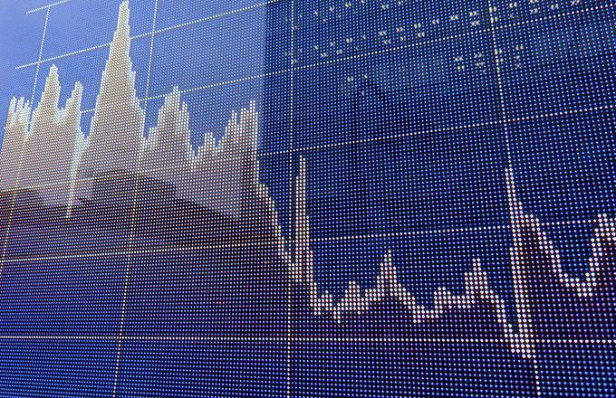

## Table of Contents

## What is an asset bubble?

An asset bubble is when the price of something, like a house or a stock, goes up a lot more than it should. People start buying it because they think the price will keep going up. But the price is not based on what the thing is really worth. It's like a bubble that can grow bigger and bigger.

But eventually, the bubble can pop. When people realize the price is too high, they stop buying. The price starts to fall fast, and people who bought at the high price can lose a lot of money. Asset bubbles can cause big problems for the economy, like what happened with the housing bubble in 2008.

## How do asset bubbles form?

Asset bubbles start when people get excited about an asset, like a stock or a house, and start buying it a lot. They think the price will keep going up, so they want to buy it before it gets too expensive. This makes the price go up even more. More people see the price going up and want to buy too, thinking they can sell it later for a profit. This cycle keeps going, with the price getting higher and higher, even though the asset might not be worth that much.

Eventually, the bubble can get too big. People start to realize that the price is much higher than what the asset is really worth. They stop buying, and some even start selling. When this happens, the price starts to fall fast. People who bought at the high price can lose a lot of money. This is called the bubble popping. It can cause big problems for the economy, like what happened with the housing bubble in 2008.

## What are some historical examples of asset bubbles?

One famous asset bubble was the Dutch Tulip Mania in the 1600s. People in the Netherlands started buying tulip bulbs because they thought the prices would keep going up. The prices got really high, with some bulbs costing more than a house! But then, people realized the prices were too high and stopped buying. The prices crashed, and many people lost a lot of money. This is one of the first big asset bubbles in history.

Another big asset bubble was the Dot-com Bubble in the late 1990s and early 2000s. People got excited about internet companies and started buying their stocks. The stock prices went up a lot, even if the companies were not making much money. People thought the internet would change everything and wanted to invest in these companies. But then, in 2000, people realized many of these companies were not doing well. The stock prices crashed, and many people lost a lot of money.

A more recent example is the Housing Bubble that led to the 2008 financial crisis. In the early 2000s, many people in the United States started buying houses because they thought the prices would keep going up. Banks gave out a lot of loans, even to people who might not be able to pay them back. The housing prices got very high. But then, in 2007 and 2008, people started to realize the prices were too high. Many people could not pay their loans, and the housing prices crashed. This caused a big problem for the economy, with many people losing their homes and jobs.

## What is an economic recession?

An economic recession is when the economy of a country starts to shrink instead of grow. This means that people are buying less, businesses are making less money, and more people are losing their jobs. It can last for months or even years. During a recession, it's harder for people to find work, and they might have to cut back on spending. This can make the recession worse because when people spend less, businesses make even less money.

Recessions can happen for many reasons. Sometimes, it's because of a big event like a housing bubble popping or a financial crisis. Other times, it might be because people are worried about the future and start saving more money instead of spending it. Governments and central banks try to help by lowering interest rates or spending more money to boost the economy. But it can take time for these actions to work, and the recovery from a recession can be slow and difficult for many people.

## How do asset bubbles contribute to economic recessions?

Asset bubbles can lead to economic recessions when they pop. When people think the price of something like a house or a stock will keep going up, they buy a lot of it. This makes the price go up even more. But if the price gets too high and people realize it's not worth that much, they stop buying. When the bubble pops, the price falls fast. People who bought at the high price can lose a lot of money. This can make them spend less money on other things, which can hurt businesses and the whole economy.

When an asset bubble pops, it can also cause big problems for banks and other financial companies. If they gave out a lot of loans based on the high prices, they can lose a lot of money when the prices fall. This can make them stop lending money to people and businesses. Without loans, it's harder for businesses to grow and for people to buy things like houses or cars. This can slow down the whole economy and lead to a recession. When many people lose their jobs and businesses struggle, it can take a long time for the economy to recover.

## What are the key indicators of an asset bubble?

One key indicator of an asset bubble is when prices go up a lot more than they should. This happens when people start buying something, like a house or a stock, because they think the price will keep going up. They might not care about what the thing is really worth. If the price keeps going up fast, it might be a sign that a bubble is forming.

Another indicator is when more and more people start talking about the asset and wanting to buy it. You might hear about it a lot on the news or from friends. When everyone is excited and wants to get in on the action, it can make the bubble grow even bigger. But when too many people are buying just because others are, it's a sign that the bubble might be ready to pop.

A third indicator is when it becomes easy to borrow money to buy the asset. Banks and lenders might give out loans more freely because they think the prices will keep going up. If people are using a lot of borrowed money to buy something, it can make the bubble even bigger. But if the prices start to fall, people might not be able to pay back their loans, which can cause big problems.

## How can asset bubbles be identified before they burst?

One way to spot an asset bubble before it bursts is by watching how fast prices are going up. If the price of something like a house or a stock is going up a lot more than it should, it might be a sign of a bubble. People might be buying it because they think the price will keep going up, not because it's worth that much. If the price keeps going up really fast, it could mean a bubble is forming.

Another way to identify an asset bubble is by paying attention to how much people are talking about it. If everyone is excited and talking about buying the asset, it can make the bubble grow bigger. When lots of people want to buy something just because others are, it's a sign that the bubble might be getting too big. Also, if it's easy to borrow money to buy the asset, that can make the bubble even bigger. But if the prices start to fall, people might not be able to pay back their loans, which can cause big problems.

## What are the immediate effects of an asset bubble bursting?

When an asset bubble bursts, the price of the asset, like a house or a stock, starts to fall fast. People who bought the asset at the high price can lose a lot of money. They might have to sell the asset for less than they paid for it. This can make them feel worried and scared. They might start spending less money on other things, like going out to eat or buying new clothes. When a lot of people do this, it can hurt businesses and the whole economy.

The bursting of an asset bubble can also cause big problems for banks and other financial companies. If they gave out a lot of loans based on the high prices, they can lose a lot of money when the prices fall. This can make them stop lending money to people and businesses. Without loans, it's harder for businesses to grow and for people to buy things like houses or cars. This can slow down the whole economy and make it harder for people to find jobs. When many people lose their jobs and businesses struggle, it can take a long time for the economy to get better.

## How do the effects of a burst asset bubble spread through the economy?

When an asset bubble bursts, the effects can spread through the economy like a ripple in a pond. The first thing that happens is the price of the asset, like a house or a stock, starts to fall fast. People who bought the asset at the high price lose money. They might have to sell it for less than they paid, which makes them feel worried and scared. They start spending less money on other things, like going out to eat or buying new clothes. When a lot of people do this, businesses start making less money. This can make them lay off workers or even close down.

The problems can get even bigger when banks and other financial companies are affected. If they gave out a lot of loans based on the high prices, they lose money when the prices fall. This can make them stop lending money to people and businesses. Without loans, it's harder for businesses to grow and for people to buy things like houses or cars. This slows down the whole economy. More people might lose their jobs, and it can take a long time for the economy to get better. The effects of a burst asset bubble can be felt by everyone, not just the people who bought the asset.

## What are the long-term impacts of asset bubbles on economic growth?

When an asset bubble bursts, it can slow down economic growth for a long time. People who lose money from the bubble might spend less on other things, which hurts businesses. Businesses might have to lay off workers or close down. This makes it harder for the economy to grow because people have less money to spend and businesses are making less money. Banks might also stop lending money because they lost money from the bubble, making it even harder for businesses to grow and for people to buy things like houses or cars.

Over time, the economy can start to recover, but it might take years. Governments and central banks can try to help by spending more money or lowering interest rates to encourage people to spend and borrow again. But the trust in the economy might be damaged, and people might be more careful with their money. This can make the recovery slow. In the end, asset bubbles can lead to less economic growth for a long time because they cause a lot of problems that take a while to fix.

## What measures can policymakers take to mitigate the impact of asset bubbles on economic recessions?

Policymakers can take several steps to help lessen the impact of asset bubbles on economic recessions. One important thing they can do is keep a close eye on the economy and watch for signs of bubbles forming. If they see prices going up too fast or too many people borrowing money to buy assets, they can take action early. They might raise interest rates to make borrowing more expensive, which can slow down the bubble. They can also set rules for banks to make sure they don't give out too many risky loans.

Another way policymakers can help is by being ready to act quickly when a bubble bursts. They can lower interest rates to make it cheaper for people and businesses to borrow money. This can help businesses keep going and people keep spending. The government can also spend more money on things like building roads or helping people find jobs. This can put more money into the economy and help it recover faster. By acting early and helping the economy after a bubble bursts, policymakers can make the impact of a recession less bad.

## How do different types of asset bubbles (e.g., housing, stock market) differently affect economic recessions?

Different types of asset bubbles, like housing and stock market bubbles, can affect economic recessions in different ways. When a housing bubble bursts, it can hit people hard because many people's wealth is tied up in their homes. If house prices fall a lot, people can lose a lot of money. They might owe more on their mortgage than their house is worth, which can make them stop spending on other things. Banks can also get into trouble if they gave out a lot of loans for houses that are now worth less. This can make them stop lending money, which slows down the whole economy.

A stock market bubble bursting can also cause big problems, but it might affect different people. People who have a lot of money in the stock market can lose a lot if the prices fall. This can make them spend less money, which can hurt businesses. But not everyone has money in the stock market, so the effects might not be as widespread as a housing bubble. Still, if big companies lose a lot of money, they might have to lay off workers or stop investing, which can slow down the economy. Both types of bubbles can lead to recessions, but they can affect different parts of the economy and different groups of people.

## What is the understanding of asset bubbles?

Asset bubbles manifest when the market prices of assets such as stocks, real estate, or commodities rise dramatically above their intrinsic value. The concept of intrinsic value refers to the actual worth of an asset as calculated by its fundamentals, such as cash flow, dividends, and growth prospects. Prices significantly exceeding these fundamentals indicate the formation of a bubble.

The drivers of asset bubbles are multifaceted, primarily involving speculative fervor and market psychology. Speculation occurs when investors expect that the market prices will continue rising and purchase assets with the intention of selling them at a higher price. This behavior can be mathematically represented by:

$$
P_t = P_{t-1} \times (1 + r + \epsilon_t)
$$

where $P_t$ is the price at time $t$, $r$ is the expected rate of return, and $\epsilon_t$ represents speculative demand.

Market psychology also plays a significant role, where investor sentiment and herd behavior push prices beyond rational levels. Behavioral biases, such as overconfidence and fear of missing out, can lead to irrational exuberance.

Economic policies, although often well-meaning, can inadvertently inflate bubbles if not carefully implemented. For instance, low interest rates can lower the cost of borrowing, encouraging excessive investment in certain assets. This is further augmented by the expansion of money supply and credit, providing ample [liquidity](/wiki/liquidity-risk-premium) for speculative investments. When credit is easily available, investors are more likely to leverage their positions, amplifying price increases. The equation below reflects this phenomenon:

$$
MV = PQ
$$

where $M$ is the money supply, $V$ is velocity of money, $P$ is price level, and $Q$ represents the economy's quantity of goods and services. An increase in $M$ without a corresponding increase in $Q$ can lead to higher $P$, contributing to asset inflation.

The pervasive impact of bubbles extends beyond distorted valuations. When bubbles burst, the resulting market correction leads to significant financial losses. Investors experience a sharp decline in wealth, and companies might face reduced market capitalization, impacting their ability to raise capital. The correction phase involves the rapid sell-off of assets, exemplified by the equation:

$$
B_t = W_t - (L_t + C_t)
$$

where $B_t$ is the bubble measure at time $t$, $W_t$ is the wealth level, $L_t$ denotes liabilities, and $C_t$ signifies capital outflows.

In conclusion, asset bubbles result from speculative behavior, market psychology, and economic policy missteps, driven by credit expansion and liquidity. They pose substantial risks through market mispricing and eventual financial losses when they burst. Understanding the mechanics of asset bubbles is crucial for mitigating their adverse effects on the economy.

## References & Further Reading

[1]: Galbraith, J. K. (1954). "The Great Crash, 1929." Boston: Houghton Mifflin Company.

[2]: Kindleberger, C. P., & Aliber, R. Z. (2011). "Manias, Panics, and Crashes: A History of Financial Crises." Palgrave Macmillan.

[3]: Shiller, R. J. (2000). "Irrational Exuberance." Princeton University Press.

[4]: Malkiel, B. G. (2015). "A Random Walk Down Wall Street: The Time-Tested Strategy for Successful Investing." W.W. Norton & Company.

[5]: López de Prado, M. (2018). "Advances in Financial Machine Learning." Wiley.

[6]: Sornette, D. (2003). "Why Stock Markets Crash: Critical Events in Complex Financial Systems." Princeton University Press.

[7]: Caginalp, G., & Balenovich, D. (1999). "Asset Flow and Momentum: Deterministic and Stochastic Equations." *Philosophical Transactions of the Royal Society of London. Series A: Mathematical, Physical and Engineering Sciences*, 357(1758), 2119-2133.

[8]: Chincarini, L. B., & Kim, D. (2006). "Quantitative Equity Portfolio Management: An Active Approach to Portfolio Construction and Management." McGraw-Hill.