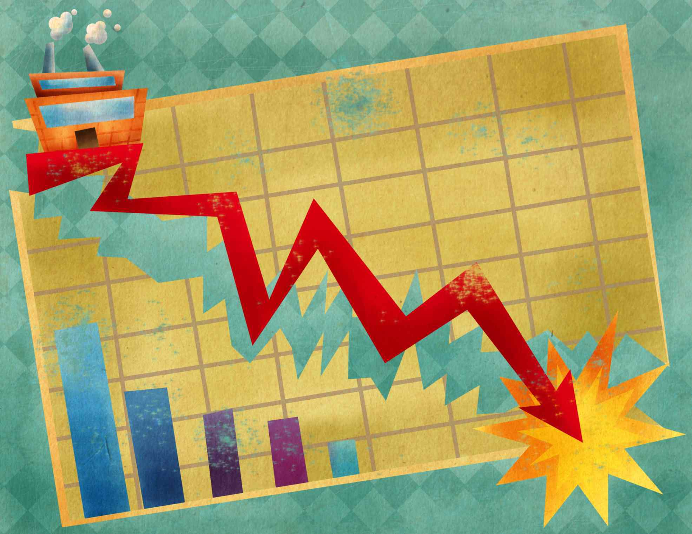

In the complex world of financial markets, understanding the interplay between bankruptcy, company stock performance, and algorithmic trading is crucial. Bankruptcy signifies a company's legal declaration of its inability to meet its financial obligations, which has a profound impact on its stock value. This scenario becomes even more intriguing with the involvement of algorithmic trading, which automates trading processes and can rapidly amplify market reactions.

The financial implications of a company's bankruptcy on its stock can be severe. When a firm declares bankruptcy, particularly under Chapter 7, its stocks could become worthless, as assets are liquidated to pay creditors. In a Chapter 11 filing, a reorganization might occur, possibly sustaining some stock value, but usually at a significantly reduced level. Investors and analysts must navigate these turbulent waters as the stock's fate hinges on the company's restructuring plan and asset value.



Algorithmic trading further complicates these interactions by executing trades at high speeds based on pre-set algorithms. While this can enhance market efficiency and liquidity, it also poses unique challenges. For instance, in the volatile environment surrounding a bankruptcy announcement, algorithmic trading might trigger extensive sell-offs or purchases, based on market signals, often leading to exaggerated price movements. This immediacy in response necessitates that investors and policymakers alike develop a nuanced understanding of these interactions to manage risk effectively and ensure market stability.

As algorithmic trading continues to gain traction, it becomes imperative to assess its impact on stock valuations, especially during financial distress. Such an understanding will allow market participants to forecast potential shifts and devise strategies to mitigate adverse effects. In today's market landscape, characterized by rapid technological advancements and complex financial instruments, anticipating and reacting to the dynamics between bankruptcy events and algorithmic trading is essential for protecting investments and maintaining market equilibrium.

## Table of Contents

## Understanding Bankruptcy and Its Impact on Company Stocks

Bankruptcy is a legal process activated when a company finds itself unable to meet its debt obligations. This proceeding provides a judicial framework within which a company can either reorganize its debts and business structure or liquidate its assets to satisfy creditors. 

When a firm opts for Chapter 11 bankruptcy, it pursues reorganization. This strategic move allows the company to restructure its debts while continuing regular operations in hopes of emerging financially viable. During this period, existing stocks might retain some value. However, due to uncertainty and potential dilution, they usually trade at significantly reduced prices compared to pre-bankruptcy levels.

Conversely, Chapter 7 bankruptcy involves the liquidation of the company's assets. The proceeds are distributed to creditors, with common shareholders typically being the last in line for any recoveries. As a result, stocks often become worthless, wiping out shareholders' investments.

A company's bankruptcy usually triggers delisting from major stock exchanges, often accompanied by steep declines in stock prices. Delisting removes the stock from platforms like the New York Stock Exchange (NYSE) or NASDAQ, severely limiting [liquidity](/wiki/liquidity-risk-premium) and further reducing the stock’s appeal to potential investors.

Historical examples provide insights into the consequences of bankruptcy on stocks. For instance, the bankruptcy of Lehman Brothers in 2008 resulted in a complete loss for ordinary shareholders. In another case, General Motors filed for Chapter 11 in 2009, allowing it to restructure effectively and later re-emerge as a stable entity. Here, the legacy stocks were rendered worthless, but the issuance of new stocks post-reorganization provided opportunities for investors.

These examples highlight the severe repercussions for investors, emphasizing the importance of understanding the implications of bankruptcy on stock performance.

## Algorithmic Trading: Mechanics and Market Impact

Algorithmic trading, often referred to as 'algo trading,' employs automated systems for executing trades based on a series of predetermined criteria. These systems are designed to [carry](/wiki/carry-trading) out trades with minimal human intervention, allowing for rapid and precise execution. The increasing presence of [algorithmic trading](/wiki/algorithmic-trading) in financial markets has significantly transformed trading mechanisms and market behavior.

High-frequency trading ([HFT](/wiki/high-frequency-trading-strategies)), a specialized subset of algorithmic trading, focuses on executing a large [volume](/wiki/volume-trading-strategy) of orders at very high speeds. Utilizing the power of sophisticated algorithms, HFT capitalizes on minuscule price discrepancies and market inefficiencies that are undetectable to human traders. For instance, HFT firms deploy algorithms that can execute tens of thousands of trades within microseconds. These algorithms are supported by cutting-edge technology, such as co-located servers and fiber optic cables, to reduce latency.

One of the primary advantages of algorithmic trading is its ability to enhance liquidity and improve pricing efficiency in the markets. By enabling a swift match of buy and sell orders, algorithmic trading contributes to tighter bid-ask spreads, benefiting all market participants. However, the sophistication and speed of these systems can also introduce new risks, such as increased market [volatility](/wiki/volatility-trading-strategies) and systemic risks. The integration of algorithmic trading in financial markets means that rapid, large-scale trading activities can lead to unexpected turbulence.

The 2010 Flash Crash is a notable example of how algorithmic trading can exacerbate market disturbances. On May 6, 2010, the Dow Jones Industrial Average plummeted nearly 1,000 points in a matter of minutes, only to recover a significant portion shortly thereafter. Investigations revealed that algorithmic trading, particularly HFT, played a significant role in amplifying the market chaos. Algorithms entered a feedback loop, where automated trading programs reacted to each other’s trades, leading to a rapid escalation of selling activity.

The potential adverse effects of algorithmic trading during periods of financial distress highlight the fine balance that must be maintained between leveraging its efficiency and mitigating its risks. The rapid response capability of algorithms, while advantageous in stable market conditions, can destabilize markets during crises. In such scenarios, algorithms reacting to similar triggers can lead to cascading effects, magnifying market movements beyond their fundamental causes.

In conclusion, while algorithmic trading brings unparalleled efficiency and liquidity improvements to markets, it also necessitates vigilant risk management to prevent disproportionate impacts during volatile periods. The ongoing challenge lies in harnessing the benefits of algorithmic trading while implementing measures to safeguard against its potential to amplify financial instability. As financial markets continue to evolve, regulators and market participants must collaborate to ensure the stability and resilience of the trading ecosystem.

## Interplay Between Bankruptcy and Algorithmic Trading

Algorithmic trading, characterized by high-speed transactions executed through sophisticated algorithms, plays a notable role in the stock dynamics of companies facing bankruptcy. The rapid dissemination and reaction capabilities intrinsic to algorithmic trading can result in significant impacts on the stocks of these financially distressed companies. 

When a company approaches bankruptcy, its stock typically experiences a feature known as volatility, which piques the interest of algorithms designed to exploit price inefficiencies. This propensity is magnified in scenarios where companies announce bankruptcy, leading to frenzied sell-offs as algorithms interpret such news as a signal of declining value. The swift decision-making process driven by algorithms can cause an amplified rush to sell stocks perceived as worthless, culminating in steep declines in their market prices.

Moreover, algorithmic trading systems, equipped with advanced analytics, have the potential to misinterpret unprecedented market movements resulting from bankruptcy announcements. Such misinterpretations can lead to either excessive sell-offs or unwarranted buy-ins, triggered by algorithms acting on predefined criteria. This automated decision-making process can exacerbate fluctuations, driving market prices far from their fundamental values.

Understanding the complex interplay between rapid algorithmic responses and stock valuation changes during corporate bankruptcies is essential for investors and market participants. This awareness can inform investors' strategies, enabling them to better anticipate and react to potential market instabilities. By appreciating the rapid information propagation by algorithms and the subsequent market reactions, investors can enhance their risk management frameworks, applying diversified strategies and employing tools to navigate the volatile landscape.

Case studies from historical bankruptcies further underscore the risks posed by algorithmic trading during these periods. For instance, the bankruptcy of Lehman Brothers in 2008 triggered algorithmic trading patterns that led to significant market perturbations. Similarly, the sharp decline in Enron's stock price prior to its bankruptcy filing was aggravated by algorithmic trading activities that reacted to the company's deteriorating credit standings. These cases highlight the necessity for both market participants and regulators to develop robust strategies and controls, such as circuit breakers and limit order protections, to mitigate undue volatility induced by algorithmic trading systems. 

These insights illuminate the challenges and opportunities presented by algorithmic trading in bankruptcy scenarios, underscoring the need for continued research and adaptation in trading strategies and regulatory frameworks to ensure market stability amidst the growing prevalence of automated trading systems.

## Navigating the Risks of Algorithmic Trading in Bankruptcy Scenarios

In bankruptcy scenarios, the risks associated with algorithmic trading can be substantial. Investors and trading firms can take several steps to mitigate these risks effectively.

Firstly, investors should employ diversified strategies to spread risk across multiple asset classes, reducing potential losses from sharp declines in any single stock. Implementing predefined trading rules allows investors to systematically manage trades by setting specific criteria for buying or selling, minimizing emotional decision-making. These rules could be based on [fundamental analysis](/wiki/fundamental-analysis), technical analysis, or a combination of factors that predict potential market reactions during bankruptcy scenarios.

Algorithmic trading firms can further manage risks by incorporating 'kill switches' into their trading systems. Kill switches automatically halt trading activities when certain conditions are met, such as extreme market volatility. This precautionary step prevents unintended massive sell-offs that could exacerbate market instability. Similarly, limit order protections can restrict the execution of trades beyond set price thresholds, safeguarding against unfavorable price excursions during volatile periods.

Regulatory measures such as circuit breakers play a crucial role in maintaining market stability. Circuit breakers temporarily halt trading on an exchange to curb panic selling and allow time for information dissemination and investor reassessment. These mechanisms are designed to prevent cascading market effects that may arise from unrestricted rapid trading actions during periods of financial distress.

Understanding legal implications and safeguarding strategies is vital for trading entities and regulators. Entities must comply with financial regulations designed to maintain orderly trading and protect investor interests. By adopting best practices and adhering to legal standards, trading firms can minimize their exposure to legal and financial risks associated with algorithmic trading in bankruptcy scenarios.

For practical implementation, investors and firms engaging in algorithmic trading can employ strategies such as:

```python
def diversified_strategy(portfolio, threshold):
    """Adjust portfolio to maintain diversification."""
    for asset in portfolio:
        if portfolio[asset]['weight'] > threshold:
            portfolio[asset]['weight'] = threshold
            # Rebalance the remaining portfolio proportionally
    return portfolio

def kill_switch_condition(market_data):
    """Check if market conditions trigger the kill switch."""
    if market_data['volatility'] > THRESHOLD_VOLATILITY:
        execute_kill_switch()

def execute_kill_switch():
    """Execute measures to halt trading."""
    print("Activating kill switch: trading halted to prevent losses.")

def implement_circuit_breaker(market_event):
    """Simulate circuit breaker activation."""
    if market_event['severity'] > CRITICAL_SEVERITY:
        print("Circuit breaker activated: temporary market halt.")
```

By integrating these strategies into their trading frameworks, investors and firms can protect their assets during financial downturns, enhancing resilience against the adverse impacts of algorithmic trading on distressed assets.

## Conclusion

The intersection of corporate bankruptcy, stock performance, and algorithmic trading presents a complex landscape wrought with both opportunities and challenges. Algorithmic trading introduces significant efficiency and liquidity into financial markets, but its effectiveness is contingent on the responsible management of associated risks, particularly during bankruptcy events. The rapid execution and large trade volume characteristic of algorithmic trading demand a robust framework for risk management to protect investors from unforeseen market disturbances, such as sudden fluctuations in stock values of distressed companies.

To safeguard investment portfolios, investors are urged to engage in proactive risk assessments and implement strategic measures that account for market volatility and potential hazards linked to algorithmic trading. This is particularly pertinent during bankruptcy events, which often precipitate sharp and unpredictable stock price movements, sometimes further exacerbated by the automated nature of algorithmic trading.

A comprehensive understanding of how automated trading systems impact distressed assets is essential for achieving improved market stability. Market participants, including investors, algorithmic trading firms, and regulators, must strive for increased transparency and adaptability to better navigate the nuances of financial distress and asset devaluation. This calls for a concerted effort in developing policies and research initiatives that strike a balance between leveraging the benefits of algorithmic trading and mitigating its potential to amplify financial instability.

Future research should prioritize the development of strategies and technologies that can anticipate and dampen the negative effects of algorithmic trading during economic downturns. By addressing these challenges, market stakeholders can enhance the resilience and stability of financial markets, ensuring they remain robust in the face of financial distress and contribute positively to overall economic well-being.

## References & Further Reading

[1]: Markus K. Brunnermeier, "Asset Pricing under Asymmetric Information: Bubbles, Crashes, Technical Analysis, and Herding" (Oxford University Press, 2001).

[2]: "Algorithmic Trading and DMA: An introduction to direct access trading strategies" by Barry Johnson.

[3]: "High-Frequency Trading: A Practical Guide to Algorithmic Strategies and Trading Systems" by Irene Aldridge.

[4]: "After the Crash: The Future of Finance" – Proceedings from the Bank of England conference on algorithmic trading, risk management, and financial stability.

[5]: "The Flash Crash: A New Era of Electronic Markets" by James Lyne. 

[6]: "Bankruptcy and Distressed Restructuring: Analytical Issues in Measuring Value" by Edward I. Altman.