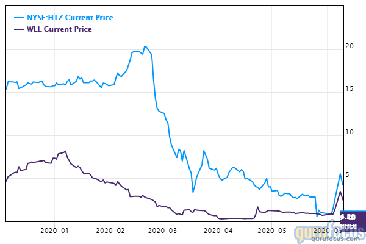

## Table of Contents

## What is bankruptcy and how does it affect a company?

Bankruptcy is when a company or person can't pay their debts and needs help from the court. It's like telling everyone, "I can't pay you back right now, so let's figure out a new plan." For a company, this can mean they get a chance to reorganize and keep going, or it might mean they have to close down and sell everything to pay off some of their debts.

When a company goes bankrupt, it can affect a lot of people. Employees might lose their jobs if the company has to close. People who lent money to the company, like banks, might not get all their money back. Customers might not get the products or services they were promised. But sometimes, bankruptcy can help a company start fresh. They might be able to get rid of some debts and come up with a new plan to keep the business running. It's a tough situation, but it can lead to a new beginning.

## How does the stock price of a company typically react to a bankruptcy filing?

When a company files for bankruptcy, its stock price usually drops a lot. This happens because investors get worried that they might lose their money. They start selling their shares quickly, which makes the stock price go down. Sometimes, the stock price can drop so much that it becomes almost worthless.

But, the reaction can be different depending on the situation. If people think the company might be able to recover after bankruptcy, the stock price might not drop as much. It might even go up a little if investors think the company has a good plan to fix its problems. However, this is not common, and most of the time, the stock price will still go down a lot when a company files for bankruptcy.

## What are the different types of bankruptcy and how do they impact stock value?

There are mainly two types of bankruptcy that companies use: Chapter 7 and Chapter 11. Chapter 7 bankruptcy means the company is going out of business. They sell everything they have to pay off as much debt as they can. When a company files for Chapter 7, the stock value usually drops a lot because the company is closing down, and shareholders will likely get nothing. It's like the company is saying goodbye, and investors know they won't see their money again.

Chapter 11 bankruptcy is different. It's about reorganizing the company so it can keep going. The company makes a plan to pay back some of its debts over time and tries to become profitable again. When a company files for Chapter 11, the stock value can still go down a lot because investors are worried. But sometimes, if people think the company has a good plan to fix its problems, the stock might not drop as much, or it might even go up a little. It's like the company is saying, "We're in trouble, but we have a plan to get better," and some investors might believe in that plan.

## Can a company's stock still be traded after filing for bankruptcy?

Yes, a company's stock can still be traded after filing for bankruptcy. When a company files for bankruptcy, it doesn't mean the stock market stops trading its shares right away. The stock can keep being bought and sold on the stock exchange, just like before. But, the price of the stock usually goes down a lot because people are worried about the company's future.

The type of bankruptcy the company files for can make a difference. If it's Chapter 7 bankruptcy, where the company is closing down, the stock might become almost worthless because the company is selling everything to pay off debts. But if it's Chapter 11 bankruptcy, where the company is trying to reorganize and keep going, the stock might still be traded, and its value could depend on how people feel about the company's plan to get better.

## What happens to shareholders when a company files for bankruptcy?

When a company files for bankruptcy, shareholders usually lose a lot of money. If the company is filing for Chapter 7 bankruptcy, which means it's closing down, shareholders are often the last in line to get any money back. After the company sells everything it has, it pays off its debts to banks and other creditors first. If there's anything left after that, shareholders might get a little bit, but usually, there's nothing left for them. So, their shares become almost worthless.

If the company files for Chapter 11 bankruptcy, which means it's trying to reorganize and keep going, shareholders might have a bit more hope. The company makes a plan to pay back some of its debts over time and tries to become profitable again. Shareholders might keep their shares, and if the company's plan works out, the stock price could go up a little. But even in Chapter 11, shareholders often see the value of their shares drop a lot because the company is still in trouble. It's a risky time for them, and they might lose a lot of money.

## How does bankruptcy affect the long-term value of a company's stock?

When a company goes bankrupt, it usually hurts the long-term value of its stock a lot. If the company is closing down because of Chapter 7 bankruptcy, the stock can become almost worthless. This is because the company sells everything it has to pay off debts, and shareholders are the last to get any money. There's usually nothing left for them, so the stock price stays very low or goes to zero. It's like the company is gone, and the stock doesn't have any value anymore.

If the company is trying to reorganize with Chapter 11 bankruptcy, the long-term value of the stock can be different. The company makes a plan to pay back some debts and keep going. If the plan works out well, the stock might slowly start to go up again. But it takes a long time, and there's a lot of risk. Even if the company survives, the stock might never get back to what it was before the bankruptcy. It's like the company is trying to start over, but it's hard to regain trust and value.

## What are the key financial indicators that might predict a company's bankruptcy?

Some key financial indicators can show if a company might be heading towards bankruptcy. One big sign is if the company keeps losing money over time. If a company's income is less than its costs for a long time, it can't keep going without running out of money. Another sign is if the company has a lot of debt and can't pay it back. If a company owes more money than it can handle, it might have to file for bankruptcy to deal with those debts. Also, if the company's cash flow is bad, meaning it doesn't have enough money coming in to cover what it needs to pay out, that's a warning sign.

Another important indicator is if the company's assets are worth less than its liabilities. This means the company owes more money than the value of everything it owns. If this happens, the company is in a tough spot and might not be able to pay back its debts. Lastly, if the company's stock price keeps going down and investors are losing faith, that can be a sign of trouble. When people don't believe in the company anymore, it's harder for the company to get the money it needs to keep going. These signs together can show that a company might be at risk of going bankrupt.

## How do investors typically respond to a company's bankruptcy announcement?

When a company announces it's going bankrupt, investors usually get very worried. They start selling their shares quickly because they're afraid they'll lose their money. This makes the stock price drop a lot. Investors know that in bankruptcy, they might not get any money back, especially if the company is closing down. So, they want to get out before the stock becomes worthless.

But sometimes, if the company is trying to reorganize and keep going, some investors might not give up hope. They might believe in the company's plan to fix its problems and start making money again. In these cases, a few investors might hold onto their shares or even buy more, hoping the stock price will go up in the future. But this is rare, and most of the time, investors will still sell their shares because bankruptcy is a big risk.

## What role do creditors play in the bankruptcy process and how does it influence stock prices?

When a company goes bankrupt, creditors are the people or banks that the company owes money to. They play a big role in the bankruptcy process. If the company is closing down under Chapter 7 bankruptcy, creditors get paid first from whatever the company can sell. They try to get as much of their money back as they can. If the company is trying to reorganize under Chapter 11 bankruptcy, creditors help make the plan to pay back some of the debts over time. They have a say in whether the plan is good enough and if they'll get some of their money back.

The way creditors act during bankruptcy can affect the company's stock prices. When creditors are trying to get their money back, they might not care about the shareholders, who are the people who own the company's stock. This makes investors worried, and they start selling their shares, which makes the stock price go down a lot. If creditors agree to a good plan to help the company reorganize, some investors might feel a bit better and hold onto their shares, hoping the company will get better. But most of the time, the stock price still goes down because bankruptcy is risky, and investors are scared they'll lose their money.

## How can a company restructure during bankruptcy and what are the potential impacts on stock?

When a company files for Chapter 11 bankruptcy, it tries to restructure so it can keep going. The company makes a plan to pay back some of its debts over time. This plan needs to be approved by the court and the company's creditors. The company might close some parts of its business that aren't making money, sell off some assets, or change how it operates to save money. The goal is to become profitable again and avoid closing down completely. This process can take a long time and is very complicated.

The impact on the company's stock during this restructuring can be big. When the company first announces it's going bankrupt, the stock price usually drops a lot because investors are worried they'll lose their money. But if the restructuring plan seems good and people think the company can get better, the stock price might not drop as much, or it might even go up a little. Still, it's a risky time, and most investors will sell their shares to avoid losing more money. The stock might never get back to what it was before the bankruptcy, even if the company survives and starts making money again.

## What are the legal implications of bankruptcy on a company's stock and trading?

When a company files for bankruptcy, there are big legal changes that affect its stock and how it's traded. If the company is filing for Chapter 7 bankruptcy, which means it's closing down, the stock can become almost worthless. The company has to sell everything it owns to pay off its debts, and shareholders are the last ones to get any money. If there's anything left after paying everyone else, shareholders might get a little bit, but usually, there's nothing left for them. This means the stock can stop being traded on the stock exchange because it doesn't have any value anymore.

If the company is filing for Chapter 11 bankruptcy, which means it's trying to reorganize and keep going, the stock can still be traded. The company makes a plan to pay back some of its debts over time, and this plan needs to be approved by the court and the company's creditors. During this time, the stock price usually drops a lot because investors are worried about the company's future. But if the restructuring plan seems good and people think the company can get better, the stock might not drop as much, or it might even go up a little. Still, it's a risky time, and the legal process can take a long time, so investors often sell their shares to avoid losing more money.

## How do market analysts forecast the impact of bankruptcy on a company's stock performance?

Market analysts look at a lot of things to guess how a company's stock will do after it goes bankrupt. They check the company's financial health before the bankruptcy, like how much money it was losing and how much debt it had. They also look at the type of bankruptcy the company is filing for. If it's Chapter 7, where the company is closing down, analysts know the stock will probably become worthless because the company is selling everything to pay off debts. But if it's Chapter 11, where the company is trying to reorganize, analysts will look at the company's plan to see if it seems good enough to help the company get better.

Analysts also think about what investors are feeling. If investors are really worried and start selling their shares quickly, the stock price will drop a lot. But if some investors believe in the company's plan to fix its problems, the stock might not drop as much, or it might even go up a little. Analysts use all this information to make their best guess about what will happen to the stock price. They know it's a risky time, and the stock might never get back to what it was before the bankruptcy, even if the company survives.

## References & Further Reading

[1]: Markus K. Brunnermeier, "Asset Pricing under Asymmetric Information: Bubbles, Crashes, Technical Analysis, and Herding" (Oxford University Press, 2001).

[2]: "Algorithmic Trading and DMA: An introduction to direct access trading strategies" by Barry Johnson.

[3]: "High-Frequency Trading: A Practical Guide to Algorithmic Strategies and Trading Systems" by Irene Aldridge.

[4]: "After the Crash: The Future of Finance" – Proceedings from the Bank of England conference on algorithmic trading, risk management, and financial stability.

[5]: "The Flash Crash: A New Era of Electronic Markets" by James Lyne. 

[6]: "Bankruptcy and Distressed Restructuring: Analytical Issues in Measuring Value" by Edward I. Altman.