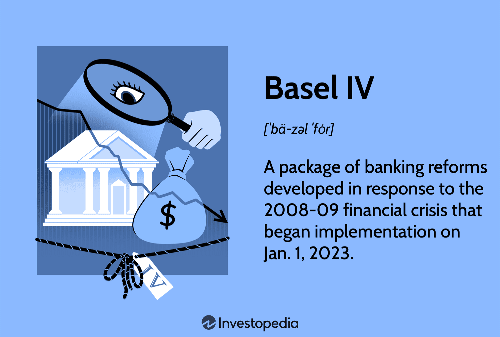

Understanding banking regulations and their implications is essential for grasping the financial landscape in which U.S. banks operate. Basel IV emerges as a pivotal progression in global banking standards, poised to reshape how banks assess financial risk. This set of regulations aims to enhance the robustness of the financial system by refining the methodologies used to calculate risk-weighted assets (RWAs), thereby promoting stability and consistency across international banking operations.

These new directives significantly impact U.S. banks, offering both challenges and opportunities in their pursuit of compliance and competitive advantage. Basel IV extends the framework established by its predecessors—Basel I, II, and III—emphasizing the need for a more standardized approach to risk management, ultimately fostering greater transparency and trust within the global financial system. The focus remains on ensuring that banks hold appropriate capital reserves against potential losses, which is crucial for maintaining overall financial health.

One of the significant aspects of Basel IV is its intersection with algorithmic trading—a domain where trades are executed at high frequencies through complex algorithms. As these trading strategies heavily rely on risk assessment models, Basel IV introduces new paradigms that may influence the flexibility and efficiency of these algorithms. U.S. banks are thus prompted to reevaluate and possibly recalibrate their trading practices to ensure alignment with the new regulatory standards.

This article will explore how Basel IV's evolving standards uniquely affect U.S. banks and their strategic maneuvers. The detailed examination of these regulations and their implications on algorithmic trading presents an opportunity for banks to refine their risk management practices and trading algorithms, potentially enhancing their resilience in volatile financial markets. Through comprehensive analysis, this article aims to elucidate the transformative impact of Basel IV on U.S. banking operations and trading strategies.

## Table of Contents

## The Basel Accords: An Overview

The Basel Accords are a series of banking supervision regulations developed by the Basel Committee on Banking Supervision (BCBS), based in Switzerland. Initiated with Basel I in 1988, these accords aimed to standardize banking regulations globally, focusing initially on credit risk and establishing a minimum capital requirement of 8% of risk-weighted assets for international banks. This marked a critical step towards uniformity in banking practices, ensuring that banks retained sufficient capital to safeguard against potential financial instability.

Basel II extended these regulations by addressing not only credit risk but also incorporating operational and market risks into the framework. Implemented in 2004, Basel II introduced the concept of three pillars: minimum capital requirements, supervisory review, and market discipline. This three-pronged approach aimed to foster more sophisticated risk management practices and enhance financial stability within the international banking sector.

The global financial crisis of 2007-2008 exposed several weaknesses in the existing Basel II framework, notably its inability to mitigate systemic risks and banking sector vulnerabilities effectively. In response, Basel III—introduced in 2010—focused on strengthening bank capital requirements and introducing new regulatory requirements on bank [liquidity](/wiki/liquidity-risk-premium) and leverage. Basel III emphasized the importance of improving the quality of bank capital, implementing more stringent regulatory standards like the Liquidity Coverage Ratio (LCR) and the Net Stable Funding Ratio (NSFR) to enhance short-term and long-term liquidity, respectively.

Continuing the progression of global banking standards, Basel IV, sometimes referred to as Basel 3.1, concentrates on refining the methodologies used to calculate risk-weighted assets (RWAs). By standardizing these calculations, Basel IV aims to improve the comparability of capital ratios across international banks, thereby promoting transparency, consistency, and trust within the global financial system. This iteration of the Basel Accords seeks to rectify disparities in banks' internal modeling approaches, contributing to more equitable and reliable risk assessments.

The Basel Accords, through their successive iterations, underscore the critical role of comprehensive risk management in banking practices. By progressively enhancing regulatory standards, they aim to secure the resilience of financial institutions worldwide, ensuring that they are better equipped to withstand future economic shocks while maintaining public confidence in the banking system.

## Impact of Basel IV on U.S. Banks

Basel IV, informally referred to as Basel 3.1, introduces significant changes to the regulatory landscape for U.S. banks by refining the methodologies used to assess and manage risk. A central focus is on the recalibration of risk-weighted assets (RWAs), which are used to determine the amount of capital banks need to hold. The revised standards aim to enhance the accuracy of risk assessments, ensuring that banks maintain adequate capital buffers to absorb potential losses.

One of the primary impacts of Basel IV is the potential increase in capital requirements that banks must meet. By tightening the approaches for calculating RWAs, Basel IV may lead to higher capital charges, particularly for those assets that are deemed riskier under the new framework. This shift could directly influence the liquidity and operational strategies of U.S. banks, requiring them to hold greater reserves and, consequently, limiting their ability to leverage their capital for business expansion and lending.

U.S. regulators, such as the Federal Reserve, are tasked with the implementation and adaptation of these international standards to the domestic context. This adaptability allows for tailored regulations that consider the unique characteristics of the U.S. banking system but also adds complexity to the Basel IV requirements. Therefore, the degree of rigor applied in the evaluation of RWAs can vary, impacting how banks navigate compliance obligations.

The introduction of Basel IV could have a pronounced effect on smaller financial institutions. Unlike larger banks with more substantial resources to manage compliance costs, smaller banks may struggle with the increased regulatory burden. These institutions must carefully balance the need to comply with Basel IV while continuing to pursue growth and maintain profitability.

Ultimately, U.S. banks may need to recalibrate their trading and investment strategies in response to Basel IV's new risk assessment models. This recalibration might involve reassessing portfolio compositions and diversifying asset holdings to optimize the risk-return profile under the revised capital requirements. Banks could also seek efficiencies in their operations or explore innovative financial products to mitigate the impact on profitability while aligning with the new regulatory landscape.

## Algorithmic Trading and Basel IV

Algorithmic trading involves using computer algorithms to execute trades at high speeds and volumes. Under Basel IV, these trading practices face higher scrutiny, with an emphasis on rigorous risk assessment. The new Basel IV standards mandate that trading algorithms must abide by enhanced risk calculation criteria, which could impact their flexibility and execution speed. This shift in regulation implies that banks must meticulously ensure their [algorithmic trading](/wiki/algorithmic-trading) systems are in compliance with these updated standards.

Given these demands, financial institutions may be compelled to invest significantly in advanced technology and modernize their existing trading infrastructures. This could involve enhancing their computational capabilities and refining their algorithmic models to align with Basel IV's emphasis on risk-weighted asset calculations. By doing so, banks aim to streamline the integration of these new regulatory requirements into their trading operations.

However, amid these regulatory pressures, there exist opportunities for banks to enhance their algorithmic trading strategies. Revisiting and optimizing trading algorithms allow institutions to boost their efficiency and robustness, particularly in volatile markets. By leveraging more sophisticated and compliant algorithms, banks can potentially enhance their competitive edge and maintain efficiency in their trading operations, even as they navigate the complexities introduced by Basel IV.

## Potential Challenges and Opportunities

Implementing Basel IV presents specific challenges for U.S. banks, notably the increased compliance costs associated with the new regulations. These costs arise from the necessity for banks to upgrade their risk management systems to meet the enhanced standards of Basel IV, which emphasizes comprehensive risk-weighted asset calculations. Ensuring compliance requires banks to invest in technology and personnel adept at interpreting and integrating these complex regulations into their operational frameworks.

One major strategic shift for banks is the potential need to alter portfolio compositions. Basel IV's stringent capital requirements could compel banks to reassess their asset holdings, especially those carrying higher risk weights. This reassessment may lead banks to divest from riskier assets, which could in turn influence lending practices and credit availability in certain sectors. For instance, banks may focus more on assets that are deemed lower risk in order to optimize their capital allocation under these new rules.

Despite these challenges, Basel IV also offers significant opportunities. The standardization and increased transparency established by the Basel IV framework can enhance investor confidence. By implementing uniform regulations, banks can facilitate more accurate comparisons of financial health across institutions. This transparency promotes market stability, as it can reduce uncertainty about a bank's risk exposure and financial resilience.

Furthermore, banks that adeptly navigate these regulatory changes could secure competitive advantages. Successfully integrating the Basel IV standards can position banks to exploit new trading opportunities that arise from a better understanding and management of risk. This capability can attract investors and clients looking for reliable financial institutions in a post-Basel IV landscape.

To balance these challenges and opportunities, U.S. banks must adopt a strategic approach that harmonizes regulatory compliance with innovative financial tactics. This may entail developing advanced risk assessment and management tools, leveraging technology for more efficient operations, and adjusting business models to align with the new regulatory environment. A proactive stance in embracing Basel IV's requirements not only ensures compliance but also primes banks for growth and stability.

## Conclusion

Basel IV represents a pivotal shift in global banking regulation, significantly influencing how U.S. banks manage risk and formulate strategies. This new framework enhances the robustness of capital requirements and introduces more stringent standards for calculating risk-weighted assets. The interplay between regulatory mandates like Basel IV and technological advancements such as algorithmic trading defines the contemporary banking landscape. As these standards gradually become ingrained, banks must exhibit adaptability, prioritizing both compliance and proficient risk management practices.

The scope of Basel IV extends beyond mere regulatory compliance. Its implementation requires banks to reevaluate and modify their operational frameworks, affecting everything from trading algorithms to capital allocation strategies. This ongoing adaptation could potentially alter banking operations, the nature of financial products offered, and competitive positioning in the market. With increased transparency and standardized risk assessments, Basel IV aims to foster a more secure and trustworthy financial environment.

For U.S. banks, thriving in this regulated landscape necessitates a comprehensive understanding and strategic embracement of Basel IV's requirements. Banks must innovate and invest in technology to ensure compliance while also seizing the opportunities presented by these stringent regulatory measures. Successfully navigating the Basel IV regulatory landscape will define the future success and resilience of banks in a rapidly evolving financial sector.

## References & Further Reading

[1]: ["Basel IV: The Next Generation of Risk Weighted Asset Measures"](https://www.wiley.com/en-us/Basel+IV%3A+The+Next+Generation+of+Risk+Weighted+Assets%2C+2nd+Edition-p-00017114) by Deloitte Insights

[2]: Hull, J. C. (2018). ["Risk Management and Financial Institutions."](https://books.google.com/books/about/Risk_Management_and_Financial_Institutio.html?id=1J1QDwAAQBAJ) John Wiley & Sons.

[3]: ["The Impact of Basel III and IV Regulations on Bank Lending"](https://rpc.cfainstitute.org/research/cfa-magazine/2012/the-impact-of-basel-iii-on-financial-markets) by the Bank for International Settlements

[4]: ["Algorithmic Trading and Financial Regulation After the Financial Crisis"](https://www.tandfonline.com/doi/full/10.1080/03085147.2016.1213977) by Yesha Yadav, Vanderbilt University Law School

[5]: ["Basel IV: The Implications for Banks and Investors"](https://www.investopedia.com/basel-iv-5218598) by PwC Global Financial Services Regulatory Center

[6]: ["Financial Regulation and Technology: Rethinking Financial Stability"](https://www.atlantafed.org/cenfis/publications/notesfromthevault/11-financial-stability-implications-of-new-technology-2018-11-29) by the International Monetary Fund