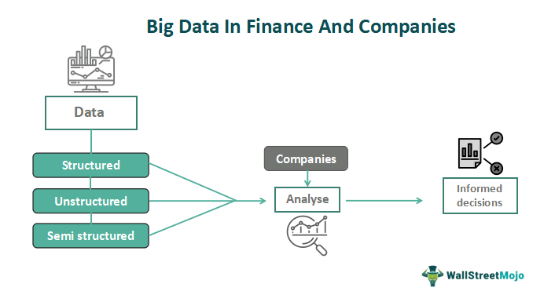

The advent of technology in the financial sector has revolutionized how data is used to make strategic investment decisions. With the proliferation of digital information, financial institutions now harness vast amounts of data to derive actionable insights. Data analytics and algorithmic trading are at the forefront of this transformation, leveraging big data to optimize financial outcomes. By analyzing extensive datasets, financial entities gain a comprehensive understanding of market dynamics, allowing for more informed decision-making.

The integration of finance data analytics, big data, and algorithmic trading is reshaping the landscape of trading and investment. These technologies are interconnected, each enhancing the potential of the others. Large datasets provide the raw material for advanced analytics; in turn, these analytics inform algorithmic trading strategies that can dynamically adjust to real-time market conditions. This synergy facilitates more efficient and precise trading actions, aligning trades with strategic objectives and minimizing risks inherent in manual trading.



As financial markets become more complex, the need for effective data-driven strategies grows. The volatility and unpredictability of modern markets demand sophisticated tools capable of analyzing trends and predicting outcomes with a high degree of accuracy. Financial firms are increasingly relying on these tools to manage portfolios, assess risks, and tailor products to meet client demands. The strategic integration of these technologies not only enhances financial performance but also provides a competitive edge in a rapidly evolving industry.

In this article, we explore the integration of finance data analytics, big data, and algorithmic trading, examining their synergies, benefits, and challenges. Understanding these elements is essential for navigating the evolving financial landscape and for anticipating future developments in the sector. Through this exploration, we aim to illuminate how these technologies work together to shape the future of trading and investment.

## Table of Contents

## Understanding Big Data in Finance

Big data in finance refers to the extensive and intricate data sets that are generated at a rapid pace and require sophisticated analytical techniques to extract meaningful insights. This concept is characterized by the "4 V's"—Volume, Variety, Velocity, and Veracity—which define its scope and underline both its transformative potential and inherent challenges.

1. **Volume**: The sheer amount of data produced within the financial sector is staggering, encompassing information from trading transactions, market feeds, consumer behavior, and more. This enormous volume necessitates advanced data processing technologies that can store and analyze data at scale.

2. **Variety**: Financial data is not homogeneous and includes both structured and unstructured data. Structured data can be neatly organized in databases, like transaction records, whereas unstructured data—such as social media posts, news articles, and emails—requires more advanced processing techniques to analyze. The capacity to handle and interpret these diverse data types allows financial institutions to gain comprehensive insights into market dynamics.

3. **Velocity**: The speed at which financial data is generated and must be processed is crucial. Market conditions can change within moments, and the ability to analyze data in real time is imperative for timely decision-making. Financial institutions leverage high-frequency trading and other algorithmic methods to respond to these rapid changes, effectively managing trades and investments.

4. **Veracity**: The accuracy and trustworthiness of data are vital, as poor data quality can lead to incorrect analyses and faulty decision-making. Financial firms must implement rigorous data verification processes to ensure that their analyses are based on reliable data.

In the financial sector, big data is a pivotal tool for identifying trends, predicting market movements, and managing risks. By scrutinizing patterns within vast datasets, financial institutions can uncover insights that might not be evident from traditional data analysis methods. For instance, predictive analytics can forecast future stock prices or market shifts effectively, aiding in risk management and strategic planning.

The capability to process and analyze big data gives financial firms a significant competitive edge. It enables the development of complex algorithms for [algorithmic trading](/wiki/algorithmic-trading), refined risk assessment methods, and enhanced customer service platforms. By leveraging big data, these institutions can formulate more informed, data-driven strategies that optimize their operational and investment outcomes. This technological acumen is indispensable in an increasingly data-centric financial landscape, where the ability to interpret and act on data swiftly can determine success.

## The Role of Data Analytics in Finance

Finance data analytics employs statistical and quantitative analyses to comprehend market dynamics and shape investment strategies. At its core, data analytics involves a systematic approach to analyzing datasets to extract meaningful insights that can guide decision-making processes in the financial sector.

Data analytics plays a crucial role in portfolio management by optimizing asset allocation strategies to maximize returns while minimizing risks. The process involves the use of historical data and advanced statistical techniques to create efficient portfolios that can withstand market fluctuations. Additionally, in credit scoring, data analytics evaluates the creditworthiness of individuals and businesses. By analyzing various financial indicators and historical borrowing behaviors, analytics delivers precise credit risk assessments, thus improving lending decisions.

In the context of fraud detection, data analytics identifies unusual patterns or transactions that could signify fraudulent activities. Machine learning algorithms and pattern recognition tools scan through large volumes of transaction data to flag potential frauds, enabling timely interventions. Furthermore, data analytics is integral to enhancing customer experience within the financial industry. By analyzing customer data, financial institutions can offer personalized services, predict customer needs, and improve satisfaction levels.

Processing large datasets allows analytics to deliver actionable insights that optimize decision-making and operational efficiency. Tools such as predictive analytics and [machine learning](/wiki/machine-learning) models enable financial firms to forecast future trends, conditions, and customer behaviors accurately. These predictive models are essential in assessing market risks, as they help organizations anticipate adverse events and develop mitigation strategies.

Continuous advancements in analytics technologies have sparked innovation in the financial sector. Techniques like natural language processing (NLP) are now utilized to interpret unstructured data from news articles or social media, providing a broader understanding of market sentiments and external factors influencing market dynamics. This evolution signifies a shift towards more sophisticated analytics solutions that leverage the full potential of data-driven insights, ultimately revolutionizing the way financial institutions operate.

## Algorithmic Trading: Efficiency and Precision

Algorithmic trading employs automated, pre-defined instructions to execute trading orders that seek to optimize both price and execution speed. This automation significantly reduces the influence of emotional and human biases on trading decisions, aligning trades more closely with strategic models and intended outcomes. By employing sophisticated algorithms, these systems can process and execute multiple trades concurrently, which ensures broader market coverage and enhances operational efficiency.

The integration of algorithms in trading systems extends beyond mere execution. They are now designed to analyze real-time data, adjust strategies dynamically, and respond adaptively to shifting market conditions. For example, an algorithm might utilize inputs such as price movements, market sentiment extracted from news feeds, and economic indicators to predict short-term trends. This adaptability helps traders to maintain a competitive edge in rapidly changing market environments.

Algorithmic trading also introduces notable cost efficiencies. Automation reduces transaction costs by minimizing the bid-ask spread and improving execution timing. The precision with which algorithms execute trades often translates to lower market impact costs, which are the costs associated with the influence of a trade on the market price.

One of the main technical approaches in algorithmic trading involves statistical [arbitrage](/wiki/arbitrage) and mean reversion strategies. These strategies often employ statistical models to identify pricing inefficiencies and execute trades before corrections occur. In a simple mean reversion model, the algorithm might look for assets that deviate from their historical average price, assuming that prices will revert to this mean over time.

Python, a popular language in the finance sector due to its extensive libraries and ease of use, can be employed to develop these algorithms. Below is a basic example of a mean reversion strategy using Python:

```python
import numpy as np
import pandas as pd

# Sample data
data = pd.Series(np.random.normal(0, 1, 1000)).cumsum()

# Simple mean reversion strategy
def mean_reversion_strategy(series, window):
    rolling_mean = series.rolling(window=window).mean()
    std_dev = series.rolling(window=window).std()

    entry = series < (rolling_mean - std_dev)  # Buy signal
    exit = series > (rolling_mean + std_dev)   # Sell signal

    return entry, exit

# Apply the strategy
buy_signals, sell_signals = mean_reversion_strategy(data, 20)
```

This snippet calculates rolling means and standard deviations of a time series and identifies buy and sell signals based on the specified deviations from the mean. While simplistic, this exemplifies the basic logic employed in more complex systems. 

The precision and cost effectiveness of algorithmic trading have made it an integral component of modern financial markets, continually advancing through the incorporation of new data sources and more sophisticated models. This evolutionary trajectory suggests an ongoing enhancement in the accuracy and reliability of trade executions, promising substantial improvements in financial market efficiency.

## Challenges and Risks

Finance data analytics and algorithmic trading have undoubtedly revolutionized the financial sector, offering numerous operational and strategic benefits. However, they also face several challenges and risks that stakeholders must address to ensure their effective and safe integration into financial systems.

One of the primary concerns is data privacy and security. As financial institutions rely increasingly on large volumes of data from diverse sources, safeguarding this data against breaches becomes paramount. According to the Ponemon Institute's "Cost of Data Breach Report," the financial sector continues to be one of the most affected industries, with average data breaches costing millions of dollars. The complexity of securing vast data sets, especially as they expand in [volume](/wiki/volume-trading-strategy) and variety, poses persistent challenges for firms. Robust encryption protocols, continual monitoring, and secure data management practices are necessary to combat these threats.

Algorithmic trading poses another significant challenge due to the potential for increased market [volatility](/wiki/volatility-trading-strategies). Instances like the 2010 Flash Crash, where algorithmic trading was partially blamed for the sudden and severe market downturn, underscore the necessity for caution ([The U.S. Securities and Exchange Commission](https://www.sec.gov/news/studies/2010/marketevents-report.pdf)). Algorithms react to market signals far faster than human traders, potentially leading to rapid and destabilizing market movements. This situation necessitates the implementation of circuit breakers and other mechanisms to mitigate risks associated with algorithm-driven market swings.

Regulatory challenges also arise as jurisdictions aim to craft guidelines that govern algorithmic trading activities. The complexity of creating standardized international regulations that address concerns about transparency, accountability, and fairness in trading systems is non-trivial. Agencies like the European Securities and Markets Authority (ESMA) have been proactive in establishing such frameworks, yet constant technological advancements demand equally adaptive regulatory measures.

The intricate nature of the systems implementing finance data analytics and algorithmic trading further exacerbates these challenges. The sophisticated nature of the underlying models and algorithms requires comprehensive risk management frameworks. Without such frameworks, there's a heightened risk of systemic failures that could lead to substantial financial losses. Risk management strategies must encompass stress testing, scenario analysis, and constant algorithmic oversight to ensure the stability and reliability of these financial systems.

In summary, while data analytics and algorithmic trading offer significant enhancements in efficiency and market insight, addressing their inherent challenges and risks is essential. Financial institutions must prioritize strong data privacy policies, recognize and mitigate potential market volatility contributions, ensure compliance with evolving regulatory standards, and maintain robust system monitoring and risk management practices to mitigate potential losses.

## The Future of Finance and Big Data

The integration of [artificial intelligence](/wiki/ai-artificial-intelligence) (AI) and machine learning (ML) with big data analytics is poised to significantly transform the financial sector. AI and ML techniques are being developed to enhance the sophistication of algorithms, enabling them to predict market trends with greater accuracy and make timely decisions based on real-time data. These advanced algorithms leverage large datasets to identify patterns that human analysts might overlook, allowing for more nuanced insights into market movements.

As algorithms become more sophisticated, their ability to predict market trends and make real-time decisions improves, bringing about a new era of personalized financial services. Through the use of big data insights, financial institutions can tailor their offerings to meet individual customer needs more precisely. This personalization is expected to lead to improved customer satisfaction and loyalty, as financial products can be aligned more closely with individual financial goals and circumstances.

However, the evolution of big data in finance is not without its challenges. Financial firms must carefully balance the drive for innovation with the necessity for regulatory compliance. The introduction of new technologies often brings regulatory scrutiny, as authorities strive to ensure that the deployment of AI and ML in finance upholds market integrity and consumer protection. Navigating this regulatory landscape requires a strategic approach, whereby firms integrate innovative technologies while adhering to legal frameworks.

Despite these challenges, the ongoing trends suggest that big data and algorithmic trading will remain pivotal in the evolution of the financial sector. These technologies enhance decision-making capabilities and improve operational efficiencies, offering a competitive edge to firms that adeptly incorporate them into their operations. As the financial industry continues to adopt these data-driven strategies, the benefits extend beyond mere efficiency gains to include greater accuracy in investment decisions and the potential for discovering new market opportunities. Consequently, big data and AI-driven analytics are expected to be enduring drivers of growth and innovation in finance.

## Conclusion

Finance data analytics, big data, and algorithmic trading are paving a pivotal path towards a transformative era in financial services. These technologies promise enhanced efficiency, precision, and innovation by leveraging vast datasets and sophisticated algorithms to optimize decision-making processes. Despite the substantial promise these tools hold, the associated risks and challenges necessitate vigilant management and oversight. For instance, data privacy concerns loom large as firms increasingly rely on highly granular data that could expose sensitive information if not securely managed. Moreover, the reliance on algorithmic trading poses unique risks such as potential market volatility spikes, necessitating robust risk management practices and regulatory frameworks.

Firms that adeptly harness these analytical and trading technologies stand to gain a competitive advantage. By integrating big data insights into their strategy, these firms can not only outperform rivals but also navigate the complexities of evolving financial markets. As technological advancements continue unabated, the potential for these capabilities will only expand, leading towards a future where data-driven decisions are central to financial operations. The trajectory suggests an era of personalized financial services, real-time decision-making, and optimized risk assessment accelerated by innovations in artificial intelligence and machine learning.

For financial institutions, embracing these technologies is pivotal for leadership in the digital age. Successfully implementing and managing these tools requires not only technical prowess but also strategic foresight to balance innovation with compliance. As the financial landscape continues to evolve, those firms that are agile, innovative, and data-focused will find themselves best positioned to capitalize on the opportunities that lie ahead, ensuring sustainable growth and resilience in the digital era.

## References & Further Reading

[1]: Bergstra, J., Bardenet, R., Bengio, Y., & Kégl, B. (2011). ["Algorithms for Hyper-Parameter Optimization."](https://dl.acm.org/doi/10.5555/2986459.2986743) Advances in Neural Information Processing Systems 24.

[2]: ["Advances in Financial Machine Learning"](https://www.amazon.com/Advances-Financial-Machine-Learning-Marcos/dp/1119482089) by Marcos Lopez de Prado

[3]: ["Evidence-Based Technical Analysis: Applying the Scientific Method and Statistical Inference to Trading Signals"](https://www.amazon.com/Evidence-Based-Technical-Analysis-Scientific-Statistical/dp/0470008741) by David Aronson

[4]: ["Machine Learning for Algorithmic Trading"](https://github.com/stefan-jansen/machine-learning-for-trading) by Stefan Jansen

[5]: ["Quantitative Trading: How to Build Your Own Algorithmic Trading Business"](https://www.amazon.com/Quantitative-Trading-Build-Algorithmic-Business/dp/1119800064) by Ernest P. Chan

[6]: Huang, Y., Liu, Y., & Arnold, K. A. (2019). ["Financial Market Prediction with Big Data Analytics"](https://www.nature.com/articles/s41929-024-01257-7). Proceedings of the 28th International Conference on World Wide Web.

[7]: "The Flash Crash: The Impact of High Frequency Trading on an Electronic Market" by Nanex Research - Available at [Nanex.net](https://altexploit.wordpress.com/wp-content/uploads/2017/05/flash-crash-impact-of-high-frequency-trading-on-an-electronic-market.pdf)

[8]: The U.S. Securities and Exchange Commission. (2010). ["Findings Regarding the Market Events of May 6, 2010."](https://www.sec.gov/news/studies/2010/marketevents-report.pdf)

[9]: "Artificial Intelligence in Asset Management: The State of Adoption" - CFA Institute Research Foundation. (Available at [Research Foundation of CFA Institute](https://fr.linkedin.com/in/qiupengyu).

[10]: Gandomi, A., & Haider, M. (2015). ["Beyond the hype: Big data concepts, methods, and analytics."](https://www.sciencedirect.com/science/article/pii/S0268401214001066) International Journal of Information Management, 35(2), 137-144.