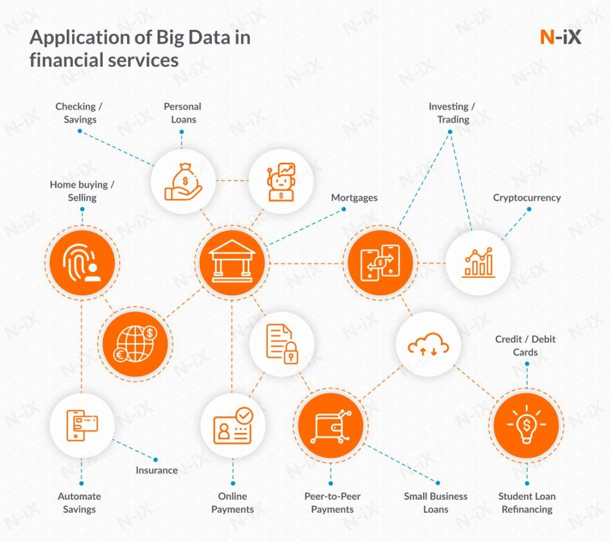

## Table of Contents

## What is Big Data and how is it defined in the context of finance?

Big Data refers to extremely large and complex data sets that traditional data processing software can't handle easily. It's not just about the size of the data, but also about the variety, velocity, and veracity of the data. In simple terms, Big Data includes a lot of information coming from different places, arriving very fast, and needing to be accurate.

In the context of finance, Big Data is used to help make better decisions and improve business operations. Financial institutions collect huge amounts of data from transactions, customer interactions, market trends, and more. By analyzing this Big Data, banks and other financial companies can find patterns and insights that help them understand their customers better, manage risks, detect fraud, and even predict future market movements. This can lead to better services, more efficient operations, and higher profits.

## How does Big Data differ from traditional data in finance?

Big Data in finance is different from traditional data mainly because of its size and complexity. Traditional data in finance usually comes from sources like customer records, transaction histories, and basic market data. It's easier to manage and analyze because it's smaller and more structured. On the other hand, Big Data includes not just these sources but also a huge amount of information from social media, internet searches, and even sensor data. This makes Big Data much larger and more diverse, requiring special tools and methods to handle and understand it.

Another key difference is how quickly Big Data comes in and how it's used. Traditional data in finance is often collected and analyzed over longer periods, like daily or monthly reports. Big Data, however, arrives in real-time and needs to be processed quickly. Financial institutions use Big Data to make instant decisions, like detecting fraud as it happens or reacting to market changes in seconds. This real-time aspect of Big Data can give financial companies a big advantage in a fast-moving industry.

## What are the primary sources of Big Data in the financial sector?

Big Data in the financial sector comes from many places. One main source is transaction data. Every time someone uses a credit card, makes a bank transfer, or buys a stock, it creates data. This data is huge because there are millions of transactions happening every day. Another big source is customer data. This includes information from customer accounts, their interactions with the bank, and their feedback. Banks also use data from social media and internet searches to understand what customers are thinking and doing.

Another important source of Big Data is market data. This includes stock prices, interest rates, and economic reports. Financial companies need to keep track of this data to make good decisions. They also use data from sensors and the Internet of Things (IoT). For example, sensors in ATMs or trading machines can provide useful information. All these different sources together make up the Big Data that financial companies use to improve their services and make better decisions.

## How can Big Data be used to improve risk management in finance?

Big Data can help financial companies manage risk better by giving them a lot more information to work with. Instead of just looking at past data, they can use Big Data to see what's happening right now and even predict what might happen next. For example, by analyzing lots of data from different places, banks can spot patterns that show when someone might be trying to do something risky or even illegal. This helps them stop problems before they get too big.

Another way Big Data helps with risk management is by making it easier to understand how different risks are connected. Sometimes, a problem in one area can affect other areas too. With Big Data, financial companies can see these connections and plan better. They can use this information to make rules and systems that protect them from many kinds of risks at the same time. This makes the whole financial system safer and more stable.

## What role does Big Data play in enhancing customer experience in financial services?

Big Data helps make the customer experience better in financial services by giving companies a lot more information about what customers want and need. By looking at data from things like customer accounts, social media, and even how people use their websites, banks can understand their customers better. This means they can offer services and products that are more personal and useful. For example, if a bank sees that a customer often travels abroad, they might offer a special credit card with no foreign transaction fees.

Another way Big Data improves customer experience is by making things faster and easier. With Big Data, banks can quickly answer customer questions and solve problems. They can use data to see when customers are having trouble and fix it before the customer even notices. This makes customers happier because they feel taken care of. Plus, Big Data helps banks make their apps and websites better, so customers can do what they need to do more easily and quickly.

## How does Big Data analytics help in fraud detection and prevention in finance?

Big Data analytics helps a lot in catching and stopping fraud in finance. It does this by looking at huge amounts of data from things like bank transactions, customer behavior, and even social media. By using special tools to analyze this data, banks can find patterns that might show someone is trying to do something bad. For example, if someone suddenly starts making a lot of big purchases in a short time, Big Data can help the bank see that this might be fraud and stop it before it gets worse.

Another way Big Data helps with fraud is by making it easier to check things quickly. In the past, it might take a long time to look at all the data and figure out if something was wrong. But with Big Data, banks can do this much faster. They can use computers to watch for signs of fraud all the time, so they can catch it right away. This means less money lost to fraud and happier customers who feel safe using the bank's services.

## What are the challenges of implementing Big Data solutions in financial institutions?

One big challenge of using Big Data in banks and other financial places is handling all the information. There's so much data coming from everywhere, like transactions, social media, and customer records. It's hard to store all this data and make sure it's safe. Banks have to spend a lot of money on special computers and software to keep the data and protect it from hackers. Also, they need people who know how to use these tools well, and finding these people can be tough.

Another challenge is making sure the data is good and correct. With so much data coming in, some of it might be wrong or not useful. Banks need to clean up this data and make sure they're using the right information. This takes a lot of work and time. Plus, there are rules about how banks can use data, especially personal information about customers. They have to follow these rules carefully, or they could get in big trouble. This makes using Big Data even harder.

Lastly, changing how a bank works to use Big Data can be tricky. The people who work at the bank might not be used to new ways of doing things. They might need training to understand how to use Big Data tools. Also, the bank's old systems might not work well with new Big Data technology. This means the bank has to spend more money and time to update everything. It's a big change, but it can be worth it if it helps the bank serve customers better and make smarter decisions.

## How can Big Data influence investment strategies and portfolio management?

Big Data can help people who manage money make better choices about where to invest. By looking at a lot of information from different places, like stock prices, news, and even what people are saying on social media, they can see patterns and trends that might not be easy to spot otherwise. This can help them decide which stocks or other investments might do well in the future. For example, if Big Data shows that a lot of people are talking about a new technology company, it might be a good idea to invest in that company before it becomes really popular.

Big Data also helps with managing a group of investments, called a portfolio. By using Big Data, managers can keep an eye on how all the different investments are doing and make changes quickly if they need to. They can see if one investment is doing badly and might need to be sold, or if another one is doing well and they should buy more of it. This can help make the whole portfolio do better over time. Plus, Big Data can help them understand how different investments affect each other, so they can make the portfolio safer and more balanced.

## What are the ethical considerations and privacy concerns related to Big Data in finance?

When banks and other financial companies use Big Data, they have to think about doing it in an ethical way. This means they need to be fair and honest with how they use people's information. One big worry is that they might use data to treat some people differently, like charging them more for loans just because of where they live or what they do for a job. This isn't fair and can hurt people who already have a hard time. Also, banks need to be clear about how they use data. If they're using it to make decisions about people's money, those people should know how and why.

Another big concern is privacy. When banks collect a lot of data about people, they have to keep it safe. If this data gets stolen or shared without permission, it can cause big problems. People might lose money or have their personal information used in bad ways. Banks need to follow rules about keeping data private and only using it for the right reasons. They also need to make sure they're not keeping more information than they need, and they should let people know what data they have about them and why they have it. This helps build trust and makes sure people's rights are respected.

## How does Big Data impact regulatory compliance and reporting in the financial industry?

Big Data helps financial companies follow rules and make reports more easily. It does this by giving them a lot of information to work with. When banks have to report to the government or other groups, they need to give a lot of details about what they're doing. Big Data makes it easier to collect all this information and put it together in the right way. This means they can make reports faster and make sure they're correct. It also helps them see if they're following all the rules, because they can check their data to make sure everything is done right.

But using Big Data for following rules can also be hard. There are a lot of rules about how banks can use data, especially when it's about people's personal information. Banks have to be very careful to follow these rules, or they could get in big trouble. They need to keep data safe and make sure they're only using it for the right reasons. This means they have to spend a lot of time and money to make sure they're doing everything correctly. But if they do it right, Big Data can help them follow the rules better and make their reports more accurate.

## What advanced Big Data technologies are being adopted by leading financial institutions?

Leading financial institutions are using a technology called Hadoop to handle Big Data. Hadoop is like a big storage place for data that can grow as much as needed. It helps banks keep all their information in one spot and work with it easily. Another technology they use is Spark, which is really fast at looking at data. With Spark, banks can see what's happening with their data almost right away, which is important for making quick decisions.

Another tool that's becoming popular is [machine learning](/wiki/machine-learning). This is a kind of computer program that can learn from data and find patterns on its own. Banks use machine learning to predict what might happen next, like if a customer might leave or if there's a chance of fraud. It helps them make better choices and serve their customers better. Also, many banks are using cloud computing, which means they store their data on the internet instead of in their own computers. This makes it easier to handle Big Data because they don't need to buy a lot of expensive equipment, and they can use the data from anywhere.

## How can financial institutions measure the ROI of their Big Data initiatives?

Financial institutions can measure the return on investment (ROI) of their Big Data initiatives by looking at how these projects help them make more money or save money. For example, if using Big Data helps them find new customers or sell more products, they can see how much extra money they're making. They can also check if Big Data helps them save money by making their work faster or stopping fraud before it happens. By comparing the costs of setting up and running Big Data systems with the extra money they make or save, they can figure out if their Big Data projects are worth it.

Another way to measure ROI is by looking at how Big Data helps them do their job better. If Big Data helps them make better decisions, like choosing the right investments or understanding what customers want, this can lead to more success in the long run. Banks can use things like customer satisfaction scores, how many customers stay with them, and how well their investments do to see if Big Data is making a difference. Even though it might be hard to put a number on these things, they are important for showing how Big Data is helping the bank do better.

## References & Further Reading

[1]: Bergstra, J., Bardenet, R., Bengio, Y., & Kégl, B. (2011). ["Algorithms for Hyper-Parameter Optimization."](https://dl.acm.org/doi/10.5555/2986459.2986743) Advances in Neural Information Processing Systems 24.

[2]: ["Advances in Financial Machine Learning"](https://www.amazon.com/Advances-Financial-Machine-Learning-Marcos/dp/1119482089) by Marcos Lopez de Prado

[3]: ["Evidence-Based Technical Analysis: Applying the Scientific Method and Statistical Inference to Trading Signals"](https://www.amazon.com/Evidence-Based-Technical-Analysis-Scientific-Statistical/dp/0470008741) by David Aronson

[4]: ["Machine Learning for Algorithmic Trading"](https://github.com/stefan-jansen/machine-learning-for-trading) by Stefan Jansen

[5]: ["Quantitative Trading: How to Build Your Own Algorithmic Trading Business"](https://www.amazon.com/Quantitative-Trading-Build-Algorithmic-Business/dp/1119800064) by Ernest P. Chan

[6]: Huang, Y., Liu, Y., & Arnold, K. A. (2019). ["Financial Market Prediction with Big Data Analytics"](https://www.nature.com/articles/s41929-024-01257-7). Proceedings of the 28th International Conference on World Wide Web.

[7]: "The Flash Crash: The Impact of High Frequency Trading on an Electronic Market" by Nanex Research - Available at [Nanex.net](https://altexploit.wordpress.com/wp-content/uploads/2017/05/flash-crash-impact-of-high-frequency-trading-on-an-electronic-market.pdf)

[8]: The U.S. Securities and Exchange Commission. (2010). ["Findings Regarding the Market Events of May 6, 2010."](https://www.sec.gov/news/studies/2010/marketevents-report.pdf)

[9]: "Artificial Intelligence in Asset Management: The State of Adoption" - CFA Institute Research Foundation. (Available at [Research Foundation of CFA Institute](https://fr.linkedin.com/in/qiupengyu).

[10]: Gandomi, A., & Haider, M. (2015). ["Beyond the hype: Big data concepts, methods, and analytics."](https://www.sciencedirect.com/science/article/pii/S0268401214001066) International Journal of Information Management, 35(2), 137-144.