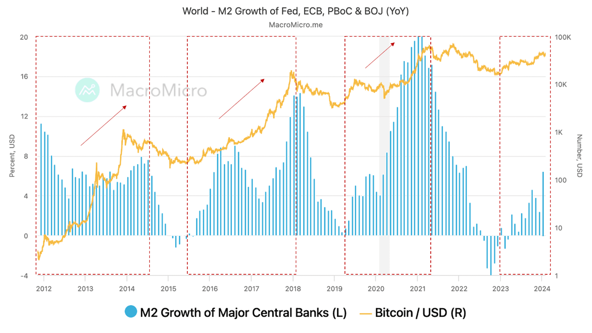

## Table of Contents

## What is Bitcoin and how does it function as a cryptocurrency?

Bitcoin is a type of digital money that people can use to buy things online. It was created in 2009 by someone using the name Satoshi Nakamoto. Unlike regular money, Bitcoin is not controlled by a government or a bank. Instead, it uses a technology called blockchain, which is like a big, public record book that keeps track of all Bitcoin transactions. This means that anyone can see the transactions, but they are secure and private because they use special codes.

When people want to use Bitcoin, they send it from their digital wallet to someone else's wallet. This is done through the internet, and the transaction is recorded on the blockchain. To make sure the transaction is valid, it needs to be checked by people called miners. Miners use powerful computers to solve complex math problems, and when they do, they add the transaction to the blockchain and get rewarded with new Bitcoins. This process helps keep Bitcoin secure and prevents people from using the same Bitcoin twice.

## What are central banks and what roles do they play in the economy?

Central banks are like the main banks of a country. They are usually run by the government and they have a big job in making sure the money in the country works well. Central banks control things like how much money is in the economy, the interest rates that banks charge each other, and they make sure that the money people use every day stays valuable and trusted.

One of the main things central banks do is set interest rates. When they change these rates, it can make borrowing money cheaper or more expensive. If they lower the rates, it can help the economy grow because people and businesses might borrow more money to buy things or start new projects. If they raise the rates, it can slow down the economy a bit, which can help stop prices from going up too fast, something called inflation. Central banks also keep an eye on the whole financial system to make sure it's working smoothly and safely.

## How does Bitcoin challenge the traditional functions of central banks?

Bitcoin challenges the traditional functions of central banks because it is not controlled by any government or central bank. With Bitcoin, there's no one in charge of setting interest rates or controlling how much money is in circulation. Instead, Bitcoin has a fixed supply that can't be changed by anyone. This means that the value of Bitcoin goes up and down based on what people think it's worth, not because a central bank decided to do something.

This can be a big change from how things usually work. Central banks use their power to try to keep the economy stable. They can print more money if they think it will help, or they can take money out of circulation if they think there's too much. With Bitcoin, no one can do that. This might make some people feel more free because they don't have to worry about a central bank making decisions that affect their money. But it can also make things more unpredictable because there's no one in charge to help smooth out the ups and downs.

## Can Bitcoin affect the monetary policy of central banks?

Bitcoin can affect the monetary policy of central banks because it gives people another choice for money. If more people start using Bitcoin instead of their country's regular money, it might make it harder for central banks to control the economy. For example, if people are using Bitcoin a lot, then when the central bank changes interest rates or prints more money, it might not have as big an effect on the economy because some people are using a different kind of money.

Also, Bitcoin can make central banks think differently about how they do things. If Bitcoin becomes very popular, central banks might need to find new ways to keep their country's money valuable and trusted. They might even start thinking about making their own digital money to compete with Bitcoin. This could lead to changes in how they manage the economy and how they work with other countries' central banks.

## What impact does Bitcoin have on the control of inflation by central banks?

Bitcoin can make it harder for central banks to control inflation. Inflation is when prices go up over time, and central banks usually try to keep it under control by changing how much money is in the economy or by changing interest rates. But if more people start using Bitcoin instead of the regular money, it might not work as well when central banks try to do these things. That's because Bitcoin has a fixed supply, which means no one can make more of it, so its value goes up and down based on what people think it's worth, not what central banks decide.

This can be a big change for central banks. If a lot of people are using Bitcoin, the central bank's tools for fighting inflation might not be as strong. They might need to think of new ways to keep prices stable. For example, they might start looking into making their own digital money to compete with Bitcoin. This could lead to new ideas and changes in how they manage the economy to keep inflation in check.

## How might Bitcoin influence the stability of financial systems overseen by central banks?

Bitcoin can make financial systems less stable because it's not controlled by central banks. If a lot of people start using Bitcoin, it can make it harder for central banks to keep the economy steady. This is because Bitcoin's value can go up and down a lot, and that can make people feel unsure about their money. If people start moving their money from regular bank accounts to Bitcoin, it could cause problems for banks and make the whole financial system less stable.

On the other hand, Bitcoin can also push central banks to make their own digital money. This could help keep the financial system stable by giving people another safe choice for money. If central banks make their own digital money, they can still control things like interest rates and how much money is in the economy. This way, they can keep the financial system stable even if more people start using cryptocurrencies like Bitcoin.

## What are the potential effects of Bitcoin on currency issuance and regulation?

Bitcoin can change how countries make and control their money. With regular money, central banks can print more or take some out of circulation to keep the economy stable. But Bitcoin has a fixed supply, so no one can make more of it. This means that if more people start using Bitcoin, it might be harder for central banks to control how much money is in the economy. They might need to find new ways to make sure there's enough money for everyone and that prices don't go up too fast.

Also, Bitcoin can make it harder for governments to control money. Because Bitcoin is not controlled by any country, it can be used to send money anywhere in the world without anyone stopping it. This can be good for people who want to send money to other countries easily, but it can also make it harder for governments to stop illegal activities like money laundering. To deal with this, governments might need to make new rules about how Bitcoin can be used and how it's taxed. This could lead to changes in how money is regulated around the world.

## How do central banks view Bitcoin and other cryptocurrencies?

Central banks are often careful about Bitcoin and other cryptocurrencies. They see them as something new and different that can change how money works. Some central banks worry that if too many people start using cryptocurrencies, it might make it harder for them to control the economy. They are concerned about things like inflation and keeping the financial system stable. Because cryptocurrencies are not controlled by any government or central bank, they can be hard to manage and might cause problems if they become very popular.

On the other hand, some central banks are starting to see the good things about cryptocurrencies. They are thinking about making their own digital money to compete with Bitcoin. This could help them keep control over the economy while also giving people a new way to use money. Central banks are also working on new rules to make sure that cryptocurrencies are used safely and don't cause too many problems. They want to find a balance between letting people use new kinds of money and keeping the financial system strong and stable.

## What regulatory measures have central banks implemented in response to Bitcoin?

Central banks have been trying to figure out how to handle Bitcoin and other cryptocurrencies. They've made rules to make sure that people using cryptocurrencies do it safely. For example, some countries have said that businesses that deal with cryptocurrencies need to follow certain rules to stop things like money laundering and fraud. They also want to make sure that people know the risks of using cryptocurrencies, like how their value can go up and down a lot.

Some central banks have also started to think about making their own digital money. This could help them keep control over the economy while also giving people a new way to use money. They are working on new laws and rules to make sure that their digital money works well with cryptocurrencies. This way, they can keep the financial system stable and safe, even if more people start using cryptocurrencies.

Overall, central banks are trying to find a balance. They want to let people use new kinds of money like Bitcoin, but they also want to make sure that it doesn't cause too many problems. They are watching how cryptocurrencies are used and making rules to keep everything under control.

## How could widespread adoption of Bitcoin alter the role of central banks in the future?

If a lot of people start using Bitcoin, it could change what central banks do. Central banks usually control how much money is in the economy and set interest rates to keep things stable. But if more people use Bitcoin, which has a fixed supply and isn't controlled by any central bank, it might be harder for them to do these things. They might need to find new ways to make sure there's enough money for everyone and that prices don't go up too fast.

Because Bitcoin isn't controlled by any country, it could also make it harder for central banks to stop illegal activities like money laundering. To deal with this, central banks might need to make new rules about how Bitcoin can be used and how it's taxed. This could lead to changes in how money is regulated around the world. In the future, central banks might need to work together more to handle the challenges that come with widespread use of cryptocurrencies like Bitcoin.

## What are the potential risks and benefits for central banks in integrating Bitcoin into their systems?

If central banks start using Bitcoin in their systems, there could be some good things and some risky things. One good thing is that it could make it easier for people to send money to other countries. Bitcoin can move quickly and cheaply across borders, which could help people who need to send money home. Also, if central banks learn how to use Bitcoin well, they might be able to make their own digital money that works even better. This could help them keep control over the economy while also giving people new ways to use money.

But there are also risks. One big risk is that Bitcoin's value can go up and down a lot, which can make people feel unsure about their money. If central banks start using Bitcoin and its value drops a lot, it could cause problems for the whole economy. Another risk is that Bitcoin is hard to control because it's not run by any government or central bank. This could make it harder for central banks to stop illegal activities like money laundering. They would need to make new rules and work together with other countries to handle these challenges.

## How are central banks researching and developing their own digital currencies in response to Bitcoin?

Central banks are looking into making their own digital money because of Bitcoin. They want to see if they can make a digital currency that works well and helps them keep control over the economy. They are doing a lot of research to figure out how to make their digital money safe and easy to use. Some central banks are even testing their digital currencies in small groups to see how they work in real life. This way, they can learn from what they see and make their digital money better before more people start using it.

A few central banks have already started working on their own digital currencies. For example, the Central Bank of China is testing a digital version of the yuan, and the European Central Bank is looking into making a digital euro. These central banks want to make sure their digital money can work well with regular money and other digital currencies like Bitcoin. They are also thinking about how to make rules that will keep everything safe and fair. By doing all this work, central banks hope to stay in control of the economy even as more people start using digital money.

## References & Further Reading

[1]: Nakamoto, S. (2008). ["Bitcoin: A Peer-to-Peer Electronic Cash System."](https://nakamotoinstitute.org/library/bitcoin/)

[2]: Yermack, D. (2015). ["Is Bitcoin a Real Currency? An Economic Appraisal."](https://www.sciencedirect.com/science/article/pii/B9780128021170000023) National Bureau of Economic Research.

[3]: Böhme, R., Christin, N., Edelman, B., & Moore, T. (2015). ["Bitcoin: Economics, Technology, and Governance."](https://www.aeaweb.org/articles?id=10.1257/jep.29.2.213) Journal of Economic Perspectives, 29(2), 213-238.

[4]: Hull, J. C. (2017). ["Options, Futures, and Other Derivatives."](https://www.semanticscholar.org/paper/Options%2C-Futures%2C-and-Other-Derivatives-Hull/89bdee500c8623864fc9eb7a471546aa713acc44) 9th Edition, Pearson.

[5]: Narang, R. (2009). ["Inside the Black Box: A Simple Guide to Quantitative and High-Frequency Trading."](https://onlinelibrary.wiley.com/doi/book/10.1002/9781118267738) Wiley.

[6]: DeFilippi, P., & Wright, A. (2018). ["Blockchain and the Law: The Rule of Code."](https://www.jstor.org/stable/j.ctv2867sp) Harvard University Press.

[7]: Roubini, N. (2018). ["Cryptocurrencies: A Central Bank Perspective."](https://www.stern.nyu.edu/experience-stern/faculty-research/why-central-bank-digital-currencies-will-destroy-cryptocurrencies) Bank for International Settlements.

[8]: Lopez de Prado, M. (2018). ["Advances in Financial Machine Learning."](https://www.amazon.com/Advances-Financial-Machine-Learning-Marcos/dp/1119482089) Wiley.