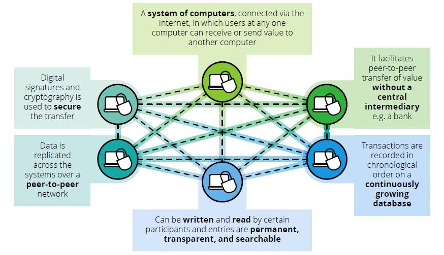

Blockchain technology is transforming industries worldwide, and the automotive sector is no exception. As this innovative technology continues to evolve, it is playing a crucial role in reshaping how vehicles are manufactured, operated, and traded. The potential for blockchain to enhance the automotive industry primarily lies in its ability to ensure transparency, security, and efficiency. This article explores the intersection of blockchain technology, automotive innovation, and algorithmic trading in future cars, highlighting the various ways in which these emerging technologies can coexist to create a streamlined and more efficient industry.

In vehicle manufacturing, blockchain can significantly improve the production process by providing a decentralized solution that ensures every vehicle part is verifiable and traceable. This helps in mitigating issues related to counterfeit parts, thus enhancing consumer trust and ensuring that parts are ethically sourced and meet stringent quality standards. Furthermore, blockchain can contribute to the advancement of smart cars and city-wide networks. By enabling the secure sharing of data among vehicles, blockchain can enhance the way cars communicate within urban environments, improving traffic management and safety.



Algorithmic trading, when integrated with blockchain, offers new avenues for efficiencies and opportunities within the automotive industry. It automates and accelerates processes related to buying, selling, and financing vehicles, promising quicker and more transparent transactions. The synergy between blockchain and algorithmic trading thus has the potential to revolutionize the automotive marketplace by streamlining operations and reducing risks.

As we embark on this journey, we will examine how blockchain technology can enhance vehicle manufacturing, safety, and trading systems, paving the way for a connected and efficient automotive future. Join us as we navigate the road to the future of cars powered by blockchain technology.

## Table of Contents

## Blockchain in Automotive Manufacturing

Manufacturers face significant challenges in ensuring transparency across their supply chains and authenticating vehicle parts. Blockchain technology emerges as a promising decentralized solution to these challenges. By employing blockchain, every vehicle part can be logged in a distributed ledger, ensuring that it is verifiable and tracked throughout its lifecycle. This transparency helps automakers prevent counterfeit parts from entering the supply chain, thereby enhancing consumer trust.

The blockchain ledger records every transaction or change of custody related to a vehicle part. Each block contains a timestamp and a cryptographic hash of the previous block, forming a chain. This structure provides a transparent and tamper-proof record, where any modification to the data can be easily detected. Hence, stakeholders in the automotive manufacturing chain can verify the authenticity and origin of parts, ensuring they meet regulatory standards and are sourced ethically.

For example, using blockchain, a car manufacturer can trace a component back to its raw material state, verifying its origin and the journey it undertook before reaching the assembly lines. If a defective part is discovered, the manufacturer can use the blockchain to trace it back to its source, facilitating quicker recalls and improving safety standards. This process not only enhances quality assurance but also bolsters the brand’s reputation for integrity.

Blockchain also offers potential integrations with Internet of Things (IoT) devices. These devices can automatically record data about the part's performance once it is integrated into a vehicle, adding another layer of authenticity and data-driven insights into the manufacturing process. The combination of IoT and blockchain can ensure the real-time recording of part conditions, performance data, and other critical metrics, allowing manufacturers to make informed decisions regarding quality control and improvements.

Moreover, ensuring parts meet quality standards and are ethically sourced aligns with the growing demand for sustainable practices. Public ledgers on a blockchain can include certifications for ethical sourcing, which auditors and stakeholders can verify at any point. This adoption of blockchain not only aids compliance with international standards but also supports corporate social responsibility initiatives by reassuring consumers about the ethical practices involved in their vehicle’s production.

In conclusion, blockchain technology addresses the critical issues of supply chain transparency and part authenticity in automotive manufacturing. By offering a verifiable, tamper-proof record of every part's journey from production to vehicle integration, blockchain enhances trust and compliance while fostering innovation in quality assurance and ethical sourcing.

## Smart Cars and City-Wide Networks

Blockchain technology is enhancing the development and functionality of smart cars within urban networks. As smart cars become more interconnected, blockchain provides the structural framework for secure and efficient communication between vehicles, traffic systems, and urban infrastructure.

One of the primary benefits of integrating blockchain with smart cars is the ability to share real-time data on traffic and road conditions. This data exchange supports better navigation decisions, helping drivers choose optimal routes, thereby reducing travel times and enhancing safety on the roads. The secure and immutable nature of blockchain ensures that data shared among vehicles is protected from tampering, thus maintaining the integrity and reliability of the information.

Blockchain-powered networks also significantly contribute to improved traffic management and emergency response. For instance, decentralized networks can quickly disseminate information about accidents or road hazards across the network, alerting vehicles and traffic management systems promptly. This acceleration in communication allows for faster and more coordinated responses to emergencies, potentially saving lives and reducing congestion caused by unexpected roadblocks.

Moreover, the data accumulated through these networks offers substantial benefits for city planning and infrastructure development. Planners and developers can utilize this data to identify traffic patterns, peak usage times, and areas of frequent congestion, enabling the design of smarter road systems and the optimization of public transport routes. The transparency and accessibility of blockchain-stored data ensure that urban development decisions are informed by accurate and comprehensive datasets.

In summary, blockchain technology plays a crucial role in advancing smart car technologies by ensuring secure communication, facilitating efficient traffic management, and providing valuable insights for urban development. This integration promises a more connected, safer, and better-managed urban transportation system.

## Car Insurance and Blockchain

The current car insurance system faces numerous challenges, primarily revolving around inefficiencies, high costs, and opaqueness in rate-setting mechanisms. Blockchain technology offers a transformative approach by introducing a usage-based insurance model, fundamentally altering how premiums are determined. Traditionally, insurance premiums have been calculated based on factors like demographics, vehicle type, and historical claim data, which often do not accurately reflect an individual's driving habits. With blockchain, insurers can use real-time data, such as distance driven, speed, and time of travel, to tailor premiums more accurately to individual behavior, aligning costs with actual risk exposure.

Smart contracts play a pivotal role in automating claims processing and payouts. These self-executing contracts are coded with specific conditions that trigger transactions automatically when certain criteria are met. For instance, if an insured event, like an accident, is recorded, the smart contract can autonomously verify the details and initiate a payout without manual intervention. This automation significantly reduces administrative costs and the potential for fraud, as the decentralized nature of blockchain ensures that all recorded data is immutable and tamper-proof. An example Python snippet of a smart contract for insurance may look like this:

```python
from ethereum import Blockchain

class InsuranceContract(Blockchain):

    def __init__(self, insured_event, payout_amount):
        self.insured_event = insured_event
        self.payout_amount = payout_amount
        self.claim_processed = False

    def check_event(self, event_data):
        if event_data == self.insured_event:
            self.process_claim()

    def process_claim(self):
        if not self.claim_processed:
            self.transfer_funds(self.payout_amount)
            self.claim_processed = True

    def transfer_funds(self, amount):
        # Logic to transfer funds
        pass
```

This contract checks whether an insured event matches the logged event data and processes the corresponding claim, ensuring a swift and fair settlement.

Moreover, blockchain technology assures transparency and fairness in setting insurance rates. The immutable ledger records all transactions and associated data, providing an open and verifiable history that both insurers and customers can trust. This transparency mitigates disputes over claims and enhances customer trust in insurance providers. By embracing blockchain, the car insurance industry can move towards a more dynamic, fair, and efficient system, benefiting both providers and consumers while fostering innovation in risk assessment and management practices.

## Blockchain, Recurring Costs, and Payments

Blockchain technology is streamlining payment processes related to recurring costs in the automotive industry, such as tolls, parking, and fuel. By utilizing smart contracts, blockchain ensures that these transactions are automated, thereby enhancing the overall driver experience. Smart contracts function as self-executing contracts with the terms of the agreement directly written into code. When pre-specified conditions are met, the contract automatically executes, allowing for seamless transactions without the need for intermediaries.

The integration of blockchain significantly reduces transaction fees and minimizes errors commonly associated with manual payments. Traditional payment systems often involve multiple intermediaries, each adding a layer of complexity and potential points of failure. Blockchain eliminates many of these middlemen, leading to more efficient transaction processing.

A practical implementation could be the use of blockchain for automatic fuel payments. A car equipped with a digital wallet and a smart contract can trigger a payment transaction as soon as it refuels. Suppose the fuel cost is $X, and the user's wallet balance is $Y. The smart contract could be structured as follows in Python pseudocode:

```python
def fuel_payment(cost, wallet_balance):
    if wallet_balance >= cost:
        wallet_balance -= cost
        print("Payment successful. Remaining balance:", wallet_balance)
        return True
    else:
        print("Insufficient balance. Payment failed.")
        return False

# Example Usage
cost_of_fuel = 50  # For example, $50
current_balance = 100  # User's current wallet balance

fuel_payment(cost_of_fuel, current_balance)
```

In addition to operational efficiencies, blockchain enhances security through its decentralized nature. The use of blockchain ensures quick and secure vehicle transactions, reducing the risk of fraud and unauthorized access to financial data. Every transaction is recorded on a decentralized ledger, making it irreversible and transparent.

As a result, blockchain technology in automotive payments not only simplifies the process but also fosters a more trusted and user-friendly environment. The improved convenience of quick and secure transactions represents a significant advancement for daily automotive operations, providing drivers with a seamless experience in managing recurring costs.

## Vehicle Histories: Ensuring Transparency and Trust

Consumers frequently encounter obstacles when attempting to verify the history and condition of a vehicle. This issue is particularly pronounced in the used car market, where the risk of fraud and misinformation is substantial. To address these challenges, blockchain technology can offer a robust solution by storing immutable and comprehensive vehicle histories. Blockchain’s decentralized and tamper-proof nature ensures that records of a vehicle's ownership, maintenance, and repairs are permanently and securely stored, increasing buyer confidence.

One of the primary advantages of using blockchain for vehicle history tracking is its ability to provide transparent records. Automakers can utilize this technology to record detailed maintenance logs, so consumers can access verified information about a vehicle's past service history. This capability helps potential buyers make more informed decisions by ensuring that the vehicle they are purchasing has been properly maintained and serviced according to the manufacturer's specifications.

In addition to maintenance records, blockchain can facilitate the secure tracking of ownership and repair histories. Traditional methods of tracking this information often involve disparate record-keeping systems, which are susceptible to loss, tampering, or error. By contrast, blockchain allows for a unified, integrated system where each event or transaction in the vehicle's life cycle is recorded as a block in the chain. This provides an unalterable history of ownership changes and documented repairs, further increasing the transparency of the vehicle's history.

Moreover, the application of blockchain technology is particularly effective in combating fraud, a pervasive issue in the used car market. For example, incidents of odometer fraud, where the mileage of a vehicle is manipulated to appear lower than it actually is, can be minimized. By securely storing mileage data throughout a vehicle's life on the blockchain, each entry forms a part of an immutable record, preventing fraudulent alterations.

In summary, blockchain technology facilitates a new standard of transparency and trust in vehicle history tracking. By leveraging its secure and decentralized network, blockchain provides detailed, unchangeable records of a vehicle’s maintenance, ownership, and repairs. This ensures a higher level of accuracy and reliability, thereby enhancing buyer confidence and reducing the likelihood of fraud. As the automotive industry continues to evolve, the integration of blockchain in verifying vehicle histories promises to significantly improve trust and transparency for consumers.

## Algorithmic Trading and Automotive

Algorithmic trading is transforming the automotive industry by automating the car buying and selling processes. This technology utilizes complex algorithms to analyze market data and execute trades at high speed, offering numerous advantages to both consumers and automotive marketplaces. By leveraging blockchain technology, these transactions are not only expedited but also rendered transparent and secure, providing a trustworthy environment for buyers and sellers.

Blockchain's decentralized nature ensures that each transaction is immutable and easily traceable, which is crucial in reducing fraud and enhancing trust between parties in the marketplace. This can be particularly beneficial in an industry where vehicle authenticity and provenance are significant concerns. Smart contracts, integral to blockchain systems, further enhance these processes by automating agreements, such as financing and leasing contracts. These are self-executing contracts where the terms between buyer and seller are directly written into code, ensuring that contractual conditions are automatically enforced without the need for intermediaries.

For instance, in a vehicle leasing context, a smart contract can automate payment schedules and terms, releasing the vehicle's digital ownership to the lessee only upon meeting specific conditions. If the lessee defaults, the vehicle's access can be automatically revoked, minimizing risks for dealers and financiers. This automation significantly reduces administrative overhead, human error, and the potential for disputes, thereby streamlining operations and enhancing efficiency.

This integration of [algorithmic trading](/wiki/algorithmic-trading) and blockchain technology in the automotive industry promises to revolutionize how cars are bought, sold, and financed. It enables real-time pricing adjustments based on supply and demand, optimizes transaction speeds, and facilitates seamless cross-border transactions without the usual transactional friction. Consequently, consumers have access to fair pricing models, and dealers can operate more efficiently in a global marketplace. As these technologies continue to advance, they are likely to play a pivotal role in reshaping the automotive economic landscape.

## Autonomous Vehicles: Blockchain’s Role

Blockchain is set to play a pivotal role in the development and operation of autonomous vehicles, offering a robust framework for secure data sharing—an essential component for boosting both navigation accuracy and decision-making processes. The decentralized nature of blockchain enhances the sharing of real-time data between vehicles, known as vehicle-to-vehicle (V2V) communication, and vehicle-to-everything (V2X) networks when extended to other infrastructural components like traffic lights and roadside sensors. This seamless data exchange facilitates efficient management of traffic flow and reduces the likelihood of accidents by enabling vehicles to make informed, split-second decisions.

At the core of safe autonomous vehicle operation is the reliability of route and sensor data. Blockchain technology, through its immutable ledgers, allows for the secure and permanent storage of this critical data. Each entry on the blockchain is timestamped and transparent, preventing any unauthorized modifications or tampering. This helps ensure that the data used by autonomous vehicles is both current and trustworthy, paving the way for more predictable and smooth journeys.

The decentralized architecture of blockchain mitigates the risks associated with data breaches, which is crucial given the vast amounts of sensitive data that autonomous vehicles generate and process. Unlike centralized databases that are more vulnerable to hacking, a blockchain-based system distributes this data across various nodes creating a 'trustless' environment. This [dispersion](/wiki/dispersion-trading) not only enhances security but also ensures that vehicle and sensor data remain accessible only to authorized parties. As a result, autonomous vehicles can operate with enhanced security protocols, maintaining the confidentiality and integrity of their communications.

In conclusion, blockchain's capabilities in providing secure, reliable, and decentralized data management systems are essential for the advancement of autonomous vehicles. As this technology continues to evolve, it holds the promise of overcoming the current limitations of centralized systems, thereby setting a new standard for safety, efficiency, and security in autonomous driving.

## Challenges and Future Prospects

Blockchain technology presents both opportunities and obstacles in the automotive industry. A significant challenge is scalability, as blockchain networks must handle large volumes of data efficiently in real-time applications, such as autonomous driving and smart traffic systems. The current state of most blockchain architectures, such as Ethereum or Bitcoin, often struggles with high transaction times and costs when scaling up, which is a barrier to their implementation in data-intensive automotive uses.

Regulatory hurdles also pose another major barrier to blockchain adoption in the automotive sector. Many countries lack clear regulations governing blockchain applications, leading to uncertainty for manufacturers and developers. This lack of regulation can slow down innovation and investment, as companies may be hesitant to fully commit to such technologies without legal clarity.

Integration with existing automotive infrastructures is crucial for blockchain's widespread adoption. Most automotive systems today were not designed with blockchain in mind, which makes seamless integration a complex task. Blockchain solutions must be flexible and compatible with legacy systems to ensure they can be universally adopted. This could involve rewriting parts of existing systems or developing middleware solutions to bridge the two technologies.

Future developments in blockchain should focus on overcoming these hurdles to fully unlock the technology’s potential in transforming the automotive landscape. Research into more efficient consensus algorithms, such as Proof of Stake (PoS) or Directed Acyclic Graph (DAG) structures, could address scalability issues by providing faster transaction processing and lower energy consumption than traditional Proof of Work (PoW) systems.

Additionally, the formulation of international standards and regulations is essential to provide a clear framework for blockchain application in the automotive industry. Such regulations could ensure data protection and privacy, factors that are increasingly important given the sensitive nature of personal data collected by smart and autonomous vehicles.

As advancements in blockchain continue, new solutions will likely emerge to enhance transparency, efficiency, and security across the automotive industry's various facets, from manufacturing and supply chain management to vehicle ownership and operation. The ongoing evolution of blockchain technology holds the promise of reshaping the automotive future, potentially leading to a more interconnected, efficient, and secure automotive environment.

## Conclusion

Blockchain technology holds immense potential to revolutionize the automotive industry. It offers substantial benefits in enhancing transparency, efficiency, and security across various facets of the automotive ecosystem, ranging from manufacturing processes to insurance models and the evolution of autonomous vehicles. These improvements manifest in ensuring authentic and ethically sourced vehicle components, facilitating seamless and automatic processing of transactions, and providing reliable data exchanges for autonomous vehicle operations.

Despite its potential, the adoption of blockchain in automotive is not without challenges. Scalability remains a significant hurdle, as the technology must be able to manage the vast amounts of data generated by connected vehicles and city-wide networks. Additionally, regulatory challenges must be addressed to ensure that blockchain systems can be integrated with existing legal and economic frameworks. However, ongoing advancements in blockchain technologies, including improvements in scalability and security, show promise in overcoming these issues.

As the automotive industry continues to evolve, the role of blockchain is expected to become even more pivotal. In facilitating decentralized networks, blockchain enables safer and more efficient autonomous driving systems. Furthermore, it promises to redefine traditional automotive transactions, from enhancing the transparency of vehicle histories to enabling innovative insurance products and payment solutions. The synergy between blockchain and automotive innovation is set to pave the way for a more connected and efficient future, making blockchain an essential component of the cars of tomorrow.

## References & Further Reading

[1]: Nakamoto, S. (2008). ["Bitcoin: A Peer-to-Peer Electronic Cash System."](https://nakamotoinstitute.org/library/bitcoin/)

[2]: Pilkington, M. (2016). "Blockchain Technology: Principles and Applications" in Research Handbook on Digital Transformations. Edward Elgar Publishing.

[3]: Tapscott, D., & Tapscott, A. (2016). ["Blockchain Revolution: How the Technology Behind Bitcoin Is Changing Money, Business, and the World."](https://dl.acm.org/doi/10.5555/3051781)

[4]: Catalini, C., & Gans, J. S. (2020). ["Some Simple Economics of the Blockchain."](https://www.nber.org/papers/w22952) National Bureau of Economic Research.

[5]: Mougayar, W. (2016). ["The Business Blockchain: Promise, Practice, and Application of the Next Internet Technology."](https://books.google.com/books/about/The_Business_Blockchain.html?id=CEsPDAAAQBAJ)

[6]: Swan, M. (2015). ["Blockchain: Blueprint for a New Economy."](https://dl.acm.org/doi/book/10.5555/3006358) O'Reilly Media.

[7]: Woodside, J. M., Augustine, F. K., & Giberson, W. (2017). "Blockchain technology adoption status and strategies." Journal of International Technology and Information Management, 26(2), 65-93.

[8]: Blossey, G., Eisenhardt, J., & Hahn, G. J. (2019). "Blockchain technology in supply chain management: an application perspective." Production & Manufacturing Research, 7(1), 90-115.

[9]: Christidis, K., & Devetsikiotis, M. (2016). ["Blockchains and Smart Contracts for the Internet of Things."](https://ieeexplore.ieee.org/document/7467408) IEEE Access.

[10]: Hull, R. (2017). "The economics of algorithmic trading: Quants, bots, arbitrage and the genie of the market." Journal of Behavioral and Experimental Finance.