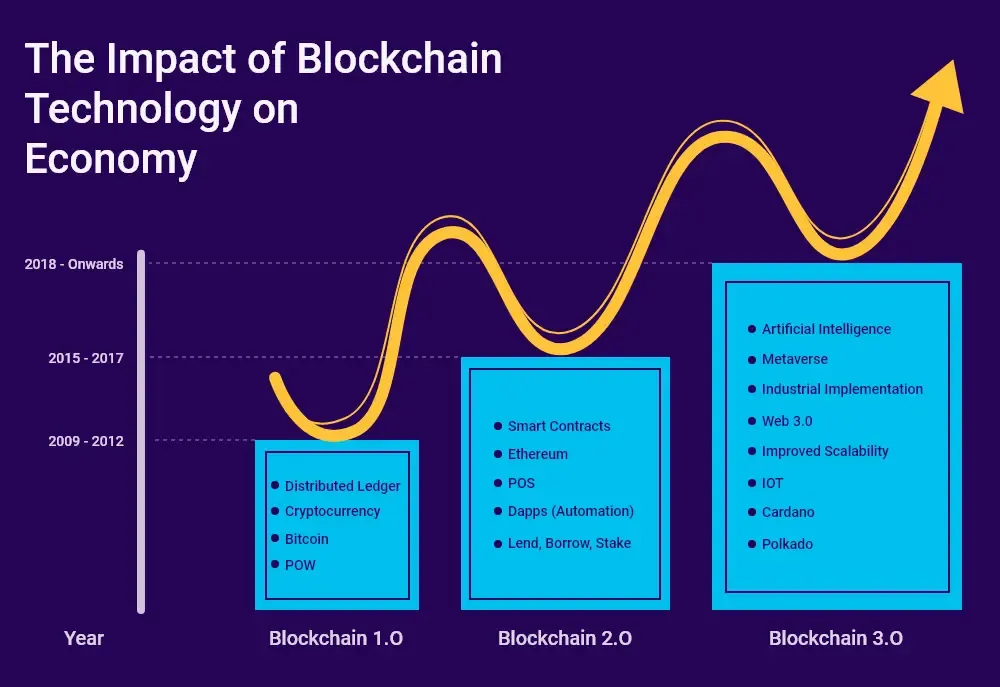

## Table of Contents

## What is blockchain technology and how does it work?

Blockchain technology is a way to store information securely and transparently. It's like a digital ledger or record book that keeps track of transactions or data. Instead of being controlled by one person or company, it's managed by many computers all over the world. This makes it very hard for anyone to cheat or change the information because everyone can see what's happening.

When someone wants to add new information to the blockchain, it gets grouped into a "block" with other pieces of information. This block is then checked by the computers in the network to make sure it's correct. Once everyone agrees, the block is added to the chain of previous blocks, creating a permanent record. Each block is connected to the one before it, making a long chain of information that's very hard to change or delete. This system helps keep data safe and trustworthy.

## How can blockchain technology benefit emerging economies?

Blockchain technology can help emerging economies by making financial services easier to access. In many developing countries, a lot of people don't have bank accounts. Blockchain can let them send and receive money without needing a bank. This can help small businesses grow because they can get paid faster and more safely. It also makes it easier for people to save money and get loans, which can help them start new businesses or improve their lives.

Another way blockchain can help is by making government services more transparent and less corrupt. In some countries, it's hard to trust that the government is doing the right thing with public money. Blockchain can keep track of how money is spent, so everyone can see where it goes. This can make people trust their government more and help make sure that money is used to build schools, hospitals, and roads. By making things more open and fair, blockchain can help emerging economies grow stronger and more stable.

## What are the current applications of blockchain in emerging markets?

In emerging markets, blockchain is being used to help people who don't have bank accounts. Companies are creating digital wallets that let people send and receive money using their phones. This is important because in many places, banks are far away or hard to use. By using blockchain, people can save money, pay for things, and even get loans without needing a bank. This helps small businesses grow and lets people take better care of their families.

Blockchain is also helping to make things more transparent in these markets. For example, some countries are using blockchain to keep track of how government money is spent. This makes it harder for corruption to happen because everyone can see where the money goes. It's also being used to make sure that supply chains are fair and that products like food and medicine are safe. By making everything more open and honest, blockchain can help build trust and make life better for people in emerging economies.

## How does blockchain improve financial inclusion in emerging economies?

Blockchain helps people in emerging economies who don't have bank accounts. In many places, banks are far away or hard to use. With blockchain, people can use their phones to send and receive money. This is called a digital wallet. It lets people save money, pay for things, and even get loans without needing a bank. This is important because it helps small businesses grow and lets people take better care of their families.

Blockchain also makes financial services safer and easier to trust. When people use blockchain, their money is kept on a network of computers all over the world. This makes it hard for anyone to steal or cheat. Because it's so safe, more people feel okay about using it. This means more people can join the financial world, which helps the whole economy grow. By making money easier to use and trust, blockchain helps everyone in emerging economies have a better chance to succeed.

## What are the challenges of implementing blockchain in emerging economies?

One big challenge of using blockchain in emerging economies is that not everyone has a smartphone or good internet. Blockchain needs these things to work well. In many places, people might not have the right tools or the internet might be slow or expensive. This makes it hard for everyone to use blockchain and get its benefits.

Another challenge is that people might not know about blockchain or trust it. In some countries, new technology can be scary or hard to understand. People might worry about losing their money or not knowing how to use it. Governments and companies need to teach people about blockchain and show them how it can help. This takes time and effort, but it's important for making blockchain work well in these places.

Also, the rules and laws in different countries can make it hard to use blockchain. Some governments might not allow it or might have strict rules about how it can be used. This can slow down the use of blockchain and make it harder for people to get the help they need. Working with governments to make good rules is important for making blockchain easier to use in emerging economies.

## How can blockchain impact governance and transparency in emerging markets?

Blockchain can make governments in emerging markets more open and honest. It works like a big, clear record book that everyone can see. When governments use blockchain, they can show people exactly how they spend money. This makes it harder for anyone to take money that should be used for things like schools and hospitals. By making everything clear, blockchain helps people trust their government more and feel sure that their money is being used the right way.

Another way blockchain helps is by making it easier to vote and keep track of votes. In some places, it's hard to know if elections are fair. With blockchain, every vote can be recorded in a way that's safe and can't be changed. This makes people trust that their vote counts and that the election is honest. By making voting more clear and fair, blockchain can help make governments in emerging markets work better for everyone.

## What role can blockchain play in reducing corruption in emerging economies?

Blockchain can help fight corruption in emerging economies by making everything more open and clear. It works like a big, safe record book that everyone can see. When governments use blockchain, they can show people exactly how they spend money. This makes it harder for anyone to take money that should be used for important things like schools and hospitals. By making everything clear, blockchain helps people trust their government more and feel sure that their money is being used the right way.

Another way blockchain helps reduce corruption is by making it easier to vote and keep track of votes. In some places, it's hard to know if elections are fair. With blockchain, every vote can be recorded in a way that's safe and can't be changed. This makes people trust that their vote counts and that the election is honest. By making voting more clear and fair, blockchain can help make governments in emerging markets work better for everyone and reduce the chances of corrupt activities.

## How does blockchain technology affect trade and supply chain management in emerging markets?

Blockchain technology can make trade and supply chain management better in emerging markets. It works like a clear record book that everyone can see. When companies use blockchain, they can keep track of where their products come from and where they go. This makes it easier to know if the products are real and safe. For example, if a farmer in an emerging market wants to sell their crops, blockchain can show that the crops are good and where they came from. This helps the farmer get a fair price and makes buyers trust the products more.

Blockchain also helps make trade faster and cheaper. In many emerging markets, it can be hard and slow to move goods from one place to another. With blockchain, companies can use smart contracts, which are like digital agreements that happen automatically. This means that when certain things happen, like a product reaching its destination, the payment can happen right away without needing a lot of paperwork. By making trade easier and more trustworthy, blockchain can help businesses in emerging markets grow and reach more people.

## What are the potential economic growth opportunities blockchain presents for emerging economies?

Blockchain can help emerging economies grow by making it easier for people to use money. In many places, people don't have bank accounts, so they can't save money or get loans easily. Blockchain lets them use their phones to send and receive money safely. This helps small businesses grow because they can get paid faster and more easily. When more people can use money, the whole economy can grow because people can start new businesses and spend more.

Blockchain also makes trade and supply chains better. It helps companies keep track of where their products come from and where they go. This makes it easier to know if the products are real and safe. When companies can trust their supply chains, they can trade more and reach more people. This can help businesses in emerging markets grow and make the economy stronger. By making everything more open and fair, blockchain can help emerging economies grow and become more stable.

## How are emerging economies currently adopting and regulating blockchain technology?

Emerging economies are starting to use blockchain technology in different ways. Some countries are using it to help people who don't have bank accounts. They create digital wallets that let people send and receive money using their phones. This helps small businesses grow and lets people save money and get loans more easily. Other countries are using blockchain to make government services more open and honest. They use it to keep track of how money is spent, so everyone can see where it goes. This helps fight corruption and makes people trust their government more.

Regulating blockchain in emerging economies can be tricky. Some governments are making rules to help blockchain grow safely. They want to make sure it's used in a way that helps people and doesn't cause problems. Other governments are still figuring out what to do. They might be worried about losing control or not understanding the technology well. It's important for these countries to work with experts and other countries to make good rules. This can help blockchain be used in a way that helps the economy grow and makes life better for people.

## What are the advanced use cases of blockchain in emerging economies that are not yet widely implemented?

In emerging economies, one advanced use of blockchain that's not yet widely used is in land and property records. Right now, in many places, it's hard to know who owns what land because the records are old or not clear. Blockchain can make a safe, clear record of who owns what land. This can help people feel sure about their property and make it easier to buy and sell land. It can also help stop people from taking land that's not theirs and make the whole system more fair.

Another advanced use of blockchain is in healthcare. In some emerging economies, it's hard to keep track of people's health records because the systems are old or not connected. Blockchain can make a safe, shared record of people's health information. This can help doctors see a person's full health history, even if they go to different hospitals. It can also help make sure that medicine and vaccines are real and safe. By making healthcare more clear and connected, blockchain can help people get better care and stay healthier.

## What future trends can we expect in the integration of blockchain in emerging economies?

In the future, we can expect blockchain to become more important in emerging economies. As more people learn about it and trust it, they will start using it for more things. One big trend will be using blockchain for digital identity. This means people can have a safe way to prove who they are online. This can help them get services like healthcare and education more easily. It can also make it easier for them to vote and get government help. By making identity more clear and safe, blockchain can help people in emerging economies live better lives.

Another trend will be using blockchain to make supply chains even better. Right now, it's hard to know where products come from and if they are real. In the future, more companies will use blockchain to keep track of their products from start to finish. This will make it easier to know if food and medicine are safe. It can also help small farmers and businesses sell their products to more people. By making supply chains more open and fair, blockchain can help emerging economies grow stronger and more stable.

## References & Further Reading

[1]: Tapscott, D., & Tapscott, A. (2016). ["Blockchain Revolution: How the Technology Behind Bitcoin Is Changing Money, Business, and the World"](https://dl.acm.org/doi/10.5555/3051781). Penguin.

[2]: Narayanan, A., Bonneau, J., Felten, E., Miller, A., & Goldfeder, S. (2016). ["Bitcoin and Cryptocurrency Technologies: A Comprehensive Introduction."](https://press.princeton.edu/books/hardcover/9780691171692/bitcoin-and-cryptocurrency-technologies) Princeton University Press.

[3]: Ip, G. (2012). ["Algorithmic Trading and Its Impacts on Market Quality."](https://www.sciencedirect.com/science/article/pii/S0378426623000687) Brookings Institution.

[4]: Gomber, P., Arndt, B., Lutat, M., & Uhle, T. (2011). ["High-Frequency Trading."](https://papers.ssrn.com/sol3/papers.cfm?abstract_id=1858626) Business & Information Systems Engineering, 3(2), 69-80.

[5]: Swan, M. (2015). ["Blockchain: Blueprint for a New Economy."](https://dl.acm.org/doi/book/10.5555/3006358) O'Reilly Media.