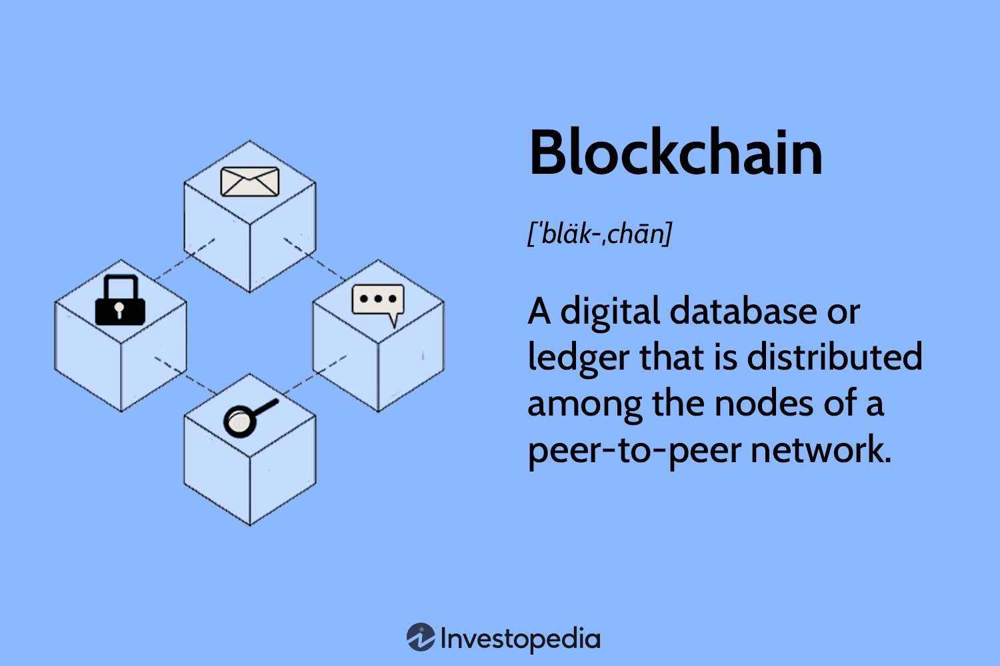

The rapid evolution of technology continues to reshape industries globally, with significant advancements in blockchain, Graphics Processing Units (GPUs), and algorithmic trading having a pronounced impact. Each of these technologies has individually transformed their respective fields, yet their interconnected nature promises even greater change. Blockchain, initially synonymous with cryptocurrencies like Bitcoin, has evolved to encompass various applications beyond digital currency, including smart contracts, supply chain management, and authentication processes. This progression is largely due to its decentralized nature, offering enhanced transparency and security.

Simultaneously, GPUs have progressed from being primarily associated with rendering graphics in gaming to pivotal components in accelerating various computational tasks. Their architecture, which allows for parallel processing, is a perfect match for the mathematical computations required in blockchain mining. This relationship spurred a surge in GPU demand, highlighting their importance in both technological and financial sectors.

Algorithmic trading, another forefront advancement, utilizes algorithms to automate trading processes, executing orders at speeds and volumes unattainable by humans. This efficiency reduces transaction costs and improves liquidity but also introduces risks, such as market volatility and system failures.

This article will explore how these technologies have evolved and intersected, specifically considering the history and current state of blockchain and GPUs, including the notorious GPU shortage, and their future prospects. Moreover, it will cover the rise of algorithmic trading, scrutinize its various benefits and inherent risks, and look at emerging trends shaping this dynamic field.

Understanding these developments is crucial for investors and technology enthusiasts aiming to stay ahead in a rapidly changing landscape. The convergence of these technologies not only reflects their individual growth trajectories but also underscores their collective potential to transform both the tech industry and financial markets.

## Table of Contents

## The Evolution of Blockchain and GPU Technologies

The cryptocurrency boom of 2016 marked a crucial point in the relationship between blockchain technology and Graphics Processing Units (GPUs). The emergence of blockchain-based currencies like Bitcoin introduced the concept of mining, a process requiring substantial computational power to solve cryptographic hash functions necessary for transaction validation and block creation on the blockchain. GPUs, originally developed to enhance graphical rendering in gaming environments, proved instrumental due to their parallel processing capabilities, making them much more efficient than traditional CPUs for mining cryptocurrencies.

The rising profitability of mining drove a surge in demand for GPUs. This demand spike led to significant sales increases and was a key [factor](/wiki/factor-investing) in the onset of a global GPU shortage. Manufacturers like NVIDIA and AMD struggled to keep up with the rapid increase in demand, resulting in elevated prices and scarcity of these units. This period accentuated the critical role of GPUs in the [cryptocurrency](/wiki/cryptocurrency) landscape and the broader tech sector, highlighting their utility beyond their intended purpose of supporting game graphics.

Over time, both blockchain and GPUs have grown beyond their initial uses. Blockchain technology has expanded its applications beyond cryptocurrency mining to sectors including supply chain management, healthcare, and finance, leveraging its decentralized, secure, and transparent nature. Projects like Ethereum have enabled smart contracts and decentralized applications (DApps), broadening the scope and impact of blockchain technologies.

Similarly, GPUs have found new life and utility in domains such as [artificial intelligence](/wiki/ai-artificial-intelligence) (AI) and [machine learning](/wiki/machine-learning) (ML). Their ability to handle extensive parallel processing makes them ideal for training [deep learning](/wiki/deep-learning) models, which require massive computational resources. This shift has led to significant advancements in AI, allowing for breakthroughs in image and speech recognition, autonomous driving, and natural language processing.

In summary, the intersection of blockchain and GPU technologies catalyzed a period of innovation and transformation, profoundly impacting both the tech and financial industries. Initially driven by the demands of cryptocurrency mining, these technologies have since matured and evolved, finding new applications and efficiencies. Their ongoing development will likely continue to shape the landscape of digital technology and finance, underscoring the importance of adaptable and scalable solutions in the face of rapidly evolving technological demands.

## Causes and Effects of the GPU Shortage

The cryptocurrency mining boom, particularly during 2017 and 2018, significantly increased the demand for Graphics Processing Units (GPUs). This boom was largely due to the profitability of mining cryptocurrencies like Ethereum, which necessitated robust computational power. Typically used for rendering graphics in gaming and professional design, GPUs became essential for solving the complex mathematical problems required for cryptocurrency mining. Subsequently, this surge in demand led to severe shortages in the GPU market, impacting not just cryptocurrency miners but also gamers, graphic artists, and scientific researchers who rely on these devices for various applications.

In response to the overwhelming demand, retailers implemented several measures to manage the supply constraints. Waiting lists became common, and some sellers resorted to auctioning off GPUs, leading to inflated prices. During peak periods, GPU prices rose to two or three times the Manufacturer's Suggested Retail Price (MSRP). The imbalance between supply and demand impacted several industries, emphasizing the critical dependence on GPUs for high-performance computing tasks.

The GPU shortage brought significant attention to the vulnerabilities present in supply chain management and the wider implications for industries reliant on computing power. This situation compelled manufacturers to explore innovative production and distribution strategies. For instance, companies started increasing their production capacities and diversifying their supply sources to mitigate future shortages. Moreover, the precision of supply chain forecasting tools was enhanced using machine learning algorithms to predict demand fluctuations more accurately.

Furthermore, the shortage had ongoing ripple effects on the broader technology market dynamics. In the gaming and tech sectors, it led companies to revise their strategies regarding hardware releases and inventory management. It also accelerated the adoption of alternative technologies, such as cloud computing and GPU virtualization, to provide computational power without the reliance on physical hardware.

In conclusion, the GPU shortage, driven by an unexpected surge in demand during the cryptocurrency mining frenzy, exposed critical vulnerabilities in supply chain management and catalyzed innovations in GPU production and distribution strategies. The event underscoreed the strategic importance of managing supply chains effectively to ensure stability in technology-reliant industries.

## Future of Blockchain and GPUs

Despite the decreased profitability of cryptocurrency mining with GPUs, these devices continue to play a significant role in the blockchain ecosystem. The growing need for distributed computing power in various blockchain applications has redirected the focus from mining towards more diverse and impactful uses of GPU technology.

One such innovation is the emergence of GPU-as-a-Service (GaaS) platforms, which leverage blockchain to democratize access to computational resources. By providing scalable GPU power over the internet, these platforms create virtual supercomputers accessible to a broad range of users, from researchers to developers. GaaS platforms facilitate computationally intensive tasks, such as rendering complex graphics, processing large datasets, or executing machine learning algorithms, without the necessity of substantial hardware investments.

Platforms like Neura exemplify how GPUs are being repurposed beyond traditional tasks. By utilizing GPUs for artificial intelligence (AI) and machine learning (ML) processes, these platforms enhance capabilities in predictive analytics, automated decision-making, and data-driven insights. Neura's integration of GPU technology into AI/ML exploits the parallel processing power inherent in GPUs, dramatically increasing the efficiency and speed of model training and execution.

As these technologies mature, there are several potential paths for further expansion and integration between blockchain and GPUs. GPU-based blockchain applications can improve computational efficiency and speed, which are critical in environments that demand high-throughput and low-latency execution. These advancements can facilitate the development of more robust blockchain networks capable of handling complex operations at scale.

Additionally, interdisciplinary applications combining blockchain with AI and IoT (Internet of Things) could leverage GPU power to process and validate vast amounts of data, enhancing everything from smart contract execution to real-time decision systems in automated vehicles or smart cities.

In conclusion, the future of GPUs within the blockchain landscape appears promising. By adapting their vast computational prowess to emerging demands in distributed technologies and intelligent systems, GPUs will continue to be integral to the transformative processes shaping modern technological infrastructures. This shift not only enhances the technical capabilities available to blockchain developers and users but also pushes the boundaries of what can be achieved through cooperative computing and innovative problem-solving.

## The Rise and Impact of Algorithmic Trading

Algorithmic trading has fundamentally transformed global financial markets, evolving as a dominant force that executes approximately 80% of trades. This transformation hinges on the ability of algorithmic systems to process vast amounts of data at remarkable speeds, allowing for trades to be executed with unparalleled efficiency and precision. By leveraging precise mathematical models, [algorithmic trading](/wiki/algorithmic-trading) minimizes human error and emotional bias, offering significant advantages over traditional trading methodologies. This precision not only leads to considerable cost savings but also enhances strategic decision-making capabilities.

The integration of technologies such as artificial intelligence (AI) and big data analytics further amplifies the efficacy of algorithmic trading systems. AI-driven algorithms can quickly adapt to changing market conditions, analyzing patterns and executing trades based on predictive insights drawn from historical data. For instance, machine learning techniques are increasingly used to refine trading strategies by continuously learning from new data inputs, thereby optimizing trade execution and maximizing returns.

However, despite its advantages, algorithmic trading is not without risks. High-frequency trading, a subset of algorithmic strategies, can exacerbate market [volatility](/wiki/volatility-trading-strategies), as rapid-fire trading can lead to situations like "flash crashes." These are extreme market events characterized by sharp price declines within short time frames, underscoring the potential for systemic risk. Additionally, the reliance on complex technological infrastructures poses the risk of system failures or crashes, which can have significant repercussions across financial markets.

To mitigate these risks, robust regulatory frameworks and oversight mechanisms are critical. Regulatory bodies worldwide are increasingly focusing on safeguarding market integrity, emphasizing the need for transparency and accountability. Ensuring that algorithmic systems comply with regulatory standards helps maintain stability while allowing innovation to flourish. Moreover, ongoing advancements in technology require continuous updates to regulatory policies to address emerging challenges in algorithmic trading.

As the landscape of financial trading continues to evolve, the future of algorithmic trading looks promising yet demands careful navigation. The confluence of AI, big data, and advanced computing promises to further enhance the capabilities of algorithmic trading. As these technologies mature, they hold the potential to redefine strategic approaches within the financial sector, presenting both opportunities and challenges. Thus, market participants and regulators alike must stay vigilant, adapting to ongoing advancements to harness the benefits while mitigating inherent risks.

## Benefits, Risks, and Trends in Algorithmic Trading

Algorithmic trading, commonly referred to as algo-trading, has revolutionized the financial markets. By relying on pre-programmed trading instructions, algo-trading can execute orders with remarkable precision and speed, driving substantial improvements in market efficiency. This efficiency is particularly evident in its ability to reduce transaction costs and manage substantial volumes of trades seamlessly. In algorithmic trading, these processes are significantly quicker than manual trading, allowing traders to exploit market opportunities and [arbitrage](/wiki/arbitrage) with minimal delay.

### Benefits

The primary benefit of algorithmic trading is the reduction in trading costs. Automating the trading process curtails the need for human intervention, which, in turn, reduces the likelihood of errors and slippage often caused by emotional decision-making and market fluctuations. Additionally, algo-trading's capacity to handle large volumes of transactions in a fraction of a second further demonstrates its operational advantage over traditional trading methods. This capability also contributes to [liquidity](/wiki/liquidity-risk-premium) and market depth, as orders can be matched more efficiently.

### Risks

Despite its clear advantages, algorithmic trading is not without risk. Technological malfunctions pose a significant threat, as issues within the algorithms or infrastructure can lead to substantial financial losses. One infamous instance is the 2010 Flash Crash, where a massive trade initiated by an algorithmic error temporarily wiped out nearly $1 trillion in market value. Furthermore, the complex nature of these algorithms makes them susceptible to exploitation and tampering, necessitating robust security measures.

Regulatory challenges also exist, as the rapid execution speeds and complex strategies employed by algo-traders can overwhelm existing regulatory frameworks. There is a constant need for regulations to evolve and keep pace with technological advancements in trading, ensuring market integrity and protecting investors.

### Trends

Looking to the future, artificial intelligence (AI) and machine learning are playing increasingly pivotal roles in enhancing algorithmic trading. These technologies enable more sophisticated and adaptive algorithms that can learn from historical data, recognize patterns, and adjust strategies in real time. This evolution creates opportunities for nuanced risk assessment and dynamic decision-making processes, improving overall trading performance.

Moreover, cloud computing supports the scalability and accessibility of algorithmic trading technologies. Smaller firms and individual traders who may not have previously had access to sophisticated trading infrastructure can now leverage cloud-based platforms to develop and execute trading strategies. This democratization of technology heralds a new era of inclusivity within financial markets, empowering a wider array of participants.

In conclusion, while algorithmic trading offers substantial benefits in terms of efficiency and cost reduction, it also poses certain risks that need to be carefully managed. Emerging technologies like AI and cloud computing present exciting trends that will shape the future of algo-trading, making it more sophisticated and accessible than ever before. Embracing these advancements will be crucial for traders seeking to navigate and capitalize on the opportunities within this rapidly evolving landscape.

## Conclusion

The integration of blockchain, GPU technologies, and algorithmic trading is fundamentally altering the frameworks of both technological and financial ecosystems. Blockchain’s decentralized ledger provides a secure and transparent mechanism for transactions, which is increasingly vital in a digital economy. Meanwhile, the computational prowess of GPUs is allowing for more complex data processing, not only enhancing blockchain capabilities but also driving advancements in fields like artificial intelligence and scientific research.

Algorithmic trading has redefined financial markets by automating processes that were once manual, leading to significant cost savings and increased trading speed. The combination of these technologies offers remarkable opportunities, but it also presents unique challenges. Stakeholders are called to navigate potential risks, such as regulatory issues, technological malfunctions, and market volatility, which may arise from this ecosystem synergy.

A comprehensive understanding of these dynamics is essential for leveraging the synergistic potential of blockchain and GPUs and unlocking the efficiencies provided by algorithmic trading. As these technologies advance and intersect, staying informed is not just advantageous; it becomes a strategic necessity for capitalizing on emerging benefits and effectively managing inherent risks. Whether you are an investor, a developer, or a policymaker, keeping abreast of these trends will ensure you are well-positioned to harness their transformative power in your respective field.

## References & Further Reading

[1]: Vigna, P., & Casey, M. J. (2015). ["The Age of Cryptocurrency: How Bitcoin and Digital Money Are Challenging the Global Economic Order"](https://archive.org/details/ageofcryptocurre0000vign). St. Martin's Press.

[2]: Lustig, I. J., & Marom, S. (2022). ["Algorithmic Trading: Winning Strategies and Their Rationale"](https://www.wiley.com/en-us/Algorithmic+Trading%3A+Winning+Strategies+and+Their+Rationale-p-9781118676998). Wiley.

[3]: Rosenthal, K. (2021). ["The Bitcoin Standard: The Decentralized Alternative to Central Banking"](https://archive.org/download/the-bitcoin-standard-the-decentralized-alternative-to-central-banking_202205/The%20Bitcoin%20Standard%20The%20Decentralized%20Alternative%20to%20Central%20Banking%20.pdf). Wiley.

[4]: Nvidia Corporation. (2018). ["NVIDIA Deep Learning GPU Technology Conference Talks."](https://developer.download.nvidia.com/video/gputechconf/gtc/2019/presentation/s9695-deep-learning-and-beyond.pdf) NVIDIA Developer.

[5]: Treleaven, P., & Batrinko, N. (2016). ["Blockchain Technology in Finance."](https://ieeexplore.ieee.org/abstract/document/8048631) Computer Science Review, Volume 23.