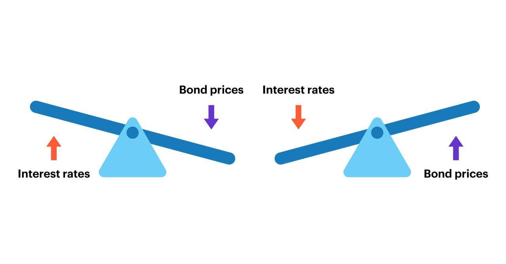

Understanding the complex relationships in the bond market is crucial for both individual investors and financial professionals. Bonds are integral to finance, serving as a predominant method for borrowing funds and investing capital. Consequently, understanding the pricing dynamics of bonds is essential for investors aiming to make informed decisions. The factors influencing bond prices, such as coupon rates and interest rates, significantly affect investment returns and strategies.

A bond's coupon rate, which is the periodic interest payment made to bondholders, is a fundamental element in assessing a bond's attractiveness. Coupled with prevailing interest rates, these components directly impact the bond's market value. Typically, when interest rates rise, the price of existing bonds with lower coupon rates declines, and when interest rates fall, the value of bonds with higher coupons increases. This inverse relationship underscores the importance of understanding interest rate trends and their potential implications for bond pricing.

The advent of algorithmic trading has introduced significant changes in the bond market. This technology employs sophisticated algorithms to execute trades at remarkable speeds, often capitalizing on minute pricing signals that are hard to detect manually. Algorithmic trading enhances market efficiency, liquidity, and price discovery while also presenting new challenges, like increased market volatility and the necessity for stringent regulatory oversight.

This article aims to provide an exhaustive overview of how bond coupons, interest rates, and algorithmic trading strategies collectively impact bond pricing. Whether you are a seasoned trader or new to the bond market, grasping these critical components will undoubtedly bolster your strategic approach, allowing you to navigate the complexities of bond investments more effectively.

## Table of Contents

## What Determines Bond Prices?

Bond prices are determined by several core factors, with the bond's coupon rate, prevailing interest rates, and the bond's time to maturity being the primary influences. When a bond is issued, its coupon rate—fixed at the time of issuance—entails periodic interest payments to the bondholder, crucially affecting the bond’s attractiveness. The coupon rate serves as a measure of the bond's return relative to other investments, particularly in stable interest rate environments. An elevated coupon rate typically implies an enhanced income stream, positioning the bond as more appealing to potential investors.

The interplay between prevailing market interest rates and bond prices is integral. Generally, an inverse relationship exists wherein rising interest rates lead to a decrease in existing bond prices, as new bonds are issued with higher yields. Conversely, declining interest rates enhance the value of existing bonds, making their lower-yield counterparts less attractive. This dynamic can be quantitatively expressed using the bond pricing formula:

$$
P = \sum_{t=1}^{n} \frac{C}{(1+i)^t} + \frac{M}{(1+i)^n}
$$

where $P$ is the bond price, $C$ is the coupon payment, $n$ is the number of periods, $i$ is the interest rate, and $M$ is the maturity value. 

Other significant factors include the bond's credit rating, which assesses the issuer's ability to meet financial obligations. A higher credit rating typically reduces the yield required by investors, thus increasing the bond's price. The issuer's financial health also directly impacts bond valuations, with robust earnings and stability lending credibility and reducing perceived risk. Economic conditions, such as inflation rates and fiscal policies, further contribute by influencing [interest rate](/wiki/interest-rate-trading-strategies) trends and investor sentiment.

It is imperative for investors to monitor these factors, as they collectively determine a bond's market value and investment potential. Grasping these elements facilitates sound financial decision-making and portfolio management.

## The Role of Bond Coupons

A bond coupon represents the periodic interest payments made to bondholders throughout the life of a bond until maturity. This payment is a critical component of the bond's total return and is a fixed percentage of the bond's face value, known as the "coupon rate.” The coupon rate is set when the bond is issued and remains unchanged throughout the bond's term.

The coupon rate is fundamental in determining the bond's income-generating potential and is a primary metric for evaluating its return on investment. Investors receive these payments typically on an annual, semi-annual, or quarterly basis, resulting in predictable income streams. The significance of the coupon rate in assessing a bond investment arises because it directly impacts the cash flow received by the investor. 

Higher coupon rates often enhance a bond's attractiveness, especially in stable interest rate environments. This is due to their ability to provide superior fixed income compared to bonds with lower coupon rates. When market interest rates are low, bonds with high coupon rates become particularly appealing as they offer returns above the prevailing market rates. 

Investors must compare the bond's coupon rate to current market interest rates to evaluate its value accurately. If the coupon rate is higher than the prevailing interest rates, the bond could be viewed as a relatively more attractive investment, potentially increasing its market price. Conversely, if the coupon rate is lower than current rates, the bond might be less appealing, likely leading to a decrease in its market price. 

Therefore, comprehending how the coupon rate interacts with market interest rates is essential for assessing both the potential value and risk associated with a bond investment. This understanding enables investors to make informed decisions to optimize their investment portfolios in varying economic environments.

## Impact of Interest Rates on Bonds

Interest rates have a profound influence on bond prices, impacting their attractiveness and market value. This relationship hinges on the fixed nature of bond coupon payments compared to dynamic interest rate environments.

When interest rates increase, new bonds are typically issued with higher coupon rates to match the market's elevated return expectations. Consequently, existing bonds with lower coupon rates become less appealing. Investors are likely to favor new issues that offer superior returns, leading to a drop in the market price of the older bonds. The price adjustment can be explained by the bond price formula, which discounts future cash flows, including coupon payments, at prevailing interest rates. As these rates rise, the present value of these cash flows decreases, resulting in a lower bond price.

The opposite effect occurs when interest rates decline. Bonds with higher coupon rates than those newly issued become more attractive as they promise better returns relative to the current low-rate environment. Accordingly, the higher demand for these existing bonds with attractive interest payments elevates their market price. This inverse relationship between bond prices and interest rates can be fundamental for bond market participants to grasp, as it directly affects the value of bond investments.

Interest rate changes can be driven by various factors, including monetary policy adjustments by central banks, inflation expectations, and overall economic conditions. Central banks might increase interest rates to combat inflation or reduce them to stimulate economic growth. Inflation expectations also play a critical role since higher expected inflation typically leads to higher interest rates as investors demand a premium for expected loss of purchasing power. Economic conditions such as GDP growth rate, unemployment, and global economic trends can similarly influence interest rate trends.

Understanding this interplay is crucial for investors aiming to navigate the bond market effectively, as it allows them to anticipate possible price movements and make informed investment decisions.

## Algorithmic Trading in the Bond Market

Algorithmic trading in the bond market leverages advanced computational algorithms to automate and optimize trading strategies. This technology has transformed trading by allowing for rapid, data-driven decision-making that can capitalize on market signals in fractions of a second. At its core, [algorithmic trading](/wiki/algorithmic-trading) involves the use of complex algorithms to execute large volumes of trades efficiently. These algorithms are based on predefined strategies that analyze historical and real-time data to determine the best possible execution parameters.

The implementation of algorithmic trading has significantly enhanced [liquidity](/wiki/liquidity-risk-premium) in the bond market. By facilitating continuous two-way trading, it ensures tighter bid-ask spreads and more transparent price discovery, benefiting all market participants. Enhanced liquidity reduces market impact costs, allowing for a more seamless trading experience. 

Price discovery in the bond market is also greatly improved through algorithmic trading. Algorithms can process vast amounts of data, including interest rate changes, economic indicators, and market sentiment to accurately assess bond values. This heightened efficiency in price discovery ensures that bonds are traded closer to their intrinsic value, thus benefiting both buyers and sellers.

However, the integration of algorithmic trading into the bond market is not without its challenges. The rapid execution of trades can contribute to increased market [volatility](/wiki/volatility-trading-strategies), creating periods of excessive price fluctuations that are exacerbated by automated reactions to short-term market signals. Additionally, the complexities of these systems necessitate rigorous risk management protocols. Algorithmic strategies must be designed to mitigate potential risks, such as flash crashes or erroneous trades, which can have significant financial and reputational repercussions.

Regulatory concerns also arise with the proliferation of algorithmic trading. The need for transparency, fair market practices, and the prevention of market manipulation is paramount. Regulatory bodies are continually adapting rules to address the unique challenges posed by automated trading systems while balancing the need for innovation and market efficiency.

In conclusion, algorithmic trading represents a significant advancement in the bond market, offering improvements in speed, accuracy, and liquidity. Nonetheless, it demands a careful approach to risk management and regulatory compliance to harness its full potential while safeguarding market stability.

## Strategies for Bond Market Trading

When trading bonds, understanding the impact of coupon rates and interest rate movements is crucial. Investors often use various trading strategies such as laddering, barbell, and bullet strategies depending on their market outlook.

Laddering is a strategy that involves purchasing bonds with staggered maturities. This approach helps investors manage interest rate risk by ensuring that they have bonds maturing at regular intervals. As bonds mature, the principal can be reinvested in new bonds at current interest rates, thereby capitalizing on potential rate increases or mitigating declines in income if rates fall.

The barbell strategy is another popular method, which involves investing in short-term and long-term bonds, while avoiding intermediate maturities. This allocation allows investors to benefit from the higher yields typically offered by longer-term bonds, while maintaining the flexibility of short-term bonds that mature relatively quickly. This strategy can provide a balance between risk and return, offering income from long-term holdings while preserving capital liquidity with short-term investments.

Bullet strategies concentrate bond investments around a specific time horizon, typically focusing on a single maturity date. This method is often used when an investor anticipates a need for a significant cash sum at a specific time, such as for college tuition or retirement. The bonds mature around the time the funds are needed, minimizing interest rate risk at the target date.

Incorporating algorithmic trading strategies can provide a competitive edge by exploiting pricing inefficiencies and executing trades at optimal times. Algorithmic strategies automate the trading process, analyzing vast amounts of data to identify patterns or [arbitrage](/wiki/arbitrage) opportunities that human traders might miss. This high-speed execution is particularly advantageous in the bond market, where small price differences can lead to substantial profits.

A successful bond trading strategy often involves a mix of [fundamental analysis](/wiki/fundamental-analysis), technical analysis, and market timing, while also considering economic forecasts. Fundamental analysis focuses on the intrinsic value of bonds, assessing factors such as economic conditions and the issuer's creditworthiness. Technical analysis, on the other hand, examines statistical trends derived from trading activity, such as price movement and [volume](/wiki/volume-trading-strategy), to forecast future price movements.

By combining these analytical approaches, traders can make informed decisions about when to buy or sell bonds, optimizing their portfolios to meet investment goals and risk tolerance. Additionally, keeping abreast of economic indicators—like interest rate projections, inflation expectations, and fiscal policies—can provide insight into potential market shifts, aiding in strategic decision-making.

Ultimately, the combination of traditional strategies and modern technology in bond market trading allows investors to navigate the complexities of the market more effectively, adapting to changing conditions and maximizing the potential for returns.

## Conclusion and Future Trends

The bond market remains a cornerstone of the global financial system, characterized by its dynamic interplay with macroeconomic variables and advances in trading technologies. It is essential for investors and financial professionals alike to comprehend the interactions between bond prices, coupon rates, and interest rates for informed decision-making. Bond prices fluctuate mainly due to changes in interest rates. An increase in interest rates typically causes existing bond prices to fall, making an understanding of this relationship pivotal for any bond market strategy.

Algorithmic trading is reshaping the bond market landscape, offering both opportunities and challenges. This form of trading utilizes sophisticated algorithms to automate and accelerate trading, enhancing market liquidity and efficiency. However, the rapid pace of trading also introduces risks such as increased volatility and complex regulatory environments. Therefore, it is crucial for market participants to keep abreast of technological advancements and evolving regulations to navigate these challenges successfully.

Looking towards future trends, the integration of [artificial intelligence](/wiki/ai-artificial-intelligence) (AI) and [machine learning](/wiki/machine-learning) in trading strategies is expected to intensify. AI can process large volumes of market data and identify patterns at a scale and speed beyond human capabilities, potentially improving decision-making in the bond market. These technologies can be employed to optimize trade execution, predict market movements, and manage risk more effectively. For instance, machine learning algorithms could be trained to refine trading strategies by analyzing past bond price movements in relation to interest rate changes.

In conclusion, the bond market's evolution is fueled by both macroeconomic forces and technological innovation. By understanding these dynamics and embracing new technologies, investors and traders can position themselves advantageously amidst the ongoing transformation of this vital financial market.

## References & Further Reading

[1]: ["The Handbook of Fixed Income Securities"](https://www.amazon.com/Handbook-Fixed-Income-Securities-Ninth/dp/1260473899) by Frank J. Fabozzi

[2]: ["Algorithmic Trading: Winning Strategies and Their Rationale"](https://books.google.com/books/about/Algorithmic_Trading.html?id=WAlFDwAAQBAJ) by Ernest P. Chan

[3]: ["Advances in Financial Machine Learning"](https://www.amazon.com/Advances-Financial-Machine-Learning-Marcos/dp/1119482089) by Marcos Lopez de Prado

[4]: ["Fixed Income Analysis"](https://en.wikipedia.org/wiki/Fixed_income_analysis) by Barbara S. Petitt, Jerald E. Pinto, and Wendy L. Pirie

[5]: ["The Basics of Bonds"](https://www.investopedia.com/financial-edge/0312/the-basics-of-bonds.aspx) from Investopedia

[6]: ["A Survey of Liquidity in the Secondary Corporate Bond Market"](https://rpc.cfainstitute.org/en/research/surveys/secondary-corporate-bond-market-liquidity-survey-report) by R. Furse, D. Keating, and A. Audette

[7]: ["The Economics of Arbitrage"](https://www.nber.org/system/files/working_papers/w29744/w29744.pdf) by Walter Bagehot

[8]: ["Bond Pricing Formula"](https://www.wallstreetmojo.com/bond-pricing-formula/) from Quantitative Finance Lectures

[9]: ["Artificial Intelligence in Financial Markets"](https://www.imf.org/en/News/Articles/2024/09/06/sp090624-artificial-intelligence-and-its-impact-on-financial-markets-and-financial-stability) edited by Christian L. Dunis, Peter W. Middleton, Andreas Karathanasopolous, Konstantinos Theofilatos