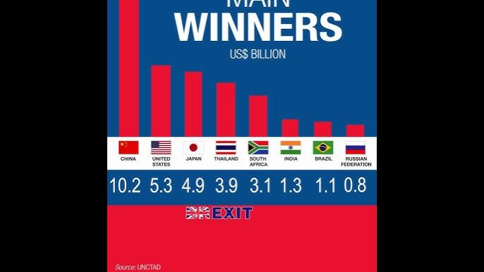

## Table of Contents

## What is Brexit and when did it occur?

Brexit is the name for the United Kingdom leaving the European Union. It happened because many people in the UK voted in a special vote called a referendum in 2016. They wanted the UK to have its own rules and not follow the EU's rules anymore. The vote was very close, but more people voted to leave than to stay.

The actual leaving happened on January 31, 2020. After that, there was a time called the transition period where the UK and EU worked out new rules for things like trade and travel. This transition period ended on December 31, 2020. Since then, the UK has been making its own laws and dealing with the EU as a separate country.

## What are the main components of the Brexit deal?

The Brexit deal has several important parts. One big part is about trade. The UK and EU agreed to not put taxes on each other's goods. This means that things like cars and food can move between the UK and EU without extra costs. They also made rules to check that these goods meet safety and quality standards. Another part is about fishing. The UK and EU decided how much fish each can catch in each other's waters. This was a big deal because many people in the UK rely on fishing for their jobs.

Another key part of the deal is about how people can move between the UK and EU. The deal says that UK citizens can visit the EU for short trips without needing a visa, and the same goes for EU citizens visiting the UK. But, living and working in each other's countries is now harder. The deal also covers things like security and how the UK and EU will work together to keep people safe. They agreed to share information and help each other fight crime and terrorism.

The last main part is about Northern Ireland. This part of the UK shares a border with Ireland, which is in the EU. The deal makes sure there are no physical checks at this border, which is important for peace. Instead, some checks happen at ports and airports. This part of the deal has been tricky and caused some disagreements, but it's meant to keep things smooth between Northern Ireland and Ireland.

## Who are considered the winners of the Brexit deal?

Some people think the UK won with the Brexit deal. They wanted the UK to make its own rules and not follow the EU's rules anymore. They believe the UK can now make better trade deals with other countries. Also, some people in the UK feel happier because they voted for Brexit and their wish came true. They think the UK can now control its own borders better and decide who can come to live and work there.

Others say the EU won. The EU kept most of its rules and didn't have to change much. The EU also got to keep some control over trade with the UK, especially with Northern Ireland. Some people think the EU got a better deal because the UK had to agree to many things to keep trade going smoothly. The EU also showed other countries that leaving the EU can be hard, which might stop others from wanting to leave too.

It's hard to say who really won because different people have different ideas about what winning means. Some businesses in the UK might feel they lost because it's harder to trade with the EU now. But some people in the UK feel they won because they got what they wanted, even if it's hard. In the end, both the UK and EU had to make some compromises, so it's a bit of a mixed result.

## Who are considered the losers of the Brexit deal?

Some people think the UK lost with the Brexit deal. They wanted the UK to keep all the good things about being in the EU, like easy trade and freedom to live and work in EU countries. But now, it's harder for UK businesses to sell things to the EU because of new rules and checks. Also, UK citizens can't move to EU countries as easily as before. Many people feel that the UK didn't get as good a deal as they hoped, and it's caused problems like slower economic growth and more paperwork for businesses.

Others believe the EU lost too. Even though the EU kept most of its rules, it lost a big member that paid a lot of money and bought a lot of things from other EU countries. Some businesses in the EU now find it harder to sell things to the UK because of the new rules. The EU also had to make some compromises, especially about Northern Ireland, which some people in the EU are not happy about. So, even though the EU might have kept more control, it also faced some losses and had to adjust to the new situation.

## How has Brexit affected the UK's economy?

Brexit has made things harder for the UK's economy. Before Brexit, the UK could easily trade with the EU without any extra costs or checks. Now, there are new rules and checks that make it harder and more expensive for UK businesses to sell things to the EU. This has slowed down the UK's economy because businesses are not making as much money as before. Some companies have even moved to the EU to avoid these problems. Also, the uncertainty about Brexit made businesses less willing to invest in the UK, which hurt economic growth.

On the other hand, the UK government says that Brexit gives them a chance to make new trade deals with other countries. They hope these new deals will help the economy grow in the future. But so far, the effects of these new deals are not clear, and many people think the short-term problems are bigger than the long-term benefits. Overall, most experts agree that Brexit has made the UK's economy weaker, at least for now.

## What impact has Brexit had on trade between the UK and EU?

Brexit has made trade between the UK and EU harder. Before Brexit, the UK could easily send and receive goods from the EU without any extra costs or checks. Now, there are new rules and checks that make it more expensive and slower for UK businesses to trade with the EU. This means that things like cars, food, and other products take longer to move between the UK and EU, and it costs more money. Some businesses have even moved to the EU to avoid these problems.

Even though the UK and EU agreed not to put taxes on each other's goods, the new rules still make trade more difficult. For example, businesses now have to fill out more paperwork and wait longer at borders. This has made some UK companies less willing to trade with the EU, and it has hurt the UK's economy. The UK government hopes to make new trade deals with other countries to help the economy, but so far, the problems with EU trade are bigger than the benefits from these new deals.

## How have immigration policies changed post-Brexit?

After Brexit, the UK changed its immigration rules. Before, UK citizens could live and work in any EU country easily, and EU citizens could do the same in the UK. Now, it's harder. UK citizens need to apply for visas to live and work in the EU, and EU citizens need to do the same to live and work in the UK. This has made moving between the UK and EU more complicated and sometimes more expensive.

The UK also introduced a new points-based immigration system. This system looks at things like a person's skills, job offer, and language ability to decide if they can come to the UK. It's not just for EU citizens; it applies to everyone from outside the UK. This change means the UK can control who comes to live and work there more than before, but it also means fewer people might want to move to the UK because of the new rules.

## What are the long-term economic forecasts for the UK following Brexit?

Many experts think that Brexit will make the UK's economy weaker in the long run. They say that because it's harder to trade with the EU now, UK businesses will make less money. This could mean fewer jobs and slower growth for the UK. Also, the new immigration rules might make it harder for businesses to find the workers they need. Some people worry that the UK might not be as rich or strong as it could have been if it stayed in the EU.

On the other hand, the UK government hopes that Brexit will help the economy in the long run. They think that by making new trade deals with countries outside the EU, the UK can find new ways to grow. They also believe that having more control over their own rules will help businesses in the UK. But it's hard to know for sure what will happen because it depends on many things, like how well the new trade deals work and how the world economy changes.

## How has Brexit influenced the political landscape within the UK?

Brexit has changed politics in the UK a lot. It made people argue and split into different groups. Some people wanted to leave the EU and some wanted to stay. This made the two big parties, the Conservatives and Labour, have fights inside their own groups. The Conservative Party, which was in charge when Brexit happened, had a hard time because some members wanted to leave the EU quickly and others wanted to take more time. This caused a lot of changes in who was leading the party and the country. The Labour Party also had problems because some members wanted to stay in the EU and others thought they should respect the vote to leave.

Brexit also made new political parties and groups come up. The Brexit Party, which later became Reform UK, got a lot of attention because they wanted a quick and clear [exit](/wiki/exit-strategy) from the EU. This showed that many people felt strongly about Brexit and wanted a party that focused on it. Also, in Scotland, more people started wanting to leave the UK and become their own country because they voted to stay in the EU. This made the Scottish National Party (SNP) stronger. So, Brexit has made the UK's politics more complicated and divided, with new parties and more arguments about what should happen next.

## What are the implications of Brexit for the financial services sector?

Brexit has made things harder for the financial services sector in the UK. Before Brexit, the UK could easily sell financial services like banking and insurance to the EU without any extra rules or costs. Now, there are new rules that make it harder for UK financial companies to do business in the EU. This means some companies have had to move parts of their business to the EU to keep selling their services there. This has made the UK's financial services sector weaker because it's lost some business and jobs.

On the other hand, the UK government hopes that Brexit will help the financial services sector in the long run. They think that by making new trade deals with countries outside the EU, the UK can find new ways to grow its financial services. They also believe that having more control over their own rules will help UK financial companies. But it's hard to know for sure what will happen because it depends on many things, like how well the new trade deals work and how the world economy changes.

## How has Brexit affected the regulatory environment for businesses in the UK?

Brexit has changed the rules that businesses in the UK have to follow. Before Brexit, the UK had to follow the same rules as the EU for things like safety, the environment, and workers' rights. Now, the UK can make its own rules. This means businesses might have to follow different rules than before, which can be confusing and take time to get used to. Some businesses might like this because they think the UK can make better rules for them. But others might find it harder because they have to deal with two sets of rules when they want to sell things to the EU.

The new rules also affect how businesses trade with the EU. Before Brexit, businesses could easily move goods between the UK and EU without extra checks or costs. Now, there are new checks and paperwork that make it harder and more expensive. This can make it harder for UK businesses to sell things to the EU. The UK government hopes that making its own rules will help businesses in the long run, but right now, many businesses are finding it hard to adjust to the new situation.

## What are the potential future scenarios for UK-EU relations post-Brexit?

After Brexit, the UK and EU could become closer friends again. They might make new deals to work together on things like trade, security, and the environment. If they do this, it could be easier for businesses to sell things between the UK and EU, and people might be able to move between the countries more easily. But this would mean both sides would have to agree to follow some rules together, which could be hard because they have different ideas about what they want.

Another way things could go is that the UK and EU might stay separate and not work together as much. The UK could make more deals with other countries around the world, and the EU might focus on its own members. This could make it harder for UK businesses to sell things to the EU, and it might be harder for people to move between the UK and EU. But the UK might feel more free to make its own rules and do things its own way.

It's hard to know which way things will go because it depends on many things, like who is in charge in the UK and EU, and what people in both places want. But no matter what happens, the UK and EU will always be neighbors and will have to find a way to get along.

## References & Further Reading

[1]: Sampson, T. (2017). ["Brexit: The Economics of International Disintegration."](https://www.aeaweb.org/articles?id=10.1257/jep.31.4.163) Journal of Economic Perspectives, 31(4), 163-184.

[2]: Dhingra, S., Huang, H., Ottaviano, G., Paulo Pessoa, J., Sampson, T., & Van Reenen, J. (2017). ["The Costs and Benefits of Leaving the EU: Trade Effects."](https://academic.oup.com/economicpolicy/article-abstract/32/92/651/4459728) Economic Journal, 127(603), 155-176.

[3]: Lopez de Prado, M. (2018). ["Advances in Financial Machine Learning."](https://www.amazon.com/Advances-Financial-Machine-Learning-Marcos/dp/1119482089) Wiley.

[4]: Patel, S.A. (2019). ["Brexit and Financial Services: Navigating the Uncertainty."](https://assets.ey.com/content/dam/ey-sites/ey-com/en_gl/topics/emeia-financial-services/ey-brexit-and-financial-services-navigating-the-negotiations-september-2018.pdf?download) Journal of Financial Services Research, 55(1), 1-18.

[5]: Jansen, S. (2020). ["Machine Learning for Algorithmic Trading: Predictive Models to Extract Signals from Market and Alternative Data."](https://www.amazon.com/Machine-Learning-Algorithmic-Trading-alternative/dp/1839217715) Packt Publishing.

[6]: HM Government (2020). ["The UK-EU Trade and Cooperation Agreement: Summary Explainer."](https://commonslibrary.parliament.uk/research-briefings/cbp-9106-2/) Government of the United Kingdom.