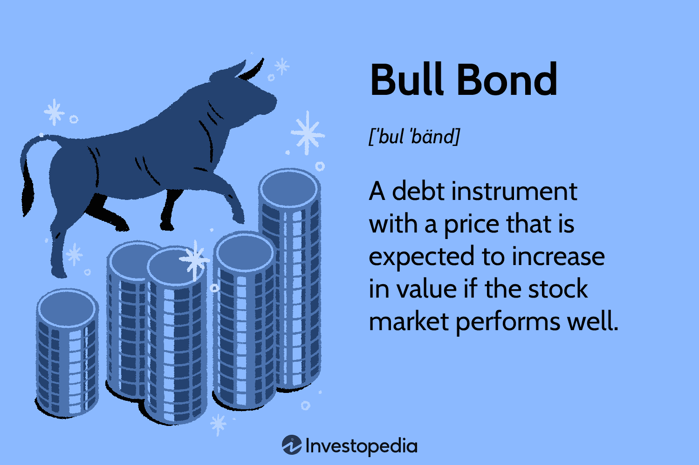

In the dynamic world of finance, understanding market trends and investment vehicles is critical for making informed decisions. Financial markets are continuously evolving, driven by various economic indicators, technological advancements, and policy changes. Investors and traders striving for success must achieve a keen awareness of these dynamics to effectively navigate the complexities of the market.

Bull markets stand out as periods characterized by rising asset prices and investor optimism, offering unique investment opportunities and challenges. These periods can lead to significant wealth creation, but also require strategic acumen to manage potential risks effectively. Understanding the impact of a bull market on different investment assets, such as stocks and bonds, is crucial for establishing balanced portfolios and optimizing returns.



Stocks typically benefit from the buoyancy of a bull market due to rising investor confidence and favorable economic conditions. As stock prices rise, they attract more investments, often leading to a decrease in the appeal of bonds. However, the relationship between stocks and bonds during bull markets is influenced by factors such as interest rates and inflation, adding complexity to investment decisions.

Algorithmic trading has emerged as a transformative tool in modern financial markets, particularly during bull markets where rapid price movements offer lucrative opportunities. By deploying pre-designed algorithms, investors can execute trades at optimal times, enhancing market efficiency and capitalizing on favorable trends. This approach allows for the rapid processing of vast amounts of market data, facilitating informed decision-making in real-time and adjusting swiftly to changes in market conditions.

This article explores how these elements interact and influence each other, providing insights for investors and traders. By understanding the intricacies of bull markets, the interplay between different asset classes, and the role of algorithmic trading, investors can develop strategies to maximize their returns while effectively managing risks. The aim is to equip readers with knowledge about maximizing opportunities during bull market phases and utilizing algorithmic trading to enhance investment strategies, thereby enabling a proactive and informed approach to investing.

## Table of Contents

## Understanding Bull Markets

A bull market is defined by a sustained period of rising prices in financial markets, often fueled by optimism and investor confidence. This optimism is typically driven by positive economic indicators such as Gross Domestic Product (GDP) growth, reduced unemployment rates, and elevated levels of consumer confidence. These indicators, when aligned, create a conducive environment for rising asset prices, drawing more investors into the market.

Historically, bull markets have occurred following periods of economic recovery or expansion. For instance, the post-World War II bull market in the United States saw significant economic growth and technological advancements. More recently, the bull market following the 2008 financial crisis was characterized by rapid technological innovation, particularly in the information technology sector, alongside supportive monetary policies such as quantitative easing.

Current trends in bull markets are increasingly influenced by digital advancements and government fiscal policies designed to buoy economies during unstable times. Technology plays a crucial role in shaping these trends, as advancements in [artificial intelligence](/wiki/ai-artificial-intelligence), automation, and data analytics offer new tools for market participants to assess and react to market conditions more accurately. Furthermore, fiscal policies aimed at maintaining low-interest rates and ensuring [liquidity](/wiki/liquidity-risk-premium) in the market serve to encourage investment and support continued economic growth.

Overall, understanding the dynamics of bull markets involves recognizing the interplay between economic indicators and technological as well as policy developments, which collectively drive investor sentiment and market performance.

## The Relationship Between Stocks and Bonds in a Bull Market

In theory, as stock prices rise during a bull market, investor enthusiasm typically shifts focus from bonds to equities. This occurs because stocks generally offer higher potential returns compared to the relatively stable but lower returns provided by bonds. As a result, bond prices tend to decrease, given the reduced demand. However, the relationship between stocks and bonds is far from straightforward and is heavily influenced by factors like interest rates and inflation.

Interest rates play a critical role in the dynamics between stocks and bonds. When interest rates rise, newly issued bonds offer higher yields, making them more attractive to investors. This effect can balance or even counteract the shift from bonds to stocks, as bonds' higher yields can entice investors back into the bond market. Conversely, when interest rates fall, existing bonds with higher locked-in rates become more attractive, potentially mitigating the expected outflow to equities.

Inflation is another pivotal [factor](/wiki/factor-investing) affecting the stocks and bonds relationship during a bull market. Rising inflation typically leads to higher interest rates, which can dampen stock market enthusiasm due to increased borrowing costs for companies. This scenario might make bonds more appealing as protection against inflationary pressures, given their fixed income nature that adjusts with changing interest rates.

Understanding these complex interdependencies is crucial for investors aiming to construct a balanced portfolio in a bull market. By assessing [interest rate](/wiki/interest-rate-trading-strategies) trends and inflation forecasts, investors can strategically allocate their assets between stocks and bonds to optimize returns while managing risk. For example, during periods of low interest rates and minimal inflation, investors might lean more heavily towards stocks. Conversely, in high-interest, inflationary environments, they might increase their allocation to bonds to capitalize on higher yields.

In essence, the interplay between stocks and bonds during a bull market is dictated by macroeconomic variables such as interest rates and inflation, necessitating that investors remain vigilant and responsive to these changes. An informed approach to asset allocation, considering these dynamics, facilitates the development of robust investment strategies designed to thrive in a volatile market landscape.

## Algorithmic Trading in Bull Markets

Algorithmic trading is a sophisticated trading strategy that utilizes pre-written algorithms to execute trades with precision, speed, and efficiency. These algorithms can process vast amounts of market data in real-time, enabling traders to make decisions based on statistical analysis and predefined criteria. In bull markets, where asset prices are generally rising, [algorithmic trading](/wiki/algorithmic-trading) becomes particularly advantageous due to the increased market activity and potential for rapid price changes.

One of the core benefits of algorithmic trading in a bull market is its ability to capitalize on the fast-paced dynamics. Bull markets are often characterized by higher [volatility](/wiki/volatility-trading-strategies) and liquidity, providing opportunities for algorithmic systems to identify and exploit short-term price movements. Algorithms can automatically execute buy and sell orders at optimal times, minimizing the impact of human emotions such as fear or greed that may disrupt manual trading processes.

The efficiency of algorithmic trading is further enhanced by its capability to adapt quickly to market changes. Algorithms can be designed to modify trading strategies based on evolving market conditions, ensuring continuous alignment with broader market trends. This adaptability is crucial in bull markets, where swift changes can occur due to factors such as economic announcements, policy shifts, or technological advancements.

Moreover, algorithmic trading can improve market efficiency by narrowing the bid-ask spread and increasing trading volumes. As algorithms facilitate faster transactions, they contribute to more fluid market conditions, which can benefit all investors by enhancing the overall trading environment. This liquidity provision, in turn, supports price discovery and reduces the execution costs associated with large trades.

In Python, a simple algorithmic trading example could look like the following:

```python
import numpy as np
import pandas as pd

# Simulated market data with random numbers for demonstration purposes
np.random.seed(42)
market_data = pd.DataFrame({
    'price': np.random.normal(100, 10, 1000)
})

def simple_moving_average(data, window_size):
    return data.rolling(window=window_size).mean()

# Parameters for trading strategy
short_window = 40
long_window = 100

# Calculate moving averages
market_data['short_mavg'] = simple_moving_average(market_data['price'], short_window)
market_data['long_mavg'] = simple_moving_average(market_data['price'], long_window)

# Trading signals
market_data['signal'] = 0
market_data['signal'][short_window:] = np.where(market_data['short_mavg'][short_window:] > market_data['long_mavg'][short_window:], 1, 0)
market_data['positions'] = market_data['signal'].diff()

print(market_data[['price', 'short_mavg', 'long_mavg', 'signal', 'positions']].tail())
```

This code represents a simple moving average crossover strategy where buy and sell signals are generated based on the crossing of short and long moving averages. Such straightforward strategies can be a starting point for more complex algorithms tailored to specific market conditions, like those observed during bull markets.

Algorithmic trading has become an essential tool for traders aiming to navigate bull markets effectively. Its ability to rapidly analyze data, adjust to market changes, and execute trades without emotional interference places it at the forefront of modern trading practices.

## Investment Strategies Using Algo Trading

Algorithmic trading involves the use of computer algorithms to execute trades with high speed and precision, based on predetermined criteria. This approach has revolutionized trading by permitting the analysis and processing of vast amounts of data in real time. Here, we explore some of the primary strategies employed in algorithmic trading, especially relevant during bull markets, which are characterized by rising asset prices and increased trading activity.

### Statistical Arbitrage

Statistical [arbitrage](/wiki/arbitrage) is a market-neutral strategy aiming to profit from the statistical mispricing of assets. In simple terms, it involves analyzing time series data to identify price divergences between correlated asset pairs. By leveraging historical data and statistical models, algorithms can predict expected price movements and capitalize on temporary inefficiencies. For example, when the price of a stock deviates from its expected value compared to an index, an algorithm may execute trades to exploit this discrepancy. Python libraries such as NumPy and pandas are often employed to handle and analyze the necessary data efficiently.

### High-Frequency Trading (HFT)

High-frequency trading is a form of algorithmic trading characterized by extremely high speed, employing sophisticated algorithms to execute a large number of orders in fractions of a second. [HFT](/wiki/high-frequency-trading-strategies) strategies often focus on exploiting small price discrepancies across various markets or securities. The speed of execution is critical, and firms often utilize co-location services to place their servers close to exchange servers, minimizing latency. The following Python code demonstrates a simplistic model for an HFT strategy that monitors bid-ask spreads:

```python
import numpy as np

# Simulated bid-ask data
bid_prices = np.array([100.05, 100.06, 100.05, 100.07])
ask_prices = np.array([100.10, 100.11, 100.09, 100.12])

# Calculating bid-ask spreads
spreads = ask_prices - bid_prices

# Assuming a decision threshold
threshold = 0.03

# Execute trades if spread is below threshold
trades = spreads < threshold
```

### Market Making

Market making involves providing liquidity to the markets by simultaneously posting buy and sell orders for a particular asset. Market makers earn the bid-ask spread, deploying algorithms to adjust bids and offers based on ongoing market conditions and inventory levels. Algorithms continuously evaluate the trade-off between profit margins and the associated risk of holding assets, ensuring that they can respond dynamically to market changes.

### Implementation of Algorithmic Strategies

Algorithms, by handling extensive datasets, enable precise trade execution based on real-time data, essential for the above strategies. These algorithms are engineered to quickly process information, assess risk, and adapt to market conditions, making them invaluable in leveraging bull market potential. Advanced [machine learning](/wiki/machine-learning) algorithms further enhance this capability by recognizing patterns and learning from historical data to make informed predictions.

The synergy between algorithmic trading and technology facilitates efficient risk management and enhances trading performance. However, due to the inherent complexity and potential for rapid market shifts, traders must remain vigilant about the risks involved, such as algorithmic errors or unexpected market events that can lead to substantial losses. It remains imperative for investors and traders to continuously refine these strategies, adapting to new data and evolving market conditions to optimize their outcomes.

## Opportunities and Risks in a Bull Market

Bull markets present considerable profit opportunities as they are marked by rising stock valuations. This upward trend often results from increased investor confidence, robust economic indicators, and favorable market conditions. During a bull market, companies typically experience strong earnings growth, leading to higher stock prices and investment returns for shareholders. The psychological aspect also plays a role, with investors driven by the fear of missing out, further propelling stock prices upward.

Despite the attractive returns, bull markets are not devoid of risks. A significant concern is the potential for market corrections. A correction is defined as a decline of at least 10% from recent highs, and it can occur with little warning. Such corrections can arise from unexpected economic data, geopolitical events, or shifts in investor sentiment. The heightened volatility during these periods necessitates caution as rapid price fluctuations can lead to substantial losses.

In a bull market, some sectors might exhibit inflated valuations as investor enthusiasm can push prices beyond intrinsic value. This overvaluation increases the risk of sharp price declines if the market sentiment changes. Additionally, bull markets may encourage speculative behavior, with investors increasingly engaging in riskier investments hoping for higher returns. This behavior can amplify market volatility and exacerbate declines during downturns.

Strategic risk management practices become essential to balance these opportunities and risks. Diversifying investments across different asset classes can mitigate the risk of significant losses due to sudden market shifts. Implementing stop-loss orders and utilizing hedging strategies, such as options and futures contracts, can also help manage downside risk. Maintaining a disciplined investment approach and regularly reviewing and adjusting portfolios in response to market changes ensures that investors can capitalize on the benefits of a bull market while safeguarding against potential pitfalls.

## Conclusion

Navigating bull markets requires a comprehensive understanding of the interdependent dynamics between stocks, bonds, and algorithmic trading. This intricate relationship plays a pivotal role in shaping investment strategies aimed at maximizing returns. Algorithmic trading, characterized by the use of computer algorithms to execute trades, provides investors with the ability to adapt swiftly to rapid market shifts. This technology enables precise timing of trade execution, thereby enhancing potential returns during bullish phases.

An investor’s capacity to effectively leverage algorithmic trading is contingent on their comprehension of market dynamics. By analyzing trends and employing data-driven insights, investors can identify optimal entry and [exit](/wiki/exit-strategy) points, which are crucial for capitalizing on upward market trajectories. Furthermore, a proactive and informed approach not only enhances profit potential but also facilitates efficient risk management—a critical component in safeguarding investments against sudden market corrections or volatility spikes.

In essence, the intersection of algorithmic trading and an astute understanding of market forces equips investors with the tools needed to thrive in bull markets. By integrating strategic foresight with technological capabilities, investors are better positioned to harness bullish trends while maintaining a resilient stance against inherent risks.

## References & Further Reading

For further insights, readers can explore a rich array of resources on trading strategies, market trends, and finance technology. Scholarly articles and [books](/wiki/algo-trading-books) provide valuable historical context, discussing how past bull markets have unfolded and their long-term impacts. Websites like Investopedia offer comprehensive guides on investment vehicles, trading techniques, and economic indicators crucial for understanding market dynamics.

For those interested in algorithmic trading, "Algorithmic Trading: Winning Strategies and Their Rationale" by Ernie Chan is a highly recommended read. It covers various quantitative strategies used in algorithmic trading and their practical applications. Moreover, the work of authors like Andreas F. Clenow in "Stocks on the Move" presents adaptable trading strategies designed for algorithmic frameworks, specifically targeting trend-following methods.

Online platforms like Coursera and edX host courses on quantitative finance and algorithmic trading, offering foundational knowledge to both beginners and seasoned investors. Understanding programming languages such as Python—widely used for developing trading bots and executing algorithms efficiently—can be enhanced through resources like "Python for Finance" by Yves Hilpisch, which investigates into the implementation of financial algorithms.

To stay updated on market trends and technological advancements, the financial sections of news outlets such as Bloomberg, Financial Times, and The Wall Street Journal provide in-depth analysis on current financial markets' shifts. They often include expert opinions that give insight into the latest trends and their potential implications.

Engaging with online forums and communities, such as those on Reddit or Stack Exchange, can also provide real-time discussions and diverse perspectives on current investment strategies and market conditions. These platforms allow for the exchange of ideas and experiences, which can be invaluable in applying theoretical knowledge to practical scenarios.

By leveraging these resources, readers can deepen their understanding of the investment landscape, equipping themselves with the knowledge necessary to navigate and capitalize on both current and future market conditions.

