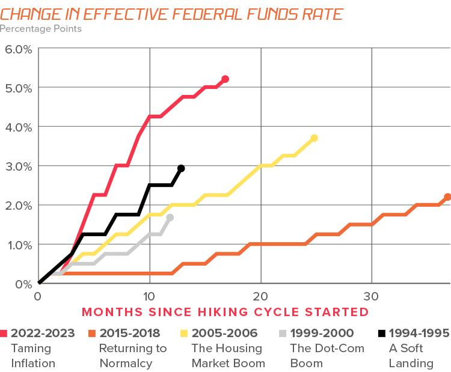

## Table of Contents

## What is a bull market?

A bull market is a time when the prices of things like stocks and other investments go up a lot over a long period. It's called a bull market because it's like a bull charging forward with strength and energy. During a bull market, people feel good about the economy and are more likely to buy stocks because they think the prices will keep going up.

In a bull market, companies usually do well and make more money. This makes their stock prices go up even more. People who invest in the stock market during a bull market can make a lot of money if they buy stocks early and sell them when the prices are high. But it's important to remember that bull markets don't last forever, and they can be followed by times when the market goes down.

## What are bonds and how do they work?

Bonds are like loans that you give to a company or the government. When you buy a bond, you're lending them money, and in return, they promise to pay you back the money you lent them, plus a little extra, over a certain period of time. This extra money is called interest, and it's how the company or government thanks you for lending them money.

The way bonds work is pretty simple. Let's say you buy a bond for $1,000 that pays 5% interest every year. That means every year, you'll get $50 from the company or government until the bond reaches its end date, which could be 10 or 20 years later. When the bond matures, they give you back your $1,000. Bonds are seen as safer investments than stocks because you know exactly how much money you'll get back and when, but they usually don't grow as fast as stocks might.

## How do bull markets generally affect the economy?

Bull markets usually make the economy stronger. When people see that stock prices are going up, they feel more confident about the future. They might spend more money on things like cars, houses, and vacations because they think their investments are doing well. This extra spending helps businesses grow and hire more people, which means more jobs and more money moving around in the economy.

But bull markets can also lead to some problems. Sometimes, people get too excited and start taking big risks with their money, hoping to make even more. This can create bubbles, where prices get too high and don't match what things are really worth. If the bubble bursts, it can lead to a big drop in the market and hurt the economy. So while bull markets can be good for growth, they need to be watched carefully to make sure they don't get out of hand.

## What is the relationship between stock markets and bond markets?

The stock market and the bond market are two big parts of the financial world, and they often affect each other. When the stock market is doing well, like during a bull market, people might feel more confident and want to invest more in stocks because they think they can make more money. This can make bond prices go down a bit because fewer people want to buy them. Bonds are seen as safer but they usually don't grow as fast as stocks, so when stocks are doing great, bonds can seem less exciting.

On the other hand, when the stock market is not doing so well, people might start looking for safer places to put their money. That's when they might turn to bonds. If a lot of people start buying bonds, the demand for them goes up, and so do their prices. This can make the bond market stronger while the stock market is struggling. So, the stock market and the bond market kind of move in opposite directions sometimes, depending on what's happening in the economy and how people feel about their investments.

## How do rising stock prices in a bull market influence investor behavior towards bonds?

When stock prices go up in a bull market, people often get excited and want to put more of their money into stocks. They see that stocks are doing well and think they can make more money by investing in them. Because of this, they might not be as interested in buying bonds. Bonds are seen as safe but they don't grow as fast as stocks. So, when stocks are doing great, bonds can seem boring and less attractive to investors.

This change in behavior can make bond prices go down a bit. If fewer people want to buy bonds, their demand goes down, and so do their prices. But even though bond prices might drop, they can still be important for people who want to keep their money safe. Bonds give a steady return and can help balance out the risk of having a lot of money in stocks. So, even in a bull market, some investors might still choose to keep some of their money in bonds to be on the safe side.

## What happens to bond yields during a bull market?

During a bull market, when stock prices are going up a lot, people often want to invest more in stocks than in bonds. This means fewer people are buying bonds, so the demand for them goes down. When the demand for bonds goes down, their prices also go down. But here's the important part: when bond prices go down, their yields, or the interest they pay, go up. This is because the interest payment stays the same, but it's a bigger part of a smaller bond price.

So, in a bull market, bond yields usually go up because bond prices go down. This can make bonds look more attractive to some investors who are looking for higher returns. But most people are still more excited about stocks during a bull market, so they might not pay much attention to the higher bond yields. It's all about what investors feel is the best place to put their money at that time.

## How does inflation, often associated with bull markets, impact bond prices?

Inflation means that the prices of things go up over time. When there's a lot of inflation, the money you get from bonds might not be worth as much in the future. This is because the interest payments from bonds stay the same, but if everything else costs more, that money doesn't go as far. So, when people expect a lot of inflation, they might not want to buy bonds as much, and this can make bond prices go down.

In a bull market, inflation can be more common because the economy is doing well and people are spending more money. When bond prices go down because of inflation, the yields, or the interest rates, go up. This is because the same amount of interest is now a bigger part of a smaller bond price. But even with higher yields, if people think inflation will keep going up, they might still choose to invest in other things that they think will grow faster than inflation.

## Can you explain the concept of interest rate risk in the context of bull markets?

Interest rate risk is about how changes in interest rates can affect the value of bonds. When interest rates go up, the prices of existing bonds usually go down. This happens because new bonds that are issued will have higher interest rates, making the older bonds with lower rates less attractive to investors. In a bull market, if the economy is doing really well, the central bank might raise interest rates to slow things down a bit and keep inflation in check. This can make bond prices drop, which is a problem for people who own bonds.

In a bull market, people often feel good about the economy and might not worry too much about [interest rate](/wiki/interest-rate-trading-strategies) risk. They might be more focused on the rising stock prices and the good times. But if interest rates do go up, it can still hurt bond investors. They might see the value of their bonds go down, and if they need to sell their bonds before they mature, they could lose money. So, even in a bull market, it's important for investors to think about interest rate risk and how it might affect their investments.

## How might a bull market affect different types of bonds, such as government bonds versus corporate bonds?

In a bull market, when the economy is doing well, government bonds might not be as popular. People often feel more confident and want to take more risks with their money, so they might choose to invest in stocks instead of safe government bonds. This means fewer people want to buy government bonds, which can make their prices go down. But government bonds are still seen as very safe, so if the bull market makes people worried about inflation or rising interest rates, some might still buy them to keep their money safe.

Corporate bonds can be a bit different. These bonds are from companies, and they usually offer higher interest rates than government bonds because they can be riskier. In a bull market, when companies are doing well and making more money, people might feel more comfortable buying corporate bonds. The higher interest rates can look more attractive, especially if people think the companies will keep doing well. But if the bull market leads to higher interest rates, the prices of existing corporate bonds could also go down, just like with government bonds. So, it's important for investors to think about these risks when they're deciding where to put their money.

## What strategies can bond investors use to mitigate risks during a bull market?

During a bull market, bond investors can use a few strategies to keep their money safe. One good idea is to spread out their investments, or diversify. This means they don't put all their money in one type of bond. They might buy some government bonds, which are very safe, and some corporate bonds, which can offer higher returns but are riskier. By mixing different kinds of bonds, they can balance out the risks and still get some good returns.

Another strategy is to pay attention to the length of the bonds they buy. Bonds that last a long time, like 20 or 30 years, can lose more value if interest rates go up. So, during a bull market, investors might want to buy bonds that don't last as long, like 5 or 10 years. These shorter-term bonds are less affected by changes in interest rates, which can help protect their money.

Lastly, bond investors can also look into inflation-protected securities, like Treasury Inflation-Protected Securities (TIPS). These bonds adjust their interest payments based on inflation, so if prices go up a lot during a bull market, the bond's value won't go down as much. This can be a smart way to keep their money safe from the effects of inflation.

## How do central bank policies during bull markets influence the bond market?

During a bull market, central banks often keep a close eye on the economy to make sure it doesn't grow too fast. If the economy is doing really well and people are spending a lot of money, the central bank might decide to raise interest rates. This is to slow things down a bit and keep inflation from getting out of control. When interest rates go up, the prices of existing bonds usually go down because new bonds will have higher interest rates, making the old ones less attractive. So, central bank policies can make bond prices drop during a bull market.

But central banks also have other tools they can use. Sometimes, they might keep interest rates low to keep the good times going and help the economy grow even more. This can make bonds look more attractive because their prices stay high and their yields, or interest payments, stay low. It all depends on what the central bank thinks is best for the economy at that time. So, their policies can have a big impact on how bond investors act during a bull market.

## What historical examples illustrate the impact of bull markets on bonds?

In the late 1990s, during the dot-com bull market, stock prices went way up because of excitement about internet companies. People wanted to invest in these new tech companies and thought they could make a lot of money. Because of this, fewer people were interested in buying bonds. Bond prices went down, and their yields, or the interest they paid, went up. But even with higher yields, most people were still more excited about stocks. This shows how a strong bull market can make bonds less popular.

Another example is the bull market that started after the 2008 financial crisis and lasted until early 2020. During this time, the economy was getting better, and stock prices were going up. The Federal Reserve, which is like the central bank in the U.S., kept interest rates low to help the economy grow. This made bonds more attractive because their prices stayed high and their yields were low. But as the economy got stronger, the Federal Reserve started to raise interest rates a bit. This made bond prices go down because new bonds had higher interest rates. So, even in a bull market, central bank actions can affect how well bonds do.

## References & Further Reading

For further insights, readers can explore a rich array of resources on trading strategies, market trends, and finance technology. Scholarly articles and [books](/wiki/algo-trading-books) provide valuable historical context, discussing how past bull markets have unfolded and their long-term impacts. Websites like Investopedia offer comprehensive guides on investment vehicles, trading techniques, and economic indicators crucial for understanding market dynamics.

For those interested in [algorithmic trading](/wiki/algorithmic-trading), "Algorithmic Trading: Winning Strategies and Their Rationale" by Ernie Chan is a highly recommended read. It covers various quantitative strategies used in algorithmic trading and their practical applications. Moreover, the work of authors like Andreas F. Clenow in "Stocks on the Move" presents adaptable trading strategies designed for algorithmic frameworks, specifically targeting trend-following methods.

Online platforms like Coursera and edX host courses on quantitative finance and algorithmic trading, offering foundational knowledge to both beginners and seasoned investors. Understanding programming languages such as Python—widely used for developing trading bots and executing algorithms efficiently—can be enhanced through resources like "Python for Finance" by Yves Hilpisch, which investigates into the implementation of financial algorithms.

To stay updated on market trends and technological advancements, the financial sections of news outlets such as Bloomberg, Financial Times, and The Wall Street Journal provide in-depth analysis on current financial markets' shifts. They often include expert opinions that give insight into the latest trends and their potential implications.

Engaging with online forums and communities, such as those on Reddit or Stack Exchange, can also provide real-time discussions and diverse perspectives on current investment strategies and market conditions. These platforms allow for the exchange of ideas and experiences, which can be invaluable in applying theoretical knowledge to practical scenarios.

By leveraging these resources, readers can deepen their understanding of the investment landscape, equipping themselves with the knowledge necessary to navigate and capitalize on both current and future market conditions.

