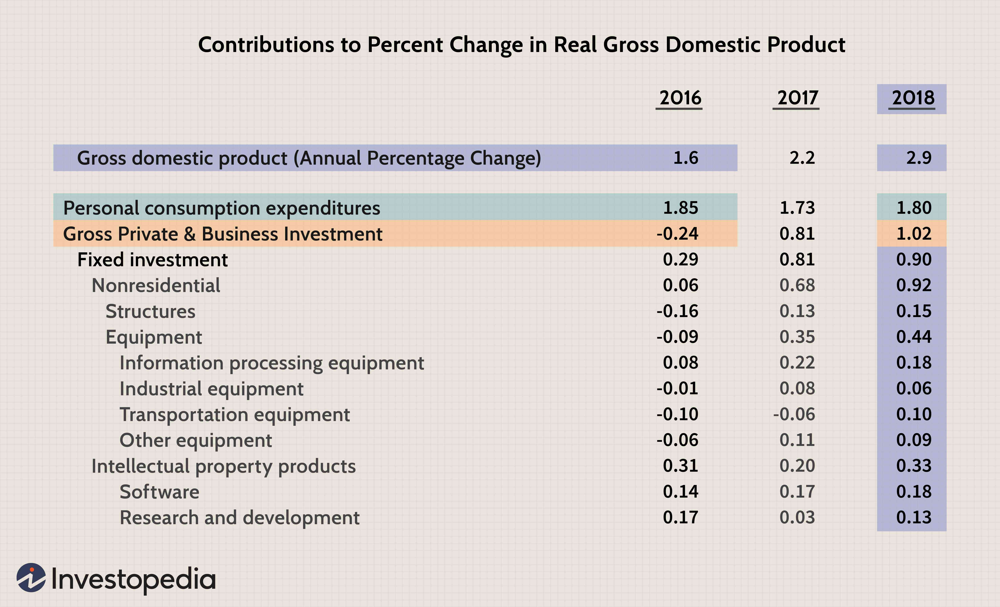

Economic growth and investment are intrinsically linked, each driving and influencing the other in significant ways. Economic growth represents an increase in the production and consumption of goods and services, reflecting enhancements in living standards. Investment, on the other hand, is the allocation of resources, typically financial, with the expectation of future returns. Together, these elements form a dynamic interplay crucial for the prosperity of nations.

Capital investment is the cornerstone of this relationship, involving expenditure on physical goods and infrastructure that contribute to productive capacities. Investments in machinery, technology, and facilities improve efficiency and productivity within the economy, leading to increased output and economic growth. For instance, investments in technology not only enhance production capabilities but also stimulate innovation, creating new sectors and job opportunities.

In recent years, algorithmic trading has emerged as a transformative force within modern finance, influencing investment strategies and the broader economic landscape. Algorithmic trading refers to the use of computer algorithms to execute trades at speeds and efficiencies beyond human capabilities. This technology harnesses large datasets and mathematical models to predict market movements and optimize trade outcomes, providing investors with advanced tools for maximizing returns.

This article explores the interplay between economic growth and investment, examining the role of different types of investments, including public, private, and foreign direct investment, in driving economic expansion. We consider how capital investments serve as catalysts for economic growth by boosting productivity and efficiency. The discussion extends to the rising impact of algorithmic trading on the investment landscape, highlighting its benefits and potential risks. Finally, we address future trends in investment and economic growth, contemplating the role of emerging technologies and the importance of policy frameworks that support sustainable advancements. Through this structure, we aim to elucidate the complex yet vital interaction between investment strategies and economic goals, underscoring the necessity for stakeholders to adopt forward-thinking and inclusive policies to ensure sustained economic progress.

## Table of Contents

## Understanding Economic Growth

Economic growth is a measure of the increase in a country's economic output over time, typically assessed by the increase in gross domestic product (GDP). It signifies the enhanced capacity of an economy to produce goods and services, leading to higher levels of income and improved standards of living. Economic growth is pivotal as it directly influences poverty reduction, employment opportunities, and the ability of a nation to invest in social infrastructure such as health and education.

Key drivers of economic growth include investment, technological advancement, labor force growth, and efficient allocation of resources. Investment is crucial as it leads to capital accumulation. By infusing financial resources into various sectors, investments drive productivity enhancements. For example, investments in infrastructure can reduce transportation and transaction costs, while investments in technology and education can significantly enhance workforce productivity.

Economic policies can foster growth by creating an environment conducive to business expansion and innovation. This includes maintaining macroeconomic stability, providing incentives for research and development, implementing fair trade policies, and ensuring robust legal and regulatory frameworks. Appropriate fiscal policies, such as tax incentives for entrepreneurs, and monetary policies that control inflation and interest rates, are vital for sustaining economic growth.

Various countries have demonstrated substantial economic growth through strategic investments. China, for example, experienced exponential growth in recent decades by investing heavily in industrialization and infrastructure development, becoming a global manufacturing hub. Similarly, South Korea's focus on technology and education fueled its rapid economic expansion, transforming it into a high-income economy within a few decades. Ireland is another example, having attracted foreign direct investment (FDI) through favorable tax policies and an open-market strategy, leading to a significant boost in its GDP.

These examples illustrate that with strategic investments and supportive economic policies, nations can harness their resources to achieve and sustain high levels of economic growth, thereby improving the quality of life for their populations.

## The Role of Investment in Economic Growth

Investments play a pivotal role in driving economic growth, acting through various channels such as public investment, private investment, and foreign direct investment (FDI). Each type of investment contributes uniquely to the development and expansion of an economy.

### Types of Investments

**Public Investment**: Public investment involves government expenditure on infrastructure, public services, and other sectors that may not have immediate lucrative returns but are crucial for long-term national development. For instance, investing in roads, bridges, and public transportation facilitates better connectivity and access to markets, thereby enhancing productivity and growth. 

**Private Investment**: This encompasses investment by private entities, such as corporations and individuals, in various sectors of the economy. Private investments often focus on sectors like technology, real estate, and energy, driven by the potential for profit and technological advancement. Innovations resulting from private investments often lead to increased efficiency and productivity, contributing to economic growth.

**Foreign Direct Investment (FDI)**: FDI involves cross-border investments where a foreign entity invests directly in the production or business of another country, either by establishing operations or acquiring tangible assets. FDI is a significant driver of economic globalization, often bringing not only capital but also technology, managerial skills, and jobs to the recipient country, fostering economic development.

### Contributions to Economic Growth

Investments in infrastructure, technology, and education significantly propel economic growth. Infrastructure development reduces logistics costs and time, making businesses more competitive. Technological investment drives innovation, leading to new products and processes that improve productivity. Investment in education enhances human capital, equipping the workforce with skills necessary for a dynamic economy.

The **economic multiplier effect** is a crucial concept that illustrates how investment triggers a chain reaction within the economy, whereby an initial injection of spending leads to a more than proportional increase in the national income. For example, infrastructure projects not only create immediate jobs in construction but also reduce costs and improve efficiencies for businesses over the long term, leading to further economic benefits.

### Case Studies

Several countries have experienced significant economic growth driven by strategic investments. For example:

- **China** has witnessed rapid economic growth over the past few decades, largely fueled by massive public investments in infrastructure and manufacturing capabilities. These investments attracted private sector growth, leading to technological advancements and an increase in productivity.

- **Ireland's Celtic Tiger** phase in the late 20th century was largely driven by significant FDI, primarily from U.S. technology firms, attracted by favorable tax policies and a skilled workforce. This investment brought not only capital but also knowledge transfer and employment, transforming the Irish economy.

- **Brazil's Proálcool Program** in the 1970s represents a successful public investment in sugarcane ethanol production to reduce dependence on foreign oil. This initiative spurred economic growth by creating jobs, stimulating agricultural productivity, and eventually leading to export capabilities in renewable energy.

These examples underscore how tailored investment strategies can lead to substantial economic progress, reinforcing the necessity for strategic planning and implementation of investment initiatives in driving long-term economic growth.

## Capital Investment: A Catalyst for Economic Expansion

Capital investment refers to the funds invested in a firm or enterprise for the purpose of furthering its business objectives. This includes investments in physical assets like machinery, buildings, and technology, which are essential for facilitating productive processes. The primary components of capital investment typically involve expenditure on new equipment, infrastructure improvements, and human capital development through training and education.

Capital investment plays a crucial role in enhancing productivity and efficiency within both businesses and the wider economy. By allocating resources to upgrade facilities and introduce advanced technologies, businesses can increase their output and reduce costs, leading to greater profitability. In macroeconomic terms, higher productivity driven by capital investment contributes to economic expansion by increasing the total output of goods and services available in the economy.

The lifecycle of capital investment in businesses and national economies generally follows a progression from initial planning and funding to execution and operational utilization. In the early stages, businesses develop investment strategies and secure the necessary funding, which may involve raising capital through equity or debt. Once the investment is executed, the assets are employed to achieve strategic goals, such as entering new markets or increasing production capacity. Over time, these investments are assessed for their returns and impact, guiding future investment decisions.

There are numerous real-world examples of successful capital investments that have markedly influenced economic outcomes. For instance, the development of Silicon Valley in the United States is a notable example where significant investment in technology infrastructure and human capital led to the establishment of a leading hub for innovation and entrepreneurship. Similarly, China's Belt and Road Initiative represents large-scale capital investment in infrastructure across Asia and Europe, aimed at boosting trade and economic integration. These cases underscore capital investment's pivotal role in spurring economic development and growth trajectories.

## Algorithmic Trading and Its Influence on the Investment Landscape

Algorithmic trading represents a significant advancement in the trading ecosystem, utilizing computer algorithms to automate the process of buying and selling financial instruments. Initially introduced in the 1970s, [algorithmic trading](/wiki/algorithmic-trading) has evolved due to technological advancements and the proliferation of electronic communication networks. These algorithms analyze various market factors, including price, timing, and [volume](/wiki/volume-trading-strategy), to execute orders at speeds and frequencies beyond human capability.

Algorithmic trading fundamentally reshapes investment strategies by offering traders the ability to implement complex strategies efficiently. It facilitates the execution of a high volume of trades with precision, minimizing human errors and emotional biases. Traders employ algorithmic strategies such as [market making](/wiki/market-making), [trend following](/wiki/trend-following), [arbitrage](/wiki/arbitrage), and [scalping](/wiki/gamma-scalping). Additionally, algorithmic trading enables the deployment of high-frequency trading ([HFT](/wiki/high-frequency-trading-strategies)) strategies, which leverage speed to capitalize on minute price discrepancies across markets.

The benefits of algorithmic trading extend to economic stability through enhanced [liquidity](/wiki/liquidity-risk-premium) and improved price discovery. By executing trades rapidly, algorithmic trading adds depth to markets, ensuring that volume is available when needed, thereby reducing [volatility](/wiki/volatility-trading-strategies). However, the high speed and automated nature of algorithmic trading also introduce risks. Flash crashes, as seen in the 2010 U.S. stock market, highlight the potential for algorithms to amplify market volatility. Regulatory bodies are continually challenged to ensure that safeguards are in place to mitigate systemic risks.

In terms of market efficiency, algorithmic trading contributes significantly by narrowing bid-ask spreads and facilitating arbitrage opportunities, thus ensuring that prices reflect available information promptly. This increased efficiency benefits all market participants by reducing transaction costs and enhancing the resilience of trading systems. By enabling continuous and dynamic interaction among various trading platforms, algorithmic trading fosters an interconnected financial network, optimizing the allocation of financial resources and supporting a robust investment landscape.

## Interconnection between Algorithmic Trading and Economic Growth

Algorithmic trading, a method of executing orders using pre-programmed trading instructions, significantly influences capital flows and investment patterns. It's characterized by high speed and the ability to analyze large sets of data in real-time, enhancing the efficiency of financial markets. 

Algorithmic trading facilitates more efficient capital flows by breaking down massive transactions into smaller orders, minimizing market impact and reducing transaction costs. This segmentation ensures that large trades do not drastically affect asset prices, thus stabilizing capital flows across various markets. For example, in high-frequency trading (HFT), algorithms execute trades in milliseconds, allowing traders to capitalize on small price discrepancies, thereby maintaining liquidity and enabling smoother investment flows.

Emerging markets stand to gain significantly from algorithmic trading. These markets often encounter liquidity constraints and volatile capital flows, which can be mitigated through the increased market participation enabled by algorithms. Algorithmic trading can create a more conducive environment for local and foreign investments, thus enhancing access to capital. For instance, the introduction of algorithmic trading in the Indian stock markets has led to increased liquidity and reduced transaction costs, making it more attractive to both local and international investors.

Technological advancements in algorithmic trading continue to drive economic innovation. Machine learning and [artificial intelligence](/wiki/ai-artificial-intelligence) enhance the predictive capabilities of trading algorithms, shifting investment patterns toward more data-driven decisions. This transition facilitates more dynamic allocation of resources, encouraging economic sectors poised for growth. Moreover, advancements such as blockchain and decentralized finance (DeFi) technologies are expected to further innovate trading mechanisms, potentially reshaping traditional financial systems.

Despite these benefits, algorithmic trading presents regulatory challenges and economic implications. The high speed and automated nature of these trades can exacerbate market volatility during periods of financial distress, as seen in the 2010 "Flash Crash." Regulators face difficulties in crafting policies that adequately mitigate risks without stifacing innovation. Furthermore, the dominance of algorithmic trading raises concerns about market accessibility for traditional traders, leading to discussions on fair trading practices.

To address such challenges, regulatory frameworks must evolve alongside technological advancements. Implementing measures like circuit breakers and ensuring transparency in algorithmic models can help maintain market stability and integrity. Continuous dialogue between regulators, financial institutions, and technology developers is crucial for aligning regulatory policies with the rapid pace of innovation in algorithmic trading.

In summary, the interconnection between algorithmic trading and economic growth is multifaceted, offering potential advantages for market efficiency and access to capital, particularly in emerging economies. However, the associated technological and regulatory challenges require careful consideration to fully harness these benefits while ensuring economic stability.

## Future Trends in Investment and Economic Growth

Predicted trends in global investment highlight a continued evolution toward technological integration and sustainability. Economic impacts of these trends are vast, with significant implications for both developed and emerging markets. The increasing reliance on data-driven decision-making sets the stage for a transformative shift in how investments are conducted and optimized.

Artificial intelligence (AI) and [machine learning](/wiki/machine-learning) (ML) are poised to play pivotal roles in future trading algorithms. These technologies enable more precise and adaptive trading strategies by analyzing vast datasets to uncover patterns and trends that might elude traditional analytical methods. For example, machine learning algorithms can evaluate historical market data to predict future stock prices, enhancing the efficacy of investment portfolios. Python, with its extensive libraries such as TensorFlow and scikit-learn, is often utilized for developing such advanced trading algorithms.

Aligning investments with sustainable economic growth presents both challenges and opportunities. On one hand, investors are increasingly prioritizing environmental, social, and governance ([ESG](/wiki/esg-investing)) criteria, recognizing their importance in achieving long-term value. This shift necessitates a reevaluation of investment strategies to integrate sustainability without compromising returns. On the other hand, there is the challenge of accurately measuring and reporting ESG performance, which requires standardized frameworks and transparency.

Policy frameworks play a critical role in fostering both economic growth and technological advancement. Governments are tasked with crafting regulations that encourage innovation while maintaining market stability and protecting investors. For instance, creating incentives for investment in renewable energy or technology startups can spur economic growth and technological progress. Simultaneously, there is a need to address potential risks associated with rapid technological changes, such as cybersecurity threats and job displacement due to automation.

In conclusion, the future of global investment is intricately tied to advancements in technology and sustainability considerations. Embracing AI and ML in trading strategies offers significant potential for enhancing market efficiency and investment returns. However, achieving sustainable economic growth will require careful balancing through supportive policy frameworks that encourage innovation and address emerging challenges. As stakeholders navigate these trends, future-oriented investment strategies that prioritize inclusivity and sustainability will be crucial for long-term prosperity.

## Conclusion

In conclusion, this article has explored the multifaceted relationship between economic growth and investment, emphasizing the necessity to balance investment strategies with broader economic goals. Investment, including both public and private sectors, acts as a critical driver of economic development by enhancing infrastructure, technological capabilities, and education systems. The economic multiplier effect underscores the cascading benefits that initial investments can propel throughout an economy.

A significant focus was placed on capital investment as a catalyst for economic expansion, with real-world examples illustrating its impact on productivity and efficiency. As businesses and nations navigate the lifecycle of capital investments, they are encouraged to align these investments with strategic economic objectives to foster sustainable growth.

Algorithmic trading has emerged as a transformative force within the investment landscape, shaping contemporary financial strategies. By leveraging sophisticated algorithms and data-driven insights, algorithmic trading can enhance market liquidity and efficiency, contributing to more stable economic environments. However, the associated risks necessitate comprehensive regulatory frameworks to safeguard against potential instability.

As the article suggests, embracing future-oriented investment tools like algorithmic trading offers the potential for sustained economic growth, particularly if integrated with emerging technologies such as artificial intelligence and machine learning. These innovations could revolutionize trading algorithms, fostering more efficient capital flows and investment patterns, especially in emerging markets.

Stakeholders, including policymakers and investors, are encouraged to adopt inclusive and forward-thinking investment policies. By fostering an environment that supports both technological advancement and economic development, it is possible to navigate future challenges and capitalize on opportunities that align with sustainable economic growth objectives. Through strategic investment and leveraging advanced technologies, stakeholders can create resilient and dynamic economies prepared for the complexities of the future.

## References & Further Reading

[1]: Bergstra, J., Bardenet, R., Bengio, Y., & Kégl, B. (2011). ["Algorithms for Hyper-Parameter Optimization."](https://papers.nips.cc/paper/4443-algorithms-for-hyper-parameter-optimization) Advances in Neural Information Processing Systems 24.

[2]: ["Advances in Financial Machine Learning"](https://www.amazon.com/Advances-Financial-Machine-Learning-Marcos/dp/1119482089) by Marcos Lopez de Prado

[3]: ["Evidence-Based Technical Analysis: Applying the Scientific Method and Statistical Inference to Trading Signals"](https://www.amazon.com/Evidence-Based-Technical-Analysis-Scientific-Statistical/dp/0470008741) by David Aronson

[4]: ["Machine Learning for Algorithmic Trading"](https://github.com/stefan-jansen/machine-learning-for-trading) by Stefan Jansen

[5]: ["Quantitative Trading: How to Build Your Own Algorithmic Trading Business"](https://www.amazon.com/Quantitative-Trading-Build-Algorithmic-Business/dp/1119800064) by Ernest P. Chan