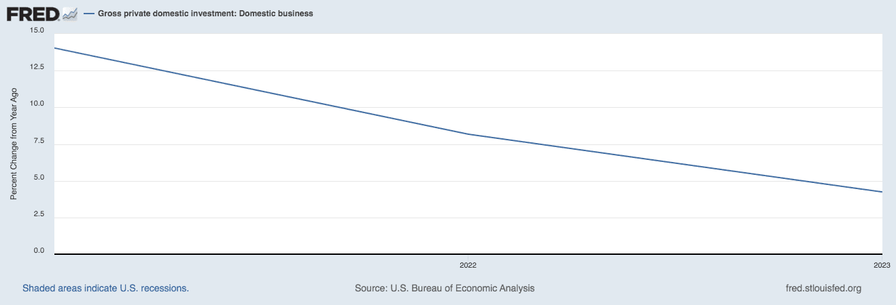

## Table of Contents

## What is capital investment?

Capital investment is when a business spends money to buy things that will help it grow or work better in the future. These things can be big machines, buildings, or even new technology. The idea is that by spending money now, the business will make more money later. For example, a factory might buy a new machine that makes their products faster and cheaper.

This kind of spending is different from everyday costs like paying for electricity or buying office supplies. Capital investments are usually big and expensive, and they are meant to last a long time. Businesses often need to plan carefully and think about how these investments will help them in the long run. Sometimes, they might even need to borrow money to make these big purchases.

## How is economic growth measured?

Economic growth is usually measured by looking at the Gross Domestic Product (GDP) of a country. GDP is the total value of all the goods and services produced in a country in a year. If the GDP goes up, it means the economy is growing. Economists often look at the GDP growth rate, which shows how much the GDP has increased from one year to the next. A higher growth rate means the economy is doing well.

Another way to measure economic growth is by looking at changes in people's income and employment. When more people have jobs and are [earning](/wiki/earning-announcement) more money, it's a sign that the economy is growing. Economists also look at other things like how much people are spending, how much businesses are investing, and how much the government is spending. All these factors together help give a full picture of how the economy is doing.

Sometimes, economists use other measures like the Gross National Product (GNP) or the Human Development Index (HDI). GNP is similar to GDP but includes income from abroad. HDI looks at things like education and health, not just money. These different measures help give a more complete view of economic growth and how it affects people's lives.

## What are the basic types of capital investment?

Capital investment can be divided into two main types: tangible and intangible. Tangible capital investments are things you can touch, like buildings, machinery, and vehicles. These are physical assets that help a business do its work better or make more products. For example, a bakery might buy a new oven to bake more bread each day. Tangible investments are often big and expensive, and they last for a long time.

Intangible capital investments are things you can't touch, like patents, trademarks, and software. These are non-physical assets that still help a business grow or work better. For instance, a company might invest in a new software program to manage its inventory more efficiently. While you can't see or touch these investments, they can be just as important as tangible ones because they can help a business stand out from competitors or run more smoothly.

## Can you explain the relationship between capital investment and economic growth?

Capital investment is important for economic growth because it helps businesses grow and become more productive. When businesses buy new machines, build new factories, or invest in new technology, they can make more products or provide better services. This means they can sell more and make more money. As businesses grow, they often need to hire more workers, which means more people have jobs and can spend money on things they need. This spending helps other businesses grow too, creating a cycle of growth in the economy.

The relationship between capital investment and economic growth also works the other way around. When the economy is growing, businesses feel more confident about the future and are more likely to make big investments. They see that people are buying more and that there is a good chance they will make money back from their investments. This confidence leads to more capital investment, which in turn helps the economy keep growing. So, capital investment and economic growth go hand in hand, each helping the other to keep the economy moving forward.

## What are some historical examples where capital investment significantly impacted economic growth?

One big example of capital investment helping economic growth is the Industrial Revolution in the 18th and 19th centuries. During this time, new machines like the steam engine and the spinning jenny were invented. Businesses invested a lot of money to build factories and buy these machines. This allowed them to make things like cloth and steel much faster and cheaper. As a result, more goods were made and sold, which helped the economy grow a lot. More people got jobs in factories, and they could buy more things, which kept the economy growing.

Another example is the post-World War II economic boom in the United States and Europe. After the war, many countries invested in rebuilding their cities and factories. The United States, for instance, used the Marshall Plan to help Europe rebuild. This meant a lot of money was spent on new buildings, roads, and machines. As these countries rebuilt, their economies started to grow quickly. People had jobs again, and they could buy things, which made the economy even stronger. This period is often called the "Golden Age of Capitalism" because of how fast the economy grew thanks to these big investments.

## How does capital investment affect productivity?

Capital investment helps make businesses more productive. When a business buys new machines or builds new factories, it can make more things faster. For example, a farmer might buy a new tractor that can plow the fields much quicker than an old one. This means the farmer can plant more crops and get them to market faster. More products being made in less time means the business is more productive.

Investing in things you can't touch, like new software, also helps productivity. A company might buy a new computer program to keep track of its inventory. This makes it easier for them to know what they have and what they need to order. This saves time and reduces mistakes, making the business run smoother and more efficiently. Overall, capital investment in both tangible and intangible assets can make a big difference in how much a business can produce and how well it can operate.

## What role do government policies play in encouraging capital investment?

Government policies can help businesses feel more confident about spending money on big investments. One way they do this is by offering tax breaks or subsidies. For example, if a government says businesses can pay less tax if they buy new machines, more companies might decide to invest. Governments can also make it easier for businesses to borrow money by setting low interest rates. This makes it cheaper for businesses to get loans to buy things like new factories or technology.

Another way governments encourage capital investment is by creating a stable and predictable environment. If businesses know that the rules and taxes won't change suddenly, they feel safer about making big investments. Governments can also invest in things like roads, bridges, and internet, which make it easier for businesses to work and grow. When businesses see that the government is helping to build a good place to do business, they are more likely to invest in their own growth.

## How do different sectors (e.g., technology, infrastructure) respond differently to capital investment?

Different sectors respond to capital investment in their own ways. In the technology sector, capital investment often goes into research and development (R&D) or buying new software and hardware. This can lead to new products or better ways of doing things. For example, a tech company might invest in a new computer system that makes their work faster and helps them come up with new ideas. This can make the company grow quickly and stay ahead of others. But, the tech sector can be risky because new ideas might not always work out, so companies have to be careful about where they spend their money.

In the infrastructure sector, like building roads or bridges, capital investment usually means spending on big projects that last a long time. When a government or company invests in building a new highway, it can help the whole economy grow. More people and goods can move around easily, which helps businesses in many different sectors. Infrastructure projects can take a long time to finish and cost a lot of money, but once they are done, they can make a big difference for a long time. This kind of investment is often seen as more stable than in the tech sector, but it still needs careful planning and management.

## What are the potential risks and drawbacks of heavy capital investment?

Heavy capital investment can be risky because it costs a lot of money upfront. If the new machines or buildings don't work out as planned, the business might lose a lot of money. For example, if a company buys a new factory but then can't sell enough products to pay for it, they could end up in debt. Also, big investments take a long time to pay off, so if the economy gets worse or if something unexpected happens, the business might struggle to make money back.

Another drawback is that heavy capital investment can tie up a lot of a business's money. This means they might not have enough cash to spend on other important things, like paying employees or buying supplies. If a business spends all its money on a big project and then needs money for something else, they might have to borrow more, which can be risky. Also, if the technology or the market changes quickly, the big investment might become outdated before the business can make their money back.

## How can capital investment be optimized to maximize economic growth?

To make the most out of capital investment for economic growth, businesses and governments need to be smart about where they spend their money. They should focus on investments that will help them make more things or provide better services. For example, a company might buy a new machine that makes their work faster, or a government might build a new road that helps people and goods move around more easily. It's also important to think about the future and invest in things like new technology or education, which can help the economy grow over a long time. By choosing the right investments, businesses and governments can help the economy grow faster and stronger.

Another way to optimize capital investment is to make sure it's spread out across different parts of the economy. If all the money goes into just one area, like building houses, the economy might not grow as much as it could. But if the money is used for different things, like building houses, making new technology, and improving schools, then more people can benefit. This helps create more jobs and makes the economy more stable. By balancing investments and thinking about the big picture, businesses and governments can help the economy grow in a way that helps everyone.

## What advanced economic theories explain the impact of capital investment on economic growth?

One advanced economic theory that helps explain how capital investment affects economic growth is the Solow-Swan growth model. This model says that economic growth comes from having more workers, more capital (like machines and buildings), and better technology. When businesses invest in new machines or buildings, they can make more things and become more productive. This helps the economy grow. But the model also says that there's a limit to how much growth can come from just adding more capital. After a while, adding more machines doesn't help as much because there aren't enough workers to use them all. So, to keep growing, the economy needs new technology or better ways of doing things.

Another theory is the endogenous growth theory, which says that economic growth can keep going if businesses keep investing in things like education and research. This theory thinks that new ideas and better technology come from inside the economy, not just from outside. When businesses spend money on research and development, they can come up with new products or better ways of making things. This helps the economy grow because it keeps making new ideas and technology. Unlike the Solow-Swan model, this theory says that growth can keep going if businesses keep investing in the right things, like education and new technology.

## How do global economic trends influence the effectiveness of capital investment in driving economic growth?

Global economic trends can really change how well capital investment helps an economy grow. For example, if the world economy is doing well, businesses might feel more confident about spending money on new machines or buildings. This is because they think they can sell more products and make more money back from their investments. But if there's a big economic problem, like a global recession, businesses might be scared to spend money because they're not sure if they'll make it back. Also, things like changes in world trade rules or new technology can make some investments more useful than others. If a new technology comes out that makes old machines outdated, businesses might lose money on their investments.

Another way global trends affect capital investment is through interest rates and money exchange rates. When interest rates are low around the world, it's cheaper for businesses to borrow money to invest in new things. This can help the economy grow because more businesses can afford to make big investments. But if interest rates go up, borrowing becomes more expensive, and businesses might not want to invest as much. Exchange rates also matter because they affect how much it costs to buy things from other countries. If a country's money gets weaker, it might be more expensive to buy machines from abroad, which can make capital investment less effective. So, global trends can make a big difference in how well capital investment helps an economy grow.

## References & Further Reading

[1]: Bergstra, J., Bardenet, R., Bengio, Y., & Kégl, B. (2011). ["Algorithms for Hyper-Parameter Optimization."](https://papers.nips.cc/paper/4443-algorithms-for-hyper-parameter-optimization) Advances in Neural Information Processing Systems 24.

[2]: ["Advances in Financial Machine Learning"](https://www.amazon.com/Advances-Financial-Machine-Learning-Marcos/dp/1119482089) by Marcos Lopez de Prado

[3]: ["Evidence-Based Technical Analysis: Applying the Scientific Method and Statistical Inference to Trading Signals"](https://www.amazon.com/Evidence-Based-Technical-Analysis-Scientific-Statistical/dp/0470008741) by David Aronson

[4]: ["Machine Learning for Algorithmic Trading"](https://github.com/stefan-jansen/machine-learning-for-trading) by Stefan Jansen

[5]: ["Quantitative Trading: How to Build Your Own Algorithmic Trading Business"](https://www.amazon.com/Quantitative-Trading-Build-Algorithmic-Business/dp/1119800064) by Ernest P. Chan