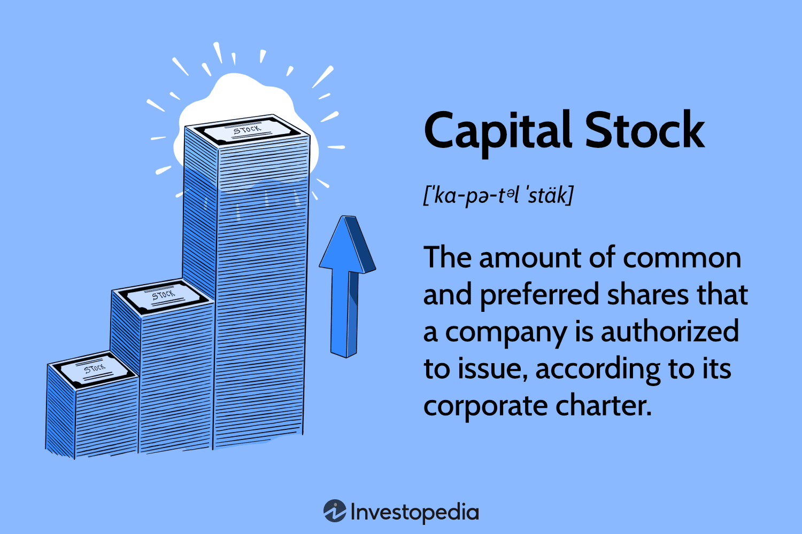

The financial landscape is continually evolving with capital stock playing a pivotal role in company finance. Capital stock represents a corporation's total shares issued, encompassing common and preferred shares, and acts as a fundamental metric reflecting a company’s equity structure and financial potential. As businesses navigate this evolving terrain, they increasingly rely on innovative methods like algorithmic trading to influence the stock market and their financial performance. Algorithmic trading, which utilizes computer algorithms to execute trades at speeds and volumes far surpassing human capability, has become a transformative force in modern finance. This method allows for enhanced efficiency and precision in trading, yet it also raises challenges related to market volatility and regulatory oversight.

This article explores how capital stock and algorithmic trading impact business dynamics and financial health. By examining the role of capital stock in corporate finance, clarifying its implications for both companies and investors, and analyzing how algorithmic trading operates within this framework, we can understand the forces at play in today's financial markets. Such insights provide a lens through which investors, analysts, and stakeholders can better navigate the complexities of a rapidly transforming market environment. Understanding these concepts is crucial for informed decision-making, allowing participants to anticipate risks and capitalize on opportunities in an era defined by technological advancements and financial innovation.

## Table of Contents

## Understanding Capital Stock

Capital stock represents the aggregate quantity of shares a corporation is authorized to issue, encompassing both common and preferred shares. This authorization is a fundamental aspect of a company's capital structure, as it dictates the maximum number of shares that can be distributed to investors. The capital stock is a crucial element of corporate finance, conferring ownership privileges and responsibilities to shareholders.

An increase in capital stock can operate as a double-edged sword. On one hand, it provides corporations with the opportunity to raise substantial capital, which can be leveraged for business expansion, research and development, or debt reduction. This influx of resources can fortify a company's competitive position and foster growth. Nevertheless, the issuance of additional shares can result in share dilution, which may decrease the value of existing shares. Dilution occurs when new shares are issued, leading to a reduced ownership percentage for current shareholders and often affecting the stock's market price adversely.

Differentiating between common and preferred stock is instrumental for investors, particularly in understanding their rights in scenarios such as bankruptcy. Common stockholders typically have voting rights but are situated behind preferred stockholders in terms of claim on assets and earnings. Conversely, preferred stockholders generally receive fixed dividends and have priority over common stockholders for asset distribution in the event of liquidation, but do not have voting rights. This distinction highlights the strategic considerations investors must weigh when evaluating their equity investments.

Companies retain the ability to modify their capital stock issuance as part of strategic decisions, which can significantly affect market perception and investor confidence. For instance, a company may decide to issue more shares to finance acquisitions or pay down debt. Such decisions can lead to fluctuations in stock price as the market digests the implications of the added shares and assesses the strategic rationale behind them.

Details pertaining to a company's capital stock can usually be found in the shareholders' equity section of its balance sheet. This section provides key insights into the number of authorized shares, along with the number of issued and outstanding shares. Often accompanied by the par value of each type of stock, this data is essential for investors analyzing a company's financial statements to assess its financial health and corporate governance practices.

## The Downside of Increasing Capital Stock

Increasing capital stock often leads to share dilution, which can significantly impact the value of existing shares. Share dilution occurs when a company issues new shares, thus increasing the total number of shares outstanding. This increase in shares means that each existing share represents a smaller ownership stake in the company, potentially diminishing its value. As a result, the earnings per share (EPS), a key financial metric, may decrease since EPS is calculated by dividing the company's net earnings by the total number of outstanding shares. The formula for EPS emphasizes this relationship:

$$
\text{EPS} = \frac{\text{Net Earnings}}{\text{Total Shares Outstanding}}
$$

When more shares are added to the denominator without a proportionate increase in net earnings, the EPS will decrease, potentially making the company less attractive to investors who prioritize high earnings efficiency.

Frequent issuance of new shares may also signal underlying financial instability. It can indicate a company's reliance on external funding sources to finance operations or growth initiatives, as opposed to generating funds through internal cash flows or organic growth. While raising capital through share issuance can be a strategic move for expansion and development, over-reliance on this method might suggest that the company is struggling to maintain adequate [liquidity](/wiki/liquidity-risk-premium) or meet its financial obligations through its core business operations.

Investors, analyzing a company's financial strategy regarding capital stock, should carefully consider the implications of these actions for long-term value. They should assess whether the capital raised through new shares is being deployed effectively to generate future returns that justify the dilution, or if it is merely a temporary measure to cover shortfalls in cash flow. Understanding the company's strategic rationale, financial health, and growth prospects is crucial for making informed investment decisions. The sustainability of a company’s growth and its approach to financing through capital stock management significantly influence its market perception and long-term success.

## Benefits of Expanding Capital Stock

Expanding capital stock, though potentially dilutive, can present significant advantages for corporate growth and development. By increasing the capital base through the issuance of new shares, companies can access new financing channels, providing them with the necessary resources to undertake ambitious projects, expand their operations, and enhance competitiveness in their respective industries. The infusion of capital from stock sales can be strategically deployed to fuel research and development, facilitate mergers and acquisitions, or invest in infrastructure improvements, all of which can drive long-term growth.

A well-executed strategy for increasing capital stock can also result in improved stock performance. When managed appropriately, this approach can boost a company’s market valuation, reflecting positively in stock price reactions. Investors observing effective capital management are likely to respond favorably, perceiving the increase as a sign of robust business health and growth potential. Consequently, this can lead to a rise in shareholder returns, potentially allowing the company to offer higher dividends, thereby attracting more investors and enhancing shareholder value.

Moreover, not all expansions of capital stock are created equal. In scenarios where additional stock offerings are well-received by the market, it indicates strong investor confidence and sound strategic planning by the company. This reception can be assessed by the absence of a significant drop in share prices post-issuance, suggesting that the market participants believe in the company’s growth prospects and the efficient use of the newly acquired funds.

In conclusion, while the specter of dilution is a legitimate concern, the strategic expansion of capital stock, underpinned by clear business objectives and transparent communication with investors, can serve as a powerful tool for companies seeking growth and enhanced market presence. This process underscores the importance of aligning capital strategies with overall corporate goals and market expectations.

## The Role of Algorithmic Trading in Finance

Algorithmic trading utilizes advanced computational algorithms to automate trading processes in the stock market, fundamentally transforming how trades are executed. This innovative approach offers several advantages, primarily enhancing the speed, efficiency, and accuracy of trades. By executing transactions based on pre-set criteria, [algorithmic trading](/wiki/algorithmic-trading) minimizes human error, allowing traders to process vast volumes of orders in fractions of a second. This is accomplished through the use of sophisticated mathematical models and statistical analysis to determine the optimal timing and execution of trades.

One significant advantage of algorithmic trading is its ability to optimize the execution of trades. Traders can reduce the market impact and enhance the execution quality by breaking down large orders into smaller ones, executed periodically according to the predefined strategy. This can be particularly beneficial in improving the liquidity and ensuring the trades are carried out at the desired price levels.

Despite its advantages, algorithmic trading presents challenges. One major issue is the potential exacerbation of market [volatility](/wiki/volatility-trading-strategies). Rapid execution of a large number of trades can lead to significant price fluctuations within a short period, impacting market stability. For example, during a market crash or rapid price increase, algorithms may react to the price changes in a way that amplifies the current trend, contributing to the volatility.

Additionally, there is a risk of system failures, which can lead to financial losses. These failures could be due to programming errors, unexpected market conditions, or connectivity issues, underscoring the need for robust risk management systems and protocols to mitigate such risks.

High-frequency trading ([HFT](/wiki/high-frequency-trading-strategies)), a subset of algorithmic trading, has played a pivotal role in reshaping the financial markets. HFT involves executing a large number of orders in extremely short time frames, often milliseconds or microseconds. While HFT contributes to increased liquidity and narrowed bid-ask spreads, it has also been a subject of regulatory scrutiny. Concerns about potential market manipulation, such as quote stuffing or front-running, have prompted regulators to implement stringent oversight to ensure fair and transparent trading practices.

In conclusion, while algorithmic trading has revolutionized the financial industry by improving efficiency and accuracy, its rapid execution and reliance on complex algorithms also present risks that must be managed. Continuous monitoring and regulation are essential to safeguard market integrity and prevent any negative implications associated with algorithmic and high-frequency trading. As technology evolves, the balance between leveraging these advanced tools and ensuring a stable and equitable market remains crucial for all market participants.

## Impact of Algorithmic Trading on Capital Stock and Markets

Algorithmic trading significantly influences stock liquidity and price formation, which are critical aspects of the broader financial market's dynamics. The introduction of computational algorithms into trading processes has fundamentally altered how securities are bought and sold, leading to both advantageous and challenging consequences.

One of the primary ways algorithmic trading impacts the market is through the speed and [volume](/wiki/volume-trading-strategy) of automated trades. These trades can be executed at fractions of a second, leading to rapid price shifts that traditional trading methods cannot match. This increased speed and volume can enhance liquidity, as the market becomes more capable of absorbing large orders without substantial impacts on price. However, this also means that market stability can be compromised during periods of high volatility, as prices may fluctuate significantly due to automated decision-making processes reacting to market events.

Furthermore, algorithmic trading platforms often utilize [artificial intelligence](/wiki/ai-artificial-intelligence) (AI) and [machine learning](/wiki/machine-learning) to refine trading strategies. While these technologies can improve efficiency and potentially identify market opportunities faster than human traders, they also introduce risks related to unintended collusion. For instance, AI-driven algorithms might independently develop similar trading patterns, which can inadvertently amplify market movements, leading to inefficiencies in price discovery. This scenario poses significant regulatory concerns, as it challenges the integrity of the market.

The integration of AI and algorithmic trading into capital markets necessitates careful oversight to balance innovative advancements with the preservation of financial integrity. Regulatory bodies must ensure that these technologies do not undermine market fairness or stability. This involves implementing measures to monitor and manage the potential risks associated with high-frequency trading and ensuring that robust systems are in place to mitigate the impact of algorithmic failures.

In conclusion, while algorithmic trading offers substantial benefits in terms of improving market liquidity and efficiency, it also presents challenges that require vigilant regulation and oversight. The financial markets must continuously adapt to these evolving technologies to maintain a stable and equitable trading environment.

## Conclusion

The intersection of capital stock management and algorithmic trading presents compelling opportunities and challenges for both companies and investors. As organizations expand their capital stock, they can unlock avenues for growth and development through increased financing. This can facilitate ventures into new projects, operational expansions, and enhanced competitive positioning in the market. However, these advantages must be balanced against the potential for share dilution, which can affect shareholder value and investor confidence.

Simultaneously, algorithmic trading has made significant strides in enhancing market efficiency by utilizing advanced computational techniques to execute trades based on pre-set criteria with precision and speed. This introduces advantages in minimizing human error and achieving better market pricing. Nonetheless, the rapid pace and high volume of these trades can induce market volatility and pose systemic risks, such as unintentional algorithmic interactions that may disrupt price efficiency.

For stakeholders—including investors, analysts, and regulators—a thorough understanding of these dynamics is crucial to effectively navigating the financial landscape. This includes recognizing the potential benefits of increased capital stock in facilitating growth, while also accounting for the influence of algorithmic trading in shaping market dynamics.

Regulatory bodies hold a pivotal role in this ecosystem by monitoring the evolving practices of algorithmic trading to ensure market stability and protect investor interests. Striking a balance between fostering innovation and maintaining regulatory oversight is vital to safeguard the integrity of financial markets.

For future financial strategies to be successful, it is essential to incorporate both traditional methods and cutting-edge technological innovations. This holistic approach allows for the leveraging of capital stock management's capital-raising abilities and algorithmic trading's efficiency-enhancing capabilities, setting the stage for success in a complex and ever-evolving market environment.

## References & Further Reading

[1]: ["Algorithmic Trading: Winning Strategies and Their Rationale"](https://www.wiley.com/en-us/Algorithmic+Trading%3A+Winning+Strategies+and+Their+Rationale-p-9781118460146) by Ernie Chan

[2]: Hendershott, T., Jones, C. M., & Menkveld, A. J. (2011). ["Does Algorithmic Trading Improve Liquidity?"](https://onlinelibrary.wiley.com/doi/full/10.1111/j.1540-6261.2010.01624.x) Journal of Finance, 66(1), 1-33.

[3]: Narang, R. (2013). ["Inside the Black Box: A Simple Guide to Quantitative and High-Frequency Trading"](https://onlinelibrary.wiley.com/doi/book/10.1002/9781118662717) by Wiley.

[4]: Kissell, R. (2013). ["The Science of Algorithmic Trading and Portfolio Management"](https://www.sciencedirect.com/book/9780124016897/the-science-of-algorithmic-trading-and-portfolio-management) by Academic Press.

[5]: Aldridge, I. (2013). ["High-Frequency Trading: A Practical Guide to Algorithmic Strategies and Trading Systems"](https://www.amazon.com/High-Frequency-Trading-Practical-Algorithmic-Strategies/dp/1118343506) by Wiley.